

# ESPHome DIY sensors - Best Buy Tips

## Introduction

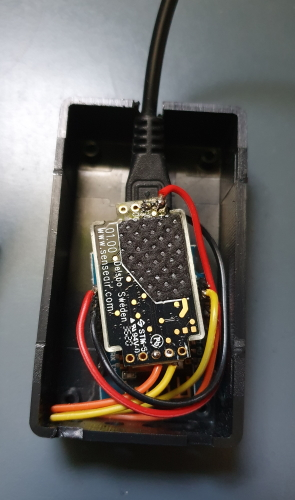
If you want to create your own sensors with ESPHome you need an ESP development board where you can load the software to read the sensors and send this data over the network to your home server. 

If you're afraid to solder some pins or connect the ESP to the sensor, look for some tutorials and give it a try. 
You can also look for ESPs and sensors with already pins, then with dupont cables you don't need to soldering at all.

Here you find some useful links where you can buy ESPs, 
sensors and other tooling which can be useful for making your own DIY sensors.

I have a [page](../esphome/index) where I added manuals to create your own sensors.

---

## Table of Contents
<!-- TOC -->
  * [ESP board](#esp-board)
  * [Sensors](#sensors)
    * [Temperature and humidity sensor](#temperature-and-humidity-sensor)
    * [Air quality sensor](#air-quality-sensor)
    * [CO2 sensor](#co2-sensor)
    * [Pressure sensor](#pressure-sensor)
    * [Weight sensor](#weight-sensor)
    * [Rain gauge sensor](#rain-gauge-sensor)
    * [Waterproof temperature sensor](#waterproof-temperature-sensor)
    * [Occupancy sensor (mmWave)](#occupancy-sensor-mmwave)
    * [Presence sensor (microwave)](#presence-sensor-microwave)
  * [Cables](#cables)
  * [Power](#power)
  * [USB hub](#usb-hub)
  * [Dupont](#dupont)
  * [Pin heads](#pin-heads)
  * [Boxes](#boxes)
  * [Tools](#tools)
    * [Soldering iron](#soldering-iron)
    * [Soldering tin wire](#soldering-tin-wire)
    * [Desoldering](#desoldering)
    * [Breadboard](#breadboard)
    * [Helping hand](#helping-hand)
  * [RTL-SDR Radio sniffer for 433 and 868 MHz](#rtl-sdr-radio-sniffer-for-433-and-868-mhz)
  * [P1 cable for smart gas and energy meter](#p1-cable-for-smart-gas-and-energy-meter)
  * [Internal links](#internal-links)
<!-- TOC -->

---

> **_NOTE 1:_** Most links on this page are hardware I also bought myself.
> Most of the links are affiliate links, you pay the same price AND support my blog by buying it from here.

---

## ESP board

The brains of your own sensor. It contains the processor to run the program on, and with the Wifi module on it which can make contact with your own network.

### ESP32

The newer and faster ESP32 board has a dual core processor, bluetooth, usb-c and already soldered pins.

<a href="https://s.click.aliexpress.com/e/_DDYRBIF" target="_blank">
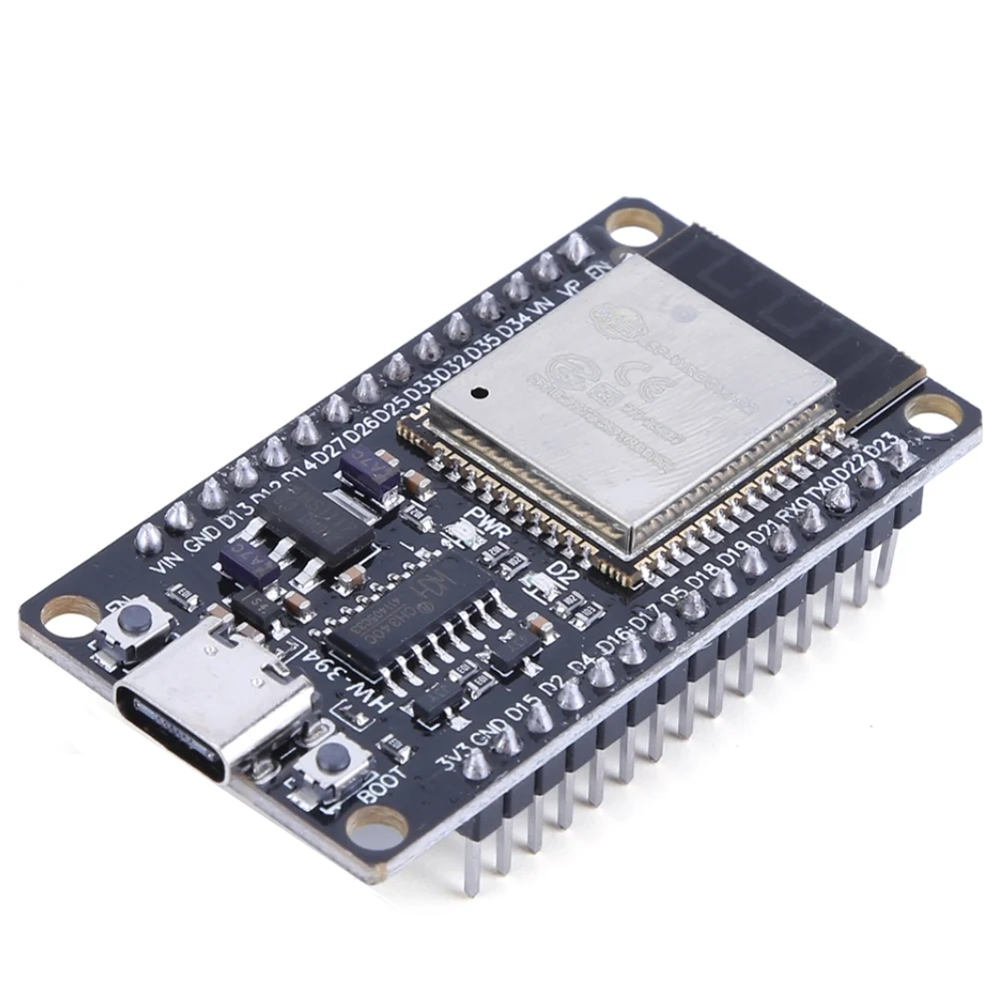
</a>

{{imgBasket}}<a href="https://s.click.aliexpress.com/e/_DDYRBIF" target="_blank">ESP-32S WROOM (AliExpress)</a>

### ESP8266

The ESP8266 NodeMCU v3 (or comparable) is the original ESP developer board and is most cases fast enough to handle the sensor data. 

<a href="https://s.click.aliexpress.com/e/_EIwdbqH" target="_blank">
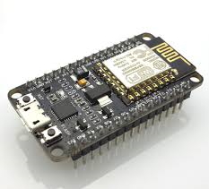
</a>

{{imgBasket}}<a href="https://s.click.aliexpress.com/e/_EIwdbqH" target="_blank">ESP8266 (AliExpress)</a>

{{imgBasket}}<a href="https://s.click.aliexpress.com/e/_mPJWRqE" target="_blank">ESP8266 (AliExpress)</a>

### ESP D1 mini

This ESP D1 mini is also an ESP8266 variant (don't use the pro or V3) 
  * You can use any ESP chip, but I like this one because of its small size
  * The pins are not soldered on the board yet (with some practice even you can do it for sure!)

{{imgBasket}}<a href="https://s.click.aliexpress.com/e/_ooKDQkk" target="_blank">link 1 (AliExpress)</a>

---

## Sensors

Sensors are the digital senses. They can measure all different kinds of units, like temperature, humidity, light intensity, pressure, etc.

Here are some ready-to-use sensors that can be connected direct to an ESP without a challenging circuit with resistors and capacitors, etc.

### Temperature and humidity sensor

Dht11 is a commonly used temperature and humidity sensor.

<a href="https://s.click.aliexpress.com/e/_DB72RCn" target="_blank">
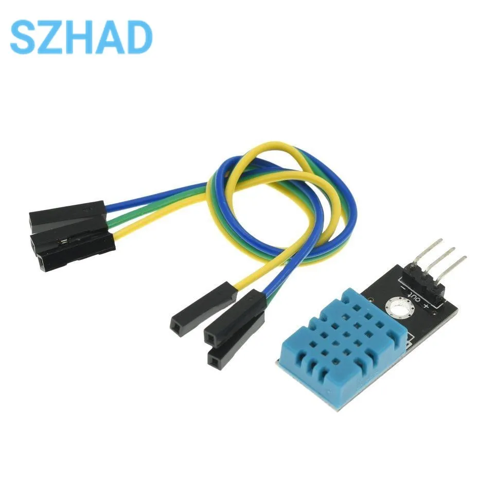</a>

{{imgBasket}}<a href="https://s.click.aliexpress.com/e/_DB72RCn" target="_blank">link 1 (AliExpress)</a>

### Air quality sensor

AGS10 TVOC air quality gas sensor.

{{imgBasket}}<a href="https://s.click.aliexpress.com/e/_DmsmcGJ" target="_blank">link 1 (AliExpress)</a>

{{imgBasket}}<a href="https://s.click.aliexpress.com/e/_DBrzBkf" target="_blank">link 2 (AliExpress)</a>

### CO2 sensor

CO2 stands for `Carbon dioxide` and is measured in `Parts per million` (ppm). 
If the amount of ppms is too high for a long time, it's not good for you're healthy.

#### SenseAir S8

SenseAir S8 CO2 sensor.

{{imgBasket}}<a href="https://s.click.aliexpress.com/e/_mM6V8we" target="_blank">link 1 (AliExpress)</a>

{{imgBasket}}<a href="https://s.click.aliexpress.com/e/_oCFOEJ6" target="_blank">link 2 (AliExpress)</a>

#### SCD41

SCD40 or SCD41 CO2 sensor are compact CO2 , humidity and temperature sensors. 
Both are quite similar, but the 41 has some higher accuracy and can measure a bit higher ppm values (2000 vs 5000).

<a href="https://s.click.aliexpress.com/e/_DB01je7" target="_blank">
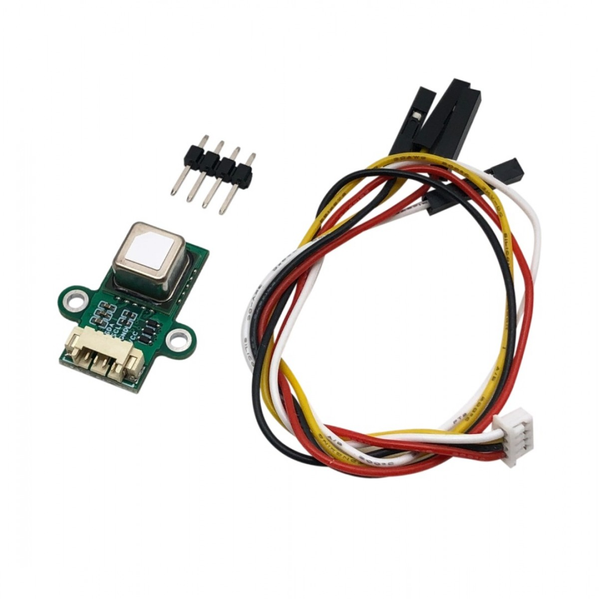</a>

<a href="https://s.click.aliexpress.com/e/_DeKQwFz" target="_blank">
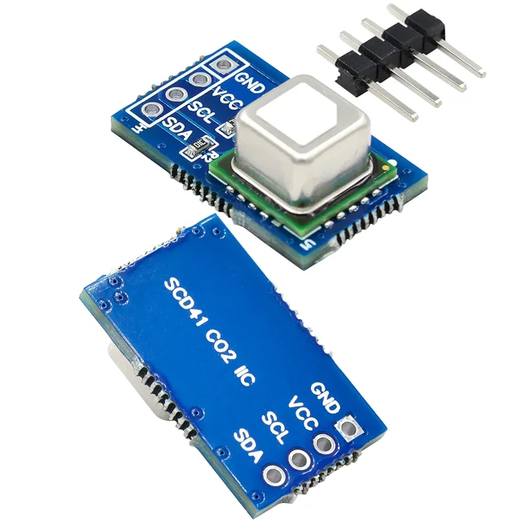</a>

{{imgBasket}}<a href="https://s.click.aliexpress.com/e/_DB01je7" target="_blank">link 1 SCD41 WITHOUT requires soldering (AliExpress)</a>

{{imgBasket}}<a href="https://s.click.aliexpress.com/e/_DeKQwFz" target="_blank">link 2 SCD41 which requires soldering (AliExpress)</a>

### Pressure sensor

This car seat sensor measures if there is pressure on a chair or seat. The output is just an open or a closed circuit.

<a href="https://s.click.aliexpress.com/e/_Dk6XL1V" target="_blank">
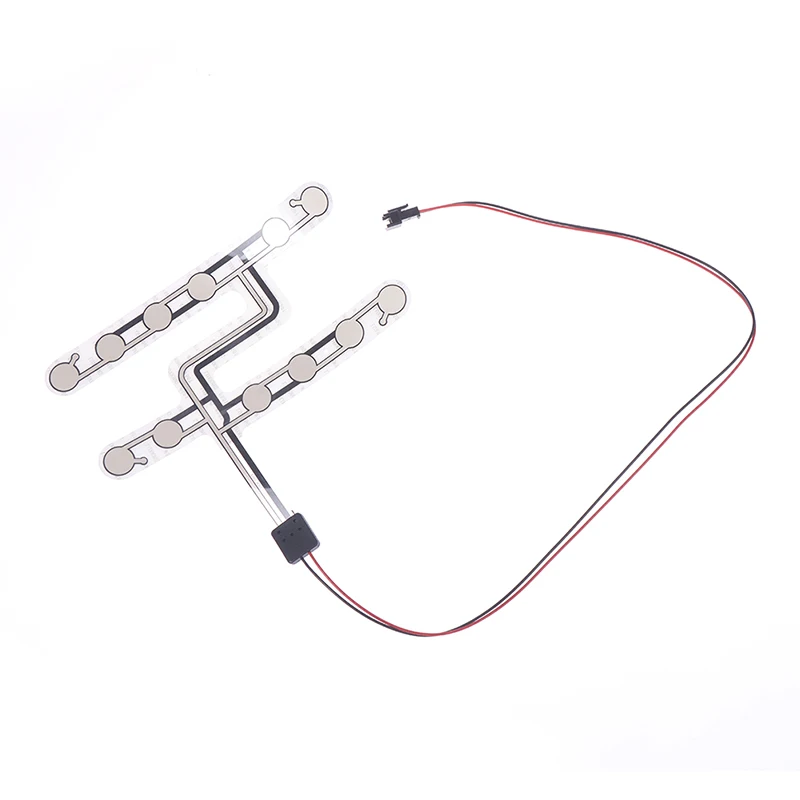</a>

{{imgBasket}}<a href="https://s.click.aliexpress.com/e/_Dk6XL1V" target="_blank">link 1 (AliExpress)</a>

### Weight sensor

The HX711 Module comes with four pressure sensors which you can place under your bed to measure the pressure to see how many people are a.t.m. in the bed.

<a href="https://s.click.aliexpress.com/e/_DkwwYYr" target="_blank">
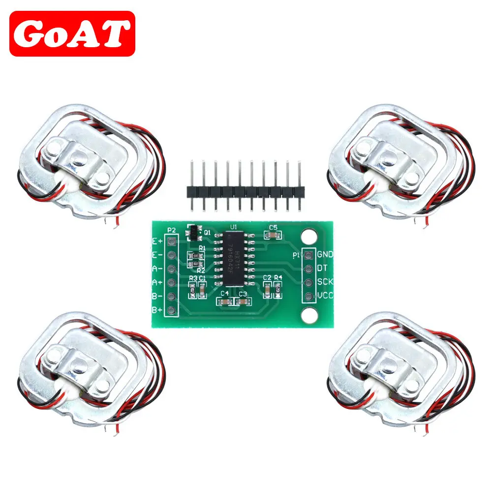</a>

{{imgBasket}}<a href="https://s.click.aliexpress.com/e/_DkwwYYr" target="_blank">link 1 (AliExpress)</a>

### Rain gauge sensor

Can be used, together with a contact sensor, to create your own rain gauge sensor.

{{imgBasket}}<a href="https://s.click.aliexpress.com/e/_DDjhCHt" target="_blank">link 1 (AliExpress)</a>

### Waterproof temperature sensor

The DS18B20 sensor is one to measure temperature in wet areas like an aquarium for example.

<a href="https://s.click.aliexpress.com/e/_Dkzs3vV" target="_blank">
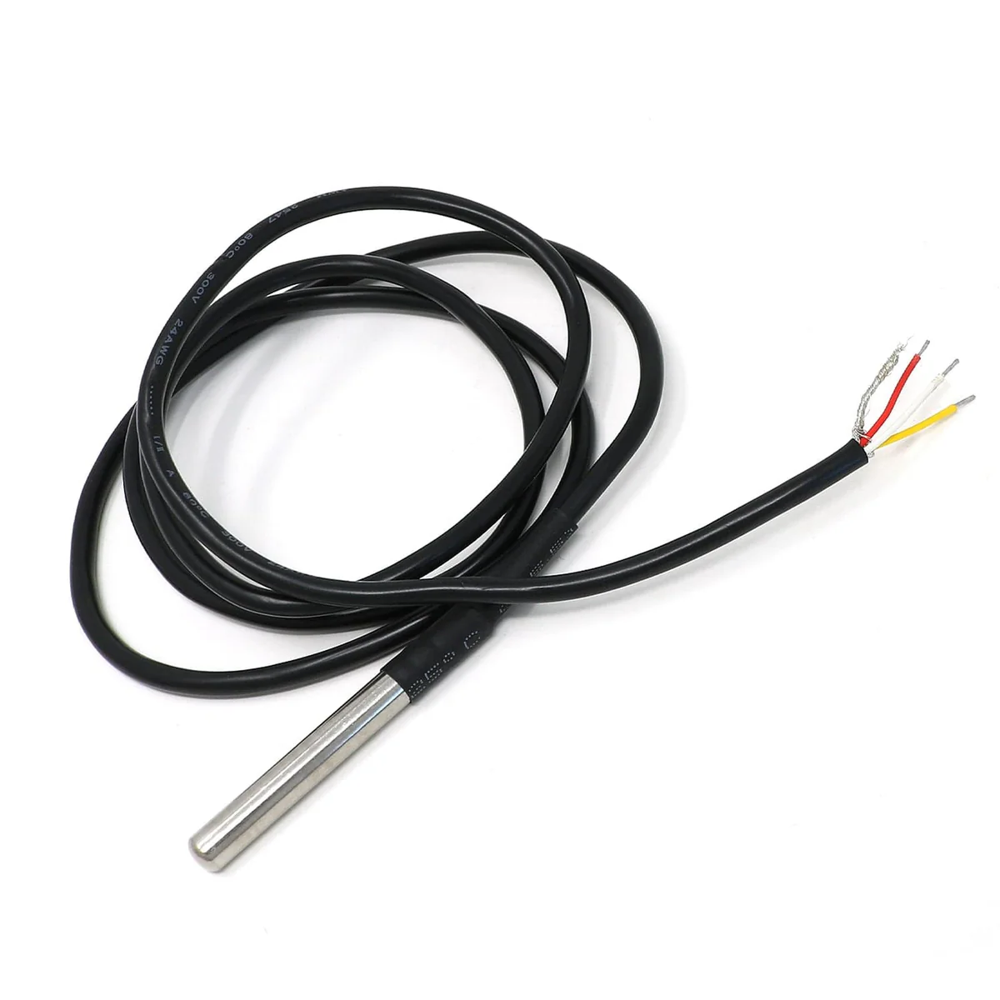</a>

{{imgBasket}}<a href="https://s.click.aliexpress.com/e/_Dkzs3vV" target="_blank">link 1 (AliExpress)</a>

---

### Occupancy sensor (mmWave)

The HLK-2410C is a 24GHz occupancy sensor (a.k.a. millimeter wave sensor)

{{imgBasket}}<a href="https://s.click.aliexpress.com/e/_oEg4ufC" target="_blank">link 1 (AliExpress)</a>

### Presence sensor (microwave)

The RCWL-0516 presence sensor (a.k.a. micrometer sensor)

<a href="https://s.click.aliexpress.com/e/_Dc8YZ39" target="_blank">
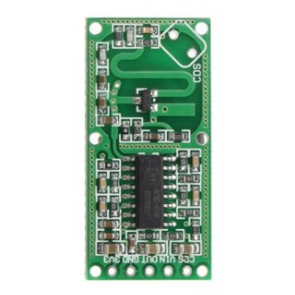</a>

{{imgBasket}}<a href="https://s.click.aliexpress.com/e/_Dc8YZ39" target="_blank">link 1 (AliExpress)</a>

---

## Cables

### Micro USB power cable

USB-A to micro USB cable to power the ESP8266.

<a href="https://s.click.aliexpress.com/e/_onj6tZi" target="_blank">
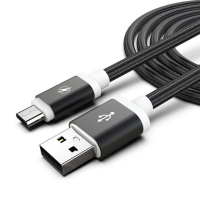 
{{imgBasket}}Micro USB cable</a>

### USB-C power cable

USB-A to USB-C cable to power the ESP32.

<a href="https://s.click.aliexpress.com/e/_EHngRGX" target="_blank">
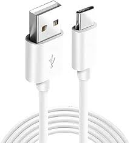 
{{imgBasket}}USB-C cable</a>

---

## Power

### 5V USB adapter

5V USB power adapter to power the ESP.

<a href="https://s.click.aliexpress.com/e/_DBB3Upl" target="_blank">
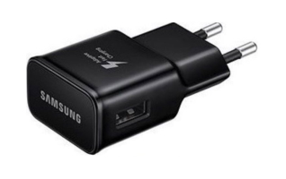</a>

{{imgBasket}}<a href="https://s.click.aliexpress.com/e/_DBB3Upl" target="_blank">link 1</a>

{{imgBasket}}<a href="https://s.click.aliexpress.com/e/_DCdi80b" target="_blank">link 2</a>

5V USB power adapter to power multiple usb devices, with fast charging and 3.1A.

<a href="https://s.click.aliexpress.com/e/_DeEZ7xD" target="_blank">
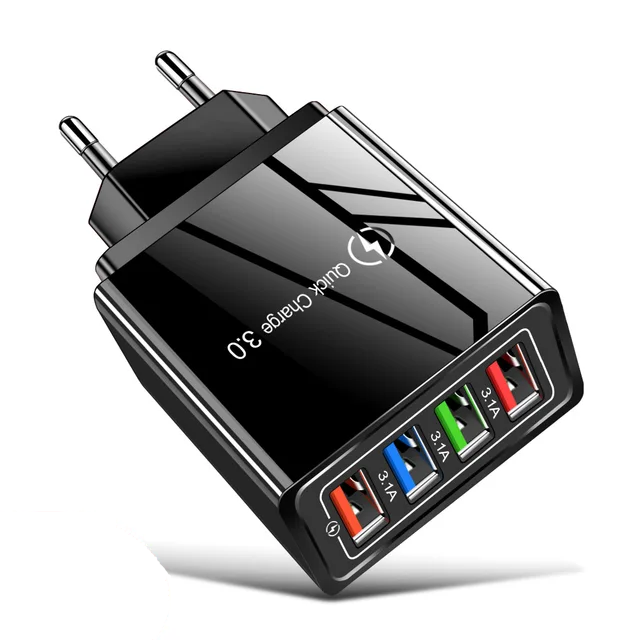</a>

{{imgBasket}}<a href="https://s.click.aliexpress.com/e/_DeEZ7xD" target="_blank">link 2</a>

### Christmas light adapter

A 2 pins adapter without a button to select a mode, just on, for Christmas lights, 31V and 3.6W.

<a href="https://s.click.aliexpress.com/e/_mstDarg" target="_blank">
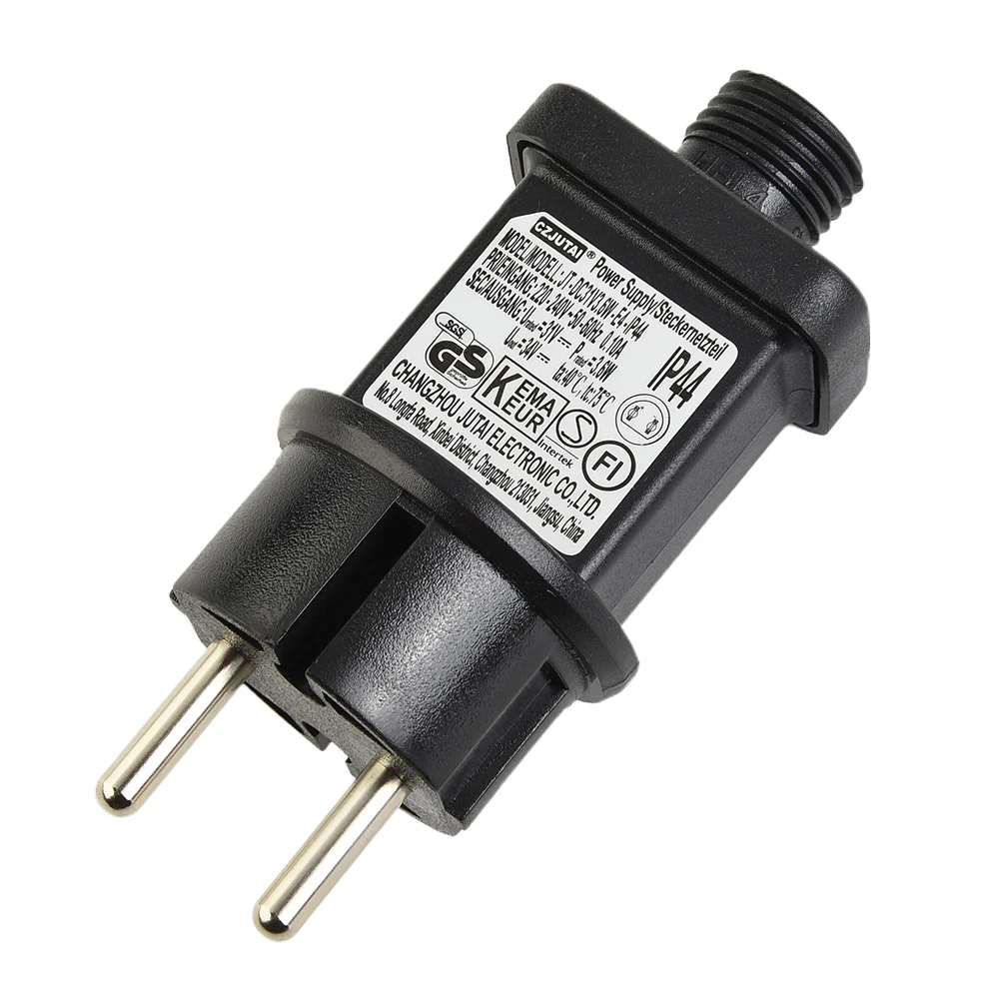</a>

{{imgBasket}}<a href="https://s.click.aliexpress.com/e/_mstDarg" target="_blank">link 1</a>

---

## USB hub

Active USB hub to power multiple USB devices.

<a href="https://s.click.aliexpress.com/e/_DlR7tt5" target="_blank">
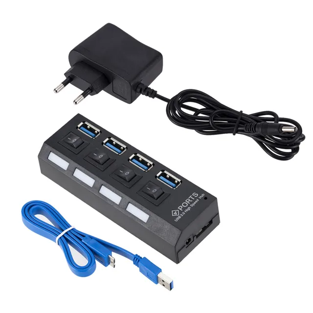</a>

{{imgBasket}}<a href="https://s.click.aliexpress.com/e/_DlR7tt5" target="_blank">link 1</a>

---

## Dupont

Dupont are cables to connect the ESP pins with sensors pins. The dupont cables are in different variants: male to male, female to male and male to female. You can also cut one end to just solder it direct to the connector.

<a href="https://s.click.aliexpress.com/e/_DEy2mvt" target="_blank">
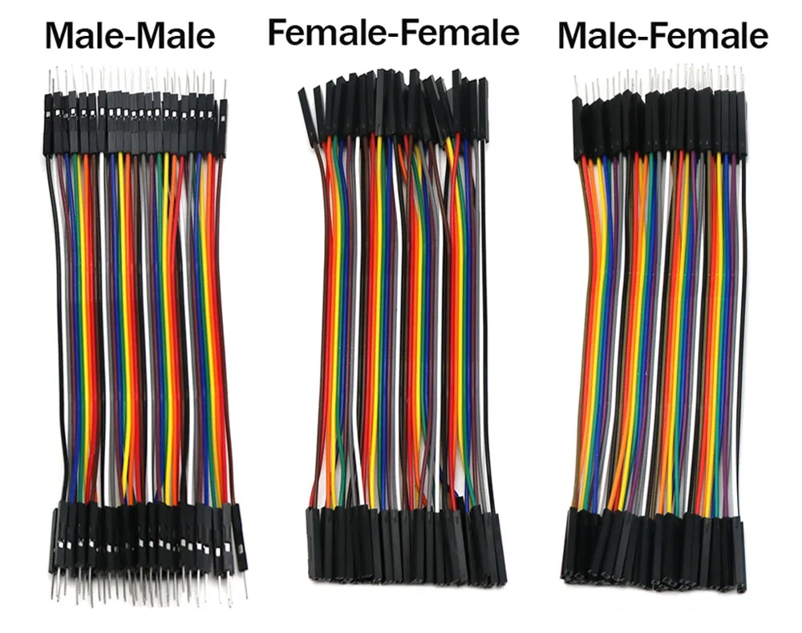</a>

{{imgBasket}}<a href="https://s.click.aliexpress.com/e/_DEy2mvt" target="_blank">link 1 (AliExpress)</a>

{{imgBasket}}<a href="https://s.click.aliexpress.com/e/_EIjrYwZ" target="_blank">link 2 (AliExpress)</a>

* If you order these, you can better order all three types at ones, also for any further projects.

---

## Pin heads

Pin heads to use dupont cables to connect the ESP with sensor.
Only required if they are not already provided.

<a href="https://s.click.aliexpress.com/e/_Dl8W2wB" target="_blank">
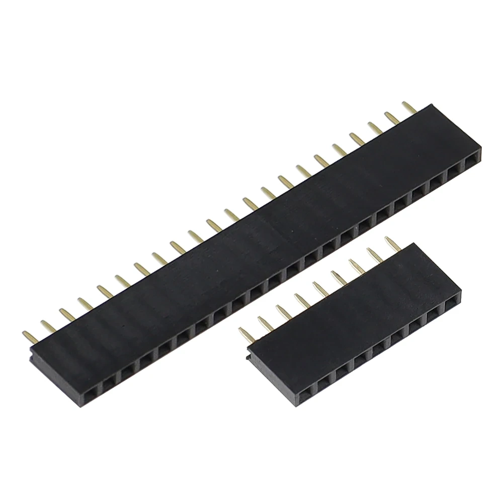</a>

{{imgBasket}}<a href="https://s.click.aliexpress.com/e/_Dl8W2wB" target="_blank">link 1 (AliExpress)</a>

<a href="https://s.click.aliexpress.com/e/_Dk4s94R" target="_blank">
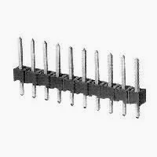</a>

{{imgBasket}}<a href="https://s.click.aliexpress.com/e/_Dk4s94R" target="_blank">link 1 (AliExpress)</a>

---

## Boxes

Plastic DIY Case to fix the esp board and sensor in.

<a href="https://s.click.aliexpress.com/e/_DDALbXD" target="_blank">
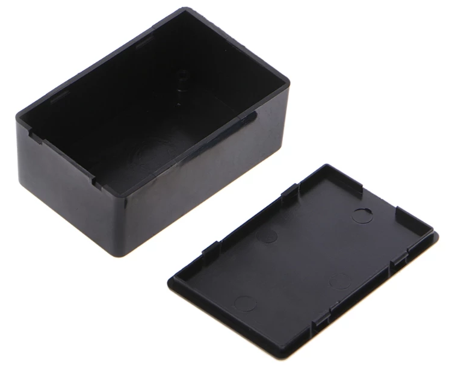</a>

{{imgBasket}}<a href="https://s.click.aliexpress.com/e/_DDALbXD" target="_blank">link 1: a lot of boxes with all kinds of sizes (AliExpress)</a>

---

## Tools

### Soldering iron
I suggest this based on the reviews. I already had one. Please let me know if you advise this one or not?

<a href="https://s.click.aliexpress.com/e/_DEDR08n" target="_blank">
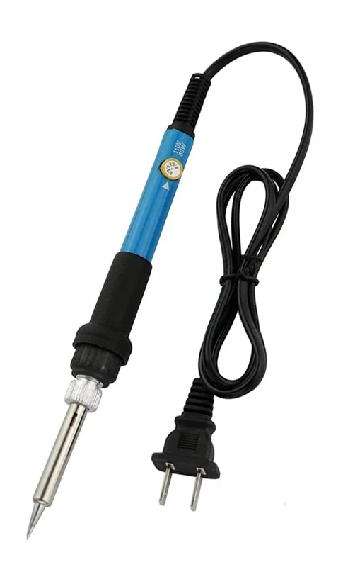</a>

{{imgBasket}}<a href="https://s.click.aliexpress.com/e/_DEDR08n" target="_blank">Soldering iron (AliExpress)</a>

### Soldering tin wire

<a href="https://s.click.aliexpress.com/e/_DEDR08n" target="_blank">
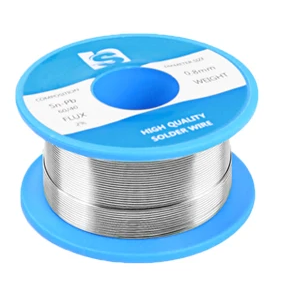</a>

{{imgBasket}}<a href="https://s.click.aliexpress.com/e/_DEDR08n" target="_blank">link 1 (AliExpress)</a>

### Desoldering

<a href="https://s.click.aliexpress.com/e/_DBED3xN" target="_blank">
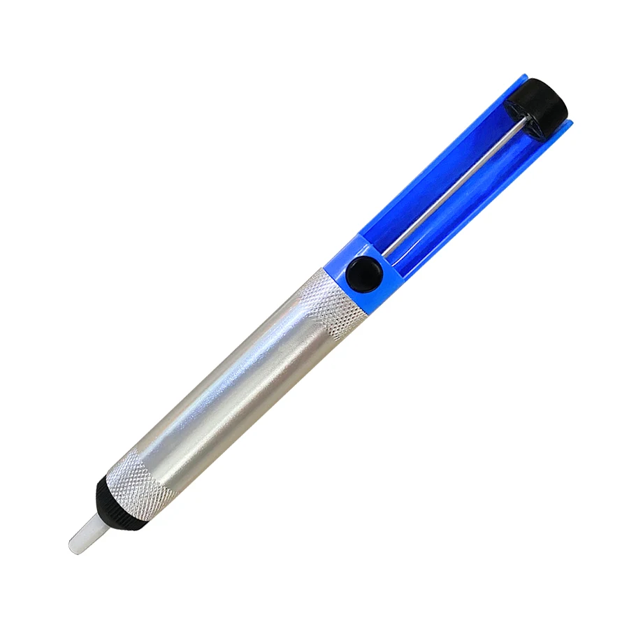
</a>

{{imgBasket}}<a href="https://s.click.aliexpress.com/e/_DBED3xN" target="_blank">link 1 (AliExpress)</a>

### Breadboard

A breadboard with dupont cables and power connector to test your setup first.

<a href="https://s.click.aliexpress.com/e/_Dkm9H7l" target="_blank">
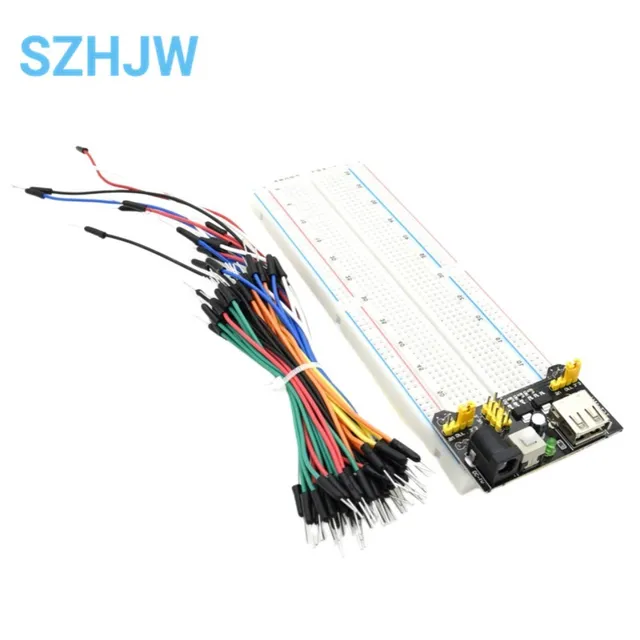
</a>

{{imgBasket}}<a href="https://s.click.aliexpress.com/e/_Dkm9H7l" target="_blank">link 1 (AliExpress)</a>

### Helping hand

This helping hand can be used to hold the ESP board and sensor while soldering.

{{imgBasket}}<a href="https://s.click.aliexpress.com/e/_Ev4uoq9" target="_blank">link 1 (AliExpress)</a>

---

## RTL-SDR Radio sniffer for 433 and 868 MHz

This receiver can be used to receive or snif signals send by device which uses the 433 or 868 MHz bandwidth.

<a href="https://s.click.aliexpress.com/e/_DDbcyVp" target="_blank">
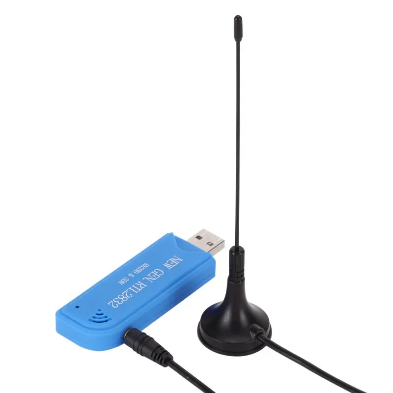</a>

{{imgBasket}}<a href="https://s.click.aliexpress.com/e/_DDbcyVp" target="_blank">link 1 (AliExpress)</a>

---

## P1 cable for smart gas and energy meter

With this cable, you can read your smart meter to read the gas and energy consumption.

<a href="https://s.click.aliexpress.com/e/_DCfNEdh" target="_blank">
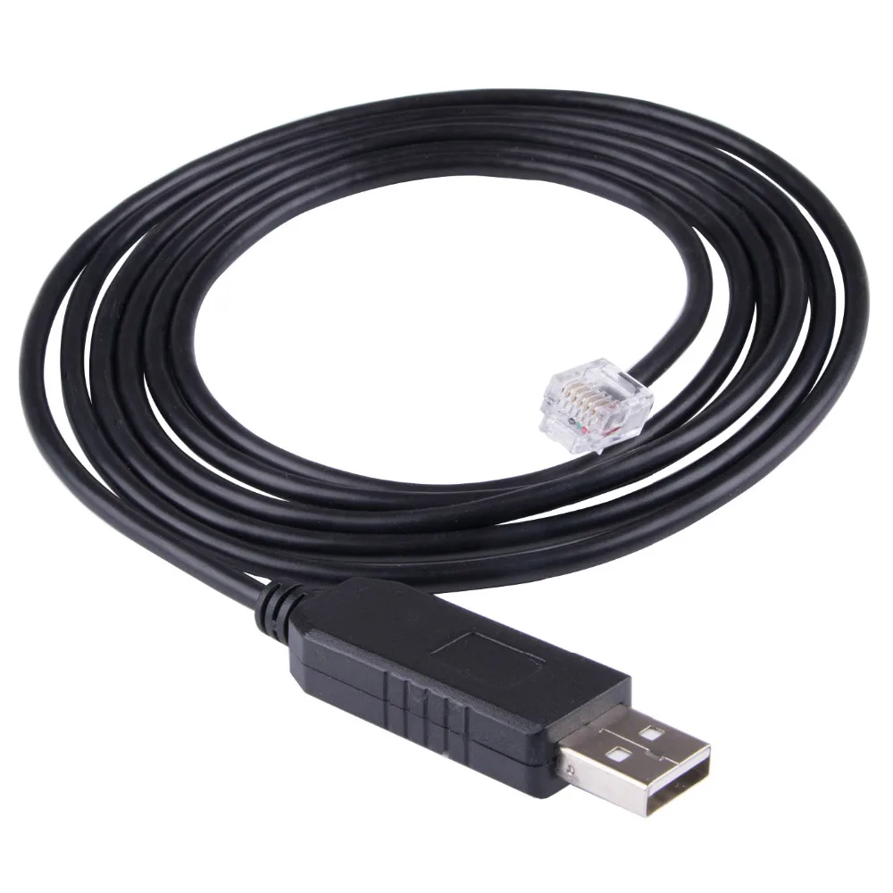
</a>

{{imgBasket}}<a href="https://s.click.aliexpress.com/e/_DCfNEdh" target="_blank">link 1 (AliExpress)</a>

---

## Internal links

Links to other sections of this blog:

* [ESPHome custom sensors and actuators](../esphome/index) how to create your own sensors with ESPHome.

* [Zigbee Smart home - Best Buy Tips](smart_home_best_buy_tips) for all kinds or Zigbee hardware buy tips.

* [All my best buy tip pages](index) 