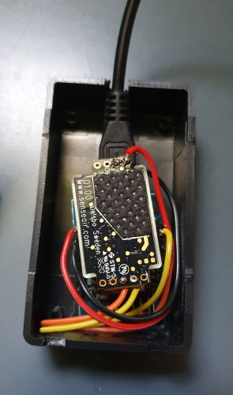



# ESPHome DIY sensors - Best Buy Tips

## Introduction

If you want to create your own sensors with ESPHome you need an ESP development board where you can load the software to read the sensors and send this data over the network to your home server.

If you're afraid to solder some pins or connect the ESP to the sensor, look for some tutorials and give it a try.
You can also look for ESPs and sensors with already pins, then with dupont cables you don't need to soldering at all.

Here you find some useful links where you can buy ESPs,
sensors and other tooling which can be useful for making your own DIY sensors.

I have a [page](../esphome/index) where I added manuals to create your own sensors.

---

## Table of Contents
<!-- TOC -->
  * [ESP board](#esp-board)
    * [ESP8266 vs ESP32](#esp8266-vs-esp32)
  * [Sensors](#sensors)
  * [Cables and power](#cables-and-power)
  * [Connecting and mounting](#connecting-and-mounting)
  * [Boxes](#boxes)
  * [Tools](#tools)
  * [Other hardware](#other-hardware)
  * [Internal links](#internal-links)
<!-- TOC -->

---

> **_NOTE 1:_** Most links on this page are hardware I also bought myself.
> Most of the links are affiliate links, You pay the normal price and also support my blog by buying it from here.

---

## ESP board

The brains of your own sensor.
It contains the processor to run the program on, and with the WiFi module on it which can make contact with your own network.

### ESP8266 vs ESP32

The two most used ESP families are the ESP8266 and the ESP32. Both are supported by ESPHome.

|              | ESP8266                 | ESP32                                           |
|--------------|-------------------------|-------------------------------------------------|
| Processor    | Single-core, 80/160 MHz | Dual-core up to 240 MHz (the C3 is single-core) |
| Memory       | About 80 KB RAM         | About 520 KB RAM (the C3 has 400 KB)            |
| Connectivity | WiFi                    | WiFi and Bluetooth                              |
| Price        | Cheapest                | A bit more expensive                            |

 

**Go for the ESP8266** if you build a simple sensor with one or two sensors, like a temperature sensor or a CO2 sensor. It is cheap and fast enough.

**Go for the ESP32** if:
* You need Bluetooth, for example to use it as a Bluetooth proxy for Home Assistant.
* You want to connect more sensors, a display or other devices, and need more pins.
* You have a bigger or more complex configuration, which needs more memory and speed.
* You want a newer board with USB-C. New ESPHome features are mostly built for the ESP32.

If you're not sure, choose an ESP32. The small price difference gives you more room to grow.

ESP32<strong>ESP32-C3 supermini</strong>

A really tiny ESP32 with bluetooth.

<a href="https://s.click.aliexpress.com/e/_DkQwIwv" target="_blank">AliExpress</a>

ESP32<strong>ESP-32S WROOM</strong>

The newer and faster ESP32 board has a dual-core processor, bluetooth, usb-c and already soldered pins.

<a href="https://s.click.aliexpress.com/e/_DDYRBIF" target="_blank">AliExpress</a>

ESP8266<strong>ESP8266 NodeMCU v3</strong>

The original ESP developer board (or comparable) and in most cases fast enough to handle the sensor data.

<a href="https://s.click.aliexpress.com/e/_c3YHyskJ" target="_blank">AliExpress</a>

ESP8266<strong>ESP D1 mini</strong>

This ESP D1 mini is also an ESP8266 variant (don't use the pro or V3). You can use any ESP chip, but I like this one because of its small size. The pins are not soldered on the board yet (with some practice even you can do it for sure!).

<a href="https://s.click.aliexpress.com/e/_ooKDQkk" target="_blank">AliExpress</a>

---

## Sensors

Sensors are the digital senses. They can measure all different kinds of units, like temperature, humidity, light intensity, pressure, etc.

Here are some ready-to-use sensors that can be connected direct to an ESP without a challenging circuit with resistors and capacitors, etc.

Temperature and humidity sensor<strong>DHT11</strong>

Dht11 is a commonly used temperature and humidity sensor.

<a href="https://s.click.aliexpress.com/e/_c3jcNSMR" target="_blank">AliExpress</a>

Air quality sensor<strong>AGS10</strong>

AGS10 TVOC air quality gas sensor.

<a href="https://s.click.aliexpress.com/e/_c3uGSNpV" target="_blank">AliExpress 1</a> | <a href="https://s.click.aliexpress.com/e/_c3GYJ8st" target="_blank">AliExpress 2</a>

CO2 sensor<strong>SenseAir S8 CO2 sensor</strong>

A basic CO2 sensor (CO2 is measured in parts per million, ppm) which can be used to make your own CO2 sensor. Check <a href="/esphome/co2_senseair_s8_sensor">this page</a> how to create this.

<a href="https://s.click.aliexpress.com/e/_c3585CLl" target="_blank">AliExpress 1</a> | <a href="https://s.click.aliexpress.com/e/_oC3ntyw" target="_blank">AliExpress 2</a>

CO2 sensor - SCD41<strong>SCD41 without soldering</strong>

SCD40 or SCD41 are compact CO2, humidity and temperature sensors. The 41 has some higher accuracy and can measure higher ppm values (2000 vs 5000). Comes with an I2C cable, so no soldering is required. Check <a href="/esphome/co2_scd40">this page</a> how to make your own CO2 sensor.

<a href="https://s.click.aliexpress.com/e/_DB01je7" target="_blank">AliExpress</a>

CO2 sensor - SCD41<strong>SCD41 with soldering</strong>

The same sensor, but it requires soldering.

<a href="https://s.click.aliexpress.com/e/_c3mSHT8x" target="_blank">AliExpress</a>

Pressure sensor<strong>Pressure sensor - largest version</strong>

This car seat sensor measures if there is pressure on a chair or seat. The output is just an open or a closed circuit. You can directly attach it to a contact-/water leak sensor.

<a href="https://s.click.aliexpress.com/e/_c4FL7beB" target="_blank">AliExpress</a>

Pressure sensor<strong>Pressure sensor - big version</strong>

<a href="https://s.click.aliexpress.com/e/_c3uYUMaV" target="_blank">AliExpress</a>

Pressure sensor<strong>Pressure sensor - smaller version</strong>

<a href="https://s.click.aliexpress.com/e/_c3phM4ij" target="_blank">AliExpress</a> | <a href="https://amzn.to/4jdyoXl" target="_blank">Amazon</a>

Weight sensor<strong>HX711 weight sensor</strong>

The HX711 Module comes with four pressure sensors which you can place under your bed to measure the pressure to see how many people are a.t.m. in the bed.

<a href="https://s.click.aliexpress.com/e/_DkwwYYr" target="_blank">AliExpress</a>

Rain gauge sensor<strong>Rain gauge</strong>

Can be used, together with a contact sensor, to create your own rain gauge sensor.

<a href="https://s.click.aliexpress.com/e/_c2vzJch7" target="_blank">AliExpress</a>

Waterproof temperature sensor<strong>DS18B20 water temperature sensor</strong>

The DS18B20 sensor is one to measure temperature in wet areas like an aquarium, for example.

<a href="https://s.click.aliexpress.com/e/_okXqtFF" target="_blank">AliExpress</a>

Occupancy sensor (mmWave)<strong>HLK-2410C</strong>

A 24GHz occupancy sensor (a.k.a. millimeter wave sensor).

<a href="https://s.click.aliexpress.com/e/_oDNOaAb" target="_blank">AliExpress</a>

Presence sensor (microwave)<strong>RCWL-0516</strong>

A presence sensor (a.k.a. micrometer sensor). Check <a href="/esphome/microwave_radar_sensor_rcwl-0516">this page</a> how to make your own presence detection sensor with this sensor.

<a href="https://s.click.aliexpress.com/e/_Dc8YZ39" target="_blank">AliExpress</a>

---

## Cables and power

Cables and power adapters to power your ESP.

Micro USB power cable<strong>Micro USB cable</strong>

USB-A to micro USB cable to power the ESP8266.

<a href="https://s.click.aliexpress.com/e/_c32Nxdc7" target="_blank">AliExpress</a>

USB-C power cable<strong>USB-C cable</strong>

USB-A to USB-C cable to power the ESP32.

<a href="https://s.click.aliexpress.com/e/_c4egHUiz" target="_blank">AliExpress</a>

5V USB adapter<strong>5V USB EU power adapter</strong>

5V USB EU power adapter to power the ESP.

<a href="https://s.click.aliexpress.com/e/_c3r0c6Ot" target="_blank">AliExpress 1</a> | <a href="https://s.click.aliexpress.com/e/_c4O9TuSp" target="_blank">AliExpress 2</a>

5V USB adapter<strong>5V USB EU power adapter, fast charging</strong>

To power multiple usb devices, with fast charging and 3.1A.

<a href="https://s.click.aliexpress.com/e/_c3hipKZb" target="_blank">AliExpress</a>

Christmas light adapter<strong>Christmas light adapter</strong>

A 2 pins adapter without a button to select a mode, just on, for Christmas lights, 31V and 3.6W.

<a href="https://s.click.aliexpress.com/e/_c41B4sVP" target="_blank">AliExpress</a>

USB hub<strong>Active powered USB hub</strong>

Active USB hub to power multiple USB devices.

<a href="https://s.click.aliexpress.com/e/_DlR7tt5" target="_blank">AliExpress</a>

---

## Connecting and mounting

Everything to connect the ESP with the sensors.

Dupont<strong>Dupont wires</strong>

Dupont are cables to connect the ESP pins with sensors pins, in different variants: male to male, female to male and male to female. You can also cut one end to just solder it direct to the connector. Better order all three types at once, also for any further projects.

<a href="https://s.click.aliexpress.com/e/_DEy2mvt" target="_blank">AliExpress 1</a> | <a href="https://s.click.aliexpress.com/e/_EIjrYwZ" target="_blank">AliExpress 2</a>

Cable connectors<strong>Cable connectors - option 1</strong>

Connect two wires without soldering.

<a href="https://s.click.aliexpress.com/e/_c3PR90Mh" target="_blank">AliExpress</a>

Cable connectors<strong>Cable connectors - option 2</strong>

Connect two wires without soldering.

<a href="https://s.click.aliexpress.com/e/_oBrUAsr" target="_blank">AliExpress</a>

Pin heads<strong>Pin head female</strong>

Pin heads to use dupont cables to connect the ESP with sensor. Only required if they are not already provided.

<a href="https://s.click.aliexpress.com/e/_Dl8W2wB" target="_blank">AliExpress</a>

Pin heads<strong>Pin head male</strong>

Pin heads to use dupont cables to connect the ESP with sensor. Only required if they are not already provided.

<a href="https://s.click.aliexpress.com/e/_Dk4s94R" target="_blank">AliExpress</a>

---

## Boxes

A box protects the ESP board and the sensor, and makes your DIY sensor easy to place.
Pick a waterproof one if the sensor is used outside or in a damp room.

Boxes<strong>Plastic boxes in all kind of sizes</strong>

Plastic DIY Case to fix the esp board and sensor in.

<a href="https://s.click.aliexpress.com/e/_DDALbXD" target="_blank">AliExpress</a>

Boxes (waterproof)<strong>Waterproof boxes in all kind of sizes</strong>

Plastic DIY Case to fix the esp board and sensor in.

<a href="https://s.click.aliexpress.com/e/_opoz0M1" target="_blank">AliExpress</a>

---

## Tools

Some of the DIY sensors need soldering. These are the tools I use for it, and a breadboard to test your setup first.

Soldering iron<strong>Soldering iron</strong>

I suggest this based on the reviews. I already had one. Please let me know if you advise this one or not?

<a href="https://s.click.aliexpress.com/e/_DEDR08n" target="_blank">AliExpress</a>

Soldering kit<strong>Soldering kit</strong>

A complete set with a soldering iron, extra tips, solder wire, a stand, a desoldering pump and a carrying case.

<a href="https://s.click.aliexpress.com/e/_c3rLAGBn" target="_blank">AliExpress</a>

Soldering tin wire<strong>Soldering tin wire</strong>

The tin wire you melt to make the connections.

<a href="https://s.click.aliexpress.com/e/_DEDR08n" target="_blank">AliExpress</a>

Desoldering<strong>Desoldering</strong>

A desoldering pump to remove solder when you made a mistake.

<a href="https://s.click.aliexpress.com/e/_DBED3xN" target="_blank">AliExpress</a>

Breadboard<strong>Breadboard</strong>

A breadboard with dupont cables and power connector to test your setup first.

<a href="https://s.click.aliexpress.com/e/_Dkm9H7l" target="_blank">AliExpress</a>

Helping hand<strong>Helping hand</strong>

This helping hand can be used to hold the ESP board and sensor while soldering.

<a href="https://s.click.aliexpress.com/e/_Ev4uoq9" target="_blank">AliExpress</a>

---

## Other hardware

Some extra hardware which is useful for other DIY projects around your smart home.

RTL-SDR Radio sniffer for 433 and 868 MHz<strong>RTL-SDR radio sniffer</strong>

This receiver can be used to receive or sniff signals send by device which uses the 433 or 868 MHz bandwidth.

<a href="https://s.click.aliexpress.com/e/_c3JK73A9" target="_blank">AliExpress</a>

P1 cable for smart gas and energy meter<strong>P1 smart meter cable</strong>

With this cable, you can read your smart meter to read the gas and energy consumption.

<a href="https://s.click.aliexpress.com/e/_omcRGhA" target="_blank">AliExpress</a>

---

## Internal links

Links to other sections of this blog:

<a class="hp-card hp-tile" href="../esphome/index">

ESPHome<strong>ESPHome custom sensors and actuators</strong>
How to create your own sensors with ESPHome.

</a>
<a class="hp-card hp-tile" href="smart_home_best_buy_tips">

Best Buy Tips<strong>Zigbee Smart home - Best Buy Tips</strong>
All kinds of Zigbee hardware buy tips.

</a>

