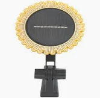
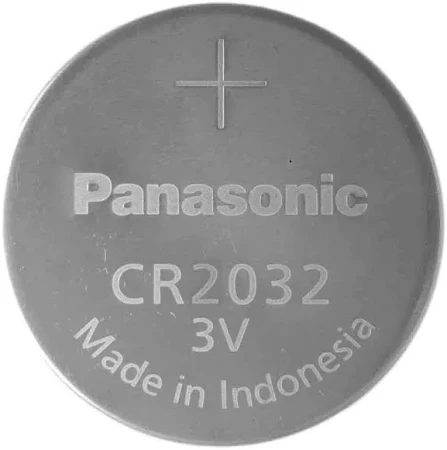



 | 

# Zigbee Smart home - Best Buy Tips

 

 

What is a smart home without digital ears and eyes? Sensors are the digital version of those.\
With the sensor data, you can make conditions, act on it and control other devices.

On this page, you find my personal favorite sensors, actuator and other Zigbee home automation related hardware.

If you need some home automation inspiration, check my [home automation ideas](../ideas/home_automation_ideas) section!

Most devices are for sale by the online shop AliExpress.
I order 90% of my home automation devices on this site for years already. 
You pay a good price, and they have fast shipping, sometimes you have the order already delivered within one week!

---

## Table of Contents
<!-- TOC -->
  * [Why I chose Zigbee](#why-i-chose-zigbee)
  * [Zigbee coordinator](#zigbee-coordinator)
  * [Zigbee sensors and actuators](#zigbee-sensors-and-actuators)
    * [Contact sensor](#contact-sensor)
    * [Motion sensor](#motion-sensor)
    * [Presence detection sensor](#presence-detection-sensor)
    * [Air quality sensor](#air-quality-sensor)
    * [Temperature sensor](#temperature-sensor)
    * [Light intensity sensor](#light-intensity-sensor)
    * [Leak sensor](#leak-sensor)
    * [Rain sensor](#rain-sensor)
    * [Lights](#lights)
      * [Bulb](#bulb)
      * [LED strip](#led-strip)
    * [Buttons](#buttons)
      * [Wall switch](#wall-switch)
      * [Wall dimmer](#wall-dimmer)
      * [Portable button](#portable-button)
    * [Vibration sensor](#vibration-sensor)
    * [USB adapter switch](#usb-adapter-switch)
    * [Infrared remote control](#infrared-remote-control)
    * [Radiator Thermostat](#radiator-thermostat)
    * [Smart socket](#smart-socket)
      * [Outdoor socket](#outdoor-socket)
  * [Batteries](#batteries)
    * [AAA sized](#aaa-sized)
    * [CR2032](#cr2032)
    * [CR1632](#cr1632)
    * [CR2450](#cr2450)
    * [Battery eliminators](#battery-eliminators)
  * [Cables](#cables)
    * [Micro USB power cable](#micro-usb-power-cable)
    * [USB-C power cable](#usb-c-power-cable)
    * [USB-C to USB-C](#usb-c-to-usb-c)
    * [USB-A extension cable](#usb-a-extension-cable)
  * [Power](#power)
  * [Battery powered PIR lights](#battery-powered-pir-lights)
<!-- TOC -->

---

> **_NOTE 1:_** Almost all hardware links on this page are devices I also use myself.\
> Most of the links are affiliate links, so you pay the same price AND support my blog also by buying it from here.

> **_NOTE 2:_** I advise these products based on my personal experience.\
> I run my network with a CC2652 Zigbee adapter and Zigbee2MQTT.\
> It can be with other hardware combinations it doesn't run with the same experience.
---
## Why I chose Zigbee

On the market, there are different types of protocols to create a smart home network. Like Zigbee, Thread, Wifi, Bluetooth, Z-Wave and Matter. All with their pros and cons. You can use different protocols next to each other. I chose for one, specific Zigbee.

This is why I choose for Zigbee:
* There is a wide range of sensor and actuator types available;
* Every Zigbee device, independent of manufacturer, it works in your network;
* The prices are low;
* It works locally, no internet is required;
* You can even link buttons direct to (a group) lamps without the need of a hub;
* Not dependent on the manufacture app, cloud or other software. When a manufacture gets bankrupt, you still can use your devices.
* It works as a mesh network, you can reach devices far away from the coordinator as long as there are enough active hops in between;
* The standard is an open protocol, you don't pay for a license fees (for Z-Wave you do) to use it;
* No compatibility issues with hardware with older or newer Zigbee versions;
* Active development on the software Zigbee2MQTT with every release a bulk of new supported Zigbee devices;

A reason why not to choose for Zigbee? I don't know :)

---

## Zigbee coordinator

Since 2020, I've run non-stop my Zigbee network with the {{imgBasket}}<a href="https://slae.sh/projects/cc2652/" target="_blank">Slaesh's CC2652RB stick (Slae website)</a> <a href="https://www.zigbee2mqtt.io/guide/adapters/zstack.html" target="_blank" alt="CC2652RB">{{imgZ2M}}CC2652RB</a> without any issue, it's a very reliable stick.
My network grew to 130+ devices today, and it still runs fast.

Another new coordinator which many people are very satisfied with is the <a href="https://s.click.aliexpress.com/e/_EuPZr6H" target="_blank">Sonoff ZBDongle-E Plus (AliExpress)</a> <a href="https://amzn.to/3OkLelX" target="_blank">(Amazon)</a> <a href="https://www.zigbee2mqtt.io/guide/adapters/zstack.html" target="_blank" alt="https://www.zigbee2mqtt.io/guide/adapters/zstack.html#zstack-adapters-texas-instruments">{{imgZ2M}}EFR32MG21</a>

 

To avoid interference with Bluetooth or Wifi,
it's better to move the stick away from the server. This is recommended for every stick. 
You can use a {{imgBasket}}<a href="https://s.click.aliexpress.com/e/_Dm5S1BL" target="_blank">USB A extension cord (AliExpress)</a> <a href="https://amzn.to/3V2q9Rk" target="_blank">(Amazon)</a> for it.

---

## Zigbee sensors and actuators

### Contact sensor

A contact sensor can be placed to check if doors and windows are open or closed. The sensor knows only those two values. The contact sensor works with a "reed switch", the circuit is by default open, but when there is a magnet nearby, the internal metal closes the circuit.

The sensor can also be used attached to other sensors that also return an open or closed circuit. With this behavior, you can create also a seat sensor or a water leak sensor.

&nbsp;

{{imgBasket}}<a href="https://s.click.aliexpress.com/e/_EumfxFt" target="_blank">Zigbee Contact sensor - Aqara (AliExpress)</a>
<a href="https://amzn.to/4fzYtvd" target="_blank">(Amazon)</a>
<a href="https://www.zigbee2mqtt.io/devices/MCCGQ11LM.html" target="_blank" title="MCCGQ11LM">{{imgZ2M}}MCCGQ11LM</a>

{{imgBasket}}<a href="https://s.click.aliexpress.com/e/_DlnHPDB" target="_blank">Zigbee Contact sensor - Tuya (AliExpress)</a>
<a href="https://amzn.to/3ZfMxch" target="_blank">(Amazon)</a>
<a href="https://www.zigbee2mqtt.io/devices/ZD08.html" target="_blank" title="ZD08">{{imgZ2M}}ZD08</a>

{{imgBasket}}<a href="https://s.click.aliexpress.com/e/_DBqHJ9x" target="_blank">Zigbee Contact sensor 2xAAA powered (cheaper) - Tuya (AliExpress)</a>
<a href="https://amzn.to/4eBavTK" target="_blank">(Amazon)</a>
<a href="https://www.zigbee2mqtt.io/devices/ZD06.html" target="_blank" title="ZD06">{{imgZ2M}}ZD06</a>

---

### Motion sensor

The traditional motion sensors work with PIR, which stands for Passive InfraRed. This sensor detects objects which sending heat, like humans and animals. 

I like the Aqara motion sensor myself a lot. It's fast, reliable. With the stand you can point it in a specific direction, so it doesn't 'see' the whole room.

If I want to cover a whole room, I use a different type PIR sensor which you can stick in the center of the ceiling and look around in all directions.

 &nbsp;

{{imgBasket}}<a href="https://s.click.aliexpress.com/e/_DBmzpmB" target="_blank">Zigbee motion sensor beam, with stand - Aqara (AliExpress)</a>
<a href="https://amzn.to/3Oj8yR5" target="_blank">(Amazon)</a>
<a href="https://www.zigbee2mqtt.io/devices/RTCGQ11LM.html" target="_blank" title="RTCGQ11LM">{{imgZ2M}}RTCGQ11LM</a>

{{imgBasket}}<a href="https://s.click.aliexpress.com/e/_DFRt33t" target="_blank">Zigbee motion sensor beam, without stand - Xiaomi (AliExpress)</a>
<a href="https://www.zigbee2mqtt.io/devices/RTCGQ01LM.html" target="_blank" title="RTCGQ01LM">{{imgZ2M}}RTCGQ01LM</a>

{{imgBasket}}<a href="https://s.click.aliexpress.com/e/_Dn2fzd5" target="_blank">Zigbee motion sensor all directions - Tuya (AliExpress)</a>
<a href="https://www.zigbee2mqtt.io/devices/IH012-RT01.html" target="_blank" title="IH012-RT01">{{imgZ2M}}IH012-RT01</a> <!-- or 809WZT -->

{{imgBasket}}<a href="https://s.click.aliexpress.com/e/_EwELbwt" target="_blank">Zigbee / WIFI motion sensor PIR, AAA powered (cheaper) - Tuya (AliExpress)</a>
<a href="https://www.zigbee2mqtt.io/devices/ZP01.html" target="_blank" title="ZP01">{{imgZ2M}}ZP01</a>

[//]: # ({{imgBasket}}<a href="https://amzn.to/4i18dQH" target="_blank">Zigbee motion sensor all directions - LIGHTEU &#40;Amazon&#41;</a>)
[//]: # (<a href="https://www.zigbee2mqtt.io/devices/PIR1-ZB.html" target="_blank" title="ZP01">{{imgZ2M}}PIR1-ZB</a>)

---

### Presence detection sensor

A human presence sensor has no need to direct sight. 
You can also hide it in a closet.
It can detect persons when they don't move, for example, when they sit on a couch.\
Ideal for the living room, bedrooms and home office.

{{imgBasket}}<a href="https://s.click.aliexpress.com/e/_oEbnm2m" target="_blank">Zigbee / WIFI human Presence detection sensor (AliExpress)</a>
<a href="https://amzn.to/3Zi5pay" target="_blank">(Amazon)</a>
<a href="https://www.zigbee2mqtt.io/devices/ZY-M100-24G.html" target="_blank" title="ZY-M100-24G">{{imgZ2M}}ZY-M100-24G</a>

---

### Air quality sensor

This 6-in-1 sensor can detect six kinds of environmental parameters:
* Temperature
* Humidity
* PM2.5
* VOC of poisonous gas
* Formaldehyde (not really accurate)
* CO2 (not really accurate, then you need a dedicated one)

All these values can affect a healthy environment at home.

Normally you get single sensors for each parameter!

Because the price is low, there are some downsides in sensor precision, the formaldehyde and CO2 sensor doesn't work that good as a dedicated sensor. 
But for the other parameters, it is a good overall air quality sensor to detect how your air quality is and if you need some fresh air inside.

{{imgBasket}}<a href="https://s.click.aliexpress.com/e/_DCFb99R" target="_blank">Zigbee / WIFI Air quality sensor - Tuya (AliExpress)</a>
<a href="https://amzn.to/40Y4IEB" target="_blank">(Amazon)</a>
<a href="https://www.zigbee2mqtt.io/devices/TS0601_air_quality_sensor.html" target="_blank" title="TS0601_air_quality_sensor">{{imgZ2M}}TS0601</a>

---

### Temperature sensor

A temperature sensor is a simple sensor that measures, next to the temperature also, the humidity in a room. 
This sensor is useful to make automations like take action if someone is in the shower. 
Or in the summer when it becomes outside colder than inside.

{{imgBasket}}<a href="https://s.click.aliexpress.com/e/_DFVRG63" target="_blank">Zigbee temperature and humidity sensor - Aqara (AliExpress)</a>
<a href="https://amzn.to/3V2h0YX" target="_blank">(Amazon)</a>
<a href="https://www.banggood.com/Aqara-Temperature-Sensor-Smart-Zigbe-Air-Pressure-Humidity-Environment-Sensor-Remote-Control-for-XiaoMi-Home-Homekit-p-2004763.html?warehouse=CN&ID=0&p=IF081412102025201707&custlinkid=3958785" target="_blank">(Banggood)</a>
<a href="https://www.zigbee2mqtt.io/devices/WSDCGQ11LM.html" target="_blank" title="WSDCGQ11LM">{{imgZ2M}}WSDCGQ11LM</a>

{{imgBasket}}<a href="https://s.click.aliexpress.com/e/_EuScxuN" target="_blank">Zigbee temperature and humidity sensor (cheaper) - Tuya (AliExpress)</a>
<a href="https://www.zigbee2mqtt.io/devices/RSH-HS06.html" target="_blank" title="RSH-HS06">{{imgZ2M}}RSH-HS06</a>

---

### Light intensity sensor

A light intensity sensor (lux sensor) measures the amount of light brightness.\
Usefull to enable the lights when it become dark outside.

{{imgBasket}}<a href="https://s.click.aliexpress.com/e/_DdVtS4P" target="_blank">Zigbee lux sensor - Aqara (AliExpress)</a>
<a href="https://www.zigbee2mqtt.io/devices/GZCGQ01LM.html" target="_blank" title="GZCGQ01LM">{{imgZ2M}}GZCGQ01LM</a>

{{imgBasket}}<a href="https://s.click.aliexpress.com/e/_DlwYz45" target="_blank">Zigbee lux sensor (cheaper) - Moes (AliExpress)</a>
<a href="https://www.zigbee2mqtt.io/devices/TS0222_light.html" target="_blank" title="TS0222_light">{{imgZ2M}}TS0222_light</a>

{{imgBasket}}<a href="https://s.click.aliexpress.com/e/_DC8WRhJ" target="_blank">Zigbee lux sensor (cheaper) - Tuya (AliExpress)</a>
<a href="https://www.zigbee2mqtt.io/devices/TS0222.html" target="_blank" title="TS0222">{{imgZ2M}}TS0222/a>

---

### Leak sensor

The Aqara leak sensor has two metal screw contacts on the back of the sensor that measures if there is water, then the two contacts have a closed circuit because water conducts.

This sensor can also be used with other boolean sensors, 
like the [chair occupancy sensor](/zigbee/zigbee_chair_occupancy_sensor).

{{imgBasket}}<a href="https://s.click.aliexpress.com/e/_Ez89iiN " target="_blank">Aqara leak sensor (AliExpress)</a>
<a href="https://amzn.to/3ZneX2Z" target="_blank">(Amazon)</a>
<a href="https://www.zigbee2mqtt.io/devices/SJCGQ11LM.html" target="_blank" title="SJCGQ11LM">{{imgZ2M}}SJCGQ11LM</a>

#### Other leak sensor

Another leak sensor is a sensor that measures if there is water, 
then the two contacts have a closed circuit because water conducts.

{{imgBasket}}<a href="https://s.click.aliexpress.com/e/_DCRMz4L" target="_blank">Zigbee leak sensor (AliExpress)</a>
<a href="https://amzn.to/3Zj7va8" target="_blank">(Amazon)</a>
<a href="https://www.zigbee2mqtt.io/devices/TS0207_water_leak_detector_1.html" target="_blank" title="TS0207_water_leak_detector_1">{{imgZ2M}}TS0207</a>

 
 
 

---

### Rain sensor

This outdoor sensor detects raindrops and measures the light intensity (lux).\
It contains a build-in battery that charges via a small solar panel.

{{imgBasket}}<a href="https://s.click.aliexpress.com/e/_EIt99cD" target="_blank">Zigbee raindrop + lux sensor (AliExpress)</a>
<a href="https://amzn.to/4i2oF32" target="_blank">(Amazon)</a>
<a href="https://www.zigbee2mqtt.io/devices/RB-SRAIN01.html" target="_blank" title="RB-SRAIN01">{{imgZ2M}}RB-SRAIN01</a>

  

---

### Lights

#### Bulb

You can replace a normal E27 bulb with Zigbee variant.
With a colored version, you can use it to inform yourself with a color for different states.

{{imgBasket}}<a href="https://s.click.aliexpress.com/e/_oFxRuUw" target="_blank">Zigbee light bulb dimmable colored (AliExpress)</a>
<a href="https://www.zigbee2mqtt.io/devices/CK-BL702-AL-01.html" target="_blank" title="CK-BL702-AL-01">{{imgZ2M}}CK-BL702-AL-01</a>

&nbsp;
 

---

#### LED strip

This LED strip is available in different versions:
* Indoor no waterproof (IP20) / Outdoor waterproof (IP65)
* 5 / 10 meter
* RGB White or RGB Warm White

 

{{imgBasket}}<a href="https://s.click.aliexpress.com/e/_ookcWte" target="_blank">Zigbee RGB 5m LED strip (AliExpress)</a>
<a href="https://www.zigbee2mqtt.io/devices/TS0503B.html" target="_blank" title="TS0503B">{{imgZ2M}}TS0503B</a>

---

### Buttons

#### Wall switch

{{imgBasket}}<a href="https://s.click.aliexpress.com/e/_DBfTCOj" target="_blank">Zigbee wall switch - Aqara (AliExpress)</a>
<a href="https://amzn.to/3CxE8YH" target="_blank">(Amazon)</a>
<a href="https://www.zigbee2mqtt.io/devices/QBKG41LM.html" target="_blank" title="QBKG41LM">{{imgZ2M}}QBKG41LM</a>

{{imgBasket}}<a href="https://s.click.aliexpress.com/e/_Ddxq8ej" target="_blank">Zigbee wall switch - Moes (AliExpress)</a>
<a href="https://amzn.to/4hXszdD" target="_blank">(Amazon)</a>
<a href="https://www.zigbee2mqtt.io/devices/ZS-EUB_2gang.html" target="_blank" title="ZS-EUB_2gang">{{imgZ2M}}ZS-EUB</a>

 
 

#### Wall dimmer

This Zigbee dimmer replaces an original wall dimmer module.\
The easiest way to make a dimmable group with gu10 lights smart.

{{imgBasket}}<a href="https://www.ecodim.nl/nl/eco-dim07-zigbee-basic.html" target="_blank">ECO-DIM.07 LED dimmer press/turn 0-200W - EcoDim (manufacturer site with links to different shops)</a>
<a href="https://www.zigbee2mqtt.io/devices/Eco-Dim.07_Eco-Dim.10.html" target="_blank" title="Eco-Dim.07_Eco-Dim.10">{{imgZ2M}}Eco-Dim.07</a>

{{imgBasket}}<a href="https://amzn.to/4108Zri" target="_blank">ECO-DIM.01 LED dimmer press/turn 0-300W - EcoDim (Amazon)</a>

{{imgBasket}}<a href="https://www.ecodim.nl/nl/smart-led-dimmers-en-schakelaars/zigbee/" target="_blank">Other EcoDimZigbee devices - EcoDim (manufacturer site with links to different shops)</a>

---

#### Portable button

This button can trigger multiple scenarios because it supports three press types: single-, double- and long press.

{{imgBasket}}<a href="https://s.click.aliexpress.com/e/_DF2oxu7" target="_blank">Zigbee button - Aqara (AliExpress)</a>
<a href="https://amzn.to/40XzGws" target="_blank">(Amazon)</a>
<a href="https://www.zigbee2mqtt.io/devices/WXKG11LM.html" target="_blank" title="WXKG11LM">{{imgZ2M}}WXKG11LM</a>

{{imgBasket}}<a href="https://s.click.aliexpress.com/e/_DE12BCH" target="_blank">Small Zigbee button - Tuya / Loginovo (AliExpress)</a>
<a href="https://amzn.to/3AJuNg6" target="_blank">(Amazon)</a>
<a href="https://www.zigbee2mqtt.io/devices/ZG-101ZL.html" target="_blank" title="ZG-101ZL">{{imgZ2M}}ZG-101ZL</a>

 

---

### Vibration sensor

This sensor can measure vibrations and rotations in the X, Y and Z direction.

{{imgBasket}}<a href="https://s.click.aliexpress.com/e/_Dn1kLJv" target="_blank">Zigbee vibration sensor - Aqara (AliExpress)</a>
<a href="https://amzn.to/3OiAAvY" target="_blank">(Amazon)</a>
<a href="https://www.zigbee2mqtt.io/devices/DJT11LM.html" target="_blank" title="DJT11LM">{{imgZ2M}}DJT11LM</a>

   

---

### USB adapter switch

This actuator can toggle the power state of each USB port individual.\
The first port can also be used to switch on/off data access via USB, the other two only for USB power.

{{imgBasket}}<a href="https://s.click.aliexpress.com/e/_DnCpniJ" target="_blank">Zigbee / WIFI USB adapter switch - Tuya (AliExpress)</a>
<a href="https://amzn.to/4hSTs2x" target="_blank">(Amazon)</a>
<a href="https://www.zigbee2mqtt.io/devices/TS0003.html" target="_blank" title="TS0003">{{imgZ2M}}TS0003</a>

 

---

### Infrared remote control

This device can learn infrared remote control signals and send them again via Zigbee. 
This way you can create automations for air conditioners, fans, lights, etc.

{{imgBasket}}<a href="https://s.click.aliexpress.com/e/_DEUWZ73" target="_blank">Zigbee IR remote control - Moes (AliExpress)</a>
<a href="https://amzn.to/495yrxA" target="_blank">(Amazon)</a>
<a href="https://www.zigbee2mqtt.io/devices/UFO-R11.html" target="_blank" title="TS0003">{{imgZ2M}}UFO-R11</a>

{{imgBasket}}<a href="https://s.click.aliexpress.com/e/_DnpWmYp" target="_blank">Wifi IR remote control - Tuya (AliExpress)</a>
<a href="https://amzn.to/4eJPxlw" target="_blank">(Amazon)</a>

{{imgBasket}}<a href="https://s.click.aliexpress.com/e/_Dna8hgH" target="_blank">Wifi IR remote control RM4 Mini - Broadlink (AliExpress)</a>
<a href="https://amzn.to/3CDLyK1" target="_blank">(Amazon)</a>

#### Infrared + RF + 433MHz + 315MHz remote control

This wifi device supports a wide range of different wireless protocols, like Infrared + RF + 433MHz + 315MHz. 
It can learn from the original remote control it signals and send them again via Zigbee.\
This way you can create automations for air conditioners, fans, lights, etc.

{{imgBasket}}<a href="https://s.click.aliexpress.com/e/_DnbfWjP" target="_blank">Wifi IR + RF + 433 + 315 remote control - Moes (AliExpress)</a>
Model: RF-R1

---

### Radiator Thermostat

With this radiator thermostat valve, it is possible to open and close the radiator in steps.\
You can also schedule complete weeks in it what the temperature should be.

{{imgBasket}}<a href="https://s.click.aliexpress.com/e/_Ddaa6GD" target="_blank">Zigbee smart radiator thermostat - Moes / Tuya (AliExpress)</a>
<a href="https://amzn.to/417IWOV" target="_blank">(Amazon)</a>
<a href="https://www.zigbee2mqtt.io/devices/TV02-Zigbee.html" target="_blank" alt="TV02">{{imgZ2M}}TV02</a>
 

 

---

### Smart socket

Smart sockets are useful to make traditional "dump" devices smart. Like a traditional standing lamp with a plug. You put it "on" and place the smart plug between the socket and wall. Now you change the switch functionality to the plug which you can be controlled automatically.

Sockets are always connected to power, this makes this sensor also a hub in the Zigbee network which extends the range and coverage of your network. You can also plug a smart socket somewhere strategic with bad coverage to improve this. He doesn't need to be on or used.

A smart plug with power consumption metrics can be useful to detect the state of the machine. You don't use the on/off functionality in that case. This can be used for washing machines, dryers, dishwashers, ovens, etc.

I live in The Netherlands and around the world there are many different types of plugs.
These will only work in just a few EU lands.\
I use the Zigbee BlitzWolf EU SHP-13 or SHP-15 which has also power consumption measurement, a physic button to switch the state and can handle 3680 W and 16 A which is enough for washing machines and dryers. It took me a while before I got the correct one for this purpose, and now it runs for years without issues.
If you buy one which has a lower wattage, your socket constantly stops working; then you know you need one with a higher wattage!

{{imgBasket}}<a href="https://s.click.aliexpress.com/e/_m0qPURC" target="_blank">Zigbee smart power socket with power measurement - BlitzWolf EU SHP-15 (AliExpress)</a>
<a href="https://www.zigbee2mqtt.io/devices/TS011F_plug_3.html" target="_blank" alt="TS011F">{{imgZ2M}}TS011F_plug_3</a>

{{imgBasket}}Zigbee smart power socket with power measurement - BlitzWolf EU SHP-13 <a href="https://amzn.to/4i0Vhdv" target="_blank">(Amazon)</a>
<a href="https://www.banggood.com/BlitzWolf-BW-SHP13-ZigBee3_0-Smart-Socket-16A-EU-Plug-Electricity-Metering-APP-Remote-Controller-Timer-Work-with-Amazon-Alexa-Google-Home-p-2000907.html?warehouse=CN&ID=0&p=IF081412102025201707&custlinkid=3954741" target="_blank">(Banggood)</a>
<a href="https://www.zigbee2mqtt.io/devices/TS0121_plug.html" target="_blank" title="TS0121_plug">{{imgZ2M}}TS0121</a>

#### Outdoor socket

This outdoor Innr Zigbee power socket can handle 2300 W and has an IP44 rating (without power measurement).

{{imgBasket}}<a href="https://amzn.to/3Vt83Ip" target="_blank">Zigbee outdoor power socket - Innr (Dual Pack) (Amazon)</a>
<a href="https://www.zigbee2mqtt.io/devices/OLS_210.html" target="_blank" title="OLS_210">{{imgZ2M}}OLS_210</a>

 
 
 

This outdoor Silvercrest/Lidl Zigbee power socket can handle 3680 W and has an IP44 rating (without power measurement).

{{imgBasket}}<a href="https://amzn.to/4eBZVMp" target="_blank">Zigbee outdoor power socket - Silvercreset (Amazon)</a>
<a href="https://www.zigbee2mqtt.io/devices/HG06619.html" target="_blank" title="HG06619">{{imgZ2M}}HG06619</a>

 

 

This is a **dual socket** outdoor Zigbee device, where each socket can be controlled individual and has **power consumption measurements**.

{{imgBasket}}<a href="https://amzn.to/40SVJoc" target="_blank">Zigbee dual port power socket with power measurement - Nous (Amazon)</a>
<a href="https://www.zigbee2mqtt.io/devices/A4Z.html" target="_blank" title="A4Z">{{imgZ2M}}A4Z</a>

 

---

## Batteries

The advantage of a lot of Zigbee sensors is that they work completely wireless. 
You can place them everywhere without the need to wire them.
Most of the devices run for years on a single battery, but now and then you need to replace them.
Before you start using a new sensor, first check what kind of battery it uses and already order some of them.
When it gets out of fuel, you can directly replace it with a new battery.

These are common types of batteries used by the above-mentioned sensors:

### AAA sized

The advantage of these is that they are everywhere available to buy, also in your local supermarket.
Because of the size, they can run for a long time on a single battery. Even these are available as rechargeable. 
The downside is that these make the sensor also quite big.

{{imgBasket}}<a href="https://s.click.aliexpress.com/e/_DEejMZ5" target="_blank">Eneloop Rechargeable AA and AAA batteries - Panasonic (AliExpress)</a>
<a href="https://amzn.to/493a0ke" target="_blank">(Amazon)</a>

{{imgBasket}}<a href="https://s.click.aliexpress.com/e/_DkcYcJt" target="_blank">4x Rechargeable AA batteries - Duracell (AliExpress)</a>
<a href="https://amzn.to/4ePpz0k" target="_blank">(Amazon)</a>

{{imgBasket}}<a href="https://s.click.aliexpress.com/e/_mr8Qxrc" target="_blank">Non rechargeable AA and AAA batteries - Yuform (AliExpress)</a>

### CR2032

This CR2032 is the most commonly used battery. It's small, but still has enough power to run sensors for a year.

{{imgBasket}}<a href="https://s.click.aliexpress.com/e/_DBuYbP9" target="_blank">CR2032 - Panasonic (AliExpress)</a>
<a href="https://amzn.to/3V4sHye" target="_blank">(Amazon)</a>

{{imgBasket}}<a href="https://s.click.aliexpress.com/e/_EzKymsH" target="_blank">CR2032 - Sony (AliExpress)</a>
<a href="https://amzn.to/4i2rCAE" target="_blank">(Amazon)</a>

#### CR2032 rechargeable = LIR2032

Instead of buying batteries for only a single use it's also possible to buy the rechargeable variant of the CR2032, called LIR2032.

They not very famous and more expensive but environment friendlier, and it reduces waste.
  

{{imgBasket}}<a href="https://s.click.aliexpress.com/e/_DdlNfZD" target="_blank">LIR2032 rechargeable adapter with USB-C (batteries not included) (AliExpress)</a> Lights green when it's full.
DON'T CHARGE NORMAL CR2032 WITH IT!

{{imgBasket}}<a href="https://s.click.aliexpress.com/e/_DCye8sj" target="_blank">2x LIR2032 rechargeable batteries - PynMont (AliExpress)</a>

{{imgBasket}}<a href="https://s.click.aliexpress.com/e/_DnnhBnN" target="_blank">5x LIR2032 rechargeable batteries (AliExpress)</a>
<a href="https://amzn.to/4fCK0i9" target="_blank">(Amazon)</a>

#### CR2032 USB battery replacements

It's also possible to convert a wireless CR2032 devices to a USB wired devices. Now you don't have to care about replacing batteries. 

{{imgBasket}}<a href="https://s.click.aliexpress.com/e/_DDUCKpH" target="_blank">CR2032 USB battery replacements (AliExpress)</a>
<a href="" target="_blank">(Amazon)</a>

{{imgBasket}}<a href="https://s.click.aliexpress.com/e/_Dlb4x11" target="_blank">CR2032 USB battery replacements (AliExpress)</a>

### CR1632

This CR1632 battery is a bit smaller than the CR2032.

{{imgBasket}}<a href="https://s.click.aliexpress.com/e/_DeRGeFB" target="_blank">CR1632 - Panasonic (AliExpress)</a>
<a href="https://amzn.to/490qqKe" target="_blank">(Amazon)</a>

{{imgBasket}}<a href="https://s.click.aliexpress.com/e/_onH4bF0" target="_blank">CR1632 - Panasonic (AliExpress)</a>

### CR2450

This CR2450 battery is a bit thicker than the other ones.

{{imgBasket}}<a href="https://s.click.aliexpress.com/e/_EGHDQRv" target="_blank">CR2450 - Eoenkk (AliExpress)</a>

{{imgBasket}}<a href="https://s.click.aliexpress.com/e/_DkYYFap" target="_blank">CR2450 - Panasonic (AliExpress)</a>
<a href="https://amzn.to/4hT10SV" target="_blank">(Amazon)</a>

{{imgBasket}}<a href="https://s.click.aliexpress.com/e/_Eu4Gfup" target="_blank">Rechargeable LIR2450 (AliExpress)</a>

{{imgBasket}}<a href="https://s.click.aliexpress.com/e/_DntctnV" target="_blank">Rechargeable LIR2450 + charger (AliExpress)</a>

### Battery eliminators

Battery eliminator (aka battery replacements) is, as the name already says, a replacement for battery power device to connect them to the main power.
This saves you from buying new batteries. The big advantage is also that you now can control them with your home automations by adding a smart plugin between the plug and the wall outlet. Now you also don't have to worry that you forgot them to put them off again.
There are different variants of them. Replacements for AA or AAA batteries and with a plug or USB connector. The advantage of a USB connector is that you can plug multiple to an active powered USB-hub to control multiple ones.

I use these a lot for all kinds of Christmas decorations.

{{imgBasket}}<a href="https://s.click.aliexpress.com/e/_oElMTEQ" target="_blank">AA battery replacement with USB (AliExpress)</a>
<a href="https://amzn.to/3AIfXqb" target="_blank">(Amazon)</a>

{{imgBasket}}<a href="https://s.click.aliexpress.com/e/_oBi7yye" target="_blank">AAA battery replacement with USB (AliExpress)</a>
<a href="https://amzn.to/3ATHOUb" target="_blank">(Amazon)</a>

{{imgBasket}}<a href="https://s.click.aliexpress.com/e/_o2FtBHM" target="_blank">AA battery replacement with power socket EU (AliExpress)</a>

{{imgBasket}}<a href="https://s.click.aliexpress.com/e/_opJpPLu" target="_blank">AAA battery replacement with power socket EU (AliExpress)</a> 

{{imgBasket}}<a href="https://s.click.aliexpress.com/e/_DDUCKpH" target="_blank">CR2032 battery replacement with USB (AliExpress)</a>

<a href="https://s.click.aliexpress.com/e/_DeBgzBR" target="_blank">

 {{imgBasket}} USB A or C to clips 3V (same voltage as two batteries) (AliExpress)
</a>

---

## Cables

### Micro USB power cable

USB-A to micro USB cable to power the ESP.

<a href="https://s.click.aliexpress.com/e/_onj6tZi" target="_blank">
 
{{imgBasket}}Micro USB cable (AliExpress)</a>
<a href="https://amzn.to/3CAUNdU" target="_blank">(Amazon)</a>

### USB-C power cable

USB-A to USB-C cable to power the ESP.

<a href="https://s.click.aliexpress.com/e/_EHngRGX" target="_blank">
 
{{imgBasket}}USB-A to USB-C cable (AliExpress)</a>

### USB-C to USB-C

USB-C to USB-C power cable with 90-degree connectors.

<a href="https://s.click.aliexpress.com/e/_EvdirFL" target="_blank">
 
{{imgBasket}}USB-C to USB-C power cable (AliExpress)</a>

### USB-A extension cable

Useful to move your Zigbee stick away from your server for the best range and avoid interference.

<a href="https://s.click.aliexpress.com/e/_Dm5S1BL" target="_blank">
 
{{imgBasket}}USB A Extension Cable Male to Female (AliExpress)</a>

---

## Power

### Adapters

5V EU USB power adapter to power your USB devices.

{{imgBasket}}<a href="https://s.click.aliexpress.com/e/_DBB3Upl" target="_blank">5V USB power adapter - link 1 (AliExpress)</a>

{{imgBasket}}<a href="https://s.click.aliexpress.com/e/_DCdi80b" target="_blank">5V USB power adapter - link 2 (AliExpress)</a>

5V EU USB power adapter to power multiple usb devices, with fast charging and 3.1A.

{{imgBasket}}<a href="https://s.click.aliexpress.com/e/_DeEZ7xD" target="_blank">5V EU USB power adapter</a>

---

## Battery powered PIR lights

Not connected, but still smart with its PIR sensor.\
Very useful for closets or stairs where no power is available.

{{imgBasket}}<a href="https://s.click.aliexpress.com/e/_DC7Ac3r" target="_blank">Battery powered PIR lights</a>

---

  

See [ESPHome DIY sensors buy tips](esphome_diy) for all kinds or hardware buy tips to create your own sensors.