

 | 

# Zigbee Smart home - Best Buy Tips

 

<a href="/buy">
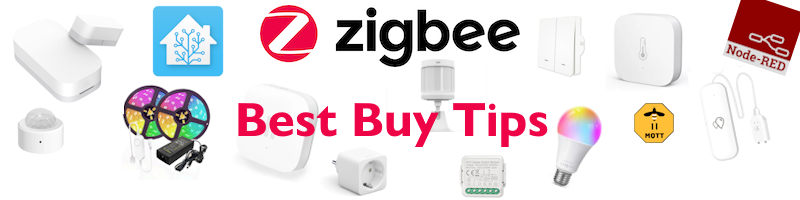
</a>

 

What is a smart home without digital ears and eyes? Sensors are the digital version of those.\
With the sensor data, you can make conditions, act on it and control other devices.

On this page, you find my personal favorite sensors, actuator and other (Zigbee) home automation related hardware.

If you need some home automation inspiration, check my [home automation ideas](../ideas/home_automation_ideas) section!

Most devices are for sale by the online shop [AliExpress](https://s.click.aliexpress.com/e/_omcoItX).
I order 90% of my home automation devices on this site for years already. 
You pay a good price, and they have fast shipping, sometimes you have the order already delivered within one week!\
If the product is also available at Amazon, I also placed a link to it also.

[> Go direct to the sensor section on this page.](#zigbee-sensors-and-actuators)

---

## Table of Contents
<!-- TOC -->
  * [Why I chose Zigbee](#why-i-chose-zigbee)
  * [Zigbee coordinator](#zigbee-coordinator)
  * [Zigbee sensors and actuators](#zigbee-sensors-and-actuators)
    * [Contact sensor](#contact-sensor)
    * [Motion sensor](#motion-sensor)
    * [Presence detection sensor](#presence-detection-sensor)
    * [Temperature sensor](#temperature-sensor)
    * [Light intensity sensor](#light-intensity-sensor)
    * [Leak sensor](#leak-sensor)
    * [Pressure sensor](#pressure-sensor)
    * [Lights](#lights)
      * [Bulb](#bulb)
    * [Bulb socket](#bulb-socket)
      * [LED strip](#led-strip)
    * [Buttons](#buttons)
    * [Vibration sensor](#vibration-sensor)
    * [USB adapter switch](#usb-adapter-switch)
    * [Plant soil sensor](#plant-soil-sensor)
    * [Outdoor sensors](#outdoor-sensors)
    * [Air quality sensor](#air-quality-sensor)
    * [Infrared remote control](#infrared-remote-control)
    * [Radiator Thermostat](#radiator-thermostat)
    * [Smart socket](#smart-socket)
    * [Power strip](#power-strip)
  * [Smart Curtains](#smart-curtains)
  * [Google Coral USB](#google-coral-usb)
  * [Batteries](#batteries)
    * [Battery eliminators](#battery-eliminators)
  * [Cables](#cables)
    * [Micro USB power cable](#micro-usb-power-cable)
    * [USB-C power cable](#usb-c-power-cable)
    * [USB-C to USB-C](#usb-c-to-usb-c)
    * [USB-A extension cable](#usb-a-extension-cable)
  * [Power](#power)
    * [Adapters](#adapters)
  * [Battery powered with PIR](#battery-powered-with-pir)
    * [Lights](#lights-1)
<!-- TOC -->

---

> **_NOTE 1:_** Almost all hardware links on this page are devices I also use myself.\
> Most of the links are affiliate links, you pay the same price AND support my blog a bit.

> **_NOTE 2:_** I advise these products based on my personal experience.\
> I run my network with a CC2652 Zigbee adapter and Zigbee2MQTT.\
> It can be with other hardware combinations it doesn't run with the same experience.

---

[> Go direct to the sensor section on this page.](#zigbee-sensors-and-actuators)

## Why I chose Zigbee

On the market, there are different types of protocols to create a smart home network. 
Like Zigbee, Thread, WiFi, Bluetooth, Z-Wave and Matter. 
All with their pros and cons. 
You can use different protocols next to each other. 
I chose for one protocol: Zigbee.

This is why I choose for Zigbee:
* There is a wide range of sensor and actuator types available;
* Every Zigbee device, independent of a manufacturer, it works in your network;
* The prices are low;
* It works locally, no internet is required;
* You can even link buttons direct to (a group) lamps without the need of a hub;
* Not dependent on the manufacture app, cloud or other software. When manufacture gets bankrupt, you still can use your devices.
* It works as a mesh network, you can reach devices far away from the coordinator as long as there are enough active hops in between;
* The standard is an open protocol, you don't pay for a license fees (for Z-Wave you do) to use it;
* No compatibility issues with hardware with older or newer Zigbee versions;
* Active development on the software Zigbee2MQTT with every release a set of new supported Zigbee devices;

A reason why not to choose for Zigbee? I don't know :)

---

## Zigbee coordinator

This new coordinator which many people are very satisfied with is the Sonoff ZBDongle-E Plus 
<a href="https://s.click.aliexpress.com/e/_omBbJGj" target="_blank">(AliExpress)</a> 
<a href="https://amzn.to/3RO4Ro9#ad" target="_blank">(Amazon US)</a> 
<a href="https://amzn.to/45o9mO9#ad" target="_blank">(Amazon DE)</a> 
<a href="https://amzn.to/3OkLelX#ad" target="_blank">(Amazon NL)</a> 
<a href="https://www.zigbee2mqtt.io/guide/adapters/zstack.html" target="_blank" alt="https://www.zigbee2mqtt.io/guide/adapters/zstack.html#zstack-adapters-texas-instruments">{{imgZ2M}}EFR32MG21</a>

I've run my Zigbee network since 2020 non-stop with the {{imgBasket}}Slaesh's CC2652RB stick <a href="https://slae.sh/projects/cc2652/" target="_blank">(Slae website)</a> 
<a href="https://www.zigbee2mqtt.io/guide/adapters/zstack.html" target="_blank" alt="CC2652RB">{{imgZ2M}}CC2652RB</a> without any issue, it's a very reliable stick.
My network grew to 140+ devices today, and it still runs fast.

To avoid interference with Bluetooth or WiFi,
it's better to move the stick away from the server. This is recommended for every stick. 
You can use a {{imgBasket}}USB A extension cord <a href="https://s.click.aliexpress.com/e/_oFCMjGU" target="_blank">(AliExpress)</a> 
<a href="https://amzn.to/43OGuhG#ad" target="_blank">(Amazon US)</a>
<a href="https://amzn.to/45jO8Rs#ad" target="_blank">(Amazon DE)</a>
<a href="https://amzn.to/3V2q9Rk#ad" target="_blank">(Amazon NL)</a> for it.

 

---

## Zigbee sensors and actuators

### Contact sensor

A contact sensor can be placed to check if doors and windows are open or closed. The sensor knows only those two values. 
The contact sensor works with a "reed switch", the circuit is by default open, but when there is a magnet nearby, the internal metal closes the circuit.

The sensor can also be used attached to other sensors that also return an open or closed circuit. 
With this behavior, you can create also a [seat occupancy sensor](/zigbee/zigbee_chair_occupancy_sensor) or a [water leak sensor](/zigbee/zigbee_water_leak_sensor).

**Best option:**\
{{imgBasket}}Zigbee Contact sensor - Aqara
<a href="https://s.click.aliexpress.com/e/_EumfxFt" target="_blank">(AliExpress)</a>
<a href="https://amzn.to/3HuCZEk#ad" target="_blank">(Amazon DE)</a>
<a href="https://amzn.to/3Dnl1kK#ad" target="_blank">(Amazon NL)</a>
<a href="https://www.zigbee2mqtt.io/devices/MCCGQ11LM.html" target="_blank" title="MCCGQ11LM">{{imgZ2M}}MCCGQ11LM</a> aka T1
Small and a long battery life.\
Unfortunately, not available for Amazon US, but <a href="https://amzn.to/4fGpP3x#ad" target="_blank">look here</a> for alternative Zigbee contact sensors.

 

**Cheaper option:**\
{{imgBasket}}Zigbee Contact sensor - Tuya
<a href="https://s.click.aliexpress.com/e/_oFAHUPO" target="_blank">(AliExpress)</a>
<a href="https://amzn.to/3Ut5mp7#ad" target="_blank">(Amazon US)</a>
<a href="https://amzn.to/45EnGB2#ad" target="_blank">(Amazon DE)</a>
<a href="https://amzn.to/4mbmFXy#ad" target="_blank">(Amazon NL)</a>
<a href="https://www.zigbee2mqtt.io/devices/ZD08.html" target="_blank" title="ZD08">{{imgZ2M}}ZD08</a>
Small and cheaper.

<a href="https://s.click.aliexpress.com/e/_oFAHUPO" target="_blank">
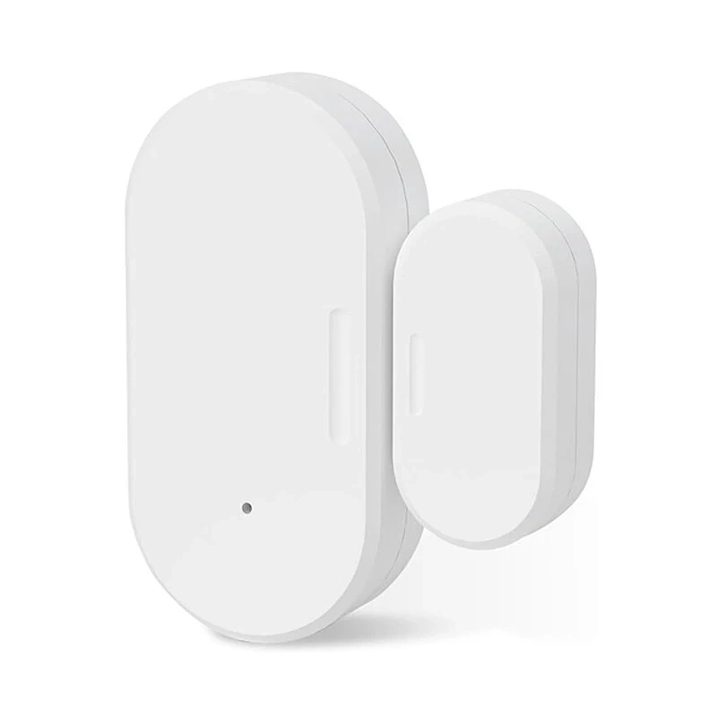</a>

 

**2xAAA battery option:**\
{{imgBasket}}Zigbee Contact sensor 2xAAA powered - Tuya 
<a href="https://s.click.aliexpress.com/e/_olDzemw" target="_blank">(AliExpress)</a>
<a href="https://amzn.to/3H6NUDI#ad" target="_blank">(Amazon US)</a>
<a href="https://amzn.to/3V5Vq5c#ad" target="_blank">(Amazon DE)</a>
<a href="https://amzn.to/3GJdFKq#ad" target="_blank">(Amazon NL)</a>
<a href="https://www.zigbee2mqtt.io/devices/ZD06.html" target="_blank" title="ZD06">{{imgZ2M}}ZD06</a>
Battery powered, bigger, cheaper.

---

### Motion sensor

A human presence sensors. 
It's a combination with a PIR + mmWave radar and brightness sensor. 
It's wireless and 2x AAA battery powered.  
The PIR sensor is used to detect a person and to activate the mmWave radar sensor. 
It avoids the detection of animals.
It can also detect persons who sit still or laying in bed.

{{imgBasket}}Zigbee Human motion + presence + lux sensor - Hoazee
<a href="https://s.click.aliexpress.com/e/_oEy7q2V" target="_blank">(AliExpress)</a>
<a href="https://amzn.to/3TWO4k4#ad" target="_blank">(Amazon US)</a>
<a href="https://amzn.to/471mJF4#ad" target="_blank">(Amazon DE)</a>
<a href="https://amzn.to/470o9Q6#ad" target="_blank">(Amazon NL)</a>
<a href="https://www.zigbee2mqtt.io/devices/ZG-204ZM.html" target="_blank" title="ZG-204ZM">{{imgZ2M}}ZG-204ZM</a>

 

The traditional motion sensors work with PIR, which stands for Passive InfraRed. This sensor detects objects which sending heat, like humans and animals. 

I like the Aqara motion sensor myself a lot. It's fast, reliable. With the stand you can point it in a specific direction, so it doesn't 'see' the whole room.

If I want to cover a whole room, I use a different type PIR sensor which you can stick in the center of the ceiling and look around in all directions.

**Best option:**\
{{imgBasket}}Zigbee motion sensor beam, WITH LIGHT SENSOR - Aqara
<a href="https://s.click.aliexpress.com/e/_okFlU1n" target="_blank">(AliExpress)</a>
<a href="https://amzn.to/3GT5efA#ad" target="_blank">(Amazon US)</a>
<a href="https://amzn.to/45DHsfK#ad" target="_blank">(Amazon DE)</a>
<a href="https://amzn.to/3Oj8yR5#ad" target="_blank">(Amazon NL)</a>
<a href="https://www.zigbee2mqtt.io/devices/RTCGQ11LM.html" target="_blank" title="RTCGQ11LM">{{imgZ2M}}RTCGQ11LM / P1</a>

 

**Alternative option:**\
{{imgBasket}}Zigbee motion sensor beam, without stand - Xiaomi 
<a href="https://s.click.aliexpress.com/e/_DFRt33t" target="_blank">(AliExpress)</a>
<a href="https://amzn.to/41NgMIi#ad" target="_blank">(Amazon DE)</a>
<a href="https://amzn.to/4kUzGUw#ad" target="_blank">(Amazon NL)</a>
<a href="https://www.zigbee2mqtt.io/devices/RTCGQ01LM.html" target="_blank" title="RTCGQ01LM">{{imgZ2M}}RTCGQ01LM</a>

**All direction option:**\
{{imgBasket}}Zigbee motion sensor all directions - Tuya
<a href="https://s.click.aliexpress.com/e/_Dn2fzd5" target="_blank">(AliExpress)</a>
<a href="https://amzn.to/3G0RcYq#ad" target="_blank">(Amazon US)</a>
<a href="https://amzn.to/3V2KJ3g#ad" target="_blank">(Amazon DE)</a>
<a href="https://amzn.to/3H4xlrT#ad" target="_blank">(Amazon DE)</a>
<a href="https://www.zigbee2mqtt.io/devices/IH012-RT01.html" target="_blank" title="IH012-RT01">{{imgZ2M}}IH012-RT01</a> <!-- or 809WZT -->

**2xAAA battery option:**\
{{imgBasket}}Zigbee / WiFi motion sensor PIR, AAA powered - Tuya
<a href="https://s.click.aliexpress.com/e/_EwELbwt" target="_blank">(AliExpress)</a>
<a href="https://amzn.to/4jqxXWH#ad" target="_blank">(Amazon US)</a>
<a href="https://amzn.to/4mQJ5xP#ad" target="_blank">(Amazon DE)</a>
<a href="https://www.zigbee2mqtt.io/devices/ZP01.html" target="_blank" title="ZP01">{{imgZ2M}}ZP01</a>

[//]: # ({{imgBasket}}<a href="https://amzn.to/4i18dQH#ad" target="_blank">Zigbee motion sensor all directions - LIGHTEU &#40;Amazon&#41;</a>)
[//]: # (<a href="https://www.zigbee2mqtt.io/devices/PIR1-ZB.html" target="_blank" title="ZP01">{{imgZ2M}}PIR1-ZB</a>)

 

---

### Presence detection sensor

A human presence sensor has no need to direct sight. 
You can also hide it in a closet.
It can detect persons when they don't move, for example, when they sit on a couch.\
Ideal for the living room, bedrooms and home office.

{{imgBasket}}Zigbee / WiFi human Presence detection sensor 
<a href="https://s.click.aliexpress.com/e/_oEbnm2m" target="_blank">(AliExpress)</a>
<a href="https://amzn.to/46ZtuXT#ad" target="_blank">(Amazon US)</a>
<a href="https://amzn.to/4mQ1MBO#ad" target="_blank">(Amazon DE)</a>
<a href="https://amzn.to/3Zi5pay#ad" target="_blank">(Amazon NL)</a>
<a href="https://www.zigbee2mqtt.io/devices/ZY-M100-24G.html" target="_blank" title="ZY-M100-24G">{{imgZ2M}}ZY-M100-24G</a>

 

---

### Temperature sensor

<a href="https://s.click.aliexpress.com/e/_oCYhgnd" target="_blank">
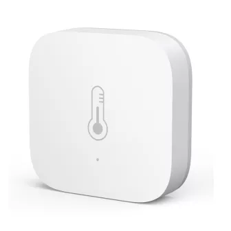</a>

A temperature sensor is a simple sensor that measures, next to the temperature also, the humidity in a room. 
This sensor is useful to make automations like take action if someone is in the shower. 
Or in the summer when it becomes outside colder than inside.

**Best option:**\
{{imgBasket}}Zigbee temperature and humidity sensor - Aqara
<a href="https://s.click.aliexpress.com/e/_oCYhgnd" target="_blank">(AliExpress)</a>
(N/A in Amazon US)
<a href="https://amzn.to/4mEBW3i#ad" target="_blank">(Amazon DE)</a>
<a href="https://amzn.to/3V2h0YX#ad" target="_blank">(Amazon NL)</a>
<a href="https://www.banggood.com/Aqara-Temperature-Sensor-Smart-Zigbe-Air-Pressure-Humidity-Environment-Sensor-Remote-Control-for-XiaoMi-Home-Homekit-p-2004763.html?warehouse=CN&ID=0&p=IF081412102025201707&custlinkid=3958785" target="_blank">(Banggood)</a>
<a href="https://www.zigbee2mqtt.io/devices/WSDCGQ11LM.html" target="_blank" title="WSDCGQ11LM">{{imgZ2M}}WSDCGQ11LM</a>

**Cheaper option:**\
{{imgBasket}}Zigbee temperature and humidity sensor - Tuya / Thirdreality
<a href="https://s.click.aliexpress.com/e/_EuScxuN" target="_blank">(AliExpress)</a>
<a href="https://amzn.to/3GGLegb#ad" target="_blank">(Amazon US)</a>
<a href="https://amzn.to/4miwd3o#ad" target="_blank">(Amazon DE)</a>
<a href="https://amzn.to/4cuvcBp#ad" target="_blank">(Amazon NL)</a>
<a href="https://www.zigbee2mqtt.io/devices/RSH-HS06.html" target="_blank" title="RSH-HS06">{{imgZ2M}}RSH-HS06</a>

**2xAAA battery option:**\
{{imgBasket}}Zigbee / WiFi temperature and humidity sensor 2xAAA powered - Tuya 
<a href="https://s.click.aliexpress.com/e/_onVr48P" target="_blank">(AliExpress)</a>
<a href="https://amzn.to/4f72VC3#ad" target="_blank">(Amazon US)</a>
<a href="https://amzn.to/4oCRyWY#ad" target="_blank">(Amazon DE)</a>
<a href="https://amzn.to/4lfjVI5#ad" target="_blank">(Amazon NL)</a>
<a href="https://www.zigbee2mqtt.io/devices/WSD500A.html" target="_blank" title="WSD500A">{{imgZ2M}}WSD500A</a> Battery powered, bigger, cheaper.\
This sensor can be converted to an [outlet sensor](/zigbee/zigbee_outlet_sensor).\

**With display option:**\
{{imgBasket}}Zigbee / WiFi temperature and humidity sensor 2xAAA powered with display. 
The width is 7 cm and the height is 2,6 cm.\
<a href="https://s.click.aliexpress.com/e/_oBX1DMr" target="_blank">(AliExpress)</a>
<a href="https://amzn.to/4lN2hwg#ad" target="_blank">(Amazon US)</a>
Model: ZY-TH01Pro
<!--<a href="https://www.zigbee2mqtt.io/devices/ZY-TH01Pro.html" target="_blank" title="ZY-TH01Pro">{{imgZ2M}}ZY-TH01Pro</a>-->

#### Water-resistant option:
{{imgBasket}}Zigbee water-resistant (IP65) aquarium/pool/bath water temperature sensor with a probe and display.
<a href="https://s.click.aliexpress.com/e/_oEuJPkc" target="_blank">(AliExpress)</a>
<a href="https://amzn.to/4oWI9dd#ad" target="_blank">(Amazon DE)</a>
<a href="https://amzn.to/44Unhd2#ad" target="_blank">(Amazon NL)</a>

Model: SNZB-02LD
Battery: CR2477 
<a href="https://www.zigbee2mqtt.io/devices/SNZB-02LD.html" target="_blank" title="SNZB-02LD">{{imgZ2M}}SNZB-02LD</a>

<a href="https://s.click.aliexpress.com/e/_oEuJPkc" target="_blank">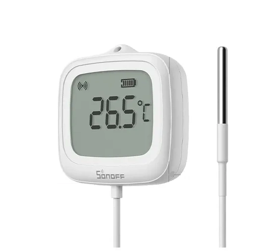</a>

 

---

### Light intensity sensor

<a href="https://s.click.aliexpress.com/e/_oBxc9XP" target="_blank">
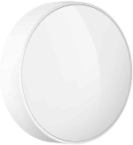</a>

A light intensity sensor (lux sensor) measures the amount of light brightness.\
Usefull to enable the lights when it becomes dark outside.

**Best option:**\
{{imgBasket}}Zigbee lux sensor - Aqara
<a href="https://s.click.aliexpress.com/e/_oBxc9XP" target="_blank">(AliExpress)</a>

<a href="https://www.zigbee2mqtt.io/devices/GZCGQ01LM.html" target="_blank" title="GZCGQ01LM">{{imgZ2M}}GZCGQ01LM</a>
Very reliable, very long battery life, quick response on small light changes, more expensive.

**Cheaper option 1:**\
{{imgBasket}}Zigbee lux sensor - Moes 
<a href="https://s.click.aliexpress.com/e/_DlwYz45" target="_blank">(AliExpress)</a>
<a href="https://www.zigbee2mqtt.io/devices/TS0222_light.html" target="_blank" title="TS0222_light">{{imgZ2M}}TS0222_light</a>

**Cheaper option 2:**\
{{imgBasket}}Zigbee lux sensor - Tuya 
<a href="https://s.click.aliexpress.com/e/_DC8WRhJ" target="_blank">(AliExpress)</a>
<a href="https://amzn.to/3TX4A3y#ad" target="_blank">(Amazon US)</a>
<a href="https://amzn.to/3JcM1Gy#ad" target="_blank">(Amazon DE)</a>
<a href="https://www.zigbee2mqtt.io/devices/TS0222.html" target="_blank" title="TS0222">{{imgZ2M}}TS0222</a>

 

---

### Leak sensor

Each leak sensor has two metal contacts, when these contacts get in contact with water, the current flows from one contact to the other, then you have a closed circuit. 
The sensor sends a signal "water detected"!
Water conducts the current and air doesn't.

<a href="https://s.click.aliexpress.com/e/_oE7l1ns" target="_blank">
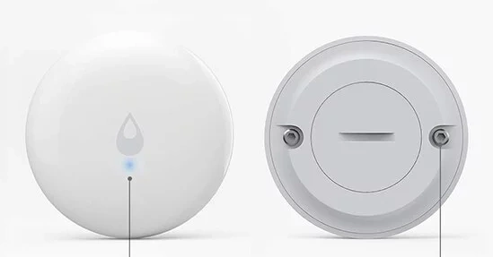</a>

The Aqara leak sensor has two metal screw contacts on the back of the sensor that measures if there is water.
This sensor is completely water-resistant. 
It has a small size and the battery lasts very long. That makes this sensor a more expensive but very reliable one.

It can also be used to create other boolean sensors, 
like the [chair occupancy sensor](/zigbee/zigbee_chair_occupancy_sensor).

**Best option:**\
{{imgBasket}}Leak sensor - Aqara 
<a href="https://s.click.aliexpress.com/e/_oE7l1ns" target="_blank">(AliExpress)</a>
<a href="https://amzn.to/470urzm#ad" target="_blank">(Amazon DE)</a>
<a href="https://amzn.to/3GGM3ph#ad" target="_blank">(Amazon NL)</a>
<a href="https://amzn.to/3ZneX2Z#ad" target="_blank">(Amazon NL)</a>
<a href="https://www.zigbee2mqtt.io/devices/SJCGQ11LM.html" target="_blank" title="SJCGQ11LM">{{imgZ2M}}SJCGQ11LM</a>

**Cheaper option:**\
Another leak sensor is the one with a wire, this sensor itself isn't water-resistant, only the other end of the cable may become wet.
This one runs on two common AAA batteries that make the sensor pretty big but cheaper to buy.

{{imgBasket}}Zigbee leak sensor
<a href="https://s.click.aliexpress.com/e/_o2bErAz" target="_blank">(AliExpress)</a>
<a href="https://amzn.to/3H5bBwd#ad" target="_blank">(Amazon US)</a>
<a href="https://amzn.to/4mKUwH4#ad" target="_blank">(Amazon DE)</a>
<a href="https://amzn.to/45cjJTY#ad" target="_blank">(Amazon NL)</a>
<a href="https://www.zigbee2mqtt.io/devices/TS0207_water_leak_detector_1.html" target="_blank" title="TS0207_water_leak_detector_1">{{imgZ2M}}TS0207</a>

<a href="https://s.click.aliexpress.com/e/_o2bErAz" target="_blank">
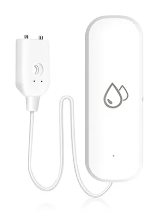</a>

 

---

### Pressure sensor

A small strip with pressure sensors in it.\
I got a separated page how I created my own [Zigbee chair occupancy sensor](/zigbee/zigbee_chair_occupancy_sensor).

Suitable for chairs/carpets/beds/sofas/carpets:
* Compact and convenient, multiple pressure control point sensors
* Flexible, lightweight, bend-resistant
* Power input：CR2032 battery

{{imgBasket}}Zigbee pressure sensor  - Tuya
<a href="https://s.click.aliexpress.com/e/" target="_blank">(AliExpress)</a>

---

### Lights

#### Bulb

<a href="https://s.click.aliexpress.com/e/_oFxRuUw" target="_blank">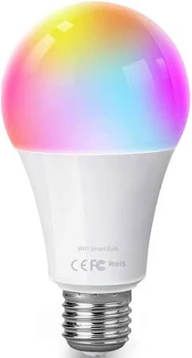</a>

You can replace a normal E27 bulb with Zigbee variant.
With a colored version, you can use it to inform yourself with a color for different states.

{{imgBasket}}Zigbee light bulb dimmable colored 
<a href="https://s.click.aliexpress.com/e/_oFxRuUw" target="_blank">(AliExpress)</a>
<a href="https://www.zigbee2mqtt.io/devices/CK-BL702-AL-01.html" target="_blank" title="CK-BL702-AL-01">{{imgZ2M}}CK-BL702-AL-01</a>

&nbsp;
 

### Bulb socket

An easy solution, screw it between the original socket and the lamp to make it controllable.

{{imgBasket}}WiFi / Zigbee smart light bulb socket 
<a href="https://s.click.aliexpress.com/e/_ooH9zP3" target="_blank">(AliExpress)</a>
<a href="https://amzn.to/3H29ucE#ad" target="_blank">(Amazon US)</a>

&nbsp;
 

&nbsp;
 

---

#### LED strip

<a href="https://s.click.aliexpress.com/e/_ookcWte" target="_blank">
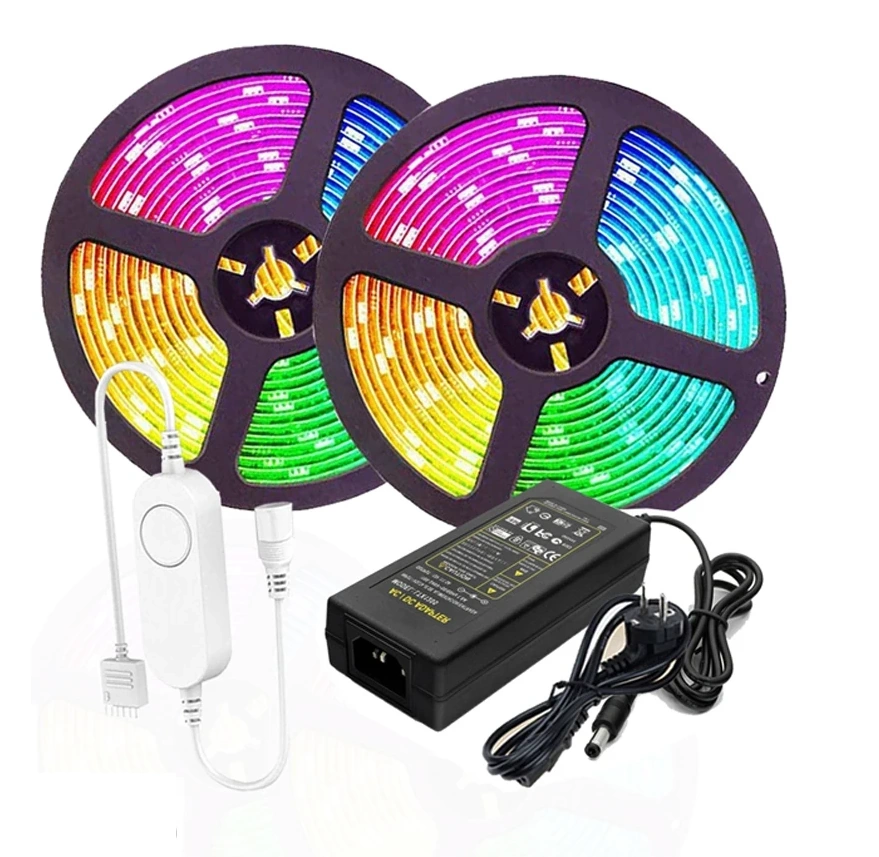</a>

This LED strip is available in different versions:
* Indoor no waterproof (IP20) / Outdoor waterproof (IP65)
* 5 / 10 meter
* RGB White or RGB Warm White

 

{{imgBasket}}Zigbee RGB 5m LED strip 
<a href="https://s.click.aliexpress.com/e/_ookcWte" target="_blank">(AliExpress)</a>
<a href="https://amzn.to/44MCe27#ad" target="_blank">(Amazon US)</a>
<a href="https://amzn.to/3H5c0yN#ad" target="_blank">(Amazon NL)</a>
<a href="https://www.zigbee2mqtt.io/devices/TS0503B.html" target="_blank" title="TS0503B">{{imgZ2M}}TS0503B</a>

 

{{imgBasket}}WiFi ESP32 WLED RGB 3-30m LED strip 
<a href="https://s.click.aliexpress.com/e/_on0VP8A" target="_blank">(AliExpress)</a>
This one supports over 100 dynamic effects. These are controllable via the WLED API or app.

---

### Buttons

#### Wall switch

<a href="https://s.click.aliexpress.com/e/_Ddxq8ej" target="_blank">
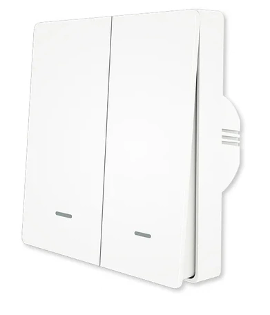</a>

{{imgBasket}}Zigbee wall switch - Aqara 
<a href="https://s.click.aliexpress.com/e/_DBfTCOj" target="_blank">(AliExpress)</a>
<a href="https://amzn.to/3JBtmnH#ad" target="_blank">(Amazon DE)</a>
<a href="https://amzn.to/4cgAL6f#ad" target="_blank">(Amazon NL)</a>
<a href="https://www.zigbee2mqtt.io/devices/QBKG41LM.html" target="_blank" title="QBKG41LM">{{imgZ2M}}QBKG41LM</a>

{{imgBasket}}Zigbee wall switch - Moes 
<a href="https://s.click.aliexpress.com/e/_Ddxq8ej" target="_blank">(AliExpress)</a>
<a href="https://amzn.to/416gUlS#ad" target="_blank">(Amazon US)</a>
<a href="https://amzn.to/46Ulw2m#ad" target="_blank">(Amazon DE)</a>
<a href="https://amzn.to/3GF13nC#ad" target="_blank">(Amazon NL)</a>
<a href="https://www.zigbee2mqtt.io/devices/ZS-EUB_2gang.html" target="_blank" title="ZS-EUB_2gang">{{imgZ2M}}ZS-EUB</a>

 

#### Wall dimmer

<a href="https://www.ecodim.nl/nl/eco-dim07-zigbee-basic.html" target="_blank">
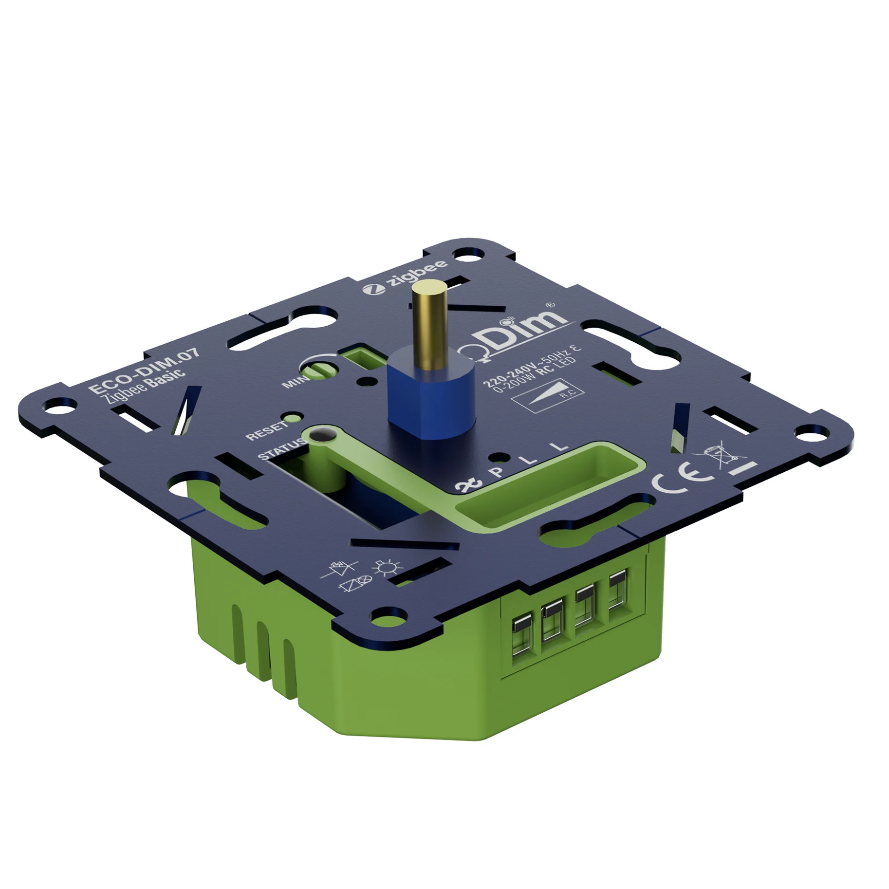</a>

This Zigbee dimmer replaces an original wall dimmer module.\
The easiest way to make a dimmable group with gu10 lights smart.

{{imgBasket}}<a href="https://www.ecodim.nl/nl/eco-dim07-zigbee-basic.html" target="_blank">ECO-DIM.07 LED dimmer press/turn 0-200W - EcoDim (manufacturer site with links to different shops)</a>
<a href="https://www.zigbee2mqtt.io/devices/Eco-Dim.07_Eco-Dim.10.html" target="_blank" title="Eco-Dim.07_Eco-Dim.10">{{imgZ2M}}Eco-Dim.07</a>

{{imgBasket}}ECO-DIM.01 LED dimmer press/turn 0-300W - EcoDim 
<a href="https://amzn.to/4108Zri#ad" target="_blank">(Amazon NL)</a>

{{imgBasket}}Other EcoDimZigbee devices - EcoDim <a href="https://www.ecodim.nl/nl/smart-led-dimmers-en-schakelaars/zigbee/" target="_blank">(manufacturer site with links to different shops)</a>

 

---

#### Portable button

These buttons can trigger multiple scenarios because they support three press types: single-, double- and long press.

**Best option:**\
{{imgBasket}}Zigbee button - Aqara 
<a href="https://s.click.aliexpress.com/e/_DF2oxu7" target="_blank">(AliExpress)</a>
<a href="https://amzn.to/3Jmhl5w#ad" target="_blank">(Amazon DE)</a>
<a href="https://amzn.to/4droHj8#ad" target="_blank">(Amazon NL)</a>
<a href="https://www.zigbee2mqtt.io/devices/WXKG11LM.html" target="_blank" title="WXKG11LM">{{imgZ2M}}WXKG11LM</a>

**Cheaper option:**\
{{imgBasket}}Small Zigbee button - Tuya / Loginovo 
<a href="https://s.click.aliexpress.com/e/_on6fohX" target="_blank">(AliExpress)</a>
<a href="https://amzn.to/4l6OrUs#ad" target="_blank">(Amazon NL)</a>
<a href="https://www.zigbee2mqtt.io/devices/ZG-101ZL.html" target="_blank" title="ZG-101ZL">{{imgZ2M}}ZG-101ZL</a>

**Alternative option:**\
{{imgBasket}}Zigbee button - Sonoff
<a href="https://amzn.to/4o6SClH#ad" target="_blank">(Amazon US)</a>

 

---

### Vibration sensor

<a href="https://s.click.aliexpress.com/e/_oEsclmH" target="_blank">
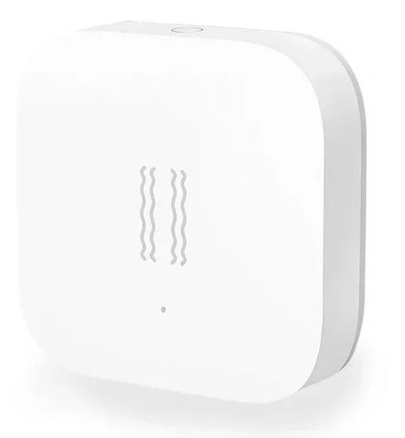</a>

This sensor can measure vibrations and rotations in the X, Y and Z direction.

{{imgBasket}}Zigbee vibration sensor - Aqara 
<a href="https://s.click.aliexpress.com/e/_oEsclmH" target="_blank">(AliExpress)</a>
<a href="https://amzn.to/4f2IrKG#ad" target="_blank">(Amazon US)</a>
<a href="https://amzn.to/3JpoqlT#ad" target="_blank">(Amazon DE)</a>
<a href="https://amzn.to/3OiAAvY#ad" target="_blank">(Amazon NL)</a>
<a href="https://www.zigbee2mqtt.io/devices/DJT11LM.html" target="_blank" title="DJT11LM">{{imgZ2M}}DJT11LM</a>

  

---

### USB adapter switch

This actuator can toggle the power state of each USB port individual.\
The first port can also be used to switch on/off data access via USB, the other two only for USB power.

{{imgBasket}}Zigbee / WiFi USB adapter switch - Tuya 
<a href="https://s.click.aliexpress.com/e/_oB5NKYq" target="_blank">(AliExpress)</a>
<a href="https://amzn.to/4mmuYQY#ad" target="_blank">(Amazon DE)</a>
<a href="https://amzn.to/4lL8Ijp#ad" target="_blank">(Amazon NL)</a>
<a href="https://www.zigbee2mqtt.io/devices/TS0003.html" target="_blank" title="TS0003">{{imgZ2M}}TS0003</a>

{{imgBasket}}Zigbee / WiFi USB adapter switch - Sonoff
<a href="https://amzn.to/3UhFZXv#ad" target="_blank">(Amazon US)</a>
<a href="https://amzn.to/41wvLXh#ad" target="_blank">(Amazon DE)</a>
<a href="https://amzn.to/4fcxpmu#ad" target="_blank">(Amazon NL)</a>

Check also the [dedicated page](/zigbee/usb_adapter_switch) about this device.

 

---
### Plant soil sensor

<a href="https://s.click.aliexpress.com/e/_onIII5b" target="_blank">
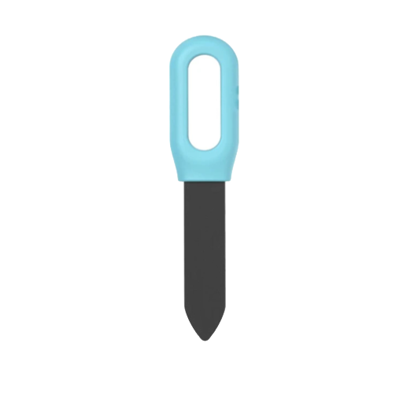</a>
Do your plants have enough water?
You stick this sensor in the soil with the plant, and it detects if the soil is not too dry or the temperature too high.

Powered by two AAA batteries.

Make sure you select the Zigbee version:\
{{imgBasket}}Zigbee soil humidity sensor - Tuya 
<a href="https://s.click.aliexpress.com/e/_onIII5b" target="_blank">(AliExpress)</a>
<a href="https://amzn.to/45mlAqw#ad" target="_blank">(Amazon DE)</a>

<a href="https://www.zigbee2mqtt.io/devices/TS0601_soil_3.html" target="_blank" title="TS0601_soil_3">{{imgZ2M}}TS0601_soil_3</a>

 

---
### Outdoor sensors

There are also outdoor sensors and actuators available, 
like water-resistant sockets, LED strips, rain sensors, etc...

There is a separated page where you can find them [Outdoor sensors - Best Buy Tips](zigbee_outdoor)

 

---

### Air quality sensor

This 6-in-1 sensor can detect six kinds of environmental parameters:
* Temperature
* Humidity
* PM2.5
* VOC of poisonous gas
* Formaldehyde (not really accurate)
* CO2 (not really accurate, then you need a dedicated one)

All these values can affect a healthy environment at home.

Normally you get single sensors for each parameter!

Because the price is low, there are some downsides in sensor precision, the formaldehyde and CO2 sensor doesn't work that good as a dedicated sensor.
But for the other parameters, it is a good overall air quality sensor to detect how your air quality is and if you need some fresh air inside.

{{imgBasket}}Zigbee / WiFi Air quality sensor - Tuya 
<a href="https://s.click.aliexpress.com/e/_oo1Odtf" target="_blank">(AliExpress)</a>
<a href="https://amzn.to/4mnr22r#ad" target="_blank">(Amazon DE)</a>
<a href="https://amzn.to/40Y4IEB#ad" target="_blank">(Amazon NL)</a>
<a href="https://www.zigbee2mqtt.io/devices/TS0601_air_quality_sensor.html" target="_blank" title="TS0601_air_quality_sensor">{{imgZ2M}}TS0601</a>

 

---

### Infrared remote control

These devices can learn infrared remote control signals and send them again via Zigbee. 
This way you can create automations for air conditioners, fans, lights, etc.

I have a dedicated page: [Zigbee infrared transmitter / receiver](/zigbee/smart_infrared_transmitter_receiver) 
on how to program and use this device to replace and automate the original remote.
Controlled by Home Assistant.

{{imgBasket}}Zigbee IR remote control - Moes 
<a href="https://s.click.aliexpress.com/e/_DEUWZ73" target="_blank">(AliExpress)</a>
<a href="https://amzn.to/3HuA4vk#ad" target="_blank">(Amazon US)</a>
<a href="https://amzn.to/47xtPBl#ad" target="_blank">(Amazon DE)</a>
<a href="https://amzn.to/495yrxA#ad" target="_blank">(Amazon NL)</a>
<a href="https://www.zigbee2mqtt.io/devices/UFO-R11.html" target="_blank" title="TS0003">{{imgZ2M}}UFO-R11</a>

**WiFi option:**
{{imgBasket}}WiFi IR remote control RM4 Mini - Broadlink
<a href="https://s.click.aliexpress.com/e/_Dna8hgH" target="_blank">(AliExpress)</a>
<a href="https://amzn.to/46zJzDz#ad" target="_blank">(Amazon US)</a>
<a href="https://amzn.to/4lbgPoa#ad" target="_blank">(Amazon NL)</a>

**Cheaper WiFi option:**
{{imgBasket}}WiFi IR remote control - Tuya 
<a href="https://s.click.aliexpress.com/e/_DnpWmYp" target="_blank">(AliExpress)</a>
<a href="https://amzn.to/4mqJMh8#ad" target="_blank">(Amazon US)</a>
<a href="https://amzn.to/4eJPxlw#ad" target="_blank">(Amazon NL)</a>

#### Infrared + RF + 433MHz + 315MHz remote control

This WiFi device supports a wide range of different wireless protocols, like Infrared + RF + 433MHz + 315MHz. 
It can learn from the original remote control it signals and send them again via Zigbee.\
This way you can create automations for air conditioners, fans, lights, etc.

{{imgBasket}}WiFi IR + RF + 433 + 315 remote control - Moes 
<a href="https://s.click.aliexpress.com/e/_DnbfWjP" target="_blank">(AliExpress)</a>
<a href="https://amzn.to/4lttIud#ad" target="_blank">(Amazon US)</a>
<a href="https://amzn.to/46GqsrC#ad" target="_blank">(Amazon NL)</a>
Model: RF-R1 / UFO-R2-RF

 

---

### Radiator Thermostat

With this radiator thermostat valve, it is possible to open and close the radiator in steps.\
You can also schedule complete weeks in it what the temperature should be.

{{imgBasket}}Zigbee smart radiator thermostat - Moes / Tuya 
<a href="https://s.click.aliexpress.com/e/_ongwmtx" target="_blank">(AliExpress)</a>
<a href="https://amzn.to/4hX8D9A#ad" target="_blank">(Amazon NL)</a>
<a href="https://www.zigbee2mqtt.io/devices/TV02-Zigbee.html" target="_blank" alt="TV02">{{imgZ2M}}TV02</a>
 

 

---

### Smart socket

Smart sockets are useful to make traditional "dump" devices smart. Like a traditional standing lamp with a plug. 

Sockets are always connected to power, this makes this sensor also a hub in the Zigbee network which extends the range and coverage of your network. 
You can also plug a smart socket somewhere strategic with bad coverage to improve this. 

A smart plug with power consumption metrics can be useful to detect the state of the machine by its power consumption. 
This can be used for washing machines, dryers, dishwashers, ovens, etc.

I use the European Zigbee BlitzWolf EU SHP-13 and SHP-15 which has also power consumption measurement. 
It has a physical button to switch the state, and can handle 3680 W and 16 A which is enough for washing machines and dryers. 
It took me a while before I got the correct smart socket for this purpose, and now they've run for years without any issues.

{{imgBasket}}Zigbee smart power socket with power measurement - BlitzWolf EU SHP-15 
<a href="https://s.click.aliexpress.com/e/_m0qPURC" target="_blank">(AliExpress)</a>
<a href="https://www.zigbee2mqtt.io/devices/TS011F_plug_3.html" target="_blank" alt="TS011F">{{imgZ2M}}TS011F_plug_3</a>

{{imgBasket}}Zigbee smart power socket with power measurement - BlitzWolf EU SHP-13
<a href="https://www.banggood.com/BlitzWolf-BW-SHP13-ZigBee3_0-Smart-Socket-16A-EU-Plug-Electricity-Metering-APP-Remote-Controller-Timer-Work-with-Amazon-Alexa-Google-Home-p-2000907.html?warehouse=CN&ID=0&p=IF081412102025201707&custlinkid=3954741" target="_blank">(Banggood)</a>
<a href="https://www.zigbee2mqtt.io/devices/TS0121_plug.html" target="_blank" title="TS0121_plug">{{imgZ2M}}TS0121</a>

 

---

### Power strip

Zigbee power strip with 4x outlets (max. 16A) and 2x USB-A (5V 2.1A).
  
Each outlet and the two USB ports can be controlled independently.
Cheaper solution than four single smart sockets!

* Suitable for EU/US/JP
* With overload protection switch
* Extension cable 1.5m
* Manual master switch
* LED indicate for each socket

{{imgBasket}}Zigbee power strip with 4 outlets and 2 USB ports - Melery / UseeLink
<a href="https://s.click.aliexpress.com/e/_oDn4Uqa" target="_blank">(AliExpress)</a>
<a href="https://amzn.to/46nuiFT#ad" target="_blank">(Amazon NL)</a>
<a href="https://www.zigbee2mqtt.io/devices/SM-0306E-2W.html" target="_blank" title="SM-0306E-2W">{{imgZ2M}}SM-0306E-2W</a>

 
 

An other Zigbee power strip with 4x outlets (max. 16A 4000W) and 2x USB-A (5V 3A) fast charging.
  
Each outlet can be controlled independently with light indicator.
The two USB ports controlled together.
Cheaper solution than four single smart sockets!

* Physical button for each socket 
* Suitable for EU
* Overload protection
* Extension cable 1.8m
* Manual master switch
* LED indicate for each socket

{{imgBasket}}Zigbee power strip with 4 outlets and 2 USB ports - Lellki 
<a href="https://s.click.aliexpress.com/e/_oCVTrot" target="_blank">(AliExpress)</a>

<a href="https://www.zigbee2mqtt.io/devices/E220-KR4N0Z0-HA.html" target="_blank" title="E220-KR4N0Z0-HA">{{imgZ2M}}E220-KR4N0Z0-HA (WP33)</a>

 

 
 

Other version, also Zigbee EU power strip with 4x outlets (max. 16A) and 3x USB-A and 1x USB-C fast charge. 
  
Each outlet and the four USB ports can be controlled independently.
Cheaper solution than four single smart sockets!

* Suitable for EU
* With overload protection switch
* Max. 3520 W
* 1x USB-C PD20W fast charge port
* 2x USB-A charge port
* 1x USB-A QC3.0 18W charge port
* Manual master switch
* LED indicate for each socket

{{imgBasket}}Zigbee power strip with 4 outlets and 4 USB ports - UseeLink 
<a href="https://s.click.aliexpress.com/e/_oE9K7K1" target="_blank">(AliExpress)</a>
<a href="https://amzn.to/3PFr86N#ad" target="_blank">(Amazon NL)</a>
<a href="https://www.zigbee2mqtt.io/devices/SM-O301-AZ.html" target="_blank" title="SM-O301-AZ">{{imgZ2M}}SM-O301-AZ</a>

 

---

## Smart Curtains

If you're looking for a U-rail solution, you can look at [Slide - Smart Curtains](/projects/slide_smart_curtains).

 

---

## Google Coral USB

<a href="https://s.click.aliexpress.com/e/_om0IKYH" target="_blank">
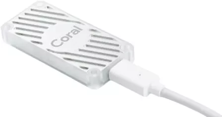</a>

USB stick to handle heavy GPU processes, like human detection with Frigate.

{{imgBasket}}Coral USB - Google 
<a href="https://s.click.aliexpress.com/e/_om0IKYH" target="_blank">(AliExpress)</a>
<a href="https://amzn.to/415ZUfA#ad" target="_blank">(Amazon US)</a>
<a href="https://amzn.to/4594MC0#ad" target="_blank">(Amazon NL)</a>

 

---

## Batteries

The advantage of a lot of Zigbee sensors is that they work completely wireless. 
You can place them everywhere without the need to wire them.
Most of the devices run for years on a single battery, but now and then you need to replace them.
Before you start using a new sensor, first check what kind of battery it uses and already order some of them.
When it gets out of fuel, you can directly replace it with a new battery.

These are common types of batteries used by the above-mentioned sensors:
* [AA](/buy/batteries#aa)
* [AAA](/buy/batteries#aaa)
* [CR2032](/buy/batteries#cr2032)
* [CR1632](/buy/batteries#cr1632)
* [CR2450](/buy/batteries#cr2450)

### Battery eliminators

Battery eliminator (aka battery replacements) is, as the name already says, a replacement for battery power device to connect them to the main power.
This saves you from buying new batteries. 
The big advantage is also that you now can control them with your home automations by adding a smart plugin between the plug and the wall outlet. 
Now you also don't have to worry that you forgot them to put them off again.
There are different variants of them. 
Replacements for AA or AAA batteries and with a plug or USB connector. 
The advantage of a USB connector is that you can plug multiple to an active powered USB-hub to control multiple ones.

I use these a lot for all kinds of Christmas decorations.

{{imgBasket}}AA battery replacement with USB 
<a href="https://s.click.aliexpress.com/e/_onadIXG" target="_blank">(AliExpress)</a>
<a href="https://amzn.to/4lv9H7M#ad" target="_blank">(Amazon US)</a>
<a href="https://amzn.to/3AIfXqb#ad" target="_blank">(Amazon NL)</a>

{{imgBasket}}AAA battery replacement with USB
<a href="https://s.click.aliexpress.com/e/_omwDXZ7" target="_blank">(AliExpress)</a>
<a href="https://amzn.to/4cqCQwo#ad" target="_blank">(Amazon US)</a>
<a href="https://amzn.to/4jnFDZB#ad" target="_blank">(Amazon NL)</a>

{{imgBasket}}AA battery replacement with power socket EU 
<a href="https://s.click.aliexpress.com/e/_o2FtBHM" target="_blank">(AliExpress)</a>

{{imgBasket}}AAA battery replacement with power socket EU 
<a href="https://s.click.aliexpress.com/e/_opan0OF" target="_blank">(AliExpress)</a> 

{{imgBasket}}CR2032 battery replacement with USB 
<a href="https://s.click.aliexpress.com/e/_DDUCKpH" target="_blank">(AliExpress)</a>
<a href="https://amzn.to/3YWg1LO#ad" target="_blank">(Amazon US)</a>

{{imgBasket}}USB A or C to clips 3V (same voltage as two batteries) 
<a href="https://s.click.aliexpress.com/e/_DeBgzBR" target="_blank">

 

---

## Cables

### Micro USB power cable

USB-A to micro USB cable to power the ESP.

<a href="https://s.click.aliexpress.com/e/_onj6tZi" target="_blank">
 
{{imgBasket}}Micro USB cable (AliExpress)</a>
<a href="https://amzn.to/42C3sHw#ad" target="_blank">(Amazon US)</a>
<a href="https://amzn.to/3CAUNdU#ad" target="_blank">(Amazon NL)</a>

### USB-C power cable

USB-A to USB-C cable to power the ESP.

<a href="https://s.click.aliexpress.com/e/_oB1SfVP" target="_blank">
 
{{imgBasket}}USB-A to USB-C cable (AliExpress)</a>
<a href="https://amzn.to/3RdjocW#ad" target="_blank">(Amazon US)</a>

### USB-C to USB-C

USB-C to USB-C power cable with 90-degree connectors.

<a href="https://s.click.aliexpress.com/e/_EvdirFL" target="_blank">
 
{{imgBasket}}USB-C to USB-C power cable (AliExpress)</a>
<a href="https://amzn.to/3RaTlDi#ad" target="_blank">(Amazon US)</a>

### USB-A extension cable

Useful to move your Zigbee stick away from your server for the best range and avoid interference.

<a href="https://s.click.aliexpress.com/e/_oFCMjGU" target="_blank">
 
{{imgBasket}}USB A Extension Cable Male to Female (AliExpress)</a>
<a href="https://amzn.to/42tTmaE#ad" target="_blank">(Amazon US)</a>

 

---

## Power

### Adapters

5V USB EU power adapter to power your USB devices.

{{imgBasket}}5V 2A EU USB power adapter <a href="https://s.click.aliexpress.com/e/_opoqyJG" target="_blank">(AliExpress)</a>

{{imgBasket}}5V 2A EU USB power adapter <a href="https://s.click.aliexpress.com/e/_DCdi80b" target="_blank">(AliExpress)</a>

5V EU USB power adapter to power multiple usb devices, with fast charging and 3.1A.

{{imgBasket}}5V USB EU power adapter 
<a href="https://s.click.aliexpress.com/e/_ol8RIG1" target="_blank">(AliExpress)</a>
<a href="https://amzn.to/4cvtLCK#ad" target="_blank">(Amazon US)</a>

 

---

## Battery powered with PIR

Not connected, but still smart with a PIR sensor in it.

### Lights

Very useful for closets or stairs where no power is available.

{{imgBasket}}Battery powered PIR lights 
<a href="https://s.click.aliexpress.com/e/_DC7Ac3r" target="_blank">(AliExpress)</a>
<a href="https://amzn.to/42zFj4t#ad" target="_blank">(Amazon US)</a>

 

---

  
That's it for the indoor sensors, see also my [Outdoor sensors - Best Buy Tips](zigbee_outdoor)

Or checkout [ESPHome DIY sensors buy tips](esphome_diy) for all kinds or hardware buy tips to create your own sensors.