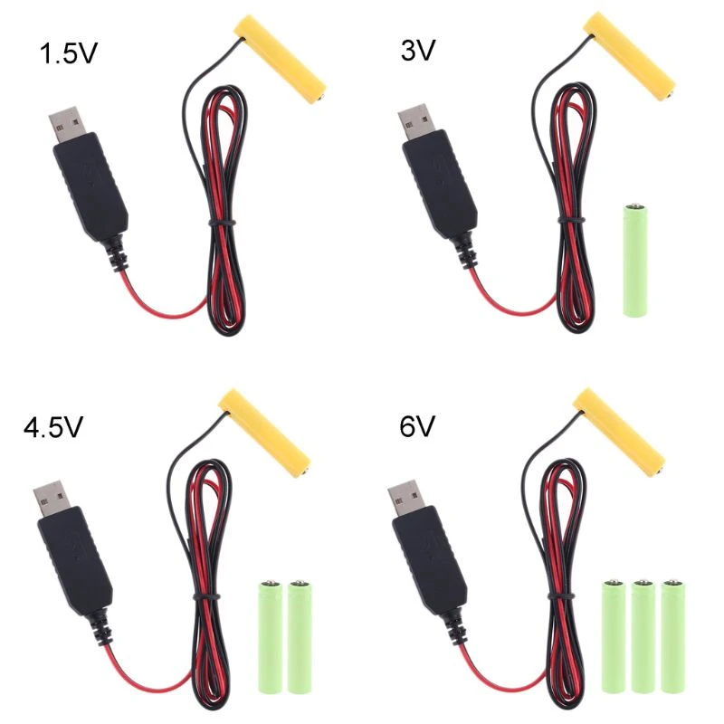

<meta property="og:image" content={previewImageSrc} />


# Zigbee Smart home - best buy tips

 

 

What is a smart home without digital ears and eyes? Sensors are the digital version of those.\
With the sensor data, you can make conditions, act on it and control other devices.

On this page, you find my personal favorite sensors, actuator and other home automation related Zigbee hardware.

If you need some home automation inspiration, check my [home automation ideas](../ideas/home_automation_ideas) section!

Most devices are for sale by the online shops Aliexpress or Banggood.
I order 90% of my home automation devices on these two sites for years already. 
You pay a good price, and they have fast shipping, sometimes you have the order already delivered within one week!

---

## Table of Contents
<!-- TOC -->
  * [Why I chose Zigbee](#why-i-chose-zigbee)
  * [Zigbee coordinator](#zigbee-coordinator)
  * [Contact sensor](#contact-sensor)
  * [Motion sensor](#motion-sensor)
  * [Presence detection sensor](#presence-detection-sensor)
  * [Smart socket](#smart-socket)
  * [Temperature sensor](#temperature-sensor)
  * [Lux sensor](#lux-sensor)
  * [Leak sensor](#leak-sensor)
  * [Lights](#lights)
  * [Button](#button)
  * [Vibration sensor](#vibration-sensor)
  * [Batteries](#batteries)
  * [Cables](#cables)
  * [Power](#power)
  * [Adapters](#adapters)
<!-- TOC -->

---

> **_NOTE 1:_** Links on this page are devices I also use myself. 
> Most of the links are affiliate links, so you pay the same price AND support my blog also by buying it from here.

> **_NOTE 2:_** I advise these products based on my personal experience. I run my network with a CC2652 zigbee adapter and Zigbee2MQTT. 
> It can be with other hardware combinations it doesn't run with the same experience.
---
## Why I chose Zigbee

On the market, there are different types of protocols to create a smart home network. Like Zigbee, Thread, Wifi, Bluetooth, Z-Wave and Matter. All with their pros and cons. You can use different protocols next to each other. I chose for one, specific Zigbee.

This is why I choose for Zigbee:
* There is a wide range of sensor and actuator types available;
* Every zigbee device, independent of manufacturer, it works in your network;
* The prices are low;
* It works locally, no internet is required;
* You can even link buttons direct to (a group) lamps without the need of a hub;
* Not dependent on the manufacture app, cloud or other software. When a manufacture gets bankrupt, you still can use your devices.
* It works as a mesh network, you can reach devices far away from the coordinator as long as there are enough active hops in between;
* The standard is an open protocol, you don't pay for a license fees (for Z-Wave you do) to use it;
* No compatibility issues with hardware with older or newer Zigbee versions;
* Active development on the software Zigbee2MQTT with every release a bulk of new supported Zigbee devices;

A reason why not to choose for Zigbee? I don't know :)

---

## Zigbee coordinator

Since 2020, I've run non-stop my Zigbee network with the {{imgBasket}}<a href="https://slae.sh/projects/cc2652/" target="_blank">Slaesh's CC2652RB stick (Slae website)</a> without any issue, it's a very reliable stick.
My network grew to 120+ devices today, and it still runs fast.

To avoid interference with Bluetooth or wifi,
it's better to move the stick away from the server. This is recommended for every stick. 
You can use a {{imgBasket}}<a href="https://s.click.aliexpress.com/e/_m0Tzory" target="_blank">20 cm USB A extension cord (Aliexpress)</a> for it.

---

## Contact sensor

A contact sensor can be placed to check if doors and windows are open or closed. The sensor knows only those two values. The contact sensor works with a "reed switch", the circuit is by default open, but when there is a magnet nearby, the internal metal closes the circuit.

The sensor can also be used attached to other sensors that also return an open or closed circuit. With this behavior, you can create also a seat sensor or a water leak sensor.

&nbsp;

{{imgBasket}}<a href="https://s.click.aliexpress.com/e/_EumfxFt" target="blank">Zigbee Contact sensor - Aqara (Aliexpress)</a>

{{imgBasket}}<a href="https://www.banggood.com/WKD-DS010-Smart-Home-Zigbe-Door-Window-Sensor-Smart-Contact-Sensor-APP-Notifications-Voice-Alarm-Work-with-HA-Hubitat-Alexa-Echo-p-2009987.html?warehouse=CN&ID=0&p=IF081412102025201707&custlinkid=3958594" target="blank">Zigbee Contact sensor (Banggood)</a>

---

## Motion sensor

The traditional motion sensors work with PIR, which stands for Passive InfraRed. This sensor detects objects which sending heat, like humans and animals. 

I like the Aqara motion sensor myself a lot. It's fast, reliable, and the new ones have also a lux sensor in it. With the stand you can point it in a specific direction, so it doesn't 'see' the whole room.
If I want to cover a whole room, I use a different type PIR sensor which you can stick in the center of the ceiling and look around in all directions.

 &nbsp;

{{imgBasket}}<a href="https://www.banggood.com/Aqara-Motion-Sensor-Smart-Human-Body-Sensor-Body-Movement-ZigBe-Wireless-Connection-Smart-Home-for-Xiaomi-Mijia-Mi-home-p-2004884.html?warehouse=CN&ID=0&p=IF081412102025201707&custlinkid=3958768" target="_blank">Zigbee motion sensor beam, with stand and build-in lux sensor -  Aqara (Banggood)</a>

{{imgBasket}}<a href="https://www.banggood.com/Tuya-Zigbe-Human-Motion-Sensor-Smart-Home-Mini-PIR-Motion-Sensor-Infrared-Detector-Security-Smart-Life-Work-with-Alexa-Google-Assistant-Hubitat-Hub-p-2009988.html?warehouse=CN&ID=0&p=IF081412102025201707&custlinkid=3958596" target="_blank">Zigbee motion sensor all directions - Tuya (Banggood)</a>

---
## Presence detection sensor

A millimeter wave presence sensor has no need to direct sight. You can hide it in a closet.
It uses 24 GHz to send it signal to detect people in a room.
It can also detect persons when they don't move, like they sit on a couch. Ideal for the living room or home office.

{{imgBasket}}<a href="https://s.click.aliexpress.com/e/_oEbnm2m" target="_blank">Zigbee mmWave Presence detection sensor (Aliexpress)</a>

---

## Smart socket

Smart sockets are useful to make traditional "dump" devices smart. Like a traditional standing lamp with a plug. You put it "on" and place the smart plug between the socket and wall. Now you change the switch functionality to the plug which you can be controlled automatically.

Sockets are always connected to power, this makes this sensor also a hub in the zigbee network which extends the range and coverage of your network. You can also plug a smart socket somewhere strategic with bad coverage to improve this. He doesn't need to be on or used.

A smart plug with power consumption metrics can be useful to detect the state of the machine. You don't use the on/off functionality in that case. This can be used for washing machines, dryers, dishwashers, ovens, etc.

I use the Zigbee BlitzWolf SHP-13 or SHP-15 which has also power consumption measurement, a physic button to switch the state and can handle 3680 W and 16 A which is enough for washing machines and dryers. It took me a while before I got the correct one for this purpose, and now it runs for years without issues. 
If you buy one which has a lower wattage, your socket constantly stops working; then you know you need one with a higher wattage!

{{imgBasket}}<a href="https://www.banggood.com/BlitzWolf-BW-SHP13-ZigBee3_0-Smart-Socket-16A-EU-Plug-Electricity-Metering-APP-Remote-Controller-Timer-Work-with-Amazon-Alexa-Google-Home-p-2000907.html?warehouse=CN&ID=0&p=IF081412102025201707&custlinkid=3954741" target="_blank">Zigbee smart power socket with power measurement - BlitzWolf SHP-13 (Banggood)</a>

{{imgBasket}}<a href=" https://s.click.aliexpress.com/e/_m0qPURC" target="_blank">Zigbee smart power socket with power measurement - BlitzWolf SHP-15 (Aliexpress)</a>

---

## Temperature sensor

A temperature sensor is a simple sensor that measures, next to the temperature also, the humidity in a room. this sensor is useful to make automations like take action if someone is in the shower. Or in the summer when it becomes outside colder than inside.

{{imgBasket}}<a href="https://www.banggood.com/Aqara-Temperature-Sensor-Smart-Zigbe-Air-Pressure-Humidity-Environment-Sensor-Remote-Control-for-XiaoMi-Home-Homekit-p-2004763.html?warehouse=CN&ID=0&p=IF081412102025201707&custlinkid=3958785" target="_blank">Zigbee temperature and humidity sensor - Aqara (Banggood)</a>

---

## Lux sensor

A lux sensor is a sensor that measures the light intensity.

{{imgBasket}}<a href="https://s.click.aliexpress.com/e/_DdVtS4P" target="_blank">Zigbee lux sensor - Aqara (Aliexpress)</a>
     

---

## Leak sensor

A leak sensor is a sensor that measures if there is water, then the two contact have a closed circuit because water conducts.

{{imgBasket}}<a href="https://s.click.aliexpress.com/e/_DCRMz4L" target="_blank">Zigbee leak sensor - (Aliexpress)</a>
   

---

## Lights

### Bulb

You can replace a normal E27 bulb with Zigbee variant.
With a colored version, you can use it to inform yourself with a color for different states.

{{imgBasket}}<a href="https://s.click.aliexpress.com/e/_oFxRuUw" target="_blank">Zigbee light bulb dimmable colored</a>

&nbsp;
 

---

### LED strip

This LED strip is available in different versions:
* Indoor no waterproof (IP20) / Outdoor waterproof (IP65)
* 5 / 10 meter
* RGB White or RGB Warm White

 

{{imgBasket}}<a href="https://s.click.aliexpress.com/e/_ookcWte" target="_blank">Zigbee RGB 5m LED strip</a>

---

## Button

### Wall switch

{{imgBasket}}<a href="https://s.click.aliexpress.com/e/_DBfTCOj" target="_blank">Zigbee wall switch - Aqara (Aliexpress)</a>

{{imgBasket}}<a href="https://s.click.aliexpress.com/e/_Ddxq8ej" target="_blank">Zigbee wall switch - Moes (Aliexpress)</a>

 
 
 

### Portable

This button can trigger multiple scenario's because it supports three press types: single-, double- and long press.

{{imgBasket}}<a href="https://s.click.aliexpress.com/e/_DF2oxu7" target="_blank">Zigbee button - Aqara (Aliexpress)</a>
    

---

## Vibration sensor

This button can measure vibrations and rotations in the X, Y and Z direction.

{{imgBasket}}<a href="https://s.click.aliexpress.com/e/_Dn1kLJv" target="_blank">Zigbee vibration sensor - Aqara (Aliexpress)</a>
    

---

## Batteries

The advantage of a lot of Zigbee sensors is that they work completely wireless. 
You can place them everywhere without the need to wire them.
Most of the devices run for years on a single battery, but now and then you need to replace them.
Before you start using a new sensor, first check what kind of battery it uses and already order some of them.
When it gets out of fuel, you can directly replace it with a new battery.

These are common types of batteries used by the above-mentioned sensors:

### AAA sized

The advantage of these is that they are everywhere available to buy, also in your local supermarket.
Because of the size, they can run for a long time on a single battery. Even these are available as rechargeable. 
The downside is that these make the sensor also quite big.

{{imgBasket}}<a href="https://s.click.aliexpress.com/e/_oFTjSkm" target="_blank">link 1: rechargeable</a>

{{imgBasket}}<a href="https://s.click.aliexpress.com/e/_mr8Qxrc" target="_blank">link 2: non rechargeable</a>

### CR2032

This CR2032 is the most commonly used battery. It's small but still has enough power to run sensors for a year.

{{imgBasket}}<a href="https://s.click.aliexpress.com/e/_mNV6Pge" target="_blank">link 1</a>

{{imgBasket}}<a href="https://s.click.aliexpress.com/e/_mPJIdGI" target="_blank">link 2</a>

### CR1632

This CR1632 battery is a bit smaller than the CR2032.

{{imgBasket}}<a href="https://s.click.aliexpress.com/e/_mLyGW8a" target="_blank">link 1</a>

{{imgBasket}}<a href="https://s.click.aliexpress.com/e/_onH4bF0" target="_blank">link 2</a>

### CR2450

This CR2450 battery is a bit thicker than the other ones.

{{imgBasket}}<a href="https://s.click.aliexpress.com/e/_EGHDQRv" target="_blank">link 1</a>

{{imgBasket}}<a href="https://s.click.aliexpress.com/e/_mrp3BBy" target="_blank">link 2</a>

### Battery eliminators

Battery eliminator (aka battery replacements) is, as the name already says, a replacement for battery power device to connect them to the main power.
This saves you from buying new batteries. The big advantage is also that you now can control them with your home automations by adding a smart plugin between the plug and the wall outlet. Now you also don't have to worry that you forgot them to put them off again.
There are different variants of them. Replacements for AA or AAA batteries and with a plug or USB connector. The advantage of a USB connector is that you can plug multiple to an active powered USB-hub to control multiple ones.

I use these a lot for all kinds of Christmas decorations.

{{imgBasket}}<a href="https://s.click.aliexpress.com/e/_oElMTEQ" target="_blank">AA battery replacement with USB</a>

{{imgBasket}}<a href="https://s.click.aliexpress.com/e/_oBi7yye" target="_blank">AAA battery replacement with USB</a>

{{imgBasket}}<a href="https://s.click.aliexpress.com/e/_o2FtBHM" target="_blank">AA battery replacement with power socket EU</a>

{{imgBasket}}<a href="https://s.click.aliexpress.com/e/_opJpPLu" target="_blank">AAA battery replacement with power socket EU</a> 

---

## Cables

### Micro USB power cable

USB-A to micro USB cable to power the ESP.

<a href="https://s.click.aliexpress.com/e/_onj6tZi" target="_blank">
 
{{imgBasket}}Micro USB cable</a>

### USB-C power cable

USB-A to USB-C cable to power the ESP.

<a href="https://s.click.aliexpress.com/e/_EHngRGX" target="_blank">
 
{{imgBasket}}USB-C cable</a>

### USB-A extension cable

<a href="https://s.click.aliexpress.com/e/_mstQlFs" target="_blank">
 
{{imgBasket}}USB A Extension Cable Male to Female</a>

---

## Power

### Adapters

5V USB power adapter to power your USB devices.

{{imgBasket}}<a href="https://s.click.aliexpress.com/e/_EQrXcuH" target="_blank">link 1</a>

{{imgBasket}}<a href="https://s.click.aliexpress.com/e/_mqQDOme" target="_blank">link 2</a>

---

See [ESPHome DIY sensors buy tips](esphome_diy) for all kinds or hardware buy tips to create your own sensors.