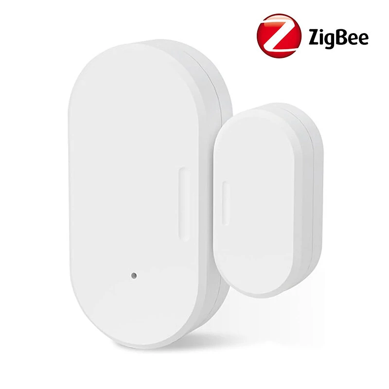
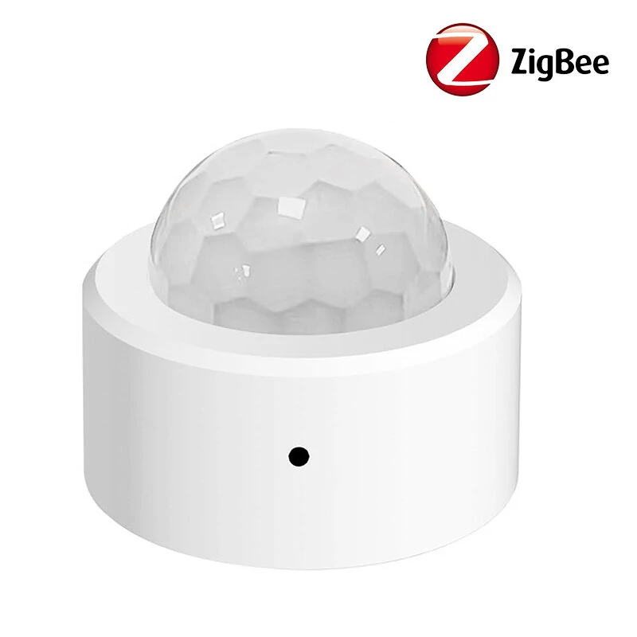
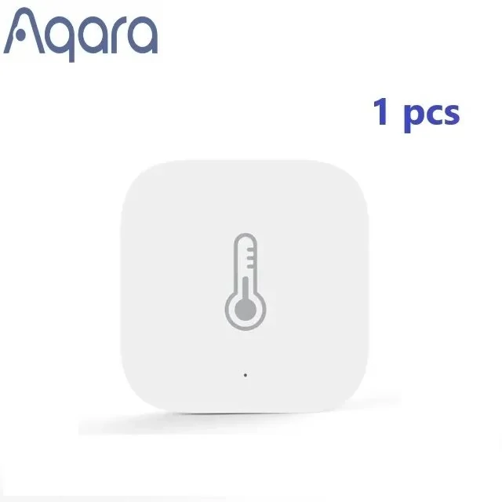
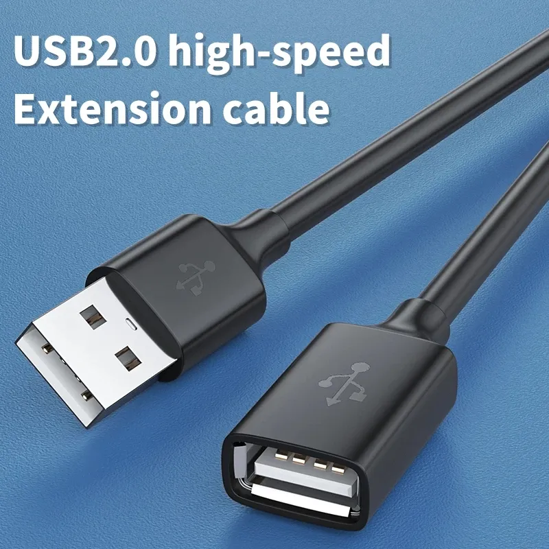

# Smart home best buy tips

On this page you find my personal favorite sensors and hardware. 
Most provided by Aliexpress or Banggood.

What is a smart home without ears and eyes? Sensors are the digital version of those. With all this data, you can make conditions and act on it and control other devices. Those devices called 'actuators', they can be controlled and act on input data.

## Why I chose Zigbee

On the market, there are different types of protocols to create a smart home network. Like Zigbee, Thread, Wifi, Bluetooth, Zwave and Matter. All with their pros and cons. You can use different protocols next to each other. I chose for one, specific Zigbee.

I choose for Zigbee because of:
* There is a wide range of sensor- and actuator types available;
* Every zigbee device, independent of manufacturer, it works in your network;
* The prices are low;
* It works locally, no internet is required;
* You can even link buttons direct to (a group) lamps without the need of a hub;
* Not dependent on the manufacture app, cloud or other software. When a manufacture gets bankrupt, you still can use your devices.
* It works as a mesh network, you can reach devices far away from the coordinator as long as there are enough active hops in between;
* The standard is an open protocol, you don't pay for a license fees (for Zwave you do) to use it;
* No compatibility issues with hardware with older or newer Zigbee versions;
* Active development on the software Zigbee2MQTT with every release a bulk of new supported Zigbee devices;

A reason why not to choose for Zigbee? I don't know :)

---

## Zigbee coordinator

Since 2020, I run non-stop my Zigbee network with the <a href="https://slae.sh/projects/cc2652/" target="_blank">Slaesh's CC2652RB stick (Slae website)</a> without any issue, it's a very reliable stick.
My network grew to 120+ devices today, and it still runs fast.

To avoid interference with Bluetooth or wifi also running on your server, 
it's better to move the stick away from the server. This is recommended for every stick. 
You can use a <a href="https://s.click.aliexpress.com/e/_m0Tzory" target="_blank">20 cm USB A extension cord (Aliexpress)</a> for it.

---

## Contact sensor

A contact sensor can be placed to check if doors and windows are open or closed. The sensor knows only those two values. The contact sensor works with a "reed switch", the circuit is by default open, but when there is a magnet nearby, the internal metal closes the circuit.

The sensor can also be used attached to other sensors that also return an open or closed circuit. With this behavior, you can create also a seat sensor or a water leak sensor.

<a href="https://www.banggood.com/WKD-DS010-Smart-Home-Zigbe-Door-Window-Sensor-Smart-Contact-Sensor-APP-Notifications-Voice-Alarm-Work-with-HA-Hubitat-Alexa-Echo-p-2009987.html?warehouse=CN&ID=0&p=IF081412102025201707&custlinkid=3958594" target="blank">Zigbee Contact sensor (banggood)</a>

---

## Motion sensor

The traditional motion sensors work with PIR, which stands for Passive InfraRed. This sensor detects objects which sending heat, like humans and animals. 

I like the <a href="https://www.banggood.com/Aqara-Motion-Sensor-Smart-Human-Body-Sensor-Body-Movement-ZigBe-Wireless-Connection-Smart-Home-for-Xiaomi-Mijia-Mi-home-p-2004884.html?warehouse=CN&ID=0&p=IF081412102025201707&custlinkid=3958768">Aqara</a> motion sensor myself a lot. It's fast, reliable and the new ones has also a lux sensor in it. With the stand you can point it to a specific direction so it doesn't 'see' the whole room.
If I want to cover a whole room I use a different type PIR sensor which you can stick in the center of the ceiling and looks around in all directions.

 &nbsp;

<a href="https://www.banggood.com/Aqara-Motion-Sensor-Smart-Human-Body-Sensor-Body-Movement-ZigBe-Wireless-Connection-Smart-Home-for-Xiaomi-Mijia-Mi-home-p-2004884.html?warehouse=CN&ID=0&p=IF081412102025201707&custlinkid=3958768">Zigbee motion sensor beam, with stand and build-in lux sensor -  Aqara (Banggood)</a>

<a href="https://www.banggood.com/Tuya-Zigbe-Human-Motion-Sensor-Smart-Home-Mini-PIR-Motion-Sensor-Infrared-Detector-Security-Smart-Life-Work-with-Alexa-Google-Assistant-Hubitat-Hub-p-2009988.html?warehouse=CN&ID=0&p=IF081412102025201707&custlinkid=3958596">Zigbee motion sensor all directions - Tuya (Banggood)</a>

---

## Smart socket

Smart sockets are useful to make traditional "dump" devices smart. Like a traditional standing lamp with a plug. You put it "on" and place the smart plug between the socket and wall. Now you change the switch functionality to the plug which you can be controlled automatically.

Sockets are always connected to power, this makes this sensor also a hub in the zigbee network which extends the range and coverage of your network. You can also plug a smart socket somewhere strategic with bad coverage to improve this. He doesn't need to be on or used.

A smart plug with power consumption metrics can be useful to detect the state of the machine. You don't use the on/off functionality in that case. This can be used for washing machines, dryers, dishwashers, ovens, etc.

I use the Zigbee BlitzWolf SHP-13 or SHP-15 which has also power consumption measurement, a physic button to switch the state and can handle 3680 W and 16A which is enough for washing machines and dryers. It took me a while before I got the correct one for this purpose, and now it runs for years without issues. 
If you buy one which has a lower wattage, your socket constantly stops working; then you know you need one with a higher wattage!

<a href="https://www.banggood.com/BlitzWolf-BW-SHP13-ZigBee3_0-Smart-Socket-16A-EU-Plug-Electricity-Metering-APP-Remote-Controller-Timer-Work-with-Amazon-Alexa-Google-Home-p-2000907.html?warehouse=CN&ID=0&p=IF081412102025201707&custlinkid=3954741">Zigbee smart power socket with power measurement - BlitzWolf SHP-13 (Banggood)</a>

---

## Temperature sensor

A temperature sensor is a simple sensor that measures, next to the temperature also, the humidity in a room. this sensor is useful to make automations like take action if someone is in the shower. Or in the summer when it becomes outside colder than inside.

<a href="https://www.banggood.com/Aqara-Temperature-Sensor-Smart-Zigbe-Air-Pressure-Humidity-Environment-Sensor-Remote-Control-for-XiaoMi-Home-Homekit-p-2004763.html?warehouse=CN&ID=0&p=IF081412102025201707&custlinkid=3958785">Zigbee temperature and humidity sensor - Aqara (Banggood)</a>

---

## Lux sensor

---

## Lights

### Bulb

---

### LED strip

---

## Switches

---

---
## Batteries

### CR2032

### CR1632

### CR2450

### Battery replacements

Battery to USB / battery eliminator 
[<a href="https://www.aliexpress.com/item/4001065392767.html" target="_blank">link 1</a>] 
[ <a href="https://www.aliexpress.com/item/1005004996793449.html" target="_blank">link 2</a> ] 
[ <a href="https://www.aliexpress.com/item/4000562483198.html" target="_blank">with power cable</a> ]

---

# DIY

## Power adapter

---
## Cables

### USB power cable

### USB A extension cable

<a href="https://s.click.aliexpress.com/e/_mstQlFs" target="_blank">
 
USB A Extension Cable Male to Female</a>

### 

## ESP

## Sensors

### Co2

### mmWave

---

> **_NOTE:_** Links on this page are devices I also have. Most of the links are affiliate links so you support my blog also by buying it from here.