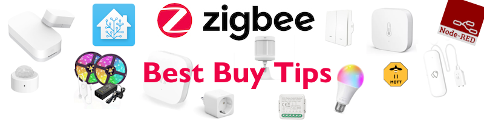



 | 

# Zigbee Smart home - Best Buy Tips

What is a smart home without digital ears and eyes? Sensors are the digital version of those.\
With the sensor data, you can make conditions, act on it and control other devices.

On this page you'll find the sensors, actuators, and other (Zigbee) home automation hardware I use in my own home and that has worked very reliably for me.

If you need some home automation inspiration, you can check my [home automation ideas](../ideas/home_automation_ideas) section!

> **_NOTE 1:_** Almost all hardware links I show are devices I also use myself.\
> Most of the links are affiliate links, You pay the normal price and also support my blog a bit.

> **_NOTE 2:_** I advise these products based on my personal experience.\
> I run my network with a CC2652 Zigbee adapter and Zigbee2MQTT.\
> With other hardware combinations it may not run with the same experience.

I've been ordering most of my smart home products from [AliExpress](https://www.aliexpress.com/) for years now:
good prices, reliable products that last for years, fast shipping (sometimes under a week), and a huge selection.
When a product is also available on Amazon, I also added a link to it.\
All the Amazon products are also bundled on these
[Amazon](https://amzn.to/4d6vXkN#ad) and [Amazon NL](https://amzn.to/4cO48ip#ad) pages.

---

## What you need

A smart home is built in layers. Each layer needs its own hardware, and each one builds on the layer above it:

<a class="hp-card" href="#1-server">1<strong>Server</strong>Where your automations run</a>
<a class="hp-card" href="#2-protocol-and-dongle">2<strong>Protocol + dongle</strong>How devices talk to the server</a>
<a class="hp-card" href="#3-sensors-and-actuators">3<strong>Sensors and actuators</strong>The eyes, ears and hands</a>
<a class="hp-card" href="#4-power-and-accessories">4<strong>Power and accessories</strong>Batteries, cables and adapters</a>

---

## 1. Server

Everything starts with a local always-on computer, which runs your applications to control your home automations.
It runs locally in your own home and it the brain of your home automations.

<a class="hp-card hp-tile" href="/homeassistant/homeassistant_hardware">

<strong>Which hardware to run Home Assistant on?</strong>
I explain which options are available and clarify common terms, so you can make a good choice.
Read more about the hardware &rarr;

</a>

&darr;

---

## 2. Protocol and dongle

On the market, there are different protocols to create a smart home network, like Zigbee, Thread, WiFi, Bluetooth, Z-Wave and Matter.
You can use different protocols next to each other. I chose one protocol: Zigbee (and some via wifi for [ESPs](/esphome)).

<a class="hp-card hp-tile" href="zigbee_why">

<strong>What is Zigbee?</strong>
Zigbee is a low-power wireless mesh network for smart home devices. Every Zigbee device works in your network regardless of the manufacturer, locally and without the internet. A cheap dongle on your server is all you need to start.
Why I chose Zigbee &rarr;

</a>

### Zigbee coordinator

The dongle (coordinator) connects your server with all the Zigbee devices. It's the heart of your Zigbee network.
In my setup, a Zigbee2MQTT instance on my home server talks via this stick to all my devices.

&#10003;

My used dongle<strong>Slaesh's CC2652RB stick</strong>

Runs my Zigbee network non-stop since 2020 without any issue. My network has grown to 140+ devices, and it still runs fast.

<a href="https://slae.sh/projects/cc2652/" target="_blank">Slae website</a> | <a href="https://www.zigbee2mqtt.io/guide/adapters/zstack.html" target="_blank">Zigbee2MQTT</a>

Popular<strong>Sonoff ZBDongle-E Plus</strong>

A coordinator that many people are very happy with.

<a href="https://s.click.aliexpress.com/e/_omBbJGj" target="_blank">AliExpress</a> | <a href="https://amzn.to/3RhO53N#ad" target="_blank">Amazon US</a> | <a href="https://amzn.to/3OkLelX#ad" target="_blank">Amazon NL</a> | <a href="https://www.zigbee2mqtt.io/guide/adapters/zstack.html" target="_blank">Zigbee2MQTT</a>

Nabu Casa<strong>Home Assistant Connect ZBT-2</strong>

From Nabu Casa, the makers of Home Assistant. A dongle with Zigbee or Thread support.

<a href="https://www.home-assistant.io/connect/zbt-2/" target="_blank">Home Assistant Connect</a>

Better range<strong>USB-A extension cable</strong>

To avoid interference with Bluetooth or WiFi, move the stick away from the server. This is recommended for every stick.

<a href="https://s.click.aliexpress.com/e/_oFCMjGU" target="_blank">AliExpress</a> | <a href="https://amzn.to/4cOv6q9#ad" target="_blank">Amazon US</a> | <a href="https://amzn.to/3V2q9Rk#ad" target="_blank">Amazon NL</a>

&darr;

---

## 3. Sensors and actuators

Now your network is ready, you can add devices. Sensors give your server information, actuators like lights and sockets act on it.
This is the hardware I advise, mostly based on my personal experience with it. Click on a type to see my favorites.

<a class="hp-card hp-tile" href="zigbee_contact_sensor">

<strong>Contact sensor</strong>
Detect open and closed doors, windows and drawers.

</a>
<a class="hp-card hp-tile" href="zigbee_motion_sensor">

<strong>Motion sensor</strong>
Trigger lights and alerts when someone moves.

</a>
<a class="hp-card hp-tile" href="zigbee_presence_sensor">

<strong>Presence detection sensor</strong>
Detect people, even when they sit still.

</a>
<a class="hp-card hp-tile" href="zigbee_pressure_sensor">

<strong>Pressure sensor</strong>
Detect weight on a chair, bed or mat.

</a>
<a class="hp-card hp-tile" href="zigbee_temperature_sensor">

<strong>Temperature sensor</strong>
Temperature and humidity for every room.

</a>
<a class="hp-card hp-tile" href="zigbee_air_quality_sensor">

<strong>Air quality sensor</strong>
Measure CO2, VOC and other air quality values.

</a>
<a class="hp-card hp-tile" href="zigbee_light_sensor">

<strong>Light intensity sensor</strong>
Measure daylight to switch lights at the right moment.

</a>
<a class="hp-card hp-tile" href="zigbee_leak_sensor">

<strong>Leak sensor</strong>
Get warned about water leaks early.

</a>
<a class="hp-card hp-tile" href="zigbee_smoke_detector">

<strong>Smoke detector</strong>
Get alerted at the first sign of smoke.

</a>
<a class="hp-card hp-tile" href="zigbee_vibration_sensor">

<strong>Vibration sensor</strong>
Detect vibrations, shocks and knocks.

</a>
<a class="hp-card hp-tile" href="zigbee_plant_soil_sensor">

<strong>Plant soil sensor</strong>
Know when your plants need water.

</a>
<a class="hp-card hp-tile" href="zigbee_lights">

<strong>Lights</strong>
Bulbs, GU10 spots and LED strips.

</a>
<a class="hp-card hp-tile" href="zigbee_buttons">

<strong>Buttons</strong>
Wall switches, dimmers and portable buttons.

</a>
<a class="hp-card hp-tile" href="zigbee_smart_socket">

<strong>Smart socket</strong>
Switch any plugged-in device and measure its power.

</a>
<a class="hp-card hp-tile" href="zigbee_power_strip">

<strong>Power strip</strong>
Several smart sockets in one strip.

</a>
<a class="hp-card hp-tile" href="zigbee_usb_adapter_switch">

<strong>USB adapter switch</strong>
Switch USB powered devices on and off.

</a>
<a class="hp-card hp-tile" href="zigbee_infrared_remote">

<strong>Infrared remote control</strong>
Control infrared devices, like an AC or TV, from automations.

</a>
<a class="hp-card hp-tile" href="zigbee_radiator_thermostat">

<strong>Radiator thermostat</strong>
Heat only the rooms and moments that need it.

</a>
<a class="hp-card hp-tile" href="/projects/slide_smart_curtains">

<strong>Smart curtains</strong>
Open and close your curtains automatically.

</a>

### Outdoor sensors

There are also outdoor sensors and actuators available, like water-resistant sockets, lights, rain sensors and even a weather station. Find here a set of preselected devices for your garden or garden room.

<a class="hp-card hp-tile" href="zigbee_outdoor_contact_sensor">

<strong>Waterproof contact sensor</strong>
Detect a gate, shed door or mailbox, also in the rain.

</a>
<a class="hp-card hp-tile" href="zigbee_outdoor_temperature_sensor">

<strong>Waterproof temperature sensor</strong>
Measure the outdoor temperature and humidity.

</a>
<a class="hp-card hp-tile" href="zigbee_outdoor_soil_sensor">

<strong>Soil sensor</strong>
Know if your garden plants have enough water.

</a>
<a class="hp-card hp-tile" href="zigbee_weather_station">

<strong>Weather stations</strong>
Full-blown weather stations with Home Assistant integration.

</a>
<a class="hp-card hp-tile" href="zigbee_outdoor_lights">

<strong>Outdoor lights</strong>
Spotlights, floodlights and LED strips for your garden.

</a>
<a class="hp-card hp-tile" href="zigbee_outdoor_socket">

<strong>Outdoor socket</strong>
Water-resistant smart sockets with power measurement.

</a>

&darr;

---

## 4. Power and accessories

Most Zigbee devices run on batteries for years, but sometimes you need other ways to power them, or just the right cable.

<a class="hp-card hp-tile" href="smart_home_batteries">

<strong>Batteries</strong>
Common battery types and battery eliminators.

</a>
<a class="hp-card hp-tile" href="smart_home_cables">

<strong>Cables</strong>
USB cables and extension cables for your ESP and Zigbee stick.

</a>
<a class="hp-card hp-tile" href="smart_home_power">

<strong>Power adapters</strong>
5V USB power adapters for your devices.

</a>
<a class="hp-card hp-tile" href="smart_home_battery_powered_pir">

<strong>Battery powered with PIR</strong>
Not connected, but still smart with a built-in PIR sensor.

</a>

---

## ESPHome DIY sensors

<a class="hp-card hp-tile" href="esphome_diy">

Best Buy Tips<strong>ESPHome DIY sensors</strong>
Hardware tips to create your own sensors with ESPHome for Home Assistant.

</a>

---

## Related articles

<a class="hp-card hp-tile" href="../ideas/home_automation_ideas#outside">

Ideas<strong>Home Automation Ideas</strong>
For integration ideas, get inspired to make your home smart.

</a>

