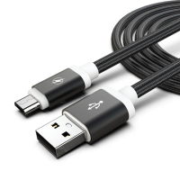
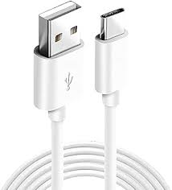
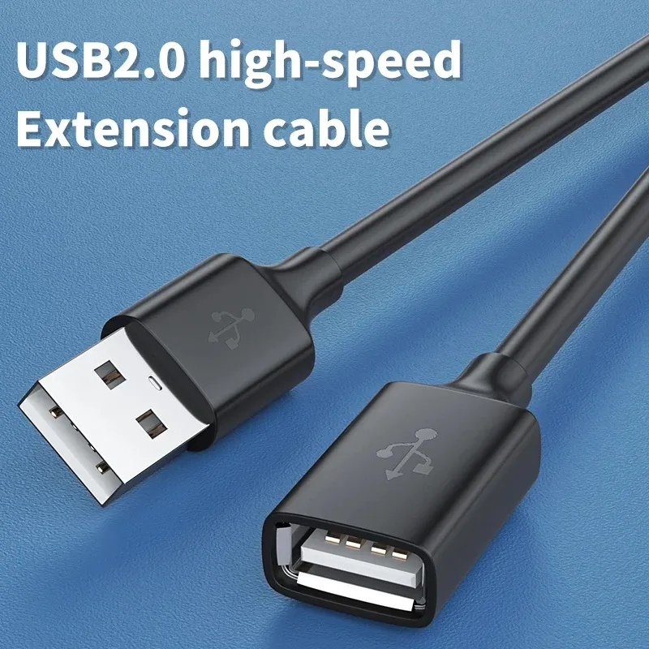



 | 

# Cables

[<< Best Buy Tips overview](smart_home_best_buy_tips#4-power-and-accessories)

Many smart home devices, like ESP boards and USB battery replacements, are powered via USB, so the right cable makes the difference.
Here are the cables I use to power an ESP, and an extension cable to move your Zigbee stick away from your server.

## Micro USB power cable

USB-A to micro USB cable to power the ESP.

<strong>Micro USB cable</strong>

<a href="https://s.click.aliexpress.com/e/_c32Nxdc7" target="_blank">AliExpress</a> | <a href="https://amzn.to/42C3sHw#ad" target="_blank">Amazon US</a> | <a href="https://amzn.to/3CAUNdU#ad" target="_blank">Amazon NL</a>

## USB-C power cable

USB-A to USB-C cable to power the ESP.

<strong>USB-A to USB-C cable</strong>

<a href="https://s.click.aliexpress.com/e/_c4egHUiz" target="_blank">AliExpress</a> | <a href="https://amzn.to/3RdjocW#ad" target="_blank">Amazon US</a>

## USB-C to USB-C

USB-C to USB-C power cable with 90-degree connectors.

<strong>USB-C to USB-C power cable</strong>

<a href="https://s.click.aliexpress.com/e/_EvdirFL" target="_blank">AliExpress</a> | <a href="https://amzn.to/3RaTlDi#ad" target="_blank">Amazon US</a>

## USB-A extension cable

Useful for moving your Zigbee stick away from your server for better range and less interference.

<strong>USB A Extension Cable Male to Female</strong>

To move your Zigbee dongle away from your server. See the <a href="smart_home_best_buy_tips#zigbee-coordinator">Zigbee coordinator</a> chapter.

<a href="https://s.click.aliexpress.com/e/_oFCMjGU" target="_blank">AliExpress</a> | <a href="https://amzn.to/42tTmaE#ad" target="_blank">Amazon US</a>

## Related articles

<a class="hp-card hp-tile" href="smart_home_best_buy_tips#zigbee-coordinator">

Best Buy Tips<strong>Zigbee dongle (coordinator)</strong>
Place the dongle away from your server with a USB-A extension cable, to avoid interference.

</a>
<a class="hp-card hp-tile" href="/esphome/co2_scd40">

ESPHome<strong>ESPHome SCD40 CO2 sensor</strong>
Create your own ESPHome CO2 sensor based on the SCD40 sensor for Home Assistant

</a>
<a class="hp-card hp-tile" href="/esphome/co2_senseair_s8_sensor">

ESPHome<strong>ESPHome SenseAir S8 CO2 sensor</strong>
Create your own ESPHome CO2 sensor based on the SenseAir S8 sensor for Home Assistant

</a>
<a class="hp-card hp-tile" href="/esphome/microwave_radar_sensor_rcwl-0516">

ESPHome<strong>ESPHome Presence detection with a microwave radar sensor</strong>
Create your own ESPHome motion and presence sensor based on the RCWL-0516 sensor for Home Assistant

</a>
<a class="hp-card hp-tile" href="/projects/stretch_display">

Project<strong>Stretch display</strong>
A stretched display to show Home Assistant dashboard on

</a>

## More buy tips

<a class="hp-card hp-mini hp-mini-index hp-mini-wide" href="smart_home_best_buy_tips#4-power-and-accessories"><strong>&larr; Best Buy Tips</strong>To the Best Buy Tips overview page</a>

<a class="hp-card hp-mini" href="smart_home_power"><strong>Power adapters</strong>5V USB power adapters for your devices.</a>
<a class="hp-card hp-mini" href="zigbee_usb_adapter_switch"><strong>USB adapter switch</strong>Switch USB powered devices on and off.</a>
<a class="hp-card hp-mini" href="smart_home_batteries"><strong>Batteries</strong>Common battery types and battery eliminators.</a>
<a class="hp-card hp-mini" href="zigbee_smart_socket"><strong>Smart socket</strong>Switch any plugged-in device and measure its power.</a>
<a class="hp-card hp-mini" href="smart_home_battery_powered_pir"><strong>Battery powered with PIR</strong>Not connected, but still smart with a built-in PIR sensor.</a>
<a class="hp-card hp-mini" href="zigbee_contact_sensor"><strong>Contact sensor</strong>Detect open and closed doors, windows and drawers.</a>

