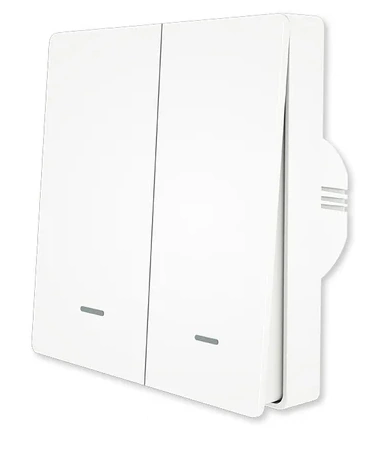



 | 

# Buttons

[<< Best Buy Tips overview](smart_home_best_buy_tips#3-sensors-and-actuators)

Buttons are a simple way to control your smart home by hand, and a good fallback when you don't want to use your phone.
A Zigbee button can switch a light, activate a scene or trigger any automation. Some can even be linked directly to a lamp, without a hub.
Below are the wall switches, wall dimmers and portable buttons I use.

## Wall switch

<strong>Zigbee wall switch - Aqara</strong>

<a href="https://s.click.aliexpress.com/e/_c3RiOyRP" target="_blank">AliExpress</a> | <a href="https://amzn.to/4cgAL6f#ad" target="_blank">Amazon NL</a>

<a href="https://www.zigbee2mqtt.io/devices/QBKG41LM.html" target="_blank">QBKG41LM</a>

<strong>Zigbee wall switch - Moes</strong>

<a href="https://s.click.aliexpress.com/e/_c4pcVDnh" target="_blank">AliExpress</a> | <a href="https://amzn.to/4uotc5i#ad" target="_blank">Amazon US</a> | <a href="https://amzn.to/3GF13nC#ad" target="_blank">Amazon NL</a>

<a href="https://www.zigbee2mqtt.io/devices/ZS-EUB_2gang.html" target="_blank">ZS-EUB</a>

## Wall dimmer

This Zigbee dimmer replaces an original wall dimmer module.\
An easy way to make a dimmable group of GU10 lights smart.

<strong>ECO-DIM.07 LED dimmer press/turn 0-200W - EcoDim</strong>

<a href="https://www.ecodim.nl/nl/eco-dim07-zigbee-basic.html" target="_blank">EcoDim site (links to different shops)</a>

<a href="https://www.zigbee2mqtt.io/devices/Eco-Dim.07_Eco-Dim.10.html" target="_blank">Eco-Dim.07</a>

<strong>ECO-DIM.01 LED dimmer press/turn 0-300W - EcoDim</strong>

<a href="https://amzn.to/4108Zri#ad" target="_blank">Amazon NL</a>

<strong>Other EcoDim Zigbee devices - EcoDim</strong>

<a href="https://www.ecodim.nl/nl/smart-led-dimmers-en-schakelaars/zigbee/" target="_blank">EcoDim site (links to different shops)</a>

---

## Portable button

These buttons can trigger multiple scenarios because they support three press types: single, double, and long press.

Best option<strong>Zigbee button - Aqara</strong>

<a href="https://s.click.aliexpress.com/e/_DF2oxu7" target="_blank">AliExpress</a> | <a href="https://amzn.to/4droHj8#ad" target="_blank">Amazon NL</a>

<a href="https://www.zigbee2mqtt.io/devices/WXKG11LM.html" target="_blank">WXKG11LM</a>

Cheaper option<strong>Small Zigbee button - Tuya / Loginovo</strong>

<a href="https://s.click.aliexpress.com/e/_on6fohX" target="_blank">AliExpress</a> | <a href="https://amzn.to/4l6OrUs#ad" target="_blank">Amazon NL</a>

<a href="https://www.zigbee2mqtt.io/devices/ZG-101ZL.html" target="_blank">ZG-101ZL</a>

## Related articles

<a class="hp-card hp-tile" href="/homeassistant/homeassistant_dashboard_wake-up-alarm-light">

Home Assistant<strong>Home Assistant dashboard: Wake-up alarm light</strong>
Here you find an explanation of a Home Assistant dashboard with an alarm timer on it which can be changed via the dashboard itself. This way...

</a>
<a class="hp-card hp-tile" href="/ideas/home_automation_ideas">

Ideas<strong>Home Automation Ideas</strong>
Home automation ideas to make your home smart

</a>

## More buy tips

<a class="hp-card hp-mini hp-mini-index hp-mini-wide" href="smart_home_best_buy_tips#3-sensors-and-actuators"><strong>&larr; Best Buy Tips</strong>To the Best Buy Tips overview page</a>

<a class="hp-card hp-mini" href="zigbee_lights"><strong>Lights</strong>Bulbs, GU10 spots and LED strips.</a>
<a class="hp-card hp-mini" href="zigbee_smart_socket"><strong>Smart socket</strong>Switch any plugged-in device and measure its power.</a>
<a class="hp-card hp-mini" href="zigbee_motion_sensor"><strong>Motion sensor</strong>Trigger lights and alerts when someone moves.</a>
<a class="hp-card hp-mini" href="zigbee_plant_soil_sensor"><strong>Plant soil sensor</strong>Know when your plants need water.</a>
<a class="hp-card hp-mini" href="zigbee_power_strip"><strong>Power strip</strong>Several smart sockets in one strip.</a>
<a class="hp-card hp-mini" href="zigbee_vibration_sensor"><strong>Vibration sensor</strong>Detect vibrations, shocks and knocks.</a>

