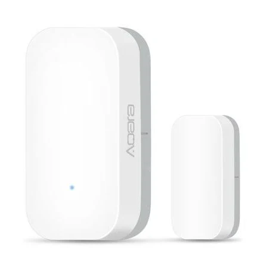
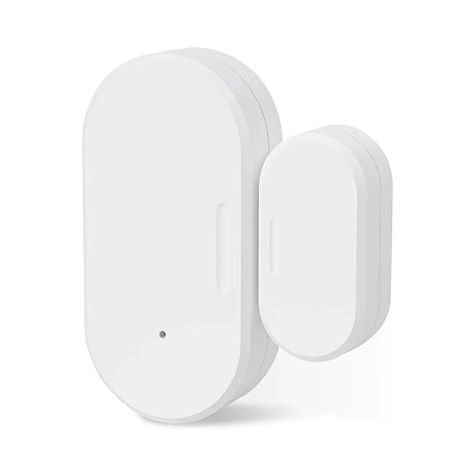
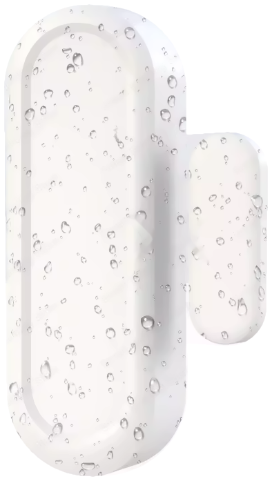



 | 

# Contact sensor

[<< Best Buy Tips overview](smart_home_best_buy_tips#3-sensors-and-actuators)

A contact sensor can be placed to check whether doors and windows are open or closed. The sensor only knows those two states.
The contact sensor works with a "reed switch". The circuit is normally open, but when a magnet is nearby, the internal metal closes it.

The sensor can also be attached to other sensors that expose an open or closed circuit.
With this behavior, you can also create a [seat occupancy sensor](/zigbee/zigbee_chair_occupancy_sensor) or a [water leak sensor](/zigbee/zigbee_water_leak_sensor).

Best option<strong>Zigbee Contact sensor - Aqara</strong>

aka T1. They are small and have a long battery life.

<a href="https://s.click.aliexpress.com/e/_c3udT3zH" target="_blank">AliExpress</a> | <a href="https://amzn.to/3R03iGC#ad" target="_blank">Amazon US</a> | <a href="https://amzn.to/3Dnl1kK#ad" target="_blank">Amazon NL</a>

<a href="https://www.zigbee2mqtt.io/devices/MCCGQ11LM.html" target="_blank">MCCGQ11LM</a>

Cheaper option<strong>Zigbee Contact sensor - Tuya</strong>

Small and cheaper.

<a href="https://s.click.aliexpress.com/e/_c4ara5aH" target="_blank">AliExpress</a> | <a href="https://amzn.to/4eokjEj#ad" target="_blank">Amazon US</a> | <a href="https://amzn.to/4swcmAw#ad" target="_blank">Amazon NL</a>

<a href="https://www.zigbee2mqtt.io/devices/ZD08.html" target="_blank">ZD08</a>

2xAAA battery option<strong>Zigbee Contact sensor 2xAAA powered - Tuya</strong>

Battery powered, bigger, cheaper.

<a href="https://s.click.aliexpress.com/e/_c3PaIIKN" target="_blank">AliExpress</a> | <a href="https://amzn.to/4tT6bHW#ad" target="_blank">Amazon US</a> | <a href="https://amzn.to/3GJdFKq#ad" target="_blank">Amazon NL</a>

<a href="https://www.zigbee2mqtt.io/devices/ZD06.html" target="_blank">ZD06</a>

IP65 waterproof option<strong>Zigbee Waterproof IP65 Contact sensor 2xAAA powered - Tuya</strong>

<a href="https://s.click.aliexpress.com/e/_c2QboG2R" target="_blank">AliExpress</a>

## Related articles

<a class="hp-card hp-tile" href="/zigbee/zigbee_chair_occupancy_sensor">

Zigbee<strong>DIY Zigbee chair occupancy sensor</strong>
DIY chair occupancy sensor Based on a leak or contact sensor and a car seat pressure sensor

</a>
<a class="hp-card hp-tile" href="/ideas/home_automation_ideas">

Ideas<strong>Home Automation Ideas</strong>
Home automation ideas to make your home smart

</a>
<a class="hp-card hp-tile" href="/projects/retrofit_kitchen_appliances">

Project<strong>Retrofit kitchen appliances to make them smarter</strong>
Retrofit kitchen appliances to make them smarter by adding out-of-the-box sensors to it.

</a>
<a class="hp-card hp-tile" href="/zigbee/zigbee_water_leak_sensor">

Zigbee<strong>DIY Zigbee leak detector</strong>
DIY Zigbee leak sensor Based on a Zigbee contact sensor and two wires

</a>
<a class="hp-card hp-tile" href="/zigbee/zigbee_outlet_sensor">

Zigbee<strong>DIY Zigbee outlet sensor</strong>
Create a non-battery Zigbee sensor

</a>
<a class="hp-card hp-tile" href="/zigbee/zigbee_waterproof_contact_sensor">

Zigbee<strong>Zigbee waterproof contact sensor</strong>
IP65 waterproof Zigbee contact sensor for outdoor use

</a>
<a class="hp-card hp-tile" href="/projects/packages-mailbox-allux-600">

Project<strong>Packages mailbox - Allux 600</strong>
I was looking for a package mailbox where 80% of my ordered packages would fit, so I don&#x27;t have to wait at home for the delivery person to arrive,...

</a>

## More buy tips

<a class="hp-card hp-mini hp-mini-index hp-mini-wide" href="smart_home_best_buy_tips#3-sensors-and-actuators"><strong>&larr; Best Buy Tips</strong>To the Best Buy Tips overview page</a>

<a class="hp-card hp-mini" href="zigbee_motion_sensor"><strong>Motion sensor</strong>Trigger lights and alerts when someone moves.</a>
<a class="hp-card hp-mini" href="zigbee_presence_sensor"><strong>Presence detection sensor</strong>Detect people, even when they sit still.</a>
<a class="hp-card hp-mini" href="zigbee_leak_sensor"><strong>Leak sensor</strong>Get warned about water leaks early.</a>
<a class="hp-card hp-mini" href="smart_home_battery_powered_pir"><strong>Battery powered with PIR</strong>Not connected, but still smart with a built-in PIR sensor.</a>
<a class="hp-card hp-mini" href="smart_home_power"><strong>Power adapters</strong>5V USB power adapters for your devices.</a>
<a class="hp-card hp-mini" href="zigbee_pressure_sensor"><strong>Pressure sensor</strong>Detect weight on a chair, bed or mat.</a>

