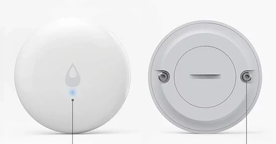



 | 

# Leak sensor

[<< Best Buy Tips overview](smart_home_best_buy_tips#3-sensors-and-actuators)

Each leak sensor has two metal contacts. 
When these contacts come into contact with water, current flows from one contact to the other and the circuit closes.
The sensor sends a signal "water detected"!
Water conducts the current and air doesn't.

The Aqara leak sensor has two metal screw contacts on the back of the sensor that measure whether there is water.
This sensor is completely water-resistant.
It has a small size and the battery lasts a very long time. 
That makes it more expensive, but also very reliable.

It can also be used to create other binary sensors,
like the [chair occupancy sensor](/zigbee/zigbee_chair_occupancy_sensor).

Best option<strong>Leak sensor - Aqara</strong>

<a href="https://s.click.aliexpress.com/e/_c3QCb0sj" target="_blank">AliExpress</a> | <a href="https://amzn.to/4eZBV9z#ad" target="_blank">Amazon US</a> | <a href="https://amzn.to/3ZneX2Z#ad" target="_blank">Amazon NL</a>

<a href="https://www.zigbee2mqtt.io/devices/SJCGQ11LM.html" target="_blank">SJCGQ11LM</a>

Cheaper option<strong>Zigbee leak sensor</strong>

Another leak sensor is the one with a wire, this sensor itself isn't water-resistant, only the other end of the cable may become wet. This one runs on two common AAA batteries, which make the sensor fairly big but cheaper to buy.

(Not available on Amazon)

<a href="https://s.click.aliexpress.com/e/_c3Su3S8r" target="_blank">AliExpress</a> | <a href="https://amzn.to/4whRnDQ#ad" target="_blank">Amazon NL</a>

<a href="https://www.zigbee2mqtt.io/devices/TS0207_water_leak_detector_1.html" target="_blank">TS0207</a>

## Related articles

<a class="hp-card hp-tile" href="/projects/smart_mailbox">

Project<strong>Smart traditional mailbox</strong>
Make your traditional mailbox smart

</a>
<a class="hp-card hp-tile" href="/zigbee/zigbee_chair_occupancy_sensor">

Zigbee<strong>DIY Zigbee chair occupancy sensor</strong>
DIY chair occupancy sensor Based on a leak or contact sensor and a car seat pressure sensor

</a>
<a class="hp-card hp-tile" href="/ideas/home_automation_ideas">

Ideas<strong>Home Automation Ideas</strong>
Home automation ideas to make your home smart

</a>
<a class="hp-card hp-tile" href="/zigbee/zigbee_water_leak_sensor">

Zigbee<strong>DIY Zigbee leak detector</strong>
DIY Zigbee leak sensor Based on a Zigbee contact sensor and two wires

</a>
<a class="hp-card hp-tile" href="/zigbee/zigbee_outlet_sensor">

Zigbee<strong>DIY Zigbee outlet sensor</strong>
Convert a battery to a non-battery powered Zigbee sensor.

</a>
<a class="hp-card hp-tile" href="/projects/retrofit_kitchen_appliances">

Project<strong>Retrofit kitchen appliances to make them smarter</strong>
Retrofit kitchen appliances to make them smarter by adding out-of-the-box sensors to it.

</a>

## More buy tips

<a class="hp-card hp-mini hp-mini-index hp-mini-wide" href="smart_home_best_buy_tips#3-sensors-and-actuators"><strong>&larr; Best Buy Tips</strong>To the Best Buy Tips overview page</a>

<a class="hp-card hp-mini" href="zigbee_contact_sensor"><strong>Contact sensor</strong>Detect open and closed doors, windows and drawers.</a>
<a class="hp-card hp-mini" href="zigbee_smart_socket"><strong>Smart socket</strong>Switch any plugged-in device and measure its power.</a>
<a class="hp-card hp-mini" href="zigbee_temperature_sensor"><strong>Temperature sensor</strong>Temperature and humidity for every room.</a>
<a class="hp-card hp-mini" href="zigbee_light_sensor"><strong>Light intensity sensor</strong>Measure daylight to switch lights at the right moment.</a>
<a class="hp-card hp-mini" href="zigbee_smoke_detector"><strong>Smoke detector</strong>Get alerted at the first sign of smoke.</a>
<a class="hp-card hp-mini" href="zigbee_air_quality_sensor"><strong>Air quality sensor</strong>Measure CO2, VOC and other air quality values.</a>

