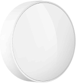



 | 

# Light intensity sensor

[<< Best Buy Tips overview](smart_home_best_buy_tips#3-sensors-and-actuators)

A light intensity sensor (lux sensor) measures the amount of light.\
Useful to enable the lights when it becomes dark outside.

Best option<strong>Zigbee lux sensor - Aqara T1</strong>

Very reliable, very long battery life, quick response on small light changes, more expensive.

<a href="https://s.click.aliexpress.com/e/_c3oHoBsX" target="_blank">AliExpress</a>

<a href="https://www.zigbee2mqtt.io/devices/GZCGQ11LM.html" target="_blank">GZCGQ11LM</a>

<!--
Xiaomi has almost the same device, with the same looks and works the same as the Aqara.

<strong>Zigbee lux sensor - Xiaomi Mi light sensor</strong>

<a href="https://s.click.aliexpress.com/e/" target="_blank">AliExpress</a>

<a href="https://www.zigbee2mqtt.io/devices/GZCGQ01LM.html" target="_blank">GZCGQ01LM</a>

Cheaper option 1<strong>Zigbee lux sensor - Moes</strong>

<a href="https://s.click.aliexpress.com/e/_DlwYz45" target="_blank">AliExpress</a>

<a href="https://www.zigbee2mqtt.io/devices/TS0222_light.html" target="_blank">TS0222_light</a>

Cheaper option 2<strong>Zigbee lux sensor - Tuya</strong>

<a href="https://s.click.aliexpress.com/e/_DC8WRhJ" target="_blank">AliExpress</a> | <a href="https://amzn.to/3TX4A3y#ad" target="_blank">Amazon US</a>

<a href="https://www.zigbee2mqtt.io/devices/TS0222.html" target="_blank">TS0222</a>

-->

## Related articles

<a class="hp-card hp-tile" href="/ideas/home_automation_ideas">

Ideas<strong>Home Automation Ideas</strong>
Home automation ideas to make your home smart

</a>
<a class="hp-card hp-tile" href="/zigbee/zigbee_soil_sensor">

Zigbee<strong>Zigbee soil sensor</strong>
A Zigbee soil sensor which measure humidity and temperature

</a>
<a class="hp-card hp-tile" href="/projects/slide_smart_curtains">

Project<strong>Slide - Smart Curtains</strong>
Slide - Smart Curtains

</a>

## More buy tips

<a class="hp-card hp-mini hp-mini-index hp-mini-wide" href="smart_home_best_buy_tips#3-sensors-and-actuators"><strong>&larr; Best Buy Tips</strong>To the Best Buy Tips overview page</a>

<a class="hp-card hp-mini" href="zigbee_motion_sensor"><strong>Motion sensor</strong>Trigger lights and alerts when someone moves.</a>
<a class="hp-card hp-mini" href="zigbee_lights"><strong>Lights</strong>Bulbs, GU10 spots and LED strips.</a>
<a class="hp-card hp-mini" href="zigbee_temperature_sensor"><strong>Temperature sensor</strong>Temperature and humidity for every room.</a>
<a class="hp-card hp-mini" href="zigbee_air_quality_sensor"><strong>Air quality sensor</strong>Measure CO2, VOC and other air quality values.</a>
<a class="hp-card hp-mini" href="zigbee_leak_sensor"><strong>Leak sensor</strong>Get warned about water leaks early.</a>
<a class="hp-card hp-mini" href="zigbee_smoke_detector"><strong>Smoke detector</strong>Get alerted at the first sign of smoke.</a>

