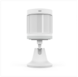
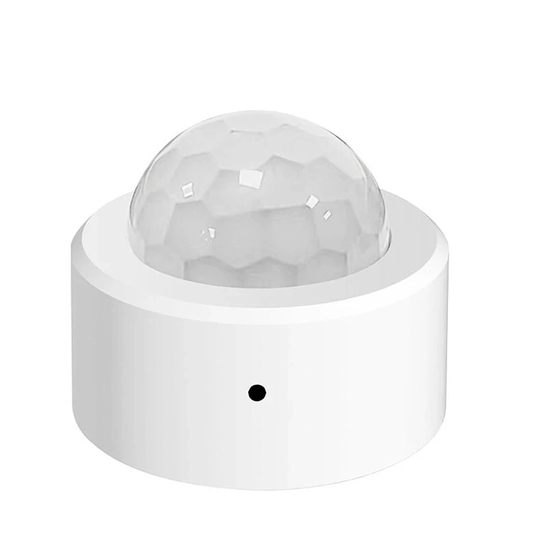



 | 

# Motion sensor

[<< Best Buy Tips overview](smart_home_best_buy_tips#3-sensors-and-actuators)

There are different types of motion sensors, each with its own strength:
* [Human presence sensor](#human-presence-sensor): also detects people who sit still
* [PIR beam sensor](#pir-beam-sensor): looks in one direction
* [PIR all directions](#pir-all-directions): covers a whole room from the ceiling
* [Battery powered PIR](#battery-powered-pir): the cheap option on AAA batteries

## Human presence sensor

A human presence sensor. 
It combines a PIR sensor, mmWave radar, and a brightness sensor.
It's wireless and 2x AAA battery powered. 
The PIR sensor detects a person and activates the mmWave radar sensor.
This helps avoid detecting animals.
It can also detect people who are sitting still or lying in bed.

<strong>Zigbee Human motion + presence + lux sensor - Hoazee</strong>

<a href="https://s.click.aliexpress.com/e/_c3fNxtbf" target="_blank">AliExpress</a> | <a href="https://amzn.to/42aE8HW#ad" target="_blank">Amazon US</a> | <a href="https://amzn.to/46H1JBL#ad" target="_blank">Amazon NL</a>

<a href="https://www.zigbee2mqtt.io/devices/ZG-204ZM.html" target="_blank">ZG-204ZM</a>

## PIR beam sensor

The traditional motion sensors work with PIR, which stands for Passive InfraRed. This sensor detects objects that emit heat, like humans and animals.

I like the Aqara motion sensor a lot. It's fast and reliable.
With the stand you can point it in a specific direction, so it doesn't 'see' the whole room.

Best option<strong>Zigbee motion sensor beam, WITH LIGHT SENSOR - Aqara</strong>

<a href="https://s.click.aliexpress.com/e/_c3tkjvQ5" target="_blank">AliExpress</a> | <a href="https://amzn.to/4tcin5k#ad" target="_blank">Amazon US</a> | <a href="https://amzn.to/4mK01ph#ad" target="_blank">Amazon NL</a>

<a href="https://www.zigbee2mqtt.io/devices/RTCGQ11LM.html" target="_blank">RTCGQ11LM / P1</a>

Alternative option<strong>Zigbee motion sensor beam - Xiaomi</strong>

<a href="https://s.click.aliexpress.com/e/_c4CYStNH" target="_blank">AliExpress</a> | <a href="https://amzn.to/4kUzGUw#ad" target="_blank">Amazon NL</a>

<a href="https://www.zigbee2mqtt.io/devices/RTCGQ01LM.html" target="_blank">RTCGQ01LM</a>

## PIR all directions

If I want to cover a whole room, I use a different type of PIR sensor which you can stick in the center of the ceiling and it looks in all directions.

All direction option<strong>Zigbee motion sensor all directions - Tuya</strong>

<a href="https://s.click.aliexpress.com/e/_c2R8wwNb" target="_blank">AliExpress</a>

<a href="https://www.zigbee2mqtt.io/devices/IH012-RT01.html" target="_blank">IH012-RT01</a>

## Battery powered PIR

A cheaper PIR motion sensor which runs on two AAA batteries, also available with WiFi.

2xAAA battery option<strong>Zigbee / WiFi motion sensor PIR, AAA powered - Tuya</strong>

<a href="https://s.click.aliexpress.com/e/_c3GftxMT" target="_blank">AliExpress</a> | <a href="https://amzn.to/4dhkbFv#ad" target="_blank">Amazon US</a>

<a href="https://www.zigbee2mqtt.io/devices/ZP01.html" target="_blank">ZP01</a>

[//]: # ({{imgBasket}}<a href="https://amzn.to/4i18dQH#ad" target="_blank">Zigbee motion sensor all directions - LIGHTEU &#40;Amazon&#41;</a>)
[//]: # (<a href="https://www.zigbee2mqtt.io/devices/PIR1-ZB.html" target="_blank" title="ZP01">{{imgZ2M}}PIR1-ZB</a>)

## Related articles

<a class="hp-card hp-tile" href="/ideas/home_automation_ideas">

Ideas<strong>Home Automation Ideas</strong>
Home automation ideas to make your home smart

</a>
<a class="hp-card hp-tile" href="/zigbee/zigbee_outlet_sensor">

Zigbee<strong>DIY Zigbee outlet sensor</strong>
Convert a battery to a non-battery powered Zigbee sensor.

</a>

## More buy tips

<a class="hp-card hp-mini hp-mini-index hp-mini-wide" href="smart_home_best_buy_tips#3-sensors-and-actuators"><strong>&larr; Best Buy Tips</strong>To the Best Buy Tips overview page</a>

<a class="hp-card hp-mini" href="zigbee_presence_sensor"><strong>Presence detection sensor</strong>Detect people, even when they sit still.</a>
<a class="hp-card hp-mini" href="zigbee_contact_sensor"><strong>Contact sensor</strong>Detect open and closed doors, windows and drawers.</a>
<a class="hp-card hp-mini" href="zigbee_light_sensor"><strong>Light intensity sensor</strong>Measure daylight to switch lights at the right moment.</a>
<a class="hp-card hp-mini" href="zigbee_pressure_sensor"><strong>Pressure sensor</strong>Detect weight on a chair, bed or mat.</a>
<a class="hp-card hp-mini" href="smart_home_battery_powered_pir"><strong>Battery powered with PIR</strong>Not connected, but still smart with a built-in PIR sensor.</a>
<a class="hp-card hp-mini" href="zigbee_temperature_sensor"><strong>Temperature sensor</strong>Temperature and humidity for every room.</a>

