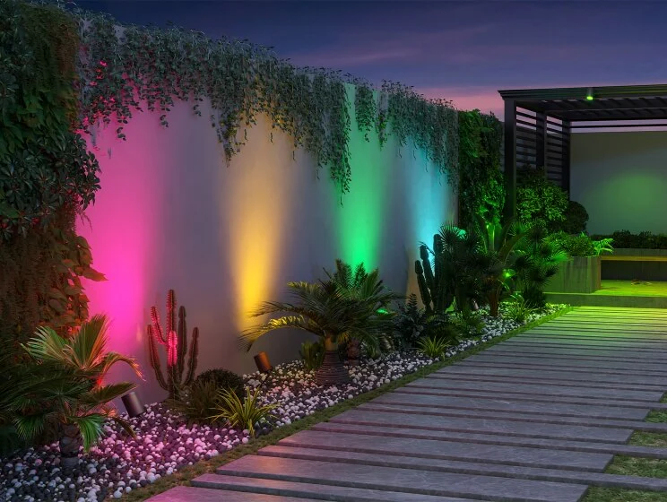
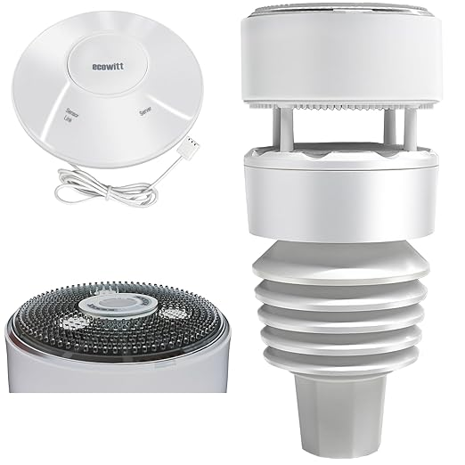



 | 

# Zigbee Outdoor - Best Buy Tips

 

For outdoor electronic hardware devices are also Zigbee smart devices available.

Find here a set of preselected devices which you can buy for in your garden or garden room.

---

## Table of Contents
<!-- TOC -->
* [Zigbee Outdoor - Best Buy Tips](#zigbee-outdoor---best-buy-tips)
  * [Table of Contents](#table-of-contents)
  * [Rain sensor](#rain-sensor)
    * [Rain + lux](#rain--lux)
  * [Soil sensor](#soil-sensor)
    * [NAS-STH02B2](#nas-sth02b2)
    * [TS0601](#ts0601)
  * [Weather stations](#weather-stations)
    * [Ecowitt 7-in-1](#ecowitt-7-in-1)
  * [Garden lights](#garden-lights)
    * [Spotlight](#spotlight)
    * [Floodlight](#floodlight)
  * [LED strip](#led-strip)
  * [Outdoor socket](#outdoor-socket)
<!-- TOC -->

---

> **_NOTE:_** Most of the links are affiliate links, you pay the same price AND support my blog a bit.

---
## Rain sensor

This outdoor sensor detects raindrops.\
It runs on two AAA batteries.
It's already triggered with a single drop.

{{imgBasket}}Zigbee raindrop sensor
<a href="https://s.click.aliexpress.com/e/_oCwblMa" target="_blank">(AliExpress)</a>
<a href="https://banggood.onelink.me/zMT7/8iw565j9#ad" target="_blank">(BangGood)</a>
(Amazon US - not available)
<a href="https://amzn.to/3JuOP1K#ad" target="_blank">(Amazon NL)</a>
<a href="https://www.zigbee2mqtt.io/devices/SNZB-05.html" target="_blank" title="SNZB-05">{{imgZ2M}}SNZB-05 (works fine, but model looks different)</a>

 

### Rain + lux

This outdoor sensor detects raindrops and measures the light intensity (lux).\
It contains a build-in battery that charges via a small solar panel.

{{imgBasket}}Zigbee raindrop + lux sensor 
<a href="https://s.click.aliexpress.com/e/_EIt99cD" target="_blank">(AliExpress)</a>
<a href="https://amzn.to/3HMbs11#ad" target="_blank">(Amazon US)</a>
<a href="https://www.zigbee2mqtt.io/devices/RB-SRAIN01.html" target="_blank" title="RB-SRAIN01">{{imgZ2M}}RB-SRAIN01</a>

  

---
## Soil sensor

### NAS-STH02B2

This sensor measures the soil temperature and humidity.\
It can be used for plants inside and outside.\
It contains a build-in battery that charges via a solar panel on top of it.

{{imgBasket}}Zigbee soil sensor 
<a href="https://s.click.aliexpress.com/e/_opMcYj3" target="_blank">(AliExpress)</a>
<a href="https://www.zigbee2mqtt.io/devices/NAS-STH02B2.html" target="_blank" title="NAS-STH02B2">{{imgZ2M}}NAS-STH02B2</a>

See [this page](/zigbee/zigbee_soil_sensor) for a detailed page about this sensor.

### TS0601

Do your plants have enough water?
You stick this sensor in the soil with the plant, and it detects if the soil is not too dry or the temperature too high.

Powered by two AAA batteries.

Make sure you select the Zigbee version:\
{{imgBasket}}Zigbee soil humidity sensor - Tuya
<a href="https://s.click.aliexpress.com/e/_onIII5b" target="_blank">(AliExpress)</a>
<a href="https://www.zigbee2mqtt.io/devices/TS0601_soil_3.html" target="_blank" title="TS0601_soil_3">{{imgZ2M}}TS0601_soil_3</a>

---
## Weather stations

Full-blown weather stations to detect outside temperature, humidity, rain, wind direction/speed etc.

### Ecowitt Wittboy 7-in-1

The most popular is the Ecowitt Wittboy. 
It isn't a Zigbee device but a WiFi weather station with a very good Home Assistant integration, all data is available as separated sensors in Home Assistant. 

{{imgBasket}} <a href="https://s.click.aliexpress.com/e/_omVcyoJ" target="_blank">Ecowitt GW2001 Wittboy Weather Station (AliExpress)</a> includes:
* GW2000 IoT Wi-Fi Gateway
* WS90 7-in-1 Outdoor Solar Powered Weather Sensor

https://youtu.be/1zMqGfrySnc

Model: WS90

---

## Garden lights

<!--
### Lawn light

A 9W / 24V DC light with 16 million colors.
The brightness and color temperature are adjustable, and it's (of course) water-resistant.

Also, possible to control them with a remote (2.4 GHz).

{{imgBasket}}Outdoor Zigbee garden light pole - MiBoxer 
<a href="https://s.click.aliexpress.com/e/_onKCyQ1" target="_blank">(AliExpress)</a>

model: LA5-09S-ZL

---
-->

### Spotlight

A 7W / 24V DC spotlight with 16 million colors.
The brightness and color temperature are adjustable, and it's water-resistant.

Support 2.4G RF remote control directly.

{{imgBasket}}Zigbee Spotlight - Gledopto 
<a href="https://s.click.aliexpress.com/e/_oDH1T7P" target="_blank">(AliExpress)</a>
<a href="https://www.zigbee2mqtt.io/devices/GL-G-003P.html" target="_blank" title="GL-G-003P">{{imgZ2M}}GL-G-003P</a>

You can chain multiple lights together to power them.

---

### Floodlight

A 10W / 12V DC LED floodlight with 16 million colors.
The brightness and color temperature are adjustable, and it's (of course) water-resistant.

Support 2.4G RF remote control directly.

{{imgBasket}}Zigbee Floodlight - Gledopto 
<a href="https://s.click.aliexpress.com/e/_okk5Oi1" target="_blank">(AliExpress)</a>
<a href="https://www.zigbee2mqtt.io/devices/GL-FL-001P.html" target="_blank" title="GL-FL-001P">{{imgZ2M}}GL-FL-001P</a>

 

---

## LED strip

This LED strip is available in different versions:
* Outdoor waterproof (IP65)
* 5 / 10 meter
* RGB White or RGB Warm White

 

{{imgBasket}}Zigbee RGB 5m LED strip 
<a href="https://s.click.aliexpress.com/e/_ookcWte" target="_blank">(AliExpress)</a>
<a href="https://www.zigbee2mqtt.io/devices/TS0503B.html" target="_blank" title="TS0503B">{{imgZ2M}}TS0503B</a>

---

## Outdoor socket

This outdoor LEDVANCE Zigbee power socket can handle 3680 W and has an IP44 rating and with power measurement.

{{imgBasket}}Zigbee outdoor power socket - LEDVANCE 
<a href="https://amzn.to/4gBFjop#ad" target="_blank">(Amazon NL)</a>
<a href="https://www.zigbee2mqtt.io/devices/4099854293276.html" target="_blank" title="4099854293276">{{imgZ2M}}4099854293276</a>

 
 
 

<!--

This outdoor Innr Zigbee power socket can handle 2300 W and has an IP44 rating (without power measurement).

{{imgBasket}}Zigbee outdoor power socket - Innr (Dual Pack) 
<a href="https://amzn.to/3Vt83Ip#ad" target="_blank">(Amazon NL)</a>
<a href="https://www.zigbee2mqtt.io/devices/OLS_210.html" target="_blank" title="OLS_210">{{imgZ2M}}OLS_210</a>
-->

<!--

This outdoor Silvercrest/Lidl Zigbee power socket can handle 3680 W and has an IP44 rating (without power measurement).

{{imgBasket}}<a href="" target="_blank">Zigbee outdoor power socket - Silvercreset (Amazon NL)</a>

<a href="https://www.zigbee2mqtt.io/devices/HG06619.html" target="_blank" title="HG06619">{{imgZ2M}}HG06619</a>
-->

 

 

This is a **dual socket** outdoor Zigbee device, where each socket can be controlled individual and has **power consumption measurements**.

{{imgBasket}}Zigbee dual port power socket with power measurement - Nous 
<a href="https://amzn.to/40SVJoc#ad" target="_blank">(Amazon NL)</a>
<a href="https://www.zigbee2mqtt.io/devices/A4Z.html" target="_blank" title="A4Z">{{imgZ2M}}A4Z</a>

 

---

See also my [Indoor sensors - Best Buy Tips](smart_home_best_buy_tips)