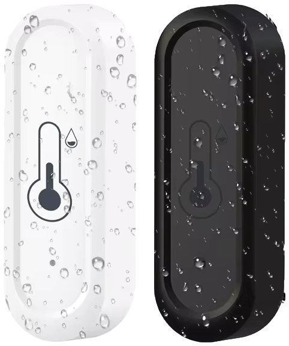



 | 

# Waterproof temperature sensor

[<< Best Buy Tips overview](smart_home_best_buy_tips#outdoor-sensors)

A waterproof Zigbee temperature and humidity sensor measures the outdoor climate.\
Useful to track the outside temperature, to protect plants against frost,
or to control an outdoor heater or a pump.

<strong>Zigbee waterproof temperature and humidity sensor</strong>

<a href="https://s.click.aliexpress.com/e/_c3nLEH8P" target="_blank">AliExpress</a>

## Related articles

<a class="hp-card hp-tile" href="/ideas/home_automation_ideas">

Ideas<strong>Home Automation Ideas</strong>
Home automation ideas to make your home smart

</a>

## More buy tips

<a class="hp-card hp-mini hp-mini-index hp-mini-wide" href="smart_home_best_buy_tips#outdoor-sensors"><strong>&larr; Best Buy Tips</strong>To the Best Buy Tips overview page</a>

<a class="hp-card hp-mini" href="zigbee_outdoor_soil_sensor"><strong>Soil sensor</strong>Know if your garden plants have enough water.</a>
<a class="hp-card hp-mini" href="zigbee_temperature_sensor"><strong>Temperature sensor</strong>Temperature and humidity for every room.</a>
<a class="hp-card hp-mini" href="zigbee_outdoor_contact_sensor"><strong>Waterproof contact sensor</strong>Detect a gate, shed door or mailbox, also in the rain.</a>
<a class="hp-card hp-mini" href="zigbee_radiator_thermostat"><strong>Radiator thermostat</strong>Heat only the rooms and moments that need it.</a>
<a class="hp-card hp-mini" href="zigbee_infrared_remote"><strong>Infrared remote control</strong>Control infrared devices, like an AC or TV, from automations.</a>
<a class="hp-card hp-mini" href="zigbee_rain_sensor"><strong>Rain sensor</strong>Detect raindrops, already triggered by a single drop.</a>

