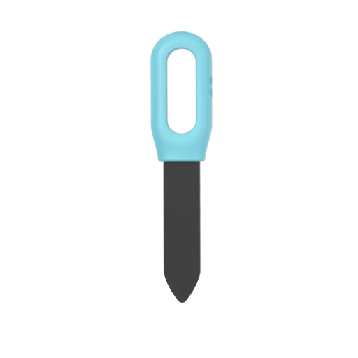



 | 

# Plant soil sensor

[<< Best Buy Tips overview](smart_home_best_buy_tips#3-sensors-and-actuators)

Do your plants have enough water?
You place this sensor in the soil near the plant, and it detects whether the soil is too dry or the temperature is too high.

Powered by two AAA batteries.

Make sure you select the Zigbee version:

<strong>Zigbee soil humidity sensor - Tuya</strong>

<a href="https://s.click.aliexpress.com/e/_c3cc9P3h" target="_blank">AliExpress</a>

<a href="https://www.zigbee2mqtt.io/devices/TS0601_soil_3.html" target="_blank">TS0601_soil_3</a>

<strong>Alternative: Zigbee soil humidity sensor - Tuya</strong>

<a href="https://s.click.aliexpress.com/e/_c3tIjR3z" target="_blank">AliExpress</a>

## Related articles

<a class="hp-card hp-tile" href="/zigbee/zigbee_soil_sensor">

Zigbee<strong>Zigbee soil sensor</strong>
A Zigbee soil sensor which measure humidity and temperature

</a>

## More buy tips

<a class="hp-card hp-mini hp-mini-index hp-mini-wide" href="smart_home_best_buy_tips#3-sensors-and-actuators"><strong>&larr; Best Buy Tips</strong>Overview of all layers and hardware</a>

<a class="hp-card hp-mini" href="zigbee_temperature_sensor"><strong>Temperature sensor</strong>Temperature and humidity for every room.</a>
<a class="hp-card hp-mini" href="zigbee_air_quality_sensor"><strong>Air quality sensor</strong>Measure CO2, VOC and other air quality values.</a>
<a class="hp-card hp-mini" href="zigbee_leak_sensor"><strong>Leak sensor</strong>Get warned about water leaks early.</a>
<a class="hp-card hp-mini" href="zigbee_vibration_sensor"><strong>Vibration sensor</strong>Detect vibrations, shocks and knocks.</a>
<a class="hp-card hp-mini" href="zigbee_lights"><strong>Lights</strong>Bulbs, GU10 spots and LED strips.</a>
<a class="hp-card hp-mini" href="zigbee_smoke_detector"><strong>Smoke detector</strong>Get alerted at the first sign of smoke.</a>

