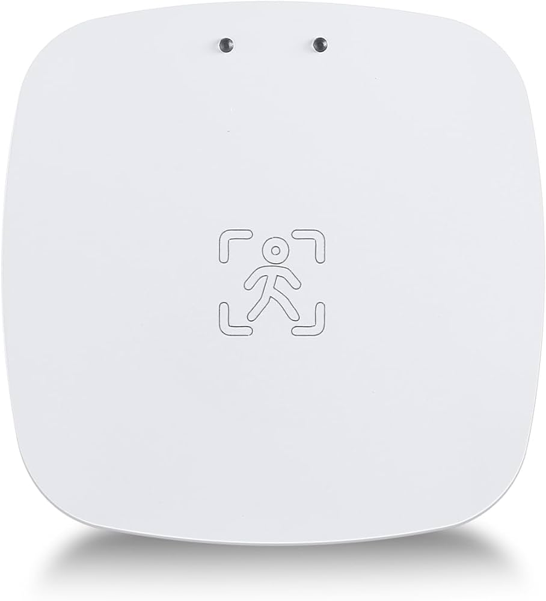



 | 

# Presence detection sensor

[<< Best Buy Tips overview](smart_home_best_buy_tips#3-sensors-and-actuators)

A presence sensor does not need a direct line of sight.
It uses radar to detect people (and pets).
You can even hide it in a closet, and it will still detect presence.
It can even detect a person who isn't moving, for example, someone sitting on a couch or chair.\
Ideal for the living room, bedrooms and home office.

Best option<strong>Zigbee or Thread (Matter) - Aqara FP300</strong>

The Aqara FP300 is a new battery-powered sensor with PIR and mmWave radar. It can detect people up to 6 meters away and also measures light, temperature, and humidity. It can be configured with multiple zones where you can detect people.

<a href="https://amzn.to/48qWsyY#ad" target="_blank">Amazon NL</a>

<a href="https://www.zigbee2mqtt.io/devices/PS-S04D.html" target="_blank">FP300</a>

Cheaper option<strong>Zigbee / WiFi human Presence detection sensor</strong>

<a href="https://s.click.aliexpress.com/e/_oEbnm2m" target="_blank">AliExpress</a> | <a href="https://amzn.to/4dlxvIY#ad" target="_blank">Amazon US</a> | <a href="https://amzn.to/3Zi5pay#ad" target="_blank">Amazon NL</a>

<a href="https://www.zigbee2mqtt.io/devices/ZY-M100-24G.html" target="_blank">ZY-M100-24G</a>

## Related articles

<a class="hp-card hp-tile" href="/ideas/home_automation_ideas">

Ideas<strong>Home Automation Ideas</strong>
Home automation ideas to make your home smart

</a>

## More buy tips

<a class="hp-card hp-mini hp-mini-index hp-mini-wide" href="smart_home_best_buy_tips#3-sensors-and-actuators"><strong>&larr; Best Buy Tips</strong>To the Best Buy Tips overview page</a>

<a class="hp-card hp-mini" href="zigbee_motion_sensor"><strong>Motion sensor</strong>Trigger lights and alerts when someone moves.</a>
<a class="hp-card hp-mini" href="zigbee_pressure_sensor"><strong>Pressure sensor</strong>Detect weight on a chair, bed or mat.</a>
<a class="hp-card hp-mini" href="zigbee_contact_sensor"><strong>Contact sensor</strong>Detect open and closed doors, windows and drawers.</a>
<a class="hp-card hp-mini" href="zigbee_temperature_sensor"><strong>Temperature sensor</strong>Temperature and humidity for every room.</a>
<a class="hp-card hp-mini" href="zigbee_air_quality_sensor"><strong>Air quality sensor</strong>Measure CO2, VOC and other air quality values.</a>
<a class="hp-card hp-mini" href="smart_home_battery_powered_pir"><strong>Battery powered with PIR</strong>Not connected, but still smart with a built-in PIR sensor.</a>

