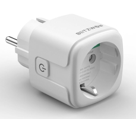



 | 

# Smart socket

[<< Best Buy Tips overview](smart_home_best_buy_tips#3-sensors-and-actuators)

Smart sockets are useful for making traditional "dumb" devices smart, like a standing lamp with a plug.

Sockets are always connected to power, which makes this socket also a hub in the Zigbee network and extends the range and coverage of your network.
You can also place a smart socket in a strategic spot with poor coverage to improve this.

A smart plug with power consumption metrics can be useful to detect a machine's state from its power draw.
This can be used for washing machines, dryers, dishwashers, ovens, etc.

I use the European Zigbee BlitzWolf EU SHP-13 and SHP-15, which also measure power consumption.
It has a physical button to switch the state, and can handle 3680 W and 16 A, which is enough for washing machines and dryers.
It took me a while to find the right smart socket for this purpose, but the ones I use have run for years without any issues.

<strong>Zigbee smart power socket with power measurement - BlitzWolf EU SHP-15</strong>

<a href="https://www.banggood.com/custlink/33vjDy5OWw" target="_blank">BangGood</a>

<a href="https://www.zigbee2mqtt.io/devices/TS011F_plug_3.html" target="_blank">TS011F_plug_3</a>

<strong>Zigbee smart power socket with power measurement - BlitzWolf EU SHP-13</strong>

<a href="https://www.banggood.com/BlitzWolf-BW-SHP13-ZigBee3_0-Smart-Socket-16A-EU-Plug-Electricity-Metering-APP-Remote-Controller-Timer-Work-with-Amazon-Alexa-Google-Home-p-2000907.html?warehouse=CN&ID=0&p=IF081412102025201707&custlinkid=3954741" target="_blank">Amazon</a>

<a href="https://www.zigbee2mqtt.io/devices/TS0121_plug.html" target="_blank">TS0121</a>

## Related articles

<a class="hp-card hp-tile" href="/ideas/home_automation_ideas">

Ideas<strong>Home Automation Ideas</strong>
Home automation ideas to make your home smart

</a>
<a class="hp-card hp-tile" href="/projects/automate_christmas_decorations">

Project<strong>Automate Christmas decorations</strong>
How I automated all my Christmas lights and other powered decorations.

</a>
<a class="hp-card hp-tile" href="/projects/retrofit_kitchen_appliances">

Project<strong>Retrofit kitchen appliances to make them smarter</strong>
Retrofit kitchen appliances to make them smarter by adding out-of-the-box sensors to it.

</a>
<a class="hp-card hp-tile" href="/esphome/orcon_mechanic_ventilation">

ESPHome<strong>Control an Orcon mechanic ventilation system from Home Assistant</strong>
Control an Orcon mechanic ventilation system from Home Assistant

</a>
<a class="hp-card hp-tile" href="/projects/stretch_display">

Project<strong>Stretch display</strong>
A stretched display to show Home Assistant dashboard on

</a>
<a class="hp-card hp-tile" href="/homeassistant/homeassistant_dashboard_wake-up-alarm-light">

Home Assistant<strong>Home Assistant dashboard: Wake-up alarm light</strong>
Here you find an explanation of a Home Assistant dashboard with an alarm timer on it which can be changed via the dashboard itself. This way...

</a>

## More buy tips

<a class="hp-card hp-mini hp-mini-index hp-mini-wide" href="smart_home_best_buy_tips#3-sensors-and-actuators"><strong>&larr; Best Buy Tips</strong>To the Best Buy Tips overview page</a>

<a class="hp-card hp-mini" href="zigbee_power_strip"><strong>Power strip</strong>Several smart sockets in one strip.</a>
<a class="hp-card hp-mini" href="zigbee_usb_adapter_switch"><strong>USB adapter switch</strong>Switch USB powered devices on and off.</a>
<a class="hp-card hp-mini" href="zigbee_infrared_remote"><strong>Infrared remote control</strong>Control infrared devices, like an AC or TV, from automations.</a>
<a class="hp-card hp-mini" href="zigbee_buttons"><strong>Buttons</strong>Wall switches, dimmers and portable buttons.</a>
<a class="hp-card hp-mini" href="zigbee_lights"><strong>Lights</strong>Bulbs, GU10 spots and LED strips.</a>
<a class="hp-card hp-mini" href="zigbee_plant_soil_sensor"><strong>Plant soil sensor</strong>Know when your plants need water.</a>

