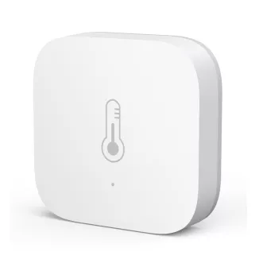



 | 

# Temperature sensor

[<< Best Buy Tips overview](smart_home_best_buy_tips#3-sensors-and-actuators)

A temperature sensor is a simple sensor that measures both temperature and humidity in a room.
This sensor is useful for automations, like taking action if someone is in the shower,
or in summer when it becomes cooler outside than inside.

Best option<strong>Zigbee temperature and humidity sensor - Aqara</strong>

<a href="https://s.click.aliexpress.com/e/_c3qxoNPD" target="_blank">AliExpress</a> | <a href="https://amzn.to/4ekFk2A#ad" target="_blank">Amazon US</a> | <a href="https://amzn.to/3V2h0YX#ad" target="_blank">Amazon NL</a> | <a href="https://www.banggood.com/Aqara-Temperature-Sensor-Smart-Zigbe-Air-Pressure-Humidity-Environment-Sensor-Remote-Control-for-XiaoMi-Home-Homekit-p-2004763.html?warehouse=CN&ID=0&p=IF081412102025201707&custlinkid=3958785" target="_blank">BangGood</a>

<a href="https://www.zigbee2mqtt.io/devices/WSDCGQ11LM.html" target="_blank">WSDCGQ11LM</a>

Cheaper option<strong>Zigbee temperature and humidity sensor - Tuya / Thirdreality</strong>

<a href="https://s.click.aliexpress.com/e/_c3i0b829" target="_blank">AliExpress</a> | <a href="https://amzn.to/427r9Xp#ad" target="_blank">Amazon US</a> | <a href="https://amzn.to/4cuvcBp#ad" target="_blank">Amazon NL</a>

<a href="https://www.zigbee2mqtt.io/devices/RSH-HS06.html" target="_blank">RSH-HS06</a>

2xAAA battery option<strong>Zigbee / WiFi temperature and humidity sensor 2xAAA powered - Tuya</strong>

Battery powered, bigger, cheaper. This sensor can be converted into an <a href="/zigbee/zigbee_outlet_sensor">outlet sensor</a>.

<a href="https://s.click.aliexpress.com/e/_c3ocEEeT" target="_blank">AliExpress</a> | <a href="https://amzn.to/4t87Isj#ad" target="_blank">Amazon US</a> | <a href="https://amzn.to/4lfjVI5#ad" target="_blank">Amazon NL</a> | <a href="https://s.click.aliexpress.com/e/_c3ocEEeT" target="_blank">AliExpress</a>

<a href="https://www.zigbee2mqtt.io/devices/WSD500A.html" target="_blank">WSD500A</a>

With display option<strong>Zigbee / WiFi temperature and humidity sensor 2xAAA powered with display.</strong>

The width is 7 cm and the height is 2,6 cm. Model: ZY-TH01Pro

<a href="https://s.click.aliexpress.com/e/_oBX1DMr" target="_blank">AliExpress</a>

With e-ink display option<strong>Zigbee temperature and humidity sensor with a bright e-ink display.</strong>

<a href="https://s.click.aliexpress.com/e/_c43N021R" target="_blank">AliExpress</a>

<a href="https://www.zigbee2mqtt.io/devices/SNZB-02UL.html" target="_blank">SNZB-02UL</a>

<!--<a href="https://www.zigbee2mqtt.io/devices/ZY-TH01Pro.html" target="_blank" title="ZY-TH01Pro">{{imgZ2M}}ZY-TH01Pro</a>-->

## Water-resistant option

<strong>Zigbee water-resistant (IP65) aquarium/pool/bath water temperature sensor with a probe and display.</strong>

Battery: CR2477.

<a href="https://s.click.aliexpress.com/e/_c3mRgyKj" target="_blank">AliExpress</a> | <a href="https://amzn.to/4utmSd1#ad" target="_blank">Amazon US</a> | <a href="https://amzn.to/44Unhd2#ad" target="_blank">Amazon NL</a>

<a href="https://www.zigbee2mqtt.io/devices/SNZB-02LD.html" target="_blank">SNZB-02LD</a>

## Waterproof outdoor option

<strong>Zigbee waterproof temperature and humidity sensor for outdoor use.</strong>

Useful to measure the garden climate, to protect plants/pumps against frost, or to control an outdoor heater/pool.

<a href="https://s.click.aliexpress.com/e/_c3nLEH8P" target="_blank">AliExpress</a>

## Related articles

<a class="hp-card hp-tile" href="/zigbee/zigbee_outlet_sensor">

Zigbee<strong>DIY Zigbee outlet sensor</strong>
Convert a battery to a non-battery powered Zigbee sensor.

</a>
<a class="hp-card hp-tile" href="/ideas/home_automation_ideas">

Ideas<strong>Home Automation Ideas</strong>
Home automation ideas to make your home smart

</a>
<a class="hp-card hp-tile" href="/projects/retrofit_kitchen_appliances">

Project<strong>Retrofit kitchen appliances to make them smarter</strong>
Retrofit kitchen appliances to make them smarter by adding out-of-the-box sensors to it.

</a>
<a class="hp-card hp-tile" href="/esphome/orcon_mechanic_ventilation">

ESPHome<strong>Control an Orcon mechanic ventilation system from Home Assistant</strong>
Control an Orcon mechanic ventilation system from Home Assistant

</a>
<a class="hp-card hp-tile" href="/projects/stretch_display">

Project<strong>Stretch display</strong>
A stretched display to show Home Assistant dashboard on

</a>
<a class="hp-card hp-tile" href="/zigbee/zigbee_chair_occupancy_sensor">

Zigbee<strong>DIY Zigbee chair occupancy sensor</strong>
DIY chair occupancy sensor Based on a leak or contact sensor and a car seat pressure sensor

</a>

## More buy tips

<a class="hp-card hp-mini hp-mini-index hp-mini-wide" href="smart_home_best_buy_tips#3-sensors-and-actuators"><strong>&larr; Best Buy Tips</strong>To the Best Buy Tips overview page</a>

<a class="hp-card hp-mini" href="zigbee_air_quality_sensor"><strong>Air quality sensor</strong>Measure CO2, VOC and other air quality values.</a>
<a class="hp-card hp-mini" href="zigbee_radiator_thermostat"><strong>Radiator thermostat</strong>Heat only the rooms and moments that need it.</a>
<a class="hp-card hp-mini" href="zigbee_light_sensor"><strong>Light intensity sensor</strong>Measure daylight to switch lights at the right moment.</a>
<a class="hp-card hp-mini" href="zigbee_pressure_sensor"><strong>Pressure sensor</strong>Detect weight on a chair, bed or mat.</a>
<a class="hp-card hp-mini" href="zigbee_presence_sensor"><strong>Presence detection sensor</strong>Detect people, even when they sit still.</a>
<a class="hp-card hp-mini" href="zigbee_motion_sensor"><strong>Motion sensor</strong>Trigger lights and alerts when someone moves.</a>

