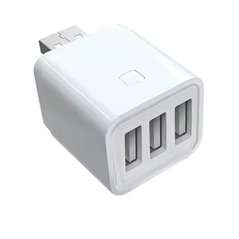



 | 

# USB adapter switch

[<< Best Buy Tips overview](smart_home_best_buy_tips#3-sensors-and-actuators)

This actuator can toggle the power state of each USB port individually.\
The first port can also be used to switch USB data access on and off, while the other two only provide USB power.

<strong>Zigbee / WiFi USB adapter switch - Tuya</strong>

<a href="https://s.click.aliexpress.com/e/_c38UUilJ" target="_blank">AliExpress</a> | <a href="https://amzn.to/4lL8Ijp#ad" target="_blank">Amazon NL</a>

<a href="https://www.zigbee2mqtt.io/devices/TS0003.html" target="_blank">TS0003</a>

<strong>Zigbee / WiFi USB adapter switch - Sonoff</strong>

<a href="https://amzn.to/4n7AxnA#ad" target="_blank">Amazon US</a> | <a href="https://amzn.to/4fcxpmu#ad" target="_blank">Amazon NL</a>

## Related articles

<a class="hp-card hp-tile" href="/projects/automate_christmas_decorations">

Project<strong>Automate Christmas decorations</strong>
How I automated all my Christmas lights and other powered decorations.

</a>
<a class="hp-card hp-tile" href="/zigbee/usb_adapter_switch">

Zigbee<strong>Zigbee USB adapter switch</strong>
A Zigbee USB adapter switch to have control of USB devices

</a>
<a class="hp-card hp-tile" href="/ideas/home_automation_ideas">

Ideas<strong>Home Automation Ideas</strong>
Home automation ideas to make your home smart

</a>

## More buy tips

<a class="hp-card hp-mini hp-mini-index hp-mini-wide" href="smart_home_best_buy_tips#3-sensors-and-actuators"><strong>&larr; Best Buy Tips</strong>To the Best Buy Tips overview page</a>

<a class="hp-card hp-mini" href="zigbee_smart_socket"><strong>Smart socket</strong>Switch any plugged-in device and measure its power.</a>
<a class="hp-card hp-mini" href="zigbee_power_strip"><strong>Power strip</strong>Several smart sockets in one strip.</a>
<a class="hp-card hp-mini" href="smart_home_power"><strong>Power adapters</strong>5V USB power adapters for your devices.</a>
<a class="hp-card hp-mini" href="zigbee_infrared_remote"><strong>Infrared remote control</strong>Control infrared devices, like an AC or TV, from automations.</a>
<a class="hp-card hp-mini" href="zigbee_radiator_thermostat"><strong>Radiator thermostat</strong>Heat only the rooms and moments that need it.</a>
<a class="hp-card hp-mini" href="zigbee_buttons"><strong>Buttons</strong>Wall switches, dimmers and portable buttons.</a>

