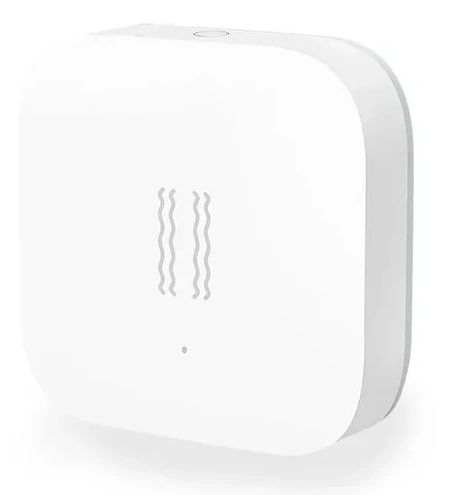



 | 

# Vibration sensor

[<< Best Buy Tips overview](smart_home_best_buy_tips#3-sensors-and-actuators)

This sensor can measure vibrations and rotations in the X, Y, and Z directions.

<strong>Zigbee vibration sensor - Aqara</strong>

<a href="https://s.click.aliexpress.com/e/_c3JdAlpD" target="_blank">AliExpress</a> | <a href="https://amzn.to/45nmTEz#ad" target="_blank">Amazon US</a> | <a href="https://amzn.to/3OiAAvY#ad" target="_blank">Amazon NL</a>

<a href="https://www.zigbee2mqtt.io/devices/DJT11LM.html" target="_blank">DJT11LM</a>

## Related articles

<a class="hp-card hp-tile" href="/ideas/home_automation_ideas">

Ideas<strong>Home Automation Ideas</strong>
Home automation ideas to make your home smart

</a>
<a class="hp-card hp-tile" href="/projects/retrofit_kitchen_appliances">

Project<strong>Retrofit kitchen appliances to make them smarter</strong>
Retrofit kitchen appliances to make them smarter by adding out-of-the-box sensors to it.

</a>
<a class="hp-card hp-tile" href="/projects/smart_mailbox">

Project<strong>Smart traditional mailbox</strong>
Make your traditional mailbox smart

</a>

## More buy tips

<a class="hp-card hp-mini hp-mini-index hp-mini-wide" href="smart_home_best_buy_tips#3-sensors-and-actuators"><strong>&larr; Best Buy Tips</strong>Overview of all layers and hardware</a>

<a class="hp-card hp-mini" href="zigbee_contact_sensor"><strong>Contact sensor</strong>Detect open and closed doors, windows and drawers.</a>
<a class="hp-card hp-mini" href="zigbee_smart_socket"><strong>Smart socket</strong>Switch any plugged-in device and measure its power.</a>
<a class="hp-card hp-mini" href="zigbee_leak_sensor"><strong>Leak sensor</strong>Get warned about water leaks early.</a>
<a class="hp-card hp-mini" href="zigbee_smoke_detector"><strong>Smoke detector</strong>Get alerted at the first sign of smoke.</a>
<a class="hp-card hp-mini" href="zigbee_plant_soil_sensor"><strong>Plant soil sensor</strong>Know when your plants need water.</a>
<a class="hp-card hp-mini" href="zigbee_lights"><strong>Lights</strong>Bulbs, GU10 spots and LED strips.</a>

