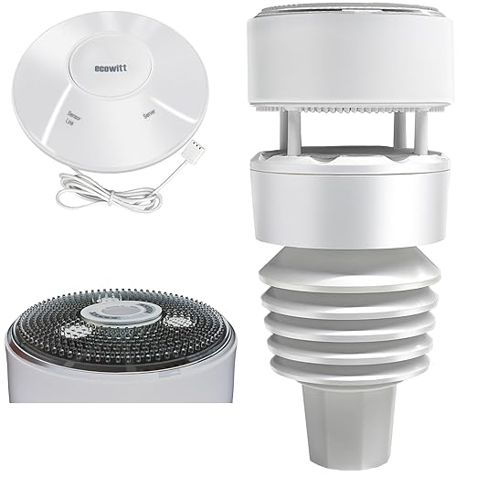



 | 

# Weather stations

[<< Best Buy Tips overview](smart_home_best_buy_tips#outdoor-sensors)

Full-blown weather stations to detect outside temperature, humidity, rain, wind direction/speed etc.

## Ecowitt Wittboy 7-in-1

The most popular is the Ecowitt Wittboy.\
It measures temperature, humidity, wind speed, light, UV levels, rain and much more!\
It isn't a Zigbee device (these devices don't exist with Zigbee) but a WiFi weather station with a very good Home Assistant integration, all data is available as separated sensors in Home Assistant. 

<strong>Ecowitt GW2001 Wittboy Weather Station</strong>

Includes a GW2000 IoT Wi-Fi Gateway and the WS90 7-in-1 Outdoor Solar Powered Weather Sensor.

<a href="https://s.click.aliexpress.com/e/_c4osbuDp" target="_blank">AliExpress</a>

Alternative<strong>Ecowitt HP2564 Wittboy Weather Station</strong>

Includes the HP2560, a 7" display with all weather data presented, which works as gateway to Home Assistant, and the WS90 7-in-1 Outdoor Solar Powered Weather Sensor.

<a href="https://s.click.aliexpress.com/e/_oBO5vtN" target="_blank">AliExpress</a>

Video with the Ecowitt Wittboy functionalities:

Video with the Ecowitt Wittboy review:

## Related articles

<a class="hp-card hp-tile" href="/homeassistant/homeassistant_dashboard_tablet_in_kiosk_mode">

Home Assistant<strong>Home Assistant dashboard: on a tablet in Kiosk mode</strong>
Guide on how to show your Home Assistant dashboard on a tablet in kiosk mode with Fully Kiosk Browser

</a>

## More buy tips

<a class="hp-card hp-mini hp-mini-index hp-mini-wide" href="smart_home_best_buy_tips#outdoor-sensors"><strong>&larr; Best Buy Tips</strong>Overview of all layers and hardware</a>

<a class="hp-card hp-mini" href="zigbee_outdoor_temperature_sensor"><strong>Waterproof temperature sensor</strong>Measure the outdoor temperature and humidity.</a>
<a class="hp-card hp-mini" href="zigbee_outdoor_lights"><strong>Outdoor lights</strong>Spotlights, floodlights and LED strips for your garden.</a>
<a class="hp-card hp-mini" href="zigbee_outdoor_soil_sensor"><strong>Soil sensor</strong>Know if your garden plants have enough water.</a>
<a class="hp-card hp-mini" href="zigbee_outdoor_socket"><strong>Outdoor socket</strong>Water-resistant smart sockets with power measurement.</a>
<a class="hp-card hp-mini" href="zigbee_water_flow_controller"><strong>Water flow controller</strong>Create a drip irrigation system.</a>

