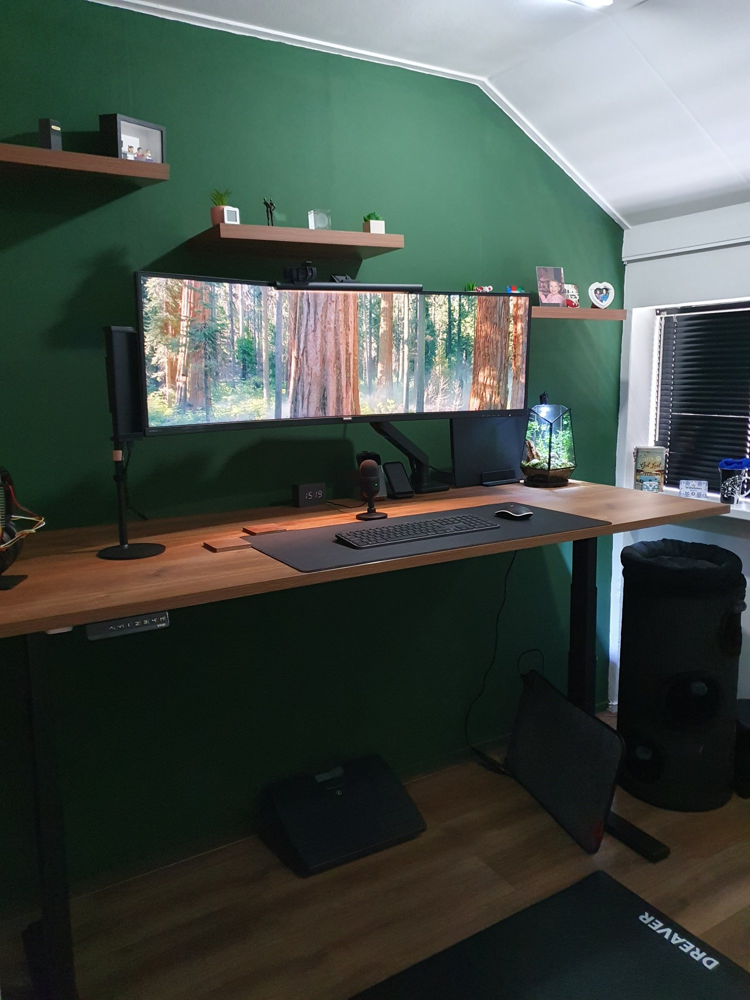
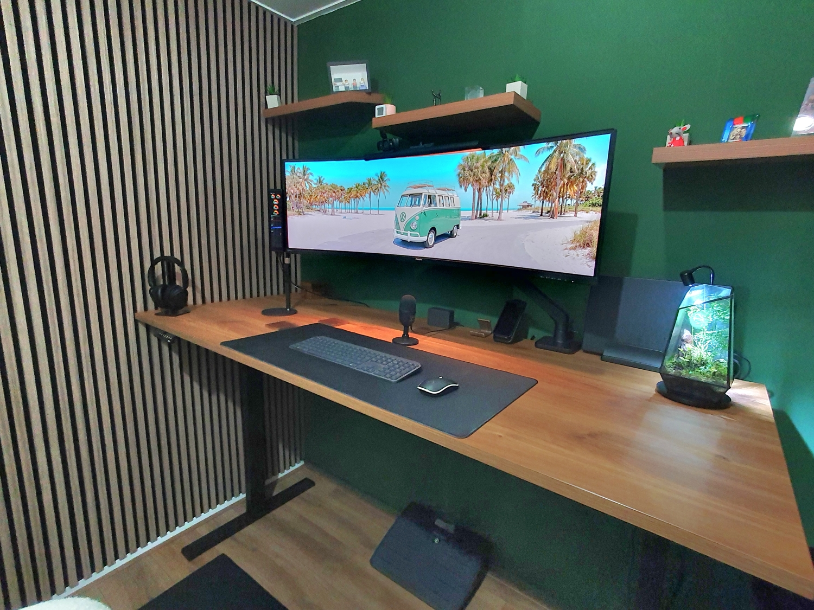
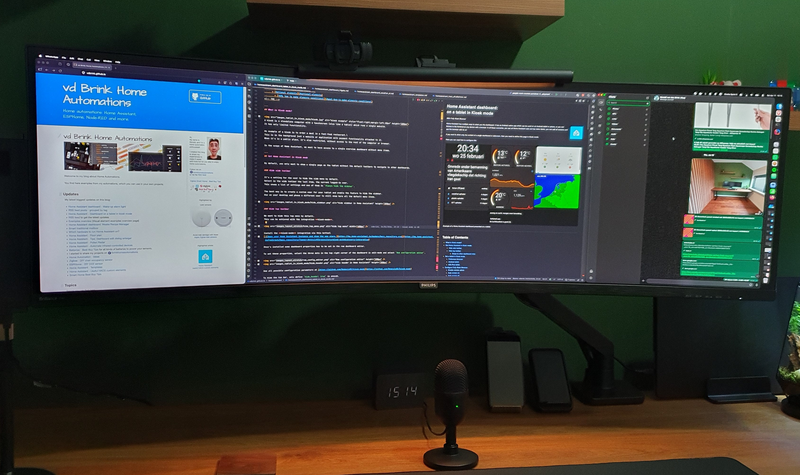
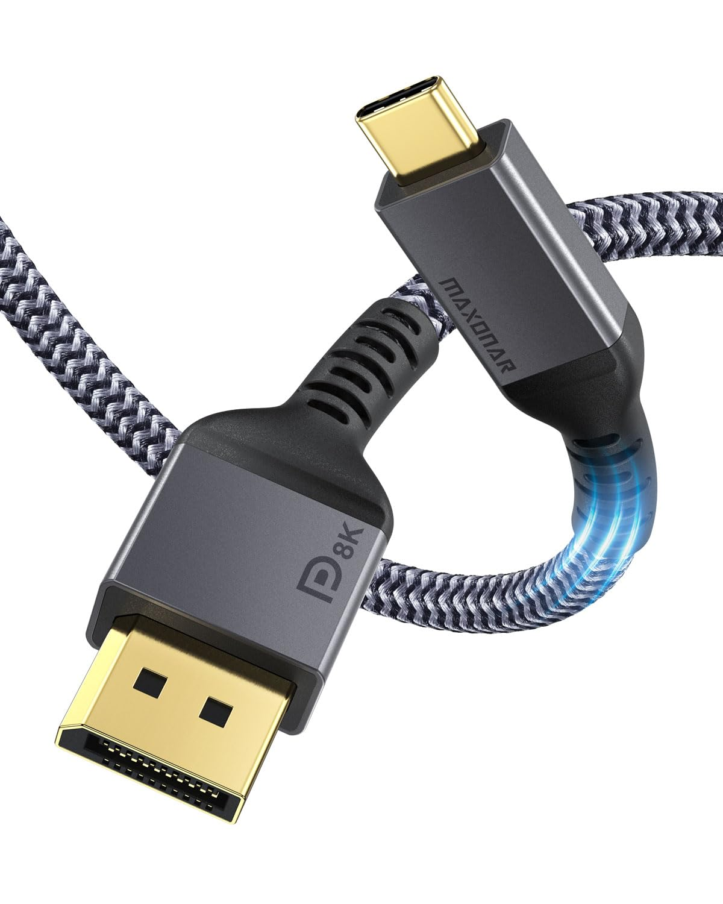
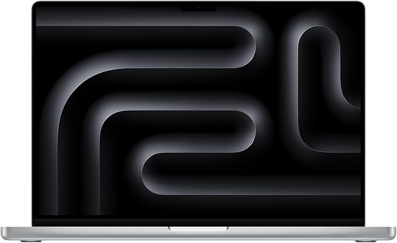
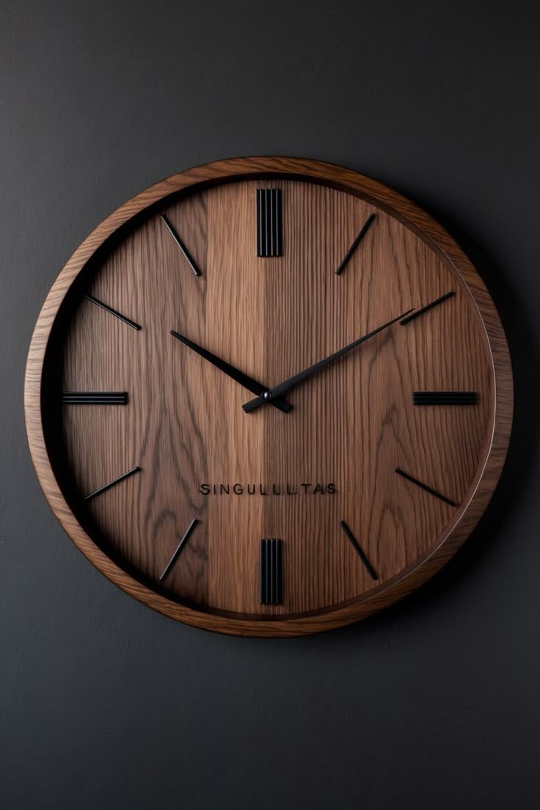
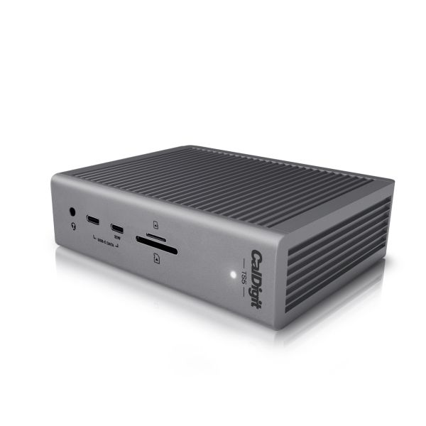
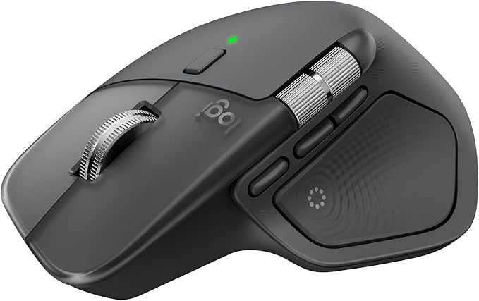



# Home office: Desk setup hardware

 

[Overview](index) |
[Mood board](office_mood_board) |
[Virtual design with AI](office_virtual_design_with_ai) |
[Room decoration](office_room_decoration) |
Desk setup hardware |
[Accessories](office_accessories)

 

On this page, you can find the main hardware products I use daily in my home office.
These are the items that genuinely make my work life easier and more enjoyable.

<em style="display:block; text-align:center">Final desk setup in standing mode</em>

---

## Table of Contents
<!-- TOC -->
  * [Amazon shop list](#amazon-shop-list)
  * [Desk](#desk)
  * [Monitor](#monitor)
  * [Laptop](#laptop)
  * [Keyboard](#keyboard)
  * [Chair](#chair)
  * [Mouse](#mouse)
  * [Accessories](#accessories)
  * [Future improvements](#future-improvements)
<!-- TOC -->

> **_NOTE:_** Links on this page can be affiliate links. You pay the same price and support my blog.

---
## Amazon shop list

Products from this page that are available on Amazon are listed on
[(Amazon US)](https://amzn.to/4ukI1pQ#ad) and [Amazon NL](https://amzn.to/3OYGFBK#ad).
Not everything on this page is available through Amazon.
Some items, like the desk, monitor, and chair, are excluded because they have been replaced by newer models or were purchased somewhere else.
Where a newer version exists, I link to that instead.

---
## Desk

I wanted to switch to a large standing desk to avoid sitting all day.
This replaces my old desk which was a fixed setup built from wood panels.

I ended up buying the YOUP02 from the Dutch shop [www.goedkoopinrichten.nl](https://www.goedkoopinrichten.nl/product/115/elektrisch-zit-sta-bureau-youp02-zwart-cognac-walnoten?modelId=572).\
I chose the 200×80 cm (78.4×31.5") walnut surface, which is a single solid piece.
It's rectangle size without any holes or rounded corners.
It has dual motors and four programmable height presets.

You can combine on this site different tops with different "feets".
They have tops available in different sizes from 120×80 cm up to 200×100 cm and different colors, black, white, oak.

<em style="display:block; text-align:center">standing desk: one piece walnut top, size 200×80 cm, programmable heights</em>

Do you want this wallpaper? 
Click on the images to open the full size version (NOT right-click and download).
A widescreen 32:9 and 5:4 version. Created with Ai.\

My wish list for my new desk was clear:
* Walnut top
* 180-200 cm (71-78.4") wide
* 80 cm (31.5") deep
* Electric standing/sit desk
* At least two programmable height presets
* Black legs
* Minimal visible wires

 
Finding the right desk took a while because there are many companies selling standing desks.

After filtering the options, I had to choose between these:
* The {{imgBasket}}[Flexispot E7 Pro](https://www.flexispot.nl/elektrisch-zit-sta-bureau-e7-pro.html) has good reviews, but it did not offer a full 200 cm wide top.
* The {{imgBasket}}[Desktronic Desk Sit-Stand](https://amzn.to/4vywnrU#ad) had very good reviews, but the walnut color was a bit too light. It also has rounded corners and a cable hole, which I did not really want.
* The {{imgBasket}}[YOUP02-Z-CW-128 Electric desk black Cognac Walnut](https://www.goedkoopinrichten.nl/product/115/elektrisch-zit-sta-bureau-youp02-zwart-cognac-walnoten?modelId=572) matched all my criteria, but it does not have many reviews.

<em style="display:block; text-align:center">YOUP02 Cognac Walnut</em>

For more discussion and desk comparisons, check out [Reddit - StandingDesk](https://www.reddit.com/r/StandingDesk/).

---
## Monitor

The monitor is a Philips 49" curved screen with a 5120 x 1440 resolution.
It has an aspect ratio of 32:9 and a curvature of 1800R.
It's the size of two 27" screens next to each other.

This is by far one of the best purchases I've ever made already a few years back, and I still love using it every minute.
The big advantage over two separate 27" screens is the flexibility to split your windows however you want.
You can use three equal windows, or one large window in the center with smaller ones on the sides.
You get all of this on one large display, without bezels breaking up the view.

<em style="display:block; text-align:center">Philips 49" screen</em>

The model I have is the Philips P Line [498P9Z/00](https://www.usa.philips.com/c-p/498P9Z_27/brilliance-329-superwide-curved-lcd-display) (model from 2021).
Newer versions are now available with improved specs while keeping the same dimensions and advantages.

Same monitor but newer models:

* {{imgBasket}}Philips 49" curved monitor - 49B2U5900C [(Amazon NL)](https://amzn.to/4afMEdn#ad)
* {{imgBasket}}Philips 49" curved monitor - Evnia 49M2C8900L [(Amazon US)](https://amzn.to/4v3Z53D#ad)

---
### Monitor cable

The Philips monitor has one DisplayPort 1.4 port and three HDMI 2.0 ports.
The MacBook M4 Pro has Thunderbolt 4 ports (USB-C) with DisplayPort 2.1.
To drive the full 5120×1440 resolution at 165 Hz, I use a DisplayPort cable for the best possible signal quality.

* {{imgBasket}}USB-C/Thunderbolt 3 to DisplayPort 1.4 Cable 8K [(Amazon US)](https://amzn.to/4dUhV7i#ad) [(Amazon NL)](https://amzn.to/3MSMgsm#ad)
* {{imgBasket}}Similar cable from Ugreen [(AliExpress)](https://s.click.aliexpress.com/e/_c3P8oBaL) [(Amazon US)](https://amzn.to/4tUWeJq#ad)

---
### Monitor arm

To keep a clean desk, I was looking for a monitor arm that:
* holds the screen **steadily** and attaches to the desk.
* doesn't have a pole in the middle of the desk, so the monitor keeps a **floating** effect.
* enough strength to hold the **weight** of the 12 kg 49" screen.
* good **cable** management and no bulky parts sticking out at the back. Otherwise, I would have to move the desk away from the wall and lose space.
* easy **pull and push** adjustment without unscrewing bolts.

 

I ended up with the [ACT AC8340](https://www.act-connectivity.com/en-us/products/av-mounts/single-monitor-arm-office-premium-gas-spring-ac8340).
It is built from solid metal, holds up to 20 kg, meets all my requirements, and is reasonably priced.

* {{imgBasket}}Monitor arm - ACT AC8340 (Amazon US N/A)  [(Amazon NL)](https://amzn.to/4qFwvD8#ad) [(Tweakers NL - Dutch price compare site)](https://tweakers.net/pricewatch/2160666/act-ac8340-monitorarm-office-premium-gasveer-1-monitor.html)

 
Alternative, similar design:
* {{imgBasket}}Monitor arm - VIVO Heavy Duty for max 49" monitors [(Amazon US)](https://amzn.to/4eqbiKm#ad) [(Amazon NL)](https://amzn.to/4uNRFBI#ad)

---
## Laptop

My daily driver is an Apple MacBook M4 Pro 16-inch.
It is powerful enough for demanding tasks and still great to take on the go.
MacBooks consistently outperform Windows laptops on both performance and battery life.

* {{imgBasket}}Apple MacBook Pro M4 16" [(Amazon US)](https://amzn.to/4dE3rHv#ad) [(Amazon NL)](https://amzn.to/4w3F12q#ad)

 

<table>
  <thead>
  <tr>
    <th colspan="3">I use these accessories for my laptop</th>
  </tr>
</thead>
  <tr>
    <td>120W universal USB-C charger</td>
    <td>Vertical laptop stand</td>
    <td>MacBook Pro 16" black cover case</td>
  </tr>
  <tr>
    <td> </td>
    <td> </td>
    <td></td>
  </tr>
</table>

---
## Keyboard

My keyboard requirements were clear: wireless, silent, smooth typing, large Shift and Enter keys, volume controls, and a numpad.
Think Apple Magic Keyboard, but with a numpad plus media and brightness function keys.

The [Logitech MX Keys S (QWERTY)](https://www.logitech.com/en-eu/shop/p/mx-keys-s.920-011587) was the obvious choice.
It exceeds my wish list, switches between three devices, lights up when your hands approach, and charges via USB-C.

 
<em style="display:block; text-align:center">YouTube product video about the Logitech MX Keys</em>

* {{imgBasket}}Logitech MX Keys [(Amazon US)](https://amzn.to/4nFt3IK#ad) [(Amazon NL)](https://amzn.to/4dBkb2a#ad)

---
## Chair

My current chair is the IKEA Millberget.
It is comfortable enough, but it has limited adjustability.\
Since getting the standing desk, there are weeks where I stand for most of the day, which takes some pressure off finding the perfect chair.
That said, I'm still on the lookout for a fully adjustable black leather-look chair.

* {{imgBasket}}Millberget [(Ikea NL)](https://www.ikea.com/nl/en/p/millberget-swivel-chair-murum-beige-70489389/#content)

I'm looking for a replacement [chair](#chair-1), suggestions are welcome!

---
## Mouse

My mouse is a basic wireless model with silent clicks and a scroll wheel.
It is simple, but it has worked well for years.

* {{imgBasket}}Silent wireless mouse [(AliExpress)](https://s.click.aliexpress.com/e/_EjJUyom)

 

Alternatives/future replacements:

* {{imgBasket}}Logitech MX Master 3S [(Amazon US)](https://amzn.to/4vxITYn#ad) [(Amazon NL)](https://amzn.to/4oe81RM#ad)
* {{imgBasket}}Logitech MX Master 4 [(Amazon US)](https://amzn.to/43maxvx#ad) [(Amazon NL)](https://amzn.to/4fwGmJo#ad)

---
## Accessories

Check out the [accessories](office_accessories) page for the other hardware and decorations I have on and around my desk.
That page includes:\
 [Monitor light](office_accessories#monitor-light),
 [Desk mat](office_accessories#desk-mat),
 [Camera](office_accessories#camera),
 [Microphone](office_accessories#microphone),
 [Headset](office_accessories#headset),
 [Laptop charger](office_accessories#laptop-charger),
 [Laptop stand](office_accessories#laptop-stand),
 [Laptop case](office_accessories#laptop-case),
 [Headphone stand](office_accessories#headphone-stand),
 [Desk clock](office_accessories#desk-clock),
 [Stretch display](office_accessories#stretch-display),
 [Retractable USB charger](office_accessories#retractable-usb-charger),
 [Footrest](office_accessories#footrest),
 [Floor protection mat](office_accessories#floor-protection-mat),
 [Floor heated mat](office_accessories#floor-heated-mat),
 [Moss terrarium](office_accessories#moss-terrarium),
 [Mug coaster](office_accessories#mug-coaster),
 [Wireless phone charger](office_accessories#wireless-phone-charger),
 [Walnut phone stand](office_accessories#walnut-phone-stand),
 [Cat tower](office_accessories#cat-tower).

<em style="display:block; text-align:center">Office accessories</em>

---
## Future improvements

There's always something to improve.
Sometimes it takes a while to find the right product that ticks most of the boxes, or ideally all of them.
The items below are still on my wish list.

If you know a good source for any of them, let me know!

### Clock

Still searching for a walnut wall clock that fits the room.
The ideal one would be very minimalist: no numbers, no gold, and a walnut tone that matches the desk and acoustic panels.

Alternative:
* {{imgBasket}}Wall clock with acoustic panel look [(Amazon.nl)](https://amzn.to/3O178xU#ad)

----
### Docking station

I'm looking for a docking station that connects either my work laptop or my personal laptop to the monitor and all peripherals with a single cable.

Minimum requirements:
* Main monitor output: 49" at 5K @ 165Hz
* Future second monitor output: at least 4K @ 60Hz
* 60W+ power delivery to charge the laptop
* Wired network connection
* Support for multiple USB peripherals
* Ability to wake up the MacBook

The CalDigit TS5 looks like the ideal option, but the price is steep.
Is it worth it?

* {{imgBasket}}CalDigit TS5 docking station
  [(Amazon US)](https://amzn.to/4un6YRH#ad)
  [(Amazon NL)](https://amzn.to/3PGaJCH#ad)

 

Know a good alternative that meets those requirements? Let me know!

----
### Camera

A 4K camera with auto-zoom and auto-follow would be a solid upgrade: sharp and clear for video calls.

---
### Chair

There are many good chair brands, which makes choosing difficult. These two are my current top picks, but I'm open to other suggestions.

* {{imgBasket}} [Haworth Fern](https://www.haworth.com/eu/en/products/executive-chairs/fern.html)
* {{imgBasket}} [Noblechairs gaming leather chair](https://www.noblechairs.com/nl-nl/epic-series/gaming-chair-pu-leather?attribute%5Bcolor%5D=Zwart%20/%20Zwart)

---
### Mouse

When I replace my mouse, it will be a Logitech MX Master 3S or 4 because of the grip, buttons, and scroll features.

* {{imgBasket}}Logitech MX Master 3S [(Amazon US)](https://amzn.to/4vxITYn#ad) [(Amazon NL)](https://amzn.to/4oe81RM#ad)
* {{imgBasket}}Logitech MX Master 4 [(Amazon US)](https://amzn.to/43maxvx#ad) [(Amazon NL)](https://amzn.to/4fwGmJo#ad)

---
### E-ink frame

I'm looking for a full-color e-ink display with a minimum size of 13" to rotate photos every few hours.
Devices with a Spectra 6 screen already come close to very good photo quality.

Do you have experience with a good product like this? I would like to hear from you!

 

---
Have other upgrade suggestions for my home office? Share them in the comments!

The next part covers the [accessories](office_accessories) that add the finishing touch.

---

 

Home office:\
[Overview](index) |
[Mood board](office_mood_board) |
[Virtual design with AI](office_virtual_design_with_ai) |
[Room decoration](office_room_decoration) |
Desk setup hardware |
[Accessories](office_accessories)

 
