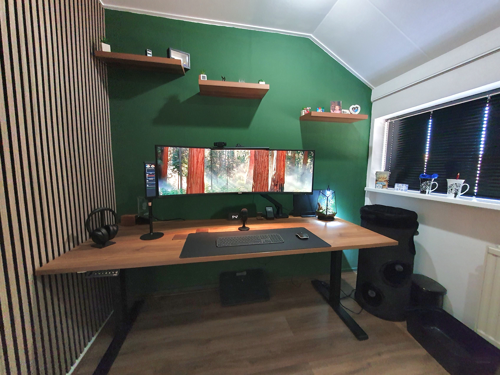



# Home office: Desk setup and room design with AI

 

Overview |
[Mood board](office_mood_board) |
[Virtual design with AI](office_virtual_design_with_ai) |
[Room decoration](office_room_decoration) |
[Desk setup hardware](desk_setup_hardware) |
[Accessories](office_accessories)

 

On this page, I walk through each step: from gathering inspiration, to creating a virtual AI mockup of my new home office, to bringing it to life with real products.

Are you looking for inspiration for your own home office desk setup?\
Or maybe you want to see how AI can help with interior design?\
Then this is the right place for you!

For this setup I used large 200×80 cm (78.4×31.5") [walnut standing desk](desk_setup_hardware#desk) with a [49" Philips monitor](desk_setup_hardware#monitor), what do you need more?

<em style="display:block; text-align:center;">The final result</em>

## The steps from idea to final result

When a spare bedroom became available again in my home, it gave me the opportunity to use this room and convert it my dream home office.
Start from scratch, redoing the walls, ceiling, and floor and choose matching accessories!

But where to start? What materials does look good in my room?
I needed first answer on these questions, so I started a new project.

<em style="display:block; text-align:center">The old room situation, virtual AI design, to final result</em>

This project is split into separate sections, each on its own page. Read whichever topics interest you.

* I started with a [mood board](office_mood_board) of example offices and materials that inspired me.
* Then I created a [virtual design with the help of AI](office_virtual_design_with_ai).
* Next, I found the best matching materials for the [room decoration](office_room_decoration).
* Then I picked the [desk setup hardware](desk_setup_hardware).
* Finally, I added [accessories](office_accessories) for the finishing touch.
* There is always room for [future improvements](desk_setup_hardware#future-improvements).

---

## The result

A desk setup is never truly finished; there are always improvements to make or accessories to swap out.
But the main build is done, and comparing it to my original [mood board](office_mood_board), the end result is surprisingly close!

<em style="display:block; text-align:center">Home office desk result</em>

If you like any of the products you see in the photos, I've listed most of them on the [desk setup page](desk_setup_hardware) and [accessories](office_accessories) pages so you can get them yourself as well.

I started with creating a mood board, [continue reading here..](office_mood_board)

---

 

Home office:\
Overview |
[Mood board](office_mood_board) |
[Virtual design with AI](office_virtual_design_with_ai) |
[Room decoration](office_room_decoration) |
[Desk setup hardware](desk_setup_hardware) |
[Accessories](office_accessories)

 
