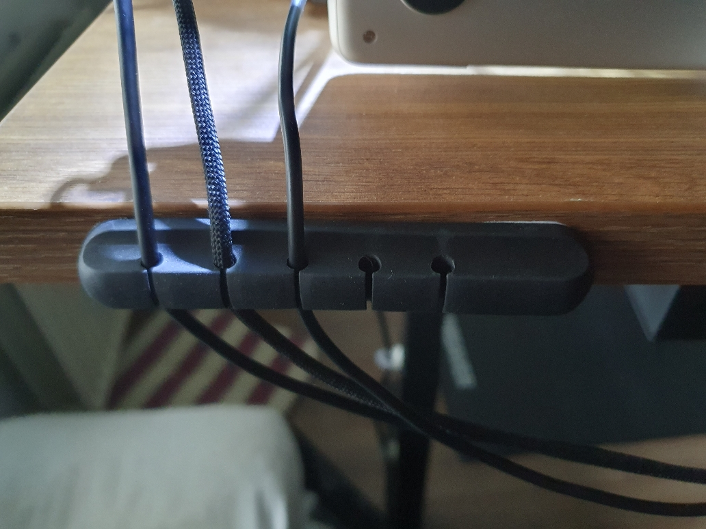
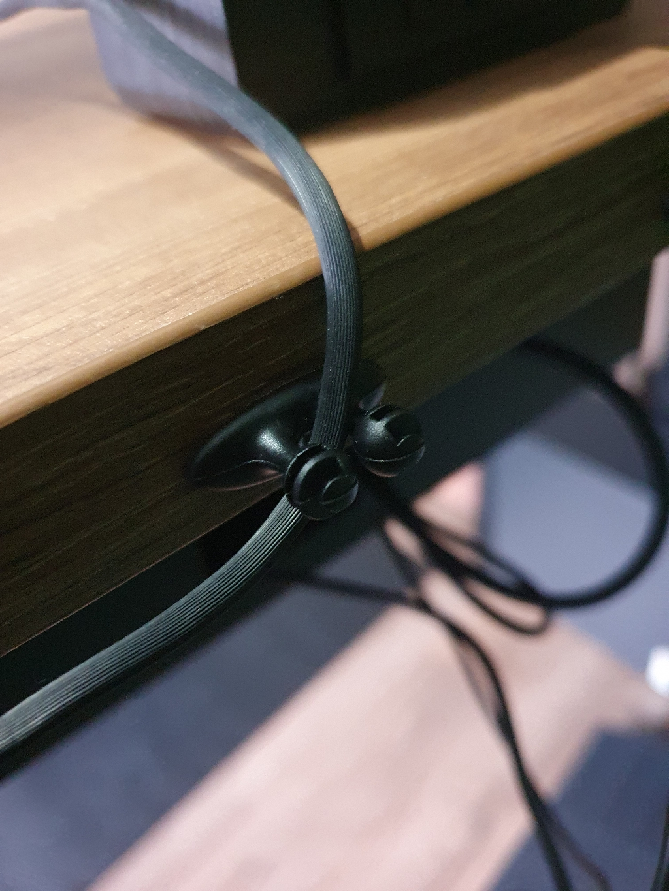
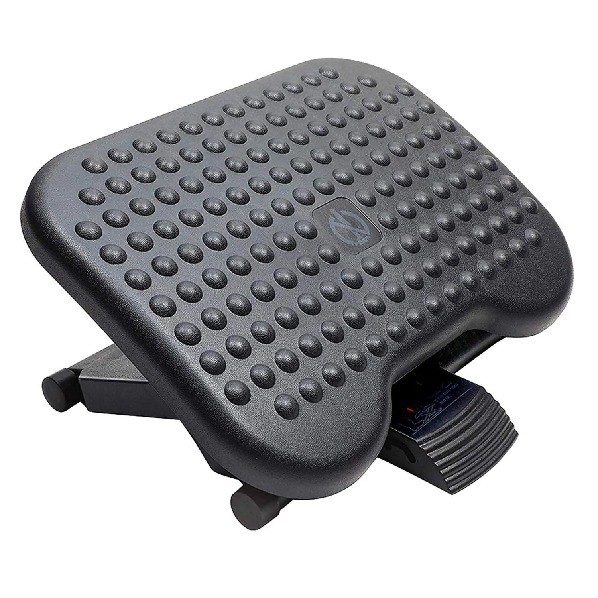
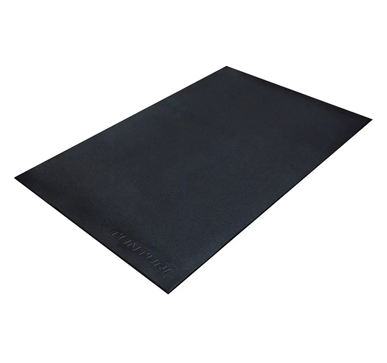
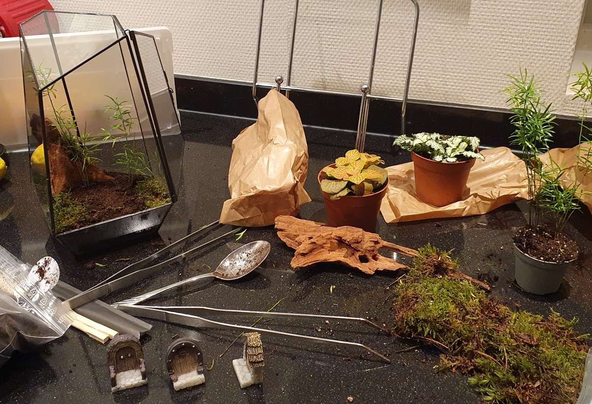
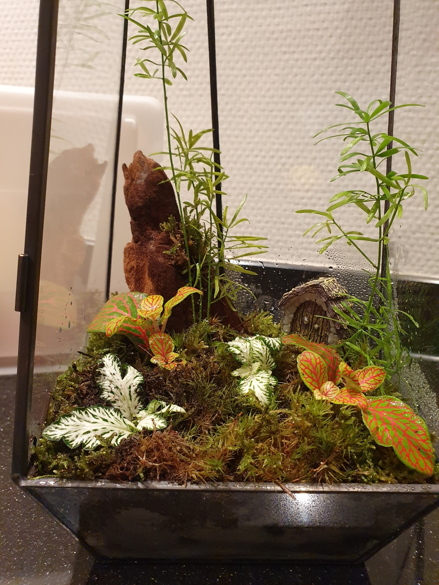
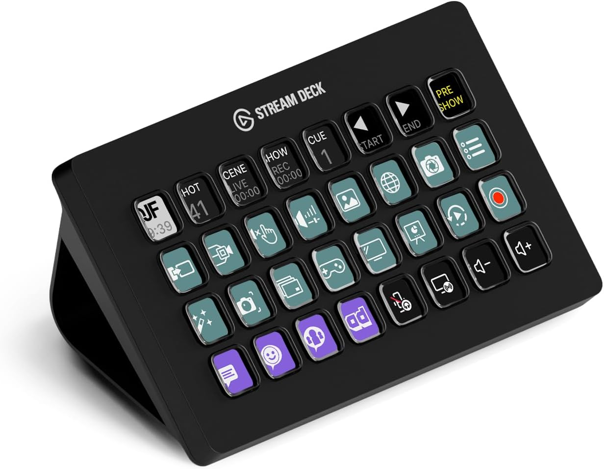



# Home office: Accessories

 

[Overview](index) |
[Mood board](office_mood_board) |
[Virtual design with AI](office_virtual_design_with_ai) |
[Room decoration](office_room_decoration) |
[Desk setup hardware](desk_setup_hardware) |
Accessories

 

On this page, you can read about the accessories I use to decorate my office and make working there a joy
for both myself and my cats, who like to keep me company during the day!

<em style="display:block; text-align:center">Accessories and my home-company-cat</em>

---
## Table of Contents
<!-- TOC -->
  * [Amazon shop list](#amazon-shop-list)
  * [Cable management](#cable-management)
  * [Monitor light](#monitor-light)
  * [Desk mat](#desk-mat)
  * [Headset](#headset)
  * [Laptop charger](#laptop-charger)
  * [Laptop stand](#laptop-stand)
  * [Laptop case](#laptop-case)
  * [Headphone stand](#headphone-stand)
  * [Desk clock](#desk-clock)
  * [Mug coaster](#mug-coaster)
  * [Wireless phone charger stand](#wireless-phone-charger-stand)
  * [Walnut phone stand](#walnut-phone-stand)
  * [Cat tower](#cat-tower)
  * [Camera](#camera)
  * [Microphone](#microphone)
  * [Smart notification light](#smart-notification-light)
  * [Stretch display](#stretch-display)
  * [Retractable USB charger](#retractable-usb-charger)
  * [Footrest](#footrest)
  * [Floor protection mat](#floor-protection-mat)
  * [Floor heated mat](#floor-heated-mat)
  * [Moss terrarium](#moss-terrarium)
  * [Shortcut keyboard](#shortcut-keyboard)
  * [Vacuum cleaner](#vacuum-cleaner)
<!-- TOC -->

> **_NOTE:_** Links on this page can be affiliate links. You pay the same price and support my blog.

---
## Amazon shop list

Products from this page that are available on Amazon are listed on
[(Amazon US)](https://amzn.to/4ukI1pQ#ad) and [Amazon NL](https://amzn.to/3OYGFBK#ad).
Not everything on this page is available through Amazon.
Some items, like the desk, monitor, and chair, are excluded because they have been replaced by newer models or were purchased somewhere else.
Where a newer version exists, I link to that instead.

---
## Cable management

For a clean desk cable needs to be hidden as much as possible.
Cable management is the solution to hide and guide the required cables under and behind the desk.

I use these types of guides to accomplish this.

&nbsp;

* {{imgBasket}}Multiple cable guide [(AliExpress)](https://s.click.aliexpress.com/e/_c3mdNNA9) [(Amazon US)](https://amzn.to/4enAaCv#ad) [(Amazon NL)](https://amzn.to/4vvsWmg#ad)
* {{imgBasket}}Single cable clip holder [(AliExpress)](https://s.click.aliexpress.com/e/_c3kfMbFX)

Alternative:

* {{imgBasket}}Single cable clip holder [(Amazon US)](https://amzn.to/4uQMxfr#ad)

---
## Monitor light

To get enough light on my desk, I use a monitor light bar that shines in front of the screen on the desk and keyboard and doesn't reflect in my eyes.
The Xiaomi Mijia monitor light desk bar is a good option.
It has a bright light, it has a remote knot to dim the light, and it can easily be attached to the monitor, with it contra weights.

* {{imgBasket}}Xiaomi Mijia monitor light desk bar [(AliExpress)](https://s.click.aliexpress.com/e/_c39rwqId) [(Amazon US)](https://amzn.to/4gy6P9O#ad) [(Amazon NL)](https://amzn.to/4xBYwjl#ad)

---
## Desk mat

I use a very large mouse mat underneath my keyboard and mouse.
The top material is soft, with a smooth surface that is perfect for sliding the mouse.
The bottom material is made of rubber to keep it in place.

I use a fully black one without any distracting artwork on it.

The size of my mat is 90 x 40 x 0.3 cm (31.5" x 15.7").
They are available in many different sizes and with different border colors.
I have the all-black version.

* {{imgBasket}}Large anti-slip mouse mat [(AliExpress)](https://s.click.aliexpress.com/e/_c4lkc8mT)
  [(Amazon US)](https://amzn.to/3QbZkeg#ad)

---
## Headset

For my new office, I looked for a newer and improved over-ear headset.
ANC keeps improving every year, and my daily three-year-old headset was ready for an upgrade.
I wanted to go for the overall best option, the Sony WH, but the price is very high for a headset.
That kept me looking further.
I heard and read good things about the QCY H3, and when I found out the improved 2026 H3S version had been released, I went for that one!
In the past, I already had a good experience with QCY in-ear earbuds for on-the-go use.

&nbsp;

&nbsp;

* Dual device connection - can connect to two devices at the same time (laptop and phone)
* Soft top - no hard plastic pressure on your head
* QCY app - to set custom sound settings and the level of noise cancellation
* Bluetooth 6 - long battery life
* Physical buttons - to control ANC/sound/calls
* 5 adaptive ANC noise-cancellation modes (Adaptive/Crowded/Commute/Indoor/Anti-Wind)
* Foldable headset with a hard case for traveling

 
Just read the reviews!

Available in black/white/gray:
* {{imgBasket}}ANC over-ear headset QCY H3S [(AliExpress)](https://s.click.aliexpress.com/e/_c4rmILlH) [(Amazon US)](https://amzn.to/3QdUDR9#ad) [(Amazon NL)](https://amzn.to/3Snv4h5#ad)

 
Alternative:\
I'm also a fan of the Sony WH range, but the price is 10x the price of the QCY, and it isn't 10x better.
For now, I stick to the QCY.

* {{imgBasket}}Sony WH-1000XM6 [(Amazon US)](https://amzn.to/4vvtad6#ad) [(Amazon NL)](https://amzn.to/3QxCUDG#ad)

---
## Laptop charger

I use a Xiaomi 120W USB-C charger to charge my laptop.
It's a powerful USB-C charger with enough power to fast charge any new laptop.

* {{imgBasket}}Xiaomi 120W USB-C [(AliExpress)](https://s.click.aliexpress.com/e/_c34kENKH) [(Amazon US)](https://amzn.to/44r6Hla#ad) [(Amazon NL)](https://amzn.to/4tInyuZ#ad)

I'm looking for a single-cable-solution with a [docking station](desk_setup_hardware#docking-station), suggestions are welcome!

---
## Laptop stand

To keep the desk clean, I place my laptop upright in a black vertical laptop stand.
This way, it takes up less space on my desk surface, and I can easily detach it and replace it with my personal laptop.

* {{imgBasket}}Vertical laptop stand [(AliExpress)](https://s.click.aliexpress.com/e/_c3YOP0VH) [(Amazon US)](https://amzn.to/4eVsZSd#ad) [(Amazon NL)](https://amzn.to/3OEi9pF#ad)
* {{imgBasket}}Vertical laptop stand for two laptops [(AliExpress)](https://s.click.aliexpress.com/e/_c4SxczDR) [(Amazon US)](https://amzn.to/4uZOXJ7#ad) [(Amazon NL)](https://amzn.to/4vjM7iv#ad)

Alternative solutions:

* {{imgBasket}}Walnut stand upright [(AliExpress)](https://s.click.aliexpress.com/e/_c4KppAtd) [(Amazon US)](https://amzn.to/4nEvBXz#ad) [(Amazon NL)](https://amzn.to/44eR5RQ#ad)
* {{imgBasket}}Laptop mount for under the desk [(AliExpress)](https://s.click.aliexpress.com/e/_c3Kc8qzt) [(Amazon US)](https://amzn.to/4tPqkOn#ad) [(Amazon NL)](https://amzn.to/4xBiFWT#ad)
* {{imgBasket}}Laptop side desk mount [(AliExpress)](https://s.click.aliexpress.com/e/_c4EqTSqf) [(Amazon US)](https://amzn.to/4tNoFca#ad) [(Amazon NL)](https://amzn.to/3Sh8k2d#ad)

## Laptop case

To avoid reflections from the nearby window and distractions from the silver laptop on my desk, I put a black case around my laptop.
I chose walnut or black for all items below my monitor and on my desk to make it look calm.

* {{imgBasket}}Black MacBook cover [(AliExpress)](https://s.click.aliexpress.com/e/_c4syE4fB) [(Amazon US)](https://amzn.to/42K2pos#ad) [(Amazon NL)](https://amzn.to/4xyesn3#ad)

---
## Headphone stand

A basic plastic headphone stand.
It just does its job: holding the headphones!

 &nbsp;

* {{imgBasket}}Headphone stand [(AliExpress)](https://s.click.aliexpress.com/e/_c2JOMKeL) [(Amazon US)](https://amzn.to/4wG3POj#ad) [(Amazon NL)](https://amzn.to/4d2Gfm7#ad)

Alternative:

* {{imgBasket}}Walnut stand [(AliExpress)](https://s.click.aliexpress.com/e/_c4S9Q9hf) [(Amazon US)](https://amzn.to/3Rl26xR#ad) [(Amazon NL)](https://amzn.to/4eh9lzY#ad)

---
## Desk clock

A basic wooden digital clock that doesn't attract more attention than needed.

* {{imgBasket}}Wooden clock [(AliExpress)](https://s.click.aliexpress.com/e/_c4L5ZfxT) [(Amazon US)](https://amzn.to/4oO0Yj2#ad) [(Amazon NL)](https://amzn.to/3Qq2eMw#ad)

Alternatives:

* Also, wood-colored, with other shapes, other colors, or additional temperature and humidity display [(AliExpress)](https://s.click.aliexpress.com/e/_c4aiBLM9) [(Amazon US)](https://amzn.to/4w6O1Ds#ad)
* Wood version with a triangle shape [(AliExpress)](https://s.click.aliexpress.com/e/_c3OvVDhP) [(Amazon US)](https://amzn.to/44lvrv9#ad)
* Version with wireless charger [(AliExpress)](https://s.click.aliexpress.com/e/_c3swbZQt) [(Amazon US)](https://amzn.to/43JGezd#ad) \
  

---
## Mug coaster

A personalized mug coaster that nobody else has is both fun and practical, and it protects your desk from spills and stains.
This coaster has a walnut look.
If you upload your own image, you can create a personalized mug coaster with your own design.

* {{imgBasket}}Personalized mug coasters [(AliExpress)](https://s.click.aliexpress.com/e/_c3xqCsX9)

---
## Wireless phone charger stand

Fewer wires on a desk make it look cleaner and more organized, and wireless phone charger stands are a nice solution for that.
If your phone supports it, just place your phone on the charger and it starts charging, with no cable needed.
Very useful to have theses on other places in your home as well, like the bedroom, kitchen, living.

* {{imgBasket}}Wireless phone charger [(AliExpress)](https://s.click.aliexpress.com/e/_c3qTRe0B) [(Amazon US)](https://amzn.to/4gy78Bu#ad) [(Amazon NL)](https://amzn.to/42HesCL#ad)

---
## Walnut phone stand

I found a simple walnut-colored stand for my other phone, which is also walnut colored, so it fits perfectly with the rest of the accessories on my desk.

* {{imgBasket}}Walnut phone stand [(AliExpress)](https://s.click.aliexpress.com/e/_c4UBgQzZ) [(Amazon US)](https://amzn.to/4fYOLFO#ad)

---
## Cat tower

When I am in the office, my cats like to stay nearby.
At first, I used a spare chair, but it took too much space, and we could not see each other well while I was standing.
I found a compact tower where they can lie inside or on top of it.

It is available in three colors: black, beige, and gray.
* {{imgBasket}}Cat tower Diogenes L [(Bitiba.nl)](https://www.bitiba.nl/shop/katten/krabpaal_krabmeubels/krabtonnen/554883?activeVariant=554883.1)

Alternative:
* {{imgBasket}}20.5-Inch Cat Condo [(Amazon US)](https://amzn.to/4tV4zgc#ad)

---
## Camera

I chose a basic camera years ago because of these features:
* HD USB camera with a lens cover
* 30 fps
* Light correction
* Good sound and microphone quality (now I use a separate microphone)
* A mount with contra weight to place on top of a monitor

Back in the day, the Logitech C920 HD Pro Webcam was a perfect match for me, and it still works fine.
But it could be upgraded to a newer one with 4K resolution and an auto-follow feature.
I'm open to any good suggestions!

* {{imgBasket}}Logitech C920 HD Pro Webcam [(Amazon US)](https://amzn.to/3Rh4ZzL#ad) [(Amazon NL)](https://amzn.to/4kLNBO6#ad)

I'm looking for a replacement [camera](desk_setup_hardware#camera-1), suggestions are welcome!

---
## Microphone

For an affordable basic microphone, I've chosen the Razer Seiren Mini black - USB condenser microphone.

* {{imgBasket}}Razer Seiren Mini black [(Amazon US)](https://amzn.to/4nLZVQ8#ad) [(Amazon NL)](https://amzn.to/4cwPg84#ad)

---
## Smart notification light

On the corner of my desk, I have a small smart notification light that looks like a random walnut accessory when it is off.
It is a walnut pencil holder with a GU10 full-color smart light hidden inside.
I use it as a CO2 warning light in my office, but it can also be used for other notifications such as focus time, calendar reminders, required AI user input, or anything else that works well as a color signal.

Read more about this in the [Smart and stylish notification light](/projects/smart_notification_light) project.

---
## Stretch display

Next to my main monitor, I have a small stretched display that shows important office and home alerts.
It is connected to a separate Raspberry Pi and displays a Home Assistant page.
It boots together with the monitor.
It visualizes room environment data such as office temperature, CO2 levels, and graphs for the last few hours, plus alerts for thing like when someone is detected around the house.

Read more about this in the [Stretch display](/projects/stretch_display) project.

---
## Retractable USB charger

Not everything can be charged wirelessly.
Sometimes you need a cable to charge headphones or a keyboard.
Most of the time, you do not need that cable and want to keep it out of sight.
But when you do need it, you do not want to dive under the desk or use loose hanging cables to connect one.

A nice solution is a retractable USB charging cable.
You can pull it out when you need it, and it automatically rolls back in when you are done.

* {{imgBasket}}Retractable USB-C power cable [(AliExpress)](https://s.click.aliexpress.com/e/_c4EmqPR3)

Alternatives:

* {{imgBasket}}Black dual USB-C power hub [(AliExpress)](https://s.click.aliexpress.com/e/_c4oe4KB1) [(Amazon US)](https://amzn.to/3SSHu0u#ad) [(Amazon NL)](https://amzn.to/4enp1Sm#ad)
* {{imgBasket}}Walnut cable organizer [(AliExpress)](https://s.click.aliexpress.com/e/_c2ud4CQX) (high shipping costs)\
  

---
## Footrest

To support my posture and stretch my legs while sitting, I use a footrest under my desk.
It can be change in different angles.

* {{imgBasket}}Footrest [(AliExpress)](https://s.click.aliexpress.com/e/_c2QayhIv) [(Amazon US)](https://amzn.to/4w1Zm7p#ad) [(Amazon NL)](https://amzn.to/4aeh67k#ad)

---
## Floor protection mat

To protect the floor from scratches and reduce chair-wheel noise, I placed a rubber protection mat underneath my chair.
A carpet version also works perfect.

* {{imgBasket}}Floor protection mat [(Amazon US)](https://amzn.to/4odC4sM#ad) [(Amazon NL)](https://amzn.to/4dUne72#ad)

---
## Floor heated mat

To keep my feet warm during winter, I placed a heated floor mat under my desk where I stand.
This way, I do not need to heat the whole room, and I avoid cold feet from the floor while standing at my desk.

It has a power output of 110 watts and can be controlled via an inline remote with 4 levels.
Most of the time, the 4th level is already too hot.
With the built-in timer, it automatically shuts off.
With a three-meter power cable.

* {{imgBasket}}Floor heated mat: VH Etna 40x60 cm [(Bol.com)](https://www.bol.com/nl/nl/p/vh-regelbare-warme-voeten-mat-etna-40-x-60-cm-lcd-controller-met-4-standen-timerfunctie-plug-heat-zuinig-in-gebruik/9300000017178095/)

Alternative:

* {{imgBasket}}Björn & Schiller, similar size (but less power and shorter power cable) [(Amazon NL)](https://amzn.to/4vW4R7D#ad)

---
## Moss terrarium

While creating my [Pinterest mood board](office_mood_board), I found a lot of inspiration for moss terrariums (also known as mossariums), and I also wanted a small living environment like that on my desk.

Buying a fully decorated one was quite expensive, but I found a nice DIY kit that let me create my own moss terrarium for a reasonable price.\
Later, my local garden center also started selling moss terrariums, so it is worth checking there too.

* {{imgBasket}}Moss terrarium glass [(AliExpress)](https://s.click.aliexpress.com/e/_c4OC8zP7) [(Amazon NL)](https://amzn.to/4w7dfCj#ad)
* {{imgBasket}}DIY moss and plants kit [(Woonhero.nl)](https://woonhero.nl/collections/terrarium-start-en-navulpakketten)
* {{imgBasket}}Top light [(AliExpress)](https://s.click.aliexpress.com/e/_c4e9lqvj)
* {{imgBasket}}Deco frogs [(AliExpress)](https://s.click.aliexpress.com/e/_c4qXtes)
* {{imgBasket}}Stainless steel tweezers [(AliExpress)](https://s.click.aliexpress.com/e/_c34YFrOH)

---
## Shortcut keyboard

I have a macro keypad with 32 buttons to trigger all kind of commands, scripts, apps, automations and other actions just with a single button click.
You can search for custom icons from a library or upload your own, and a button can also be used as small display to show status updates, like current temperature or open issues.

* {{imgBasket}}Elgato Stream Deck XL [(Amazon US)](https://amzn.to/4ycYcIe#ad) [(Amazon NL)](https://amzn.to/4bqBe6F#ad)

---
## Vacuum cleaner

With this small but strong vacuum cleaner for your desk (and keyboard), you can quickly remove small debris without scratching anything.\
It can be charged with a USB-C cable.

* {{imgBasket}}Mini desk vacuum cleaner [(AliExpress)](https://s.click.aliexpress.com/e/_c4KLKg8v)

 

That it, thanks for your interrest. Have a nice day!

---

 

Home office:\
[Overview](index) |
[Mood board](office_mood_board) |
[Virtual design with AI](office_virtual_design_with_ai) |
[Room decoration](office_room_decoration) |
[Desk setup hardware](desk_setup_hardware) |
Accessories

 
