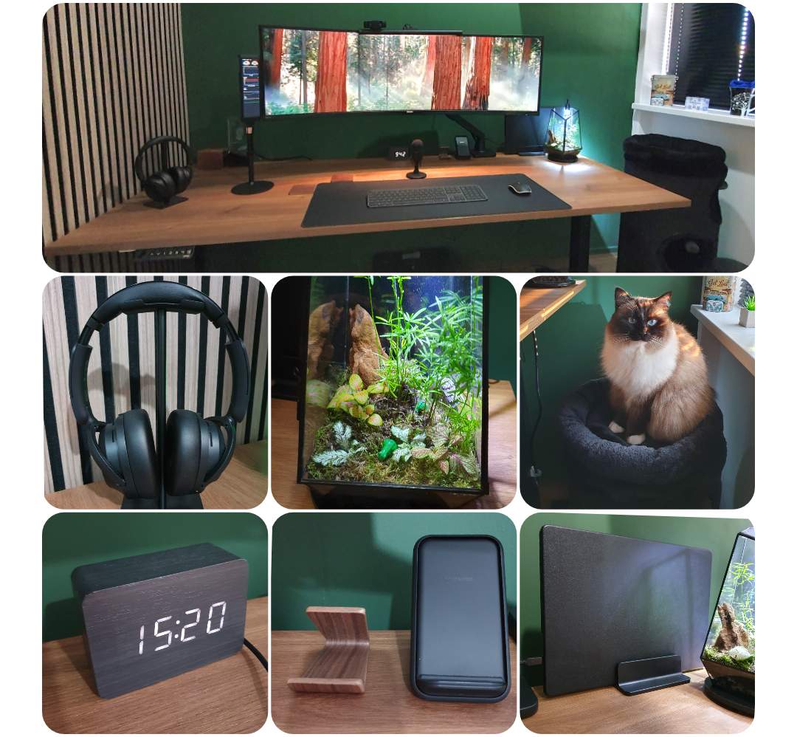
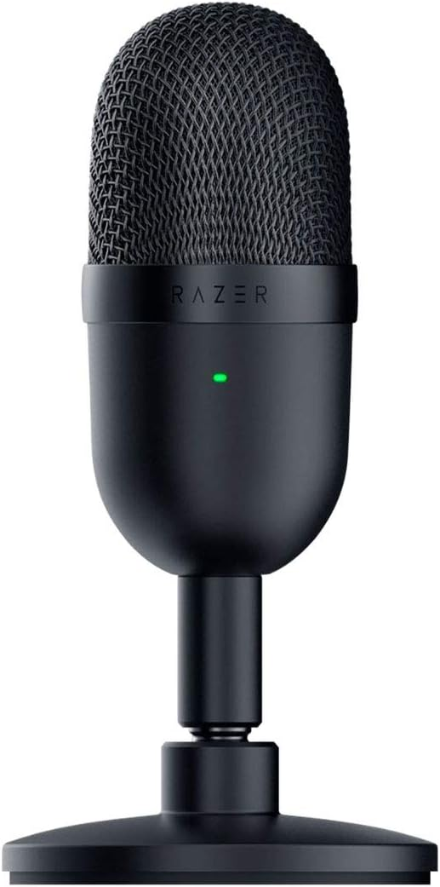
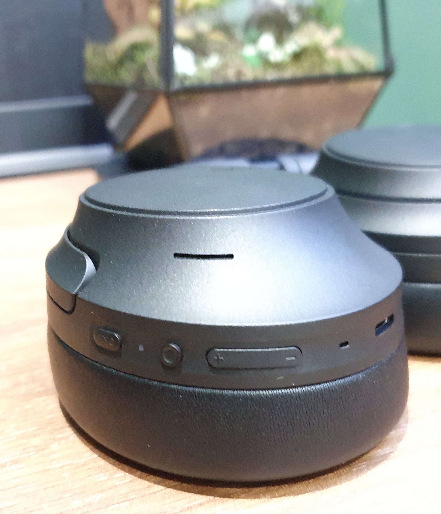
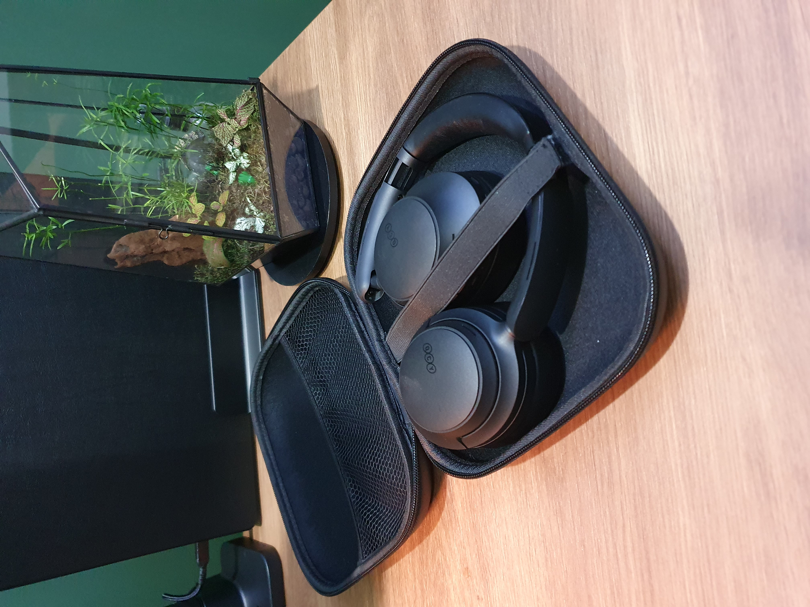
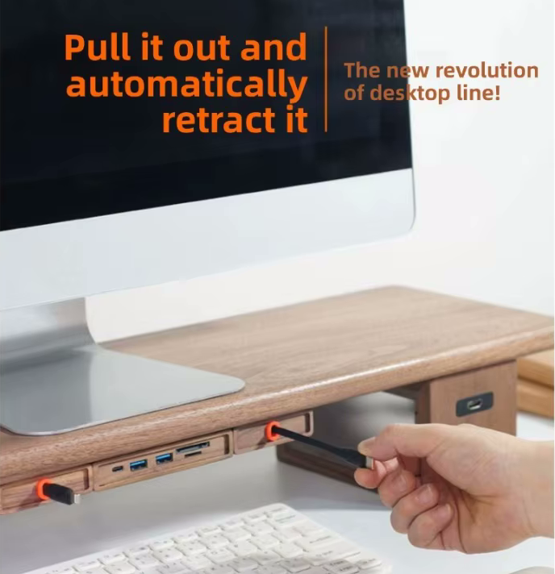
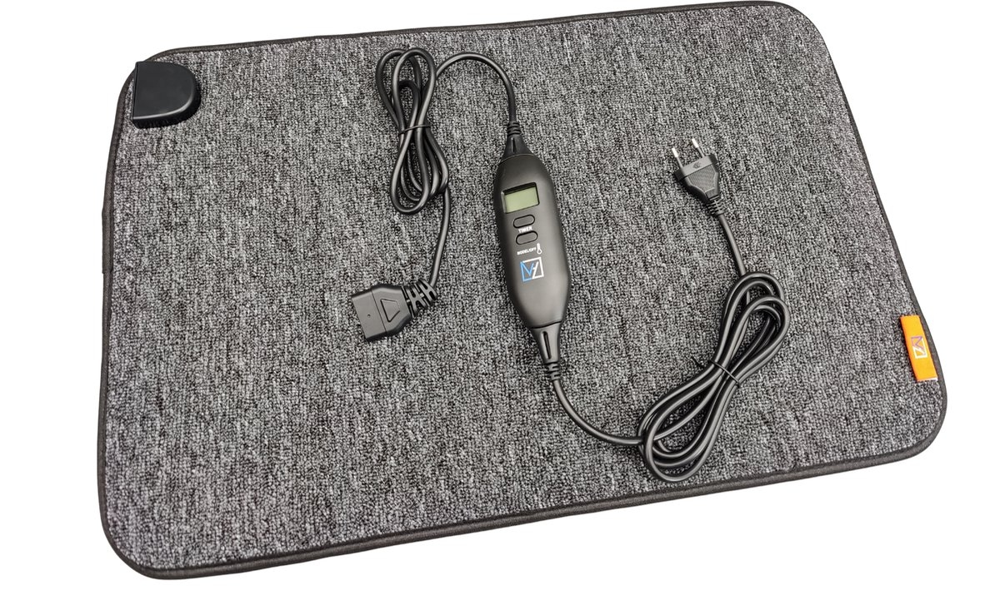
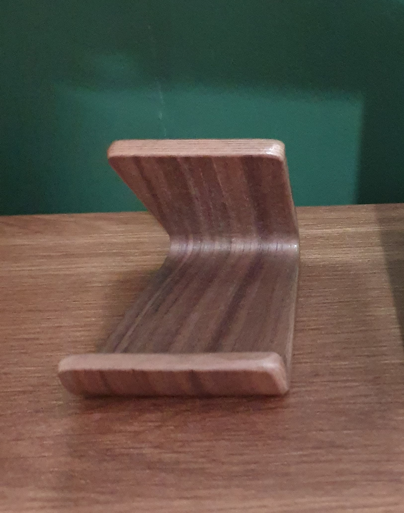
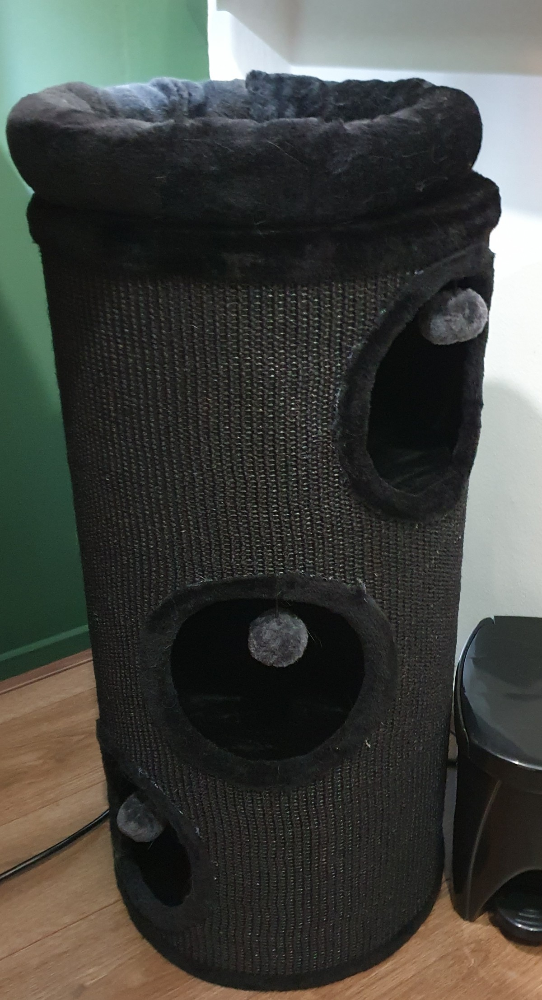



# Home office: Accessories

 

On this page you can read which accessories I use to decorate and make working in my office a joy!

---
## Table of Contents
<!-- TOC -->
  * [Monitor light](#monitor-light)
  * [Desk mat](#desk-mat)
  * [Camera](#camera)
  * [Microphone](#microphone)
  * [Headset](#headset)
  * [Laptop charger](#laptop-charger)
  * [Laptop stand](#laptop-stand)
  * [Laptop case](#laptop-case)
  * [Headphone stand](#headphone-stand)
  * [Desk clock](#desk-clock)
  * [Stretch display](#stretch-display)
  * [Retractable USB charger](#retractable-usb-charger)
  * [Footrest](#footrest)
  * [Floor protection mat](#floor-protection-mat)
  * [Floor heated mat](#floor-heated-mat)
  * [Moss terrarium](#moss-terrarium)
  * [Mug coaster](#mug-coaster)
  * [Wireless phone charger](#wireless-phone-charger)
  * [Walnut phone stand](#walnut-phone-stand)
  * [Cat tower](#cat-tower)
<!-- TOC -->

---
## Monitor light

To get enough light on my desk, I use a monitor light bar that shines in front of the screen on the desk and doesn't reflect in my eyes.
The Xiaomi Mijia monitor light desk bar is a good option, it has a remote to dim the light, and it can easily be attached to the monitor, with it contra weights.

* {{imgBasket}}Xiaomi Mijia monitor light desk bar [(AliExpress)](https://s.click.aliexpress.com/e/_c3JdA7BX) [(Amazon US)](https://amzn.to/4wFMGEo) [(Amazon NL)](https://amzn.to/4eXV5N2)

---
## Desk mat

I use a very large mouse mat underneath my keyboard and mouse.
The top material is soft with a smooth surface for the perfect sliding with the mouse.
The bottom material is made of rubber to keep it in place.

I use a full black one without any art distractions on it.

The size of my mat is 400 x 900 x 3 mm.
They are available in many different sizes and with different border colors.
I have the all-black version.

* {{imgBasket}}Large anti-slip mouse mat [(AliExpress)](https://s.click.aliexpress.com/e/_c4lkc8mT)
  [(Amazon US)](https://amzn.to/49ZQjeG)

Alternative:
* {{imgBasket}}Other all black big mat [(AliExpress)](https://s.click.aliexpress.com/e/_c4TG8ihV)

---
## Camera

I chose a basic camera (years ago) for the features:
* HD USB camera with a lens cover
* 30 fps
* Light correction
* Good sound and microphone quality (now I use a separate microphone)
* A mount with contra weight to place on top of a monitor

Back in the days, the Logitech C920 HD Pro Webcam was a perfect match for me, and it still works fine.
But it can be upgraded to a newer one with a 4K resolution with auto follow feature. I'm open for any good suggestions!

* {{imgBasket}}Logitech C920 HD Pro Webcam [(Amazon US)](https://amzn.to/3Rh4ZzL) [(Amazon NL)](https://amzn.to/4kLNBO6)

---
## Microphone

For an affordable basic microphone, I've chosen the Razer Seiren Mini black - USB condenser microphone.

* {{imgBasket}}Razer Seiren Mini black [(Amazon US)](https://amzn.to/4nLZVQ8) [(Amazon NL)](https://amzn.to/4cwPg84)

---
## Headset

For my new office I looked for a newer and improved over ear headset.
The development of ANC is improving every year and my daily used three-year-old headset could get an upgrade.
I want to go for the overall best option, the Sony WH, but the price is very high for a headset.
This keeps me looking further.
I heard and read good stories about the QCY H3 and when I found out the improved 2026 version H3S was released, I went for this one!
In the past I had already good experience with the QCY in-earbuds for on-the-go.

&nbsp;

&nbsp;

* Dual device connect - possibility to connect at the same time to two devices (laptop and phone)
* Soft top - no hard plastic pressure on your head
* QCY app - to set custom sound settings and the level of noise cancellation
* Bluetooth 6 - long battery life
* Physic buttons - to control ANC/sound/calls
* 5 modes Adaptive ANC Noise cancellation (Adaptive/Crowded/Commute/Indoor/Anti-Wind)
* Foldable headset with a hard case for traveling

 
Just read the reviews!

Available in Black/White/Gray:
* {{imgBasket}}ANC over ear headset QCY H3S [(AliExpress)](https://s.click.aliexpress.com/e/_c4rmILlH) [(Amazon US)](https://amzn.to/4tJjCsW)

 
Alternative:\
I'm also a fan of the Sony WH range, but the price is 10x the price of the QCY, but it isn't 10x better.
For now, I stick to the QCY.
* {{imgBasket}}Sony WH-1000XM6 [(Amazon US)](https://amzn.to/3POvXhK) [(Amazon NL)](https://amzn.to/3QxCUDG)

---
## Laptop charger

I use a Xiaomi 120W USB-C charger to charge my laptop.
It's a powerful USB-C charger with enough power to fast charge any new laptop.

* {{imgBasket}}Xiaomi 120W USB-c [(AliExpress)](https://s.click.aliexpress.com/e/_c34kENKH) [(Amazon US)](https://amzn.to/434cVal) [(Amazon NL)](https://amzn.to/4tInyuZ)

---
## Laptop stand

To make the desk clean, I have my laptop upright with a black vertical laptop stand.
This way it takes less space from my desk surface and I can easily detach it and replace it with my personal laptop.

* {{imgBasket}}Vertical laptop stand black [(AliExpress)](https://s.click.aliexpress.com/e/_c3YOP0VH) [(Amazon US)](https://amzn.to/4nCJ9CX)
* {{imgBasket}}Vertical laptop stand for two laptops black [(AliExpress)](https://s.click.aliexpress.com/e/_EHCUwya) [(Amazon US)](https://amzn.to/4uZOXJ7) [(Amazon NL)](https://amzn.to/3OEi9pF)

Alternative solutions:

* {{imgBasket}}Walnut stand upright [(AliExpress)](https://s.click.aliexpress.com/e/_c4KppAtd) [(Amazon US)](https://amzn.to/4nEvBXz)
* {{imgBasket}}Laptop mount under desk [(AliExpress)](https://s.click.aliexpress.com/e/_c3Kc8qzt) [(Amazon US)](https://amzn.to/4tPqkOn)
* {{imgBasket}}Laptop side desk mount [(AliExpress)](https://s.click.aliexpress.com/e/_c4EqTSqf) [(Amazon US)](https://amzn.to/4tNoFca)

## Laptop case

To avoid outside light reflections from the close window and distractions from the silver laptop on my desk I put a black case around my laptop.
I chose to have all items below my monitor and on my desk in walnut or black to make it look peaceful.

* {{imgBasket}}MacBook Pro 16" cover [(AliExpress)](https://s.click.aliexpress.com/e/_c4syE4fB) [(Amazon US)](https://amzn.to/42K2pos)

---
## Headphone stand

A basic plastic headphone stand.
It just does it job, hold the headphone!

 &nbsp;

* {{imgBasket}}Headphone stand [(AliExpress)](https://s.click.aliexpress.com/e/_c2JOMKeL) [(Amazon US)](https://amzn.to/4wG3POj) [(Amazon NL)](https://amzn.to/4d2Gfm7)

Alternative:
* {{imgBasket}}Walnut stand [(AliExpress)](https://s.click.aliexpress.com/e/_c4S9Q9hf) [(Amazon US)](https://amzn.to/3Rl26xR)

---
## Desk clock

Also, a basic wooden digital clock which doesn't attract more attention than needed.

* {{imgBasket}}Wooden clock [(AliExpress)](https://s.click.aliexpress.com/e/_c4L5ZfxT) [(Amazon US)](https://amzn.to/) [(Amazon NL)](https://amzn.to/)

Alternatives:

* Also wood colord but with other shapes, other colors or with addition temperature and humidity presented [(AliExpress)](https://s.click.aliexpress.com/e/_c4aiBLM9)
* Wood version with a triangle shaped [(AliExpress)](https://s.click.aliexpress.com/e/_c3OvVDhP)
* Version with wireless charger [(AliExpress)](https://s.click.aliexpress.com/e/_c3swbZQt)\
  

---
## Stretch display

Next to my main monitor, I have a small stretched display that shows important office and home alerts.
It is connected to a separate Raspberry Pi and displays a Home Assistant page.
It boots together with the monitor.
It visualizes environmental room data such as office temperature, CO2 value, and graphs for the last few hours, plus alerts when someone is detected around the house.

Read more about this project on [Stretch display](/projects/stretch_display).

---
## Retractable USB charger

Not everything can be charged wirelessly.
Sometimes you need a cable to charge headphones or a keyboard.
Most of the time, you do not need that cable and want to keep it out of sight.
But when you do need it, you do not want to dive under the desk or loose hanging cables to connect one.

A nice solution is a retractable USB charging cable.
You can pull it out when you need it, and it automatically rolls back in when you are done.

* {{imgBasket}}Retractable USB-C power cable [(AliExpress)](https://s.click.aliexpress.com/e/_c4EmqPR3)

Alternatives:
* {{imgBasket}}Black dual USB-C power hub [(AliExpress)](https://s.click.aliexpress.com/e/_c4oe4KB1)
* {{imgBasket}}Walnut cable organizer [(AliExpress)](https://s.click.aliexpress.com/e/_c2ud4CQX)\
  

---
## Footrest

To support my posture and stretch my legs while sitting, I use a footrest under my desk.

* {{imgBasket}}Footrest

---
## Floor protection mat

To protect the floor from scratches and reduce chair-wheel noise, I placed a rubber protection mat underneath my chair.

* {{imgBasket}}Floor protection mat [(Amazon US)](https://amzn.to/4odC4sM) [(Amazon NL)](https://amzn.to/4dUne72)

---
## Floor heated mat

To keep my feet warm during winter, I placed a heated floor mat under my desk where I stand.
This way, I do not need to heat the whole room, and I avoid cold feet from the floor while standing at my desk.

It has a power of 110 watt, controllable via a remote in the wire with 4 levels. 
Most of the time the 4th level is already too hot.
With the timer in timer it automatically shuts of.

* {{imgBasket}}Floor heated mat: VH Etna 40x60 cm [(Bol.com)](https://www.bol.com/nl/nl/p/vh-regelbare-warme-voeten-mat-etna-40-x-60-cm-lcd-controller-met-4-standen-timerfunctie-plug-heat-zuinig-in-gebruik/9300000017178095/)

---
## Moss terrarium

While creating my [Pinterest mood board](office_mood_board), I found a lot of inspiration for moss terrariums (also known as mossariums), I also wanted such small living environment like that on my desk.

Buying one fully decorated was quite expensive, but I found a nice DIY kit that let me create my own moss terrarium for a reasonable price.\
Later, my local garden center also started selling moss terrariums, so it is worth checking there too.

* {{imgBasket}}Moss terrarium glass [(AliExpress)](https://s.click.aliexpress.com/e/_c3MlDAd1) [(Amazon NL)](https://amzn.to/4w7dfCj)
* {{imgBasket}}DIY moss and plants kit [(Woonhero.nl)](https://woonhero.nl/collections/terrarium-start-en-navulpakketten)
* {{imgBasket}}Top light [(AliExpress)](https://s.click.aliexpress.com/e/_EyHPnbm)
* {{imgBasket}}Deco frogs [(AliExpress)](https://s.click.aliexpress.com/e/_c4qX4v5j)
* {{imgBasket}}Deco doors [(AliExpress)](https://s.click.aliexpress.com/e/_c3B6o2wZ)
* {{imgBasket}}Stainless Steel Tweezers [(AliExpress)](https://s.click.aliexpress.com/e/_c34YFrOH)

---
## Mug coaster

A personalized mug coaster that nobody else has is both fun and practical, and it protects your desk from spills and stains.
This coaster has a walnut look.
If you upload your own image, you can create a personalized mug coaster with your own design.

* {{imgBasket}}Personalized Mug coasters [(AliExpress)](https://s.click.aliexpress.com/e/_c3uKT7xt)

---
## Wireless phone charger

Fewer wires on a desk make it look cleaner and more organized, and wireless phone chargers are a nice solution for that.
Just place your phone on the charger and it starts charging, with no cable needed.

* {{imgBasket}}Wireless phone charger [(AliExpress)](https://s.click.aliexpress.com/e/_c3qTRe0B) [(Amazon NL)](https://amzn.to/42HesCL)

---
## Walnut phone stand

I found a simple walnut-colored stand for my other phone, which is also walnut colored, so it fits perfectly with the rest of the accessories on my desk.

* {{imgBasket}}Walnut phone stand [(AliExpress)](https://s.click.aliexpress.com/e/_c4UBgQzZ)

---
## Cat tower

When I am in the office, my cats like to stay nearby.
At first, I used a spare chair, but it took too much space, and we could not see each other well while I was standing.
I found a compact tower where they can lie inside or on top of it.

It is available in three colors: black, beige, and gray.
* {{imgBasket}}Cat tower Diogenes L [(Bitiba.nl)](https://www.bitiba.nl/shop/katten/krabpaal_krabmeubels/krabtonnen/554883?activeVariant=554883.1)

Alternative:
* {{imgBasket}}20.5-Inch Cat Condo [(Amazon US)](https://amzn.to/4tV4zgc)

---
## Vacuum cleaner

With this small but strong vacuum clean for your desk (and keyboard) you can quickly remove small trash without scratching anything.\
It can be charged with a USB-C cable.

* {{imgBasket}}Mini desk vacuum cleaner [(AliExpress)](https://s.click.aliexpress.com/e/_c4KLKg8v)

---

 

Home office:\
[Overview](index) |
[Mood board](office_mood_board) |
[Virtual design with AI](office_virtual_design_with_ai) |
[Room decoration](office_room_decoration) |
[Desk setup hardware](desk_setup_hardware) |
Accessories

 