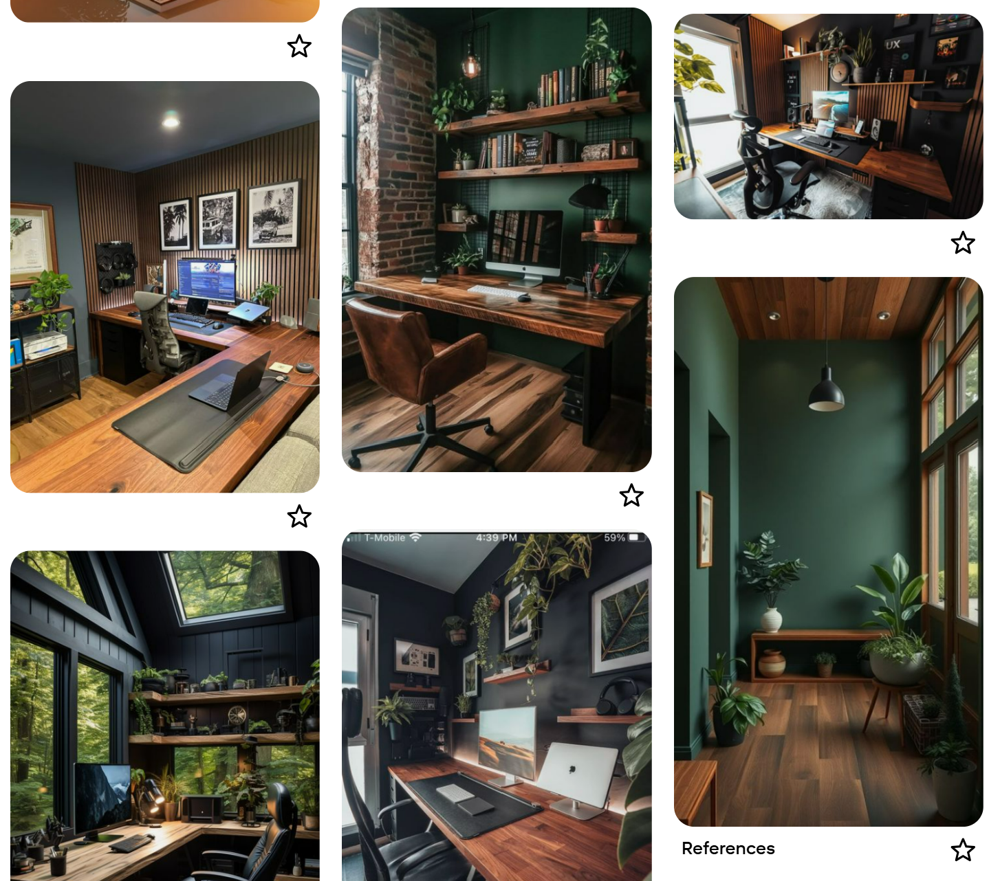

# Home office: Mood board

The idea started with a digital *mood board*, a Pinterest board where I saved photos of offices and accessories that caught my eye.
After a few months of collecting images from Pinterest, social media, and Google Images, a clear pattern of colors and materials emerged.
Dark walnut tones, dark green accents, and acoustic panels were the common thread running through most of the photos.

 
<em>Pinterest mood board</em>
 
 

---
Home office:\
[Overview](index) |
Mood board |
[Virtual design with AI](office_virtual_design_with_ai) |
[Room decoration](office_room_decoration) |
[Desk setup hardware](desk_setup_hardware) |
[Accessories](office_accessories)
