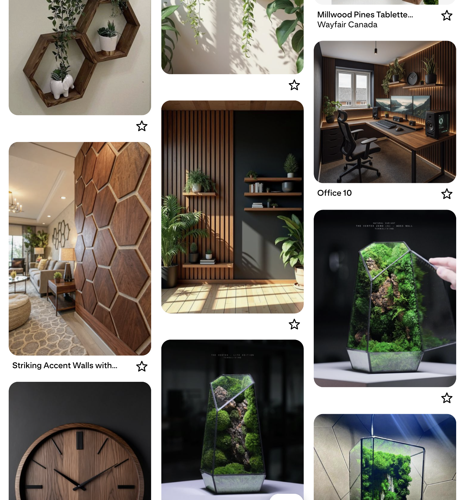

# Home office: Mood board

 

My idea for how the office should look started with a digital *mood board*: a Pinterest board where I saved photos of offices and accessories that caught my eye.
After a few months of collecting images from Pinterest, social media, and Google Images, a clear pattern of colors and materials started to emerge.
Dark walnut tones, dark green accents, green plants, and acoustic panels became the common thread running through most of the photos.

 
<em style="display:block; text-align:center">Pinterest mood board</em>
 

Some social media groups to get inspired:
* [Reddit/desksetup](https://www.reddit.com/r/desksetup/)
* [Facebook/workspacesetupaddicts](https://www.facebook.com/groups/workspacesetupaddicts/)

I'm a fan of hexagon shelves and panels, but you also have to work with products that are actually available and fit well together.
The [moss terrarium](office_accessories#moss-terrarium) made it into the final version!
The clock is an AI-created image, but it is exactly what I'm looking for. 
I still hope it will become a real product in the future.

 
<em style="display:block; text-align:center">Not everything made it to the final version</em>
 

Once I had collected enough ideas, I could start designing a virtual version of what my new office might look like. 
[Continue reading here...](office_virtual_design_with_ai)

---

 

Home office:\
[Overview](index) |
Mood board |
[Virtual design with AI](office_virtual_design_with_ai) |
[Room decoration](office_room_decoration) |
[Desk setup hardware](desk_setup_hardware) |
[Accessories](office_accessories)

 
