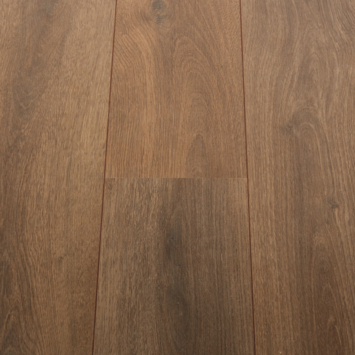
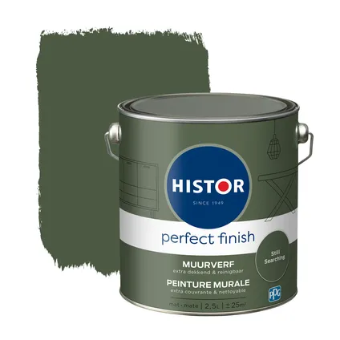
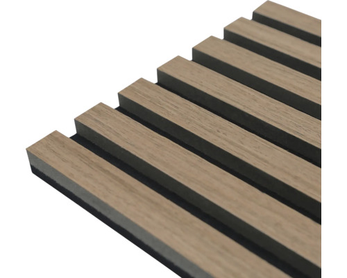

# Home office: Room decoration

 

I decorated my new office room with acoustic sound panel wall, painted all other walls and the ceiling for a new fresh look!

---
Home office:\
[Overview](index) |
[Mood board](office_mood_board) |
[Virtual design with AI](office_virtual_design_with_ai) |
Room decoration |
[Desk setup hardware](desk_setup_hardware) |
[Accessories](office_accessories)

---

## Collecting the materials

With my [virtual room design](desk_setup_hardware#virtual-room-design) in hand, I went looking for real products and materials that matched the concept.
A 1-to-1 match isn't always possible since you're limited to what's actually available on the market.

When combining different products in the same wood tone, walnut, in my case, the colors need to match as closely as possible.
Online product photos can be misleading; even a slight difference in tone can change the entire look in real life.
For that reason, I wanted to buy as many items as possible from a physical store so I could compare colors directly.
The first big item I ordered online was the desk surface.
Using its color as a reference, I then went shopping for the other major pieces, like the floor and acoustic panels.

I had already bought online a small wooden drink coaster that luckily matched the desk's color and grain pattern exactly.
It was much easier to bring that to stores as a color reference than lugging the entire desk top around.

For the floor, I visited a few local stores and compared the coaster against different laminate options.
Holding it at different angles showed how much the color can shift, which confirmed that having a physical sample was the right call.
At one store I found a perfect match, and they also sell skirting boards in the same color.

The wall panels were more difficult to find, the stores I visited only sold a few basic light and dark wood options.
None matched exactly, but one was close enough.

Choosing the dark green paint was also challenging since it's hard to judge how a color will truly look on a wall.
I found a shade I liked online, and the product page had many <a href="https://www.karwei.nl/assortiment/histor-perfect-finish-muurverf-mat-still-searching-2-5-liter/p/B155557#reviews" target="_blank">customer photos</a> showing that exact paint in real rooms, which gave a much better sense of the final result.

---

## Room design

I have taken care of the entire room.
I added an acoustic sound panel wall, painted all other walls and the ceiling for a new fresh look!

### Green wall

The accent wall behind the desk had to be a dark, moss-like green.
I ended up going with `Histor Perfect Finish muurverf mat Still Searching`.

On the product page I found a gallery of
<a href="https://www.karwei.nl/assortiment/histor-perfect-finish-muurverf-mat-still-searching-2-5-liter/p/B155557#reviews" target="_blank">customer photos</a>
that gave a great impression of how the color looks in a real room.

This color is available at different Dutch hardware stores:
* [Praxis NL](https://www.praxis.nl/verf-behang-wandbekleding/verf/binnenverf/muurverf/histor-perfect-finish-muurverf-mat-still-searching-2-5l/10049477)
* [Karwei NL](https://www.karwei.nl/assortiment/histor-perfect-finish-muurverf-mat-still-searching-2-5-liter/p/B155557#reviews)
* [Hubo NL](https://www.hubo.nl/products/histor-perfect-finish-muurverf?_pos=1&_sid=d26b8686f&_ss=r&variant=48564289372412)

The white color I used for the other walls and the ceiling is `Histor Monodek muurverf RAL 9010 gebroken wit`
It's also available at the earlier mentioned hardware stores.

---
### Acoustic sound panels

One advantage of these panels is that the wall doesn't need to be perfectly smooth underneath.
Cut the panels to height with a jigsaw, apply a tube of special panel adhesive per panel, press them to the wall, and move on to the next.
The only fiddly parts are cutting around power outlets or light switches.

The panels does a great job of absorbing the sound.

Most of the wood slats are not solid wood but pressed wood with a thin veneer layer, which keeps costs down but makes the surface easy to damage.
Drilling into them is not recommended.

I ended up with the `3D Akoestisch paneel walnut` from Hornbach.
Single panel size: 2600 x 560 x 18 mm.

* [Hornbach NL - walnut](https://www.hornbach.nl/p/3d-akoestisch-paneel-walnut-2600x560x18-mm/12085623/)

 

There was also a darker `smoked oak` version available, but it was too dark for my taste.
* [Hornbach NL - smoked oak](https://www.hornbach.nl/p/3d-akoestisch-paneel-smoked-oak-2600x560x18-mm/12085631/)

---
### Floor

On the floor, I used laminate.
It looks like a wooden floor, it's strong and easy to install.

The best match for my desk was the `Valley warm bruin eiken met V-groef` (Valley warm brown oak with V-groove) from the Dutch hardware store Karwei.
The laminate planks have a tactile surface texture you can feel underfoot.

* [Karwei NL](https://www.karwei.nl/assortiment/laminaat-valley-warm-bruin-eiken-met-v-groef/p/B242244)

 

I bought there also the matching skirting boards.
* [Karwei NL](https://www.karwei.nl/assortiment/plakplint-nr-655-bruingrijs/p/B113803)

 

Under the laminate, I added an insulation layer to reduce sound transmission to the floor below and to minimize heat loss.

---
### Ceiling lights

Since I've automated the rest of my home, I did the same for this room.

I kept the original ceiling fixtures but swapped the bulbs for [colored Zigbee bulbs](/buy/smart_home_best_buy_tips#bulb).
These can be automated based on room occupancy, time of day, and the amount of natural light coming in, automatically adjusting both brightness and color temperature.

---
### Curtains

The curtains are custom-made from thick velour fabric with an added insulation layer to block cold, heat, and sound.
[Leen Bakker NL](https://www.leenbakker.nl/gordijnen-en-raamdeco/gordijnen/gordijnen-op-maat) offers made-to-measure curtains in any size, fabric, pleat style, with optional blackout or insulation lining, and even motorized options.

The specific velour curtains with the blackout lining I ordered are no longer available.

---
### Closet

For storage, I bought two IKEA PAX wardrobes with plain white doors.
They have a clean, minimal look, and when I'm on a video call the background is a neat white wall with no distractions.

The [IKEA PAX planner](https://www.ikea.com/addon-app/storageone/pax/web/latest/nl/nl/#/planner) lets you design your configuration online, save it, and order, it automatically adds all the right components to your cart.

* [Ikea - Pax closet](https://www.ikea.com/nl/nl/search/?q=pax)

---
### Wall shelf

I have three floating walnut wall shelves for small decorations, which helps keep the desk itself clear.

I found mine at a local Action store. The quality isn't premium, but it works well enough.
* [Action NL](https://www.action.com/nl-nl/p/2581270/zwevende-wandplank/)

 

Alternatives:
* MOSSLANDA [(Ikea)](https://www.ikea.com/nl/nl/p/mosslanda-schilderijenplank-walnootpatroon-70586936/)
* Wall shelf [(AliExpress)](https://s.click.aliexpress.com/e/_c3HEC7eX)

 

That covers all the materials and elements I used to decorate the room.

---

 

Home office:\
[Overview](index) |
[Mood board](office_mood_board) |
[Virtual design with AI](office_virtual_design_with_ai) |
Room decoration |
[Desk setup hardware](desk_setup_hardware) |
[Accessories](office_accessories)

 
