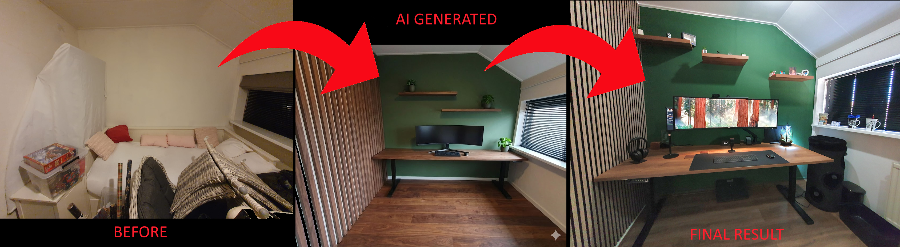

# Home office: Virtual room design with AI

 

[Overview](index) |
[Mood board](office_mood_board) |
Virtual design with AI |
[Room decoration](office_room_decoration) |
[Desk setup hardware](desk_setup_hardware) |
[Accessories](office_accessories)

 

After building a Pinterest [mood board](office_mood_board) with many photos of offices and desk setups I liked, it was time to look for the common elements.
From there, I could define a style and see what it might look like if elements from the board were virtually placed into MY room.

<em style="display:block; text-align:center">A snapshot from my Pinterest "new office" mood board</em>

To make the idea more realistic, I used [Gemini AI](https://gemini.google.com/) (any other AI tool with image generation, such as ChatGPT or Claude, can also be used) to transform a photo of the current room into what it COULD look like based on the mood board photos.
I uploaded the photo and entered prompts like these:
* *Remove all the items from the room*
* *Add a walnut floor*
* *Make the back wall dark green*
* *Add walnut acoustic panels to the wall*
* *Add a full room-width desk with a walnut top and place a widescreen monitor with a keyboard on it*
* *Add two floating shelves to the back wall and put small plants on it*

 
You can also add extra photos from the mood board to the prompt, for example, upload a photo of a specific desk you like and ask the AI to add that exact desk to the room.

 
This is what it generated.
If you ask again, the result can be very different.
You can also ask it to create multiple designs.

 
<em style="display:block; text-align:center">AI-generated room photo based on the current situation, modified with multiple prompts. Quite a difference!</em>

You can keep refining, swap out wall designs, ask for more detail, or upload photos from your mood board and have AI apply those specific elements to your room photo.\
You can also request a few alternative designs to explore different directions before committing to a final one.

> **_NOTE:_** One thing to watch out for: AI often struggles with scale.
Elements in the generated image may not be sized realistically, so always measure things yourself to verify they would actually fit.

[Continue reading](office_room_decoration) to see the next phase: turning the final idea into a realistic version of the room.

---

 

Home office:\
[Overview](index) |
[Mood board](office_mood_board) |
Virtual design with AI |
[Room Decoration](office_room_decoration) |
[Desk setup hardware](desk_setup_hardware) |
[Accessories](office_accessories)

 
