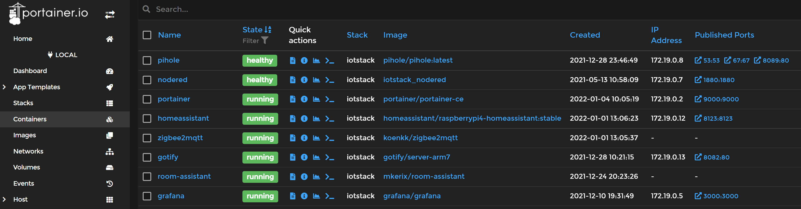
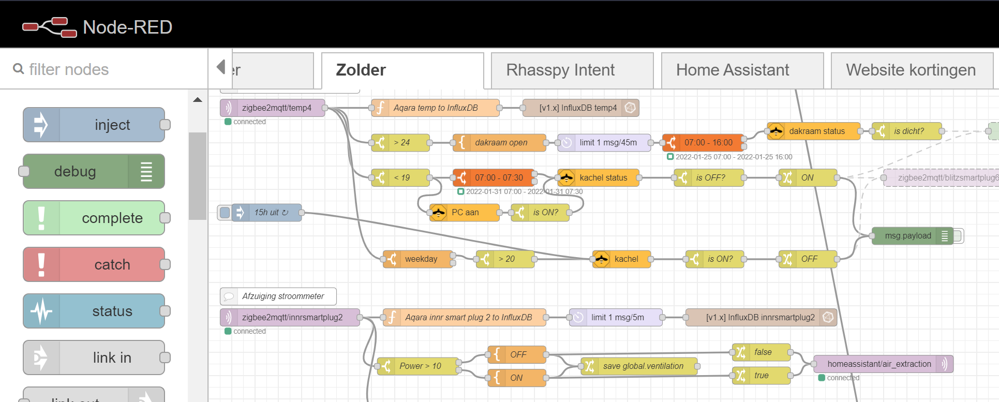
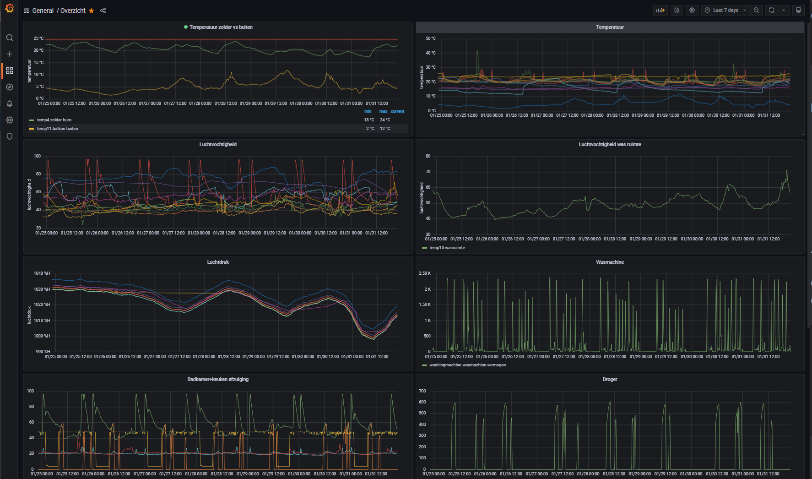

# Docker compose examples


The advantage of running applications using Docker is that it's easy to setup. 
Just with a few line you can have an application up and running.
Also update or rollback a version is possible with a single command.
For backups you don't need to backup the application itself but only the data(base) and configuration files are enough.


## Table of Contents
- [Docker commands](#)
- [Docker compose file explanation](#docker-compose-file-explanation)
- [Portainer](#portainer)
- [Node-RED](#node-red)
- [InfluxDB](#influxdb)
- [Grafana](#grafana)
- [Mosquitto](#mosquitto)
- [Zigbee2MQTT](#zigbee2mqtt)
- [Zigbee2MQTT Assistant](#zigbee2mqtt-assistant)
- [Rhasspy](#rhasspy)
- [Pi-hole](#pihole)
- [DSMR Reader](#dsmr-reader)
- [Home Assistant](#home-assistant)
- [Room Assistant](#room-assistant)
---

## Docker commands
You can control your docker containers via command line commands.
Here you find some usefully commands.

**Update container**

Get the latest version of the defined image from dockerhub.
```
docker-compose pull <container_name>
```
**Run container** 

Start the container on the background.
```
docker-compose up -d <container_name>
```
**Start container**

```
docker-compose start <container_name>
```
**Restart container**

```
docker-compose restart <container_name>
```
**Stop container**

```
docker-compose stop <container_name>
```

**Stop all container**

```
docker ps -aq | xargs docker stop 
```

**Cleanup old local images**

```
docker system prune -a
```
**Show container logs**

Show a constant stream of the last 30 log lines.
```
docker logs -f --tail 30 zigbee2mqtt
```
**Show all container**

Show all running containers.
```
docker ps
```
**Enter the bash in a container**

Use for the < container hash > the first column from a *docker ps* command.
```
docker exec -ti <container hash> bash
```
**More commands**

All the docker-compose commands can be found on the
<a href="https://docs.docker.com/compose/reference/" target="_blank">official page</a>.

---
## Docker compose file explanation
In the *docker-compose.yml* file you can define a list with applications. 
For each application you can override the default image container settings and map the internal container
ports (ports), environment variables (environment), directories (volumes) and hardware (devices) to the hosts. 
With this functionality you can easily backup custom data and settings.

*Example docker-compose.yml definition*
```
version: '2'
services:

  portainer:
    container_name: portainer
    image: portainer/portainer-ce
    ports:
      - 80:9000
    environment:
      - GF_SECURITY_ALLOW_EMBEDDING=true
    volumes:
      - ./volumes/portainer/data:/data
    devices:
      - /dev/serial/by-id/usb-xyz:/dev/ttyACM0
```

---
## Portainer

With Portainer you get a visual overview and control of your docker containers.\
You can open each docker terminal, with a single click, or see the internal logging.


```
  portainer:
    container_name: portainer
    image: portainer/portainer-ce
    restart: unless-stopped
    ports:
      - 9000:9000
    volumes:
      - /var/run/docker.sock:/var/run/docker.sock
      - ./volumes/portainer/data:/data
```

### Reset password
```
docker stop portainer
docker pull portainer/helper-reset-password
docker run --rm -v /home/pi/stack/volumes/portainer/data:/data portainer/helper-reset-password
```
The output show a new password.
```
{"level":"info","filename":"portainer.db","time":"...","message":"loading PortainerDB"}
Password successfully updated for user: admin
Use the following password to login: xxxxxxxxxxxxx
```

---

## Node-RED
Node-RED is a visual tool to create flows with blocks.\
You can use sensor data, date/time or other (online) triggers as input and each block in the chain can validate or modify data before it goes to the next block.

See my [Node-RED](../node-red/) page for examples.


Het docker-compose definition:
```  
  nodered:
    container_name: nodered
    build: ./services/nodered/.
    restart: unless-stopped
    user: "0"
    privileged: true
    ports:
      - 1880:1880
    volumes:
      - ./volumes/nodered/data:/data
      - /proc/net/arp:/host/arp
      - /var/run/docker.sock:/var/run/docker.sock
      - /var/run/dbus/system_bus_socket:/var/run/dbus/system_bus_socket
    devices:
      - "/dev/ttyAMA0:/dev/ttyAMA0"
      - "/dev/vcio:/dev/vcio"
      - "/dev/gpiomem:/dev/gpiomem"
```
The file `services/nodered/Dockerfile` installs node-RED and some usefull modules.
```
FROM nodered/node-red:latest
RUN for addonnodes in \
node-red-node-pi-gpiod \
node-red-dashboard \
node-red-contrib-influxdb \
node-red-contrib-arp \
node-red-contrib-counter \
node-red-contrib-edge-trigger \
node-red-contrib-interval-length \
node-red-contrib-isonline \
node-red-contrib-jsonpath \
node-red-contrib-push \
node-red-contrib-samsung-tv-control \
node-red-contrib-schedex \
node-red-contrib-telegrambot \
node-red-contrib-time-range-switch \
node-red-contrib-weekday \
node-red-contrib-zigbee2mqtt \
node-red-node-ping \
node-red-node-pushbullet \
node-red-node-rbe \
node-red-node-tail \
; do \
npm install ${addonnodes} ;\
done;
```

---

## InfluxDB
InfluxDB is a timebase database. 
Works seamless with Grafana to present sensor data over time.
```
  influxdb:
    container_name: influxdb
    image: "influxdb:latest"
    restart: unless-stopped
    ports:
      - 8086:8086
      - 8083:8083
      - 2003:2003
    env_file:
      - ./services/influxdb/influxdb.env
    volumes:
      - ./volumes/influxdb/data:/var/lib/influxdb
      - ./backups/influxdb/db:/var/lib/influxdb/backup
```
The content of the file `./services/influxdb/influxdb.env`
```
INFLUXDB_DATA_ENGINE=tsm1
INFLUXDB_REPORTING_DISABLED=false
INFLUXDB_ADMIN_ENABLED=true
INFLUXDB_USER=influx_user
INFLUXDB_USER_PASSWORD=influx_password
```

---

## Grafana
With Grafana you can visualize the sensor data over time.


```
  grafana:
    container_name: grafana
    image: grafana/grafana
    restart: unless-stopped
    user: "0"
    ports:
      - 3000:3000
    environment:
      - GF_SECURITY_ALLOW_EMBEDDING=true  # use Grafana as iframe in Home Assistant
    env_file:
      - ./services/grafana/grafana.env
    volumes:
      - ./volumes/grafana/data:/var/lib/grafana
      - ./volumes/grafana/log:/var/log/grafana
```

The content of the file `./services/grafana/grafana.env`
```
TZ=Europe/Amsterdam
GF_PATHS_DATA=/var/lib/grafana
GF_PATHS_LOGS=/var/log/grafana
GF_SECURITY_ALLOW_EMBEDDING=true
```

---

## Mosquitto

Mosquitto is a, so called, message broker for MQTT messages.\
Sensors can send their messages in json format to a MQTT topic and other applications can read those messages.

```
  mosquitto:
    container_name: mosquitto
    image: eclipse-mosquitto
    restart: unless-stopped
    user: "1883"
    ports:
      - 1883:1883
      - 8893:8893
      - 9001:9001
    volumes:
      - ./volumes/mosquitto/data:/mosquitto/data
      - ./volumes/mosquitto/log:/mosquitto/log
      - ./volumes/mosquitto/pwfile:/mosquitto/pwfile
      - ./services/mosquitto/mosquitto.conf:/mosquitto/config/mosquitto.conf
      - ./services/mosquitto/filter.acl:/mosquitto/config/filter.acl
```

The content of the file `./services/mosquitto/mosquitto.conf`
```
persistence true
persistence_location /mosquitto/data/
log_dest file /mosquitto/log/mosquitto.log

listener 1883
protocol mqtt

allow_anonymous true

listener 9001
protocol websockets
```

---

## Zigbee2MQTT

A bridge to read Zigbee devices values and convert the data to json and send it to the [mosquitto](#mosquitto) MQTT server.


```
  zigbee2mqtt:
    container_name: zigbee2mqtt
    image: koenkk/zigbee2mqtt
    ports:
      - 8081:8081
    volumes:
      - ./volumes/zigbee2mqtt/data:/app/data
      - /run/udev:/run/udev:ro
    devices:
      # slaesh cc2652 stick settings
      - /dev/serial/by-id/usb-Silicon_Labs_slae.sh_cc2652rb_stick_-_slaesh_s_iot_stuff_00_12_4B_00_21_CB_EF_58-if00-port0:/dev/ttyACM0
      #- /dev/serial/by-id/usb-Texas_Instruments_CC2538_USB_CDC-if00:/dev/ttyACM0
    restart: unless-stopped
    network_mode: host
    environment:
      - TZ=Europe/Amsterdam
```
The content of the file `./volumes/zigbee2mqtt/configuration.yaml` where you define things like all theZigbee devices and the groups with their devices.
```
homeassistant: true
permit_join: true
mqtt:
  base_topic: zigbee2mqtt
  server: mqtt://localhost:1883
serial:
  port: /dev/ttyACM0
advanced:
  pan_id: 6756
  report: true
frontend:
  port: 8081
experimental:
  new_api: true
devices:
  '0x000d6ffffefc2fbf':
    friendly_name: ikeasmartplug1
    debounce: 1
    retain: true
groups:
  '1901':
    friendly_name: group_lights1
    retain: true
    transition: 4
    optimistic: true
    devices:
      - ikealamp1
      - ikealamp2
      - ikealamp3

```

---

## Zigbee2MQTT Assistant

``` 
  zigbee2mqttassistant:
    container_name: zigbee2mqttassistant
    image: carldebilly/zigbee2mqttassistant
    restart: unless-stopped
    env_file:
      - ./services/zigbee2mqttassistant/zigbee2mqttassistant.env
    ports:
      - 8880:80
    environment:
      - VIRTUAL_HOST=~^zigbee2mqttassistant\..*\.xip\.io
      - VIRTUAL_PORT=8880
```

---

## Rhasspy
```
  rhasspy:
    image: rhasspy/rhasspy
    container_name: rhasspy
    restart: unless-stopped
    volumes:
       - ./volumes/rhasspy/data:/profiles
       - /etc/localtime:/etc/localtime:ro
       - /etc/asound.conf:/etc/asound.conf
    ports:
       - "12101:12101"
       - "12183:12183"
    devices:
       - /dev/snd:/dev/snd
       - /dev/bus/usb/001/006:/dev/bus/usb/001/009
    command: --user-profiles /profiles --profile nl        
```

---

## Pihole
```
  pihole:
    container_name: pihole
    image: pihole/pihole:latest
    ports:
      - "53:53/tcp"
      - "53:53/udp"
      - "67:67/udp"
      - "8089:80/tcp"
      #- "443:443/tcp"
    env_file:
      - ./services/pihole/pihole.env
    volumes:
       - ./volumes/pihole/etc-pihole/:/etc/pihole/
       - ./volumes/pihole/etc-dnsmasq.d/:/etc/dnsmasq.d/
       - ./volumes/pihole/my-external.conf:/etc/lighttpd/external.conf
    dns:
      - 127.0.0.1
      - 8.8.8.8
    # Recommended but not required (DHCP needs NET_ADMIN)
    #   https://github.com/pi-hole/docker-pi-hole#note-on-capabilities
    cap_add:
      - NET_ADMIN
    restart: unless-stopped
```

---

## DSMR Reader
```
  dsmr:
    container_name: dsmr
    image: xirixiz/dsmr-reader-docker:latest
    depends_on:
      - dsmrdb
    cap_add:
      - NET_ADMIN
    restart: always
    volumes:
      - /etc/localtime:/etc/localtime:ro
      - ./volumes/dsmr/data/backups:/dsmr/backups
    environment:
      - DJANGO_TIME_ZONE=Europe/Amsterdam
      - VIRTUAL_HOST=localhost
    ports:
      - 7777:80
      - 7779:443
    devices:
      - /dev/ttyUSB0:/dev/ttyUSB0
      
  dsmrdb:
    container_name: dsmrdb      
    image: postgres:12-alpine
    restart: always
    volumes:
      - /etc/localtime:/etc/localtime:ro
      - ./volumes/dsmr/data/db:/var/lib/postgresql/data
    environment:
      - TZ=Europe/Amsterdam
      - PG_TZ=Europe/Amsterdam
      - POSTGRES_USER=dsmrreader
      - POSTGRES_PASSWORD=****
      - POSTGRES_DB=****
```

---

## Home Assistant
```
  homeassistant:
    container_name: home-assistant
    image: homeassistant/raspberrypi4-homeassistant:stable
    volumes:
      - ./volumes/home-assistant:/config
    environment:
      - TZ=Europe/Amsterdam
    restart: unless-stopped
    network_mode: host
```

---

## Room Assistant
```
  room-assistant:
    container_name: room-assistant
    image: mkerix/room-assistant
    network_mode: host
    restart: always
    volumes:
      - /var/run/dbus:/var/run/dbus
      - ./volumes/room-assistant/config:/room-assistant/config
```
---
[Table of Content >](#table-of-contents)

[Index page >](../index)