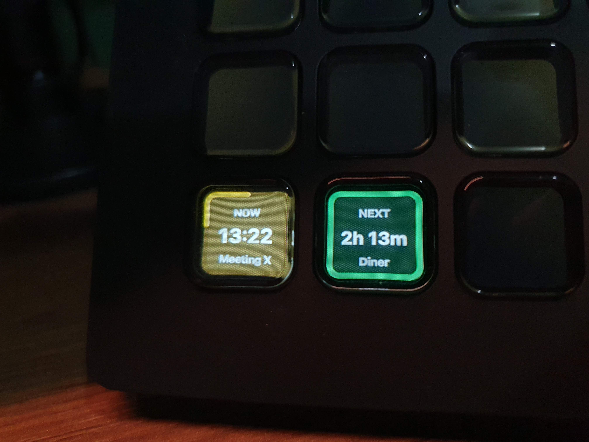
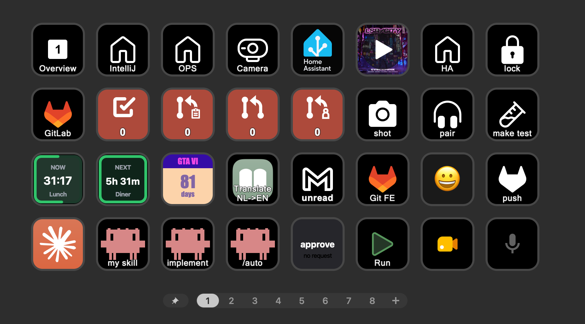
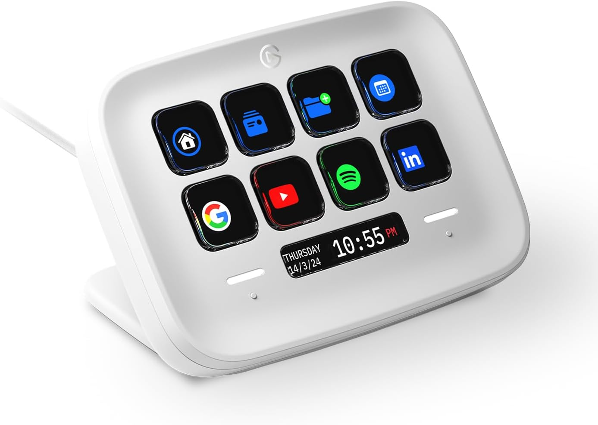
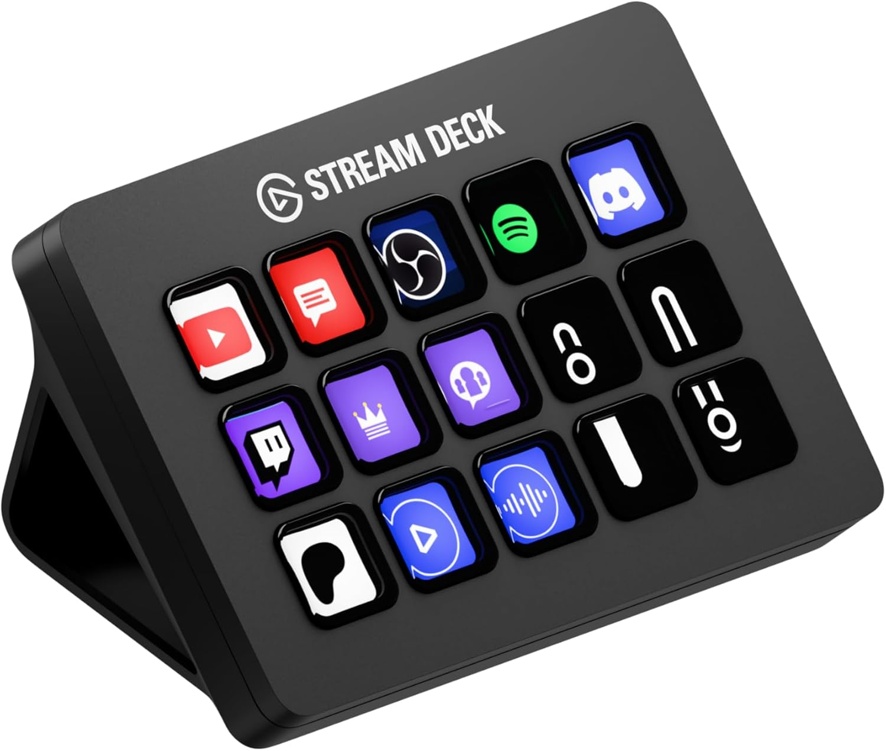
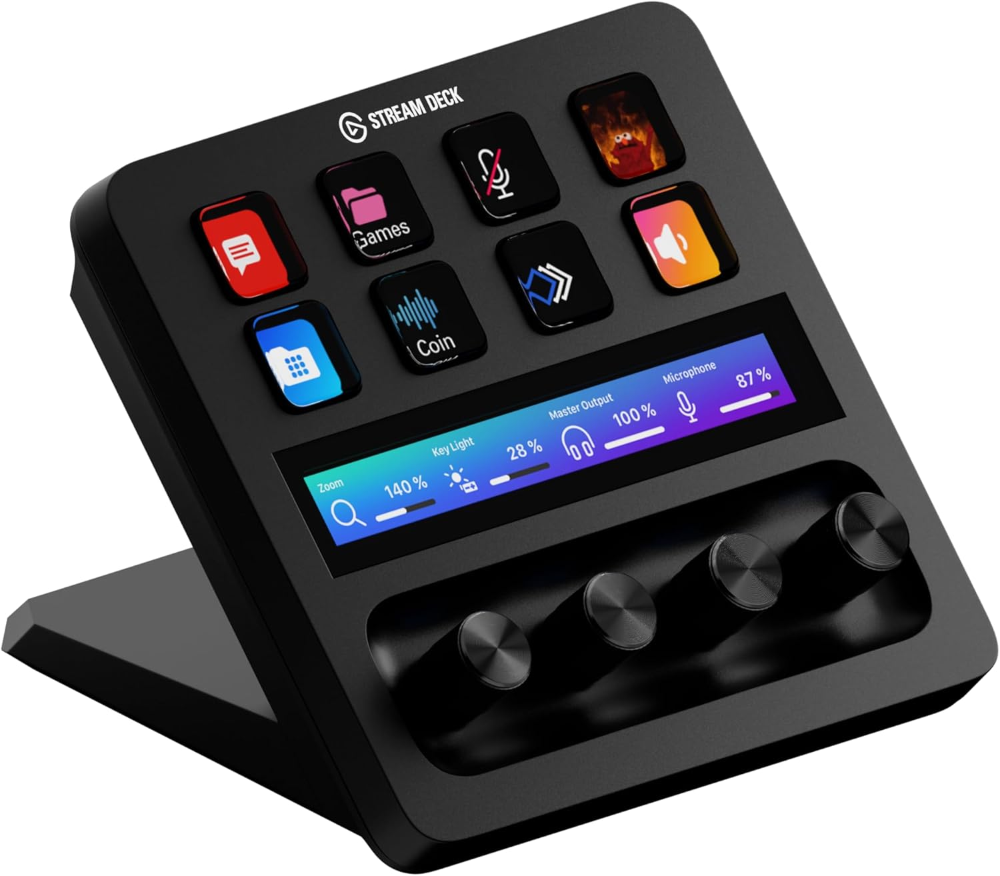
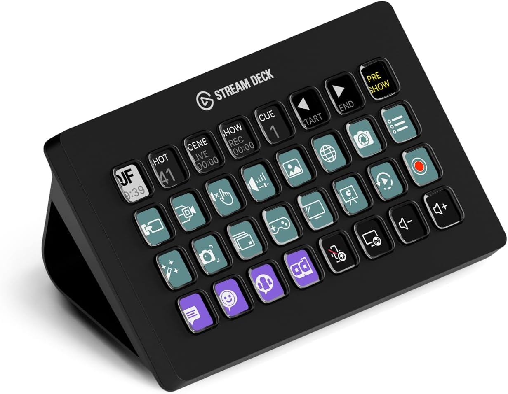
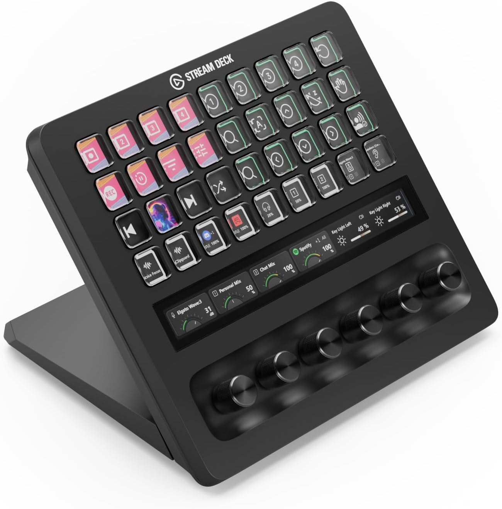
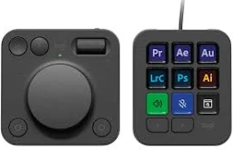
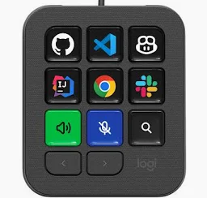
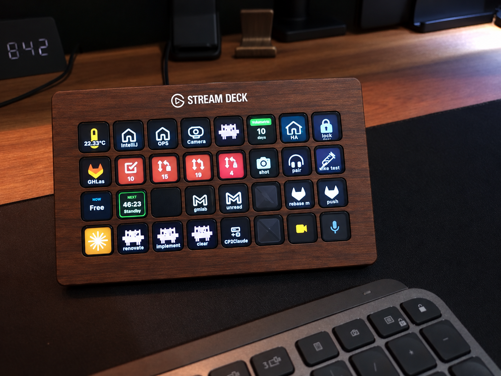



# Elgato Stream Deck

*For a software developer*

## Introduction

For all my years as a developer, a nice keyboard was good enough for my daily work.

I've always enjoyed creating scripts to automate tasks on my PC, phone, and at home, so this device is a small step for me.
I don't know why it took me so long to find it!

Read on this page to see how I use it and whether it is something you did not know you wanted as well!

You can use it to control AI agent controls, videocalls, IDEs, meetings, GitHub, GitLab, Home Assistant etc...

Here you find sections about:
* [What is a Stream Deck?](#what-is-a-stream-deck)
* [All available Elgato models](#stream-deck-comparison)
* [Many example button actions](#button-actions)

[//]: # (* [How to import and export actions]&#40;#import-and-export-data&#41;)

<em style="display:block; text-align:center">One of the pages on my Stream Deck. It's not only buttons but also information displayed on it.</em>

---

## Table of Contents

<!-- TOC -->
  * [What is a Stream Deck?](#what-is-a-stream-deck)
  * [My introduction with a Stream Deck](#my-introduction-with-a-stream-deck)
  * [Button actions](#button-actions)
  * [Stream Deck models comparison](#stream-deck-models-comparison)
    * [Alternative solutions](#alternative-solutions)
      * [Logitech MX Creative Console](#logitech-mx-creative-console)
      * [Logitech MX Keypad](#logitech-mx-keypad)
      * [Codex Creator Micro](#codex-creator-micro)
    * [My advised model for a software developer](#my-advised-model-for-a-software-developer)
    * [My personal ideal model](#my-personal-ideal-model)
<!-- TOC -->

---
## What is a Stream Deck?

A Stream Deck is a kind of keyboard where you can program each button yourself. This keypad is connect via USB with your computer.
The special part is that every button has its own little LCD screen behind it, so instead of a blank key or with a static icon, you see an icon, a label, a color or even a live value.
One press runs whatever you linked to that button: a keyboard shortcut, a script, multiple steps, an API call or an action from one of the many plugins.

 
<em>Buttons with live data: how long your current meeting takes and when the next one is.</em>

The device itself doesn't contain any OS or application, a Stream Deck application runs on the connected computer. This app does all the handling and control of the buttons.
Elgato official support Windows and MacOS and for Linux is an open source solution, OpenDeck.
You can't use it as standalone device.

Elgato (nowadays part of Corsair) originally built it for live streamers, who need to switch scenes, mute their
microphone and fire a sound effect without ever leaving their game. But the device itself doesn't know anything about
streaming, it triggers whatever you configure, and that makes it just as useful for everybody else who repeats the same
actions all day: video editors, photographers, musicians, people in endless video calls, home automation tinkerers and software developers!

The problem it solves is that shortcuts don't scale. You can remember five or ten key combinations, but not fifty, and
half of your tools use a different combination for the same thing. On top of that a lot of daily actions aren't a
shortcut at all but a small chore: open this dashboard, run that script, join the standup, set the lights for a call.

Because each button shows what it does, you don't have to remember anything, you just look and press. And with pages and
profiles you can give every application its own set of buttons, so the same hardware turns into a different control panel depending on which app you're working in.

Elgato has different models: with additional buttons, displays and dails.

<em style="display:block; text-align:center">Mini</em>

<em style="display:block; text-align:center">Neo</em>

<em style="display:block; text-align:center">MK.2</em>

<em style="display:block; text-align:center">+</em>

<em style="display:block; text-align:center">XL</em>

<em style="display:block; text-align:center">+ XL</em>

Technically a Stream Deck is one big LCD screen split into different regions for each button its own screen section.
Each button is transparant so you can see what's displayed behind it.
Here is a YouTube video of a tear down of a Stream Deck.

<em style="display:block;">Tear down of a Stream Deck</em>

---
## My introduction with a Stream Deck

I looked at the keypads available on the market for triggering frequently used scripts.
They connect via Bluetooth or USB and have between 3 and 32 buttons.
Some devices have an additional touch display or dial knobs.
I also found the wide range of Elgato Stream Deck devices. They are mainly used by streamers to quickly switch scenes and trigger actions during live streams, but they also work well for any other computer users.

The big advantage of these Elgato devices is that each button has its own display, which can be completely customized.
You do not have to remember what each button does.
You can also create multiple different action pages, multiplying the actions you can trigger with the same number of buttons.
I found many integrations and SDK features for building your own actions.
This makes it a cool gadget to play with.

Looking at the different models, I liked the new scissor keys on the [new MK.2 15-button version](#stream-deck-comparison),
but the [32-button version](#stream-deck-comparison) gave me more direct controls without switching between pages, so I went for this one to give it a shot!

<em style="display:block; text-align:center">Stream Deck MK.2, 15 buttons</em>

<em style="display:block; text-align:center">Stream Deck XL, 32 buttons</em>

Look [here](#stream-deck-comparison) for all available models.

---
## Button actions

I created a separated page with downloadable button for all kinds of actions and applications.

Actions for Claude, video calls, calendar items, website shortcuts, GitHub, Gmail, Home Assistant, event countdowns, etc...

<a href="stream_deck_button_actions">
Click here to go my page with many (developers) button action examples.

</a>
<em style="display:block; text-align:center">An example of how a Stream Deck button page could look like.</em>

[//]: # (---)

[//]: # (## Import and Export data)

[//]: # ()
[//]: # (See the separated [import and export page]&#40;stream_deck_import_export&#41; how to import and export actions, profiles, icons etc to share, load and backup your actions.)

---
## Stream Deck models comparison

Elgato (part of Corsair) sells a whole family of Stream Decks. They all run on the same Stream Deck software. They
mainly differ in the number of buttons, dials, and displays.

This table provides an overview of the different models, scroll to the right to see them all.

| Stream Deck          | Mini                                                                                                                                    | Neo                                                                                                                                  | MK.2                                                                                                                                  | MK.2 Scissor Keys                                                                                                                                 | +                                                                                                                                    | XL                                                                                                                                | + XL                                                                                                                                          | Mobile                                                                                                                                                             | Modules                                                                                                                                       |
|----------------------|-----------------------------------------------------------------------------------------------------------------------------------------|--------------------------------------------------------------------------------------------------------------------------------------|---------------------------------------------------------------------------------------------------------------------------------------|---------------------------------------------------------------------------------------------------------------------------------------------------|--------------------------------------------------------------------------------------------------------------------------------------|-----------------------------------------------------------------------------------------------------------------------------------|-----------------------------------------------------------------------------------------------------------------------------------------------|--------------------------------------------------------------------------------------------------------------------------------------------------------------------|-----------------------------------------------------------------------------------------------------------------------------------------------|
| **Image**            |  |  |  |  |  |  |  |                       |  |
| **Buttons**          | 6                                                                                                                                       | 8 + 2 touch points                                                                                                                   | 15                                                                                                                                    | 15                                                                                                                                                | 8                                                                                                                                    | 32                                                                                                                                | 36                                                                                                                                            | 15 or 32 (virtual)                                                                                                                                                 | 6 or 15                                                                                                                                       |
| **Extra display**    | No                                                                                                                                      | Yes, "info bar"                                                                                                                      | No                                                                                                                                    | No                                                                                                                                                | Yes, LCD Infobar touch strip                                                                                                         | No                                                                                                                                | Yes, LCD Infobar touch strip                                                                                                                  | n/a                                                                                                                                                                | No                                                                                                                                            |
| **Dials**            | 0                                                                                                                                       | 0                                                                                                                                    | 0                                                                                                                                     | 0                                                                                                                                                 | 4 (rotate + push)                                                                                                                    | 0                                                                                                                                 | 6 (rotate + push)                                                                                                                             | 0                                                                                                                                                                  | 0                                                                                                                                             |
| **Size (D × W × H)** | 84 × 60 × 58 mm                                                                                                                         | 107 × 78 × 26 mm                                                                                                                     | 118 × 84 × 25 mm (without stand)                                                                                                      | 118 × 84 × 25 mm (without stand)                                                                                                                  | 140 × 138 × 110 mm                                                                                                                   | 34 × 182 × 112 mm (without stand)                                                                                                 | 205 × 147 × 175 mm                                                                                                                            | Your phone                                                                                                                                                         | Depends on the enclosure                                                                                                                      |
| **Purpose**          | Cheapest entry model, for a handful of fixed actions                                                                                    | Budget mid-range with a built-in stand, page switching via the two touch points                                                      | The classic all-rounder with the original clicky keys                                                                                 | Same board as the MK.2 but with low-travel scissor keys: quieter and softer to press                                                              | Best choice when you need analog control: volume, brightness, EQ, timeline scrubbing, light dimming                                  | Maximum direct controls without switching pages, my choice for development shortcuts                                              | The 2026 flagship, "pro control surface" for broadcast studios and editing bays                                                               | Subscription app for iOS/Android, handy to try out the software before buying hardware                                                                             | OEM/DIY boards to build the keypad into your own desk or panel                                                                                |
| **Product page**     | [Elgato](https://www.elgato.com/ww/en/p/stream-deck-mini)                                                                               | [Elgato](https://www.elgato.com/ww/en/p/stream-deck-neo)                                                                             | [Elgato](https://www.elgato.com/ww/en/p/stream-deck-mk2-black)                                                                        | [Elgato]([https://www.elgato.com/ww/en/p/stream-deck-mk2-scissor-keys-black](https://www.elgato.com/ww/en/p/stream-deck-scissor-keys))            | [Elgato](https://www.elgato.com/ww/en/p/stream-deck-plus-black)                                                                      | [Elgato](https://www.elgato.com/ww/en/p/stream-deck-xl)                                                                           | [Elgato](https://www.elgato.com/ww/en/p/stream-deck-plus-xl)                                                                                  | [Elgato](https://www.elgato.com/ww/en/s/stream-deck-mobile)                                                                                                        | [Elgato](https://www.elgato.com/ww/en/p/stream-deck-module-15-keys)                                                                           |
| **Buy US**\*         | [Amazon US](https://amzn.to/4xlUk6F#ad)                                                                                                 | [Amazon US](https://amzn.to/4fOxVrA#ad)                                                                                              | [Amazon US](https://amzn.to/4xAME0z#ad)                                                                                               | [Amazon US](https://amzn.to/4h5Q3iM#ad)                                                                                                           | [Amazon US](https://amzn.to/3RrBEmN#ad)                                                                                              | [Amazon US](https://amzn.to/4ySoxvD#ad)                                                                                           | [Amazon US](https://amzn.to/4fV0q70#ad)                                                                                                       | [Android](https://play.google.com/store/apps/details?id=com.corsair.android.streamdeck) / [iOS](https://apps.apple.com/app/elgato-stream-deck-mobile/id1440014184) |                                                                                                                                               |
| **Buy NL**\*         | [Amazon NL](https://amzn.to/4xzqr3k#ad)                                                                                                 | [Amazon NL](https://amzn.to/4zRWxsG#ad)                                                                                              | [Amazon NL](https://amzn.to/4qUl1NF#ad)                                                                                               | [Amazon NL](https://amzn.to/4y5fR3K#ad)                                                                                                           | [Amazon NL](https://amzn.to/4gEnp6i#ad)                                                                                              | [Amazon NL](https://amzn.to/4gJorhG#ad)                                                                                           | [Amazon NL](https://amzn.to/3T5kzj4#ad)                                                                                                       | [Android](https://play.google.com/store/apps/details?id=com.corsair.android.streamdeck) / [iOS](https://apps.apple.com/app/elgato-stream-deck-mobile/id1440014184) |                                                                                                                                               |

See all these models together on this [Amazon US](https://amzn.to/4wESUUS)* or [Amazon NL](https://amzn.to/4yasECa)* page.

\* Links on this page may be affiliate links. You pay the normal price while supporting my blog.

---
### Alternative solutions

#### Logitech MX Creative Console

Logitech has the MX Creative Console with a 9-button keypad and a dail. 
As target group designers.

{{imgBasket}}Logitech MX Creative Console on [Amazon](https://amzn.to/3SYOLfE#ad)

#### Logitech MX Keypad

Logitech introduced recently a small 9 button keypad also for software developers as target group.
You get a 3-month free GitHub Copilot Pro+ subscription with it.

{{imgBasket}}Logitech MX Keypad on [Logitech.com](https://www.logitech.com/shop/p/mx-keypad)

#### Codex Creator Micro

A keypad created by OpenAI from ChatGPT focussed on the Codex AI agent.
It contains 13x Mechanical switches, 1x Touch sensor, 1x Rotary encoder, 1x joystick and light up keys to indicate the state of the different AI agents.

{{imgBasket}}Codex Creator Micro on [Open AI](https://openai.com/supply/co-lab/work-louder/) [out of stock]

---
### My advised model for a software developer

The 15-button MK.2 and the 32-button XL are the most interesting models for me as a software developer:
they have many buttons for a full set of shortcuts without switching pages to reach buttons for all kinds of apps.

### My personal ideal model

If I could create my ideal Elgato Stream Deck, it would use the 32-button XL as its base, with the following
modifications:

* Scissor keys: silent, with a consistent click across each button.
* Matte button finish: the current buttons reflect all the light.
* A brighter backlit screen: images can look a little pale.
* A walnut-look surround for the buttons to match my other [desk accessories](/desk/office_accessories).

 

<em style="display:block; text-align:center">AI generated how my ideal Stream Deck model should look like.</em>

---

I hope you get inspired and maybe you now also this as a product you didn't know you needed.
Or do you have all the actions and information also direct available with your normal keyboard and on your screen?\
See [here](stream_deck_button_actions) which button actions I use on my Stream Deck.
