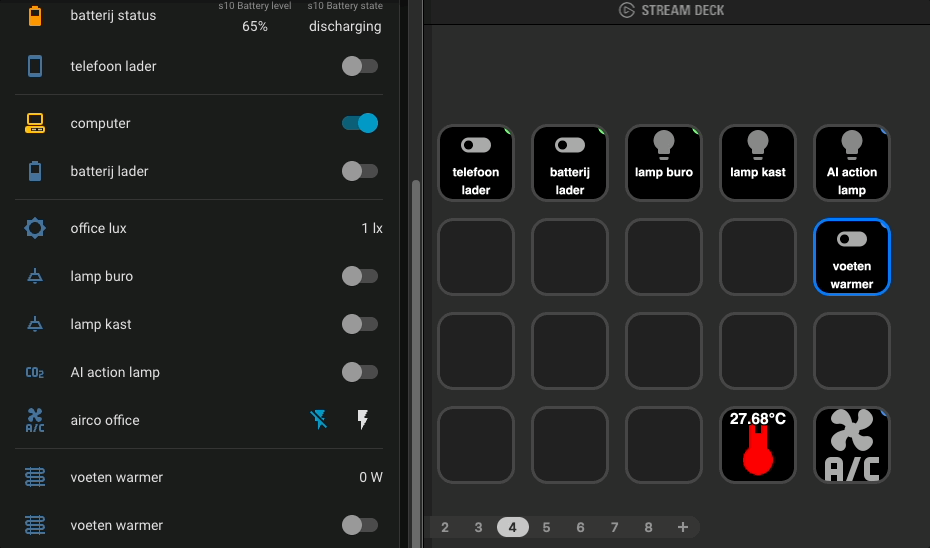
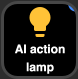
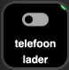
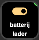
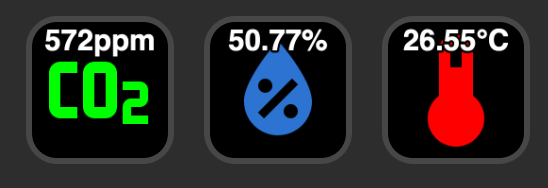
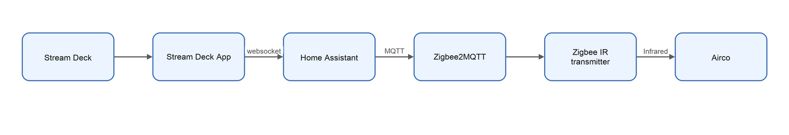

# Elgato Stream Deck - Home Assistant integration

*With the Home Assistant plugin*

Don't you know what a Stream Deck is? Check [here first](/elgato_stream_deck).

<em style="display:block; text-align:center">HA dashboard next to the Stream Deck app, fast and interactive integration</em>

Control and visualize your Home Assistant entities direct with your Elgato Stream Deck!
This is possible with
the [Stream Deck Home Assistant plugin](/elgato_stream_deck/stream_deck_button_actions#home-assistant).

What you can control and show on the Stream Deck:

- [Toggle lights, with the live on/off state and light color on the key](#lights-control)
- [Switch smart sockets on or off and see which devices are still powered](#smart-socket-control)
- [Show live sensor values, like the current office temperature, humidity, CO2](#show-current-states-like-temperature-humidity-co2)
- [Turn a non-smart air conditioner on or off via an IR transmitter](#ac-control-via-ir)
- [Open your camera stream dashboard with a single key press](#direct-open-camera-streams)

---

## Lights control

Toggle a Home Assistant `light` entity with a single key press.
The key icon follows the live state of the lamp: a bright, colored bulb when the lamp is on and a pale bulb when it's
off.
The bulb color also reflects the current light color, like my AI user input required lamp which lights ups on my desk to trigger me, check [here](/ai/ai-user-input-needed-notification-light) for all details about this project.

<em style="display:block; text-align:center">AI action required light</em>

## Smart socket control

Turn smart plugs (`switch` entities) on or off, like the chargers for my phone and batteries or the heater under my desk.
The toggle icon shows the actual state: gray when off, colored when on.
So you can see at a glance which devices are still powered, without opening the Home Assistant dashboard.

<em style="display:block; text-align:center">phone charger (off)</em>

<em style="display:block; text-align:center">battery charger (on)</em>

## Show current states like temperature, humidity, CO2

A key doesn't have to trigger an action, it can also be used as a small display.
These keys shows the current value of a CO2, humidity and temperature `sensor` entity, updated live when the sensor reports a new value.

<em style="display:block; text-align:center">live room values visible on your Stream Deck</em>

## AC control via IR

My air conditioner has no smart connection, only an infrared remote.
With a [Zigbee IR transmitter](/zigbee/smart_infrared_transmitter_receiver) controlled by Home Assistant I can send the same IR codes as the original air conditioner remote.\
This key toggles a template switch in Home Assistant which sends the IR on/off code via Zigbee2MQTT to the air conditioner.
Now I can control my air conditioner directly from Home Assistant with automations or manually from my Stream Deck.

<em style="display:block; text-align:center">control IR air conditioner on/off via a Stream Deck</em>

 

This is a diagram of how it technically works:

<em style="display:block; text-align:center">Stream Deck -> Home Assistant -> Zigbee2MQTT -> Zigbee IR transmitter -> AC</em>

## Direct open camera streams

With a single button click you can open your Home Assistant dashboard where your camera stream are visible.

---

Read more about the [Stream Deck](/elgato_stream_deck) or how to [make dump infrared devices smart](/zigbee/smart_infrared_transmitter_receiver).