

# ESPHome CO2 sensor

*Based on the SCD40 sensor*

## Introduction

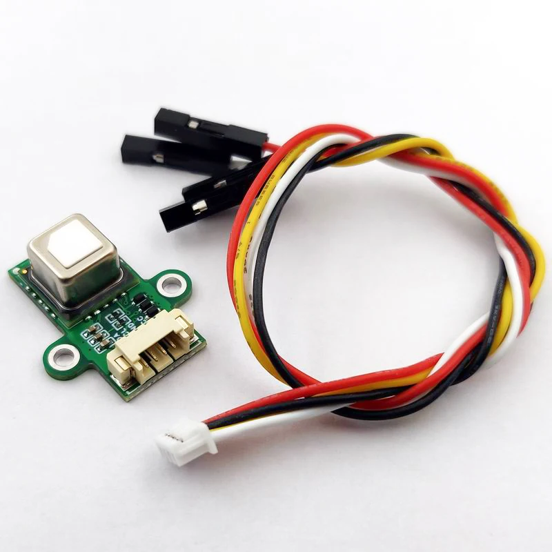

There are CO2 sensors available, most of them are expensive, but 
you can also create one yourself with just a single sensor and an ESP board. 
It's easy (and fun) to create one yourself.\
You can even create this one WITHOUT SOLDERING!!

CO2 stands for `Carbon dioxide` and is measured in `Parts per million` (ppm).

If your in a space with a too high ppm level, you can feel tired, your start yawning and can give you a headache.
For your, and your family health, it's important to act when these values are too high.\
The value rice gradual, so you don't notice it directly. 
That's why it's important to get notified about it.

The base value is what you measure outside and is around 400 ppm.

This table shows for which value, which action is required.

| ppm        | condition | action                              |
|------------|-----------|-------------------------------------|
| 400 - 800  | good      | no action is required               |
| 800 - 1200 | medium    | open a window                       |
| 1200+      | bad       | limit has reached, open all windows |

<br>

In Home Assistant, you can visualize how the CO2 value changed over time.

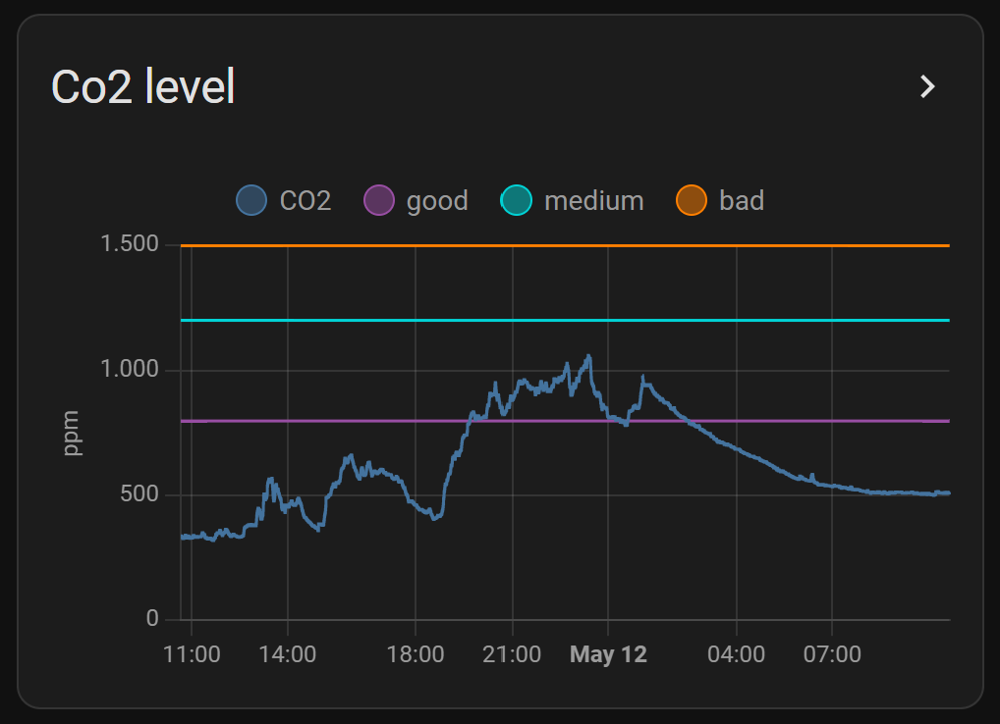

Read along how you create this graph yourself.

---

## My solution

This sensor is the easiest way to start with ESPHome.\
No soldering is required here.\
You only need to connect the wires to the ESP and flash the correct configuration.

<a href="images_scd40/hardware.jpg">
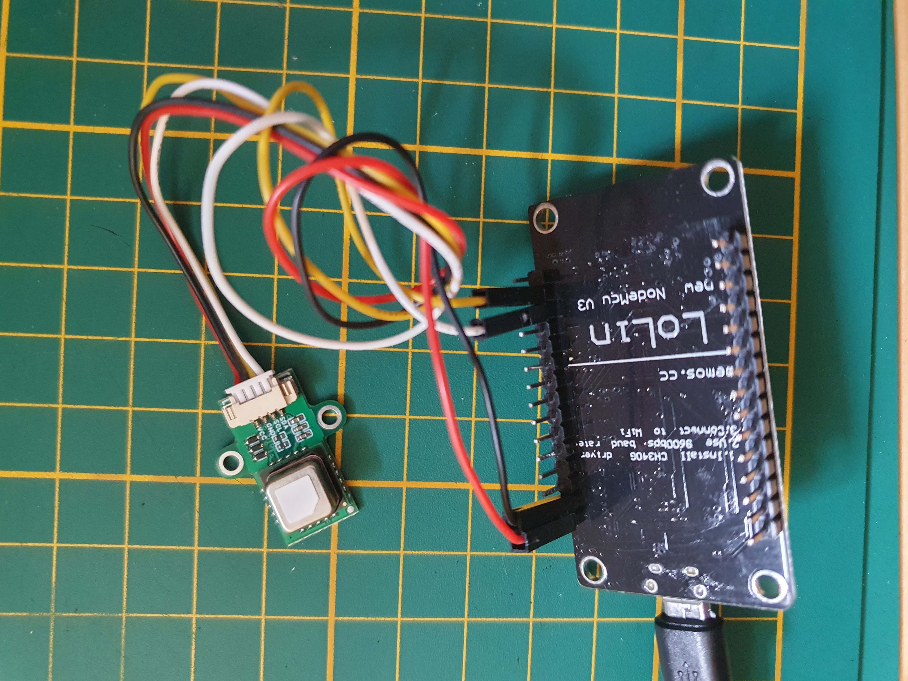
</a>

Click on the photo to open it fullscreen.

---

## Table of Contents
<!-- TOC -->
  * [My solution](#my-solution)
  * [Required hardware](#required-hardware)
  * [Connect the hardware](#connect-the-hardware)
  * [Required software](#required-software)
  * [Test if it works](#test-if-it-works)
  * [Home Assistant Dashboards](#home-assistant-dashboards)
<!-- TOC -->

---

## Required hardware

These hardware components do I use for this project.

Affiliate links are used here. Same price, and you sponsor this blog.

### SCD40 CO2 sensor

This small gas sensor measures CO2 (in a range 400-2000 ppm) and also temperature (-10-60 degrees) and humidity (0-100 percent).\
The [SCD40 datasheet](https://sensirion.com/media/documents/E0F04247/631EF271/CD_DS_SCD40_SCD41_Datasheet_D1.pdf) for all the details specs from this sensor.

<a href="https://s.click.aliexpress.com/e/_DB01je7" target="_blank">
This sensor is useful if you don't want to solder (AliExpress)
<br>

</a>

### ESP board

You can use any ESP board: [ESP32](../buy/esphome_diy#esp32), [ESP D1 mini](../buy/esphome_diy#esp-d1-mini), 
but on this page I use an ESP8266.

<a href="https://s.click.aliexpress.com/e/_EIwdbqH" target="_blank">
ESP8266 NodeMCU v3 (Ch340) with pre soldered pins (AliExpress)
<br>


<br>
<a href="https://s.click.aliexpress.com/e/_mPJWRqE" target="_blank">Alternative link (AliExpress)</a>
<br>

### Case

You can use any object with holes in it, which has a minimum length of 7 cm, width of 3 cm, and a height of 3 cm.\
The only requirement is that there could be enough air reach the sensor to measure the values in the air.\

It can also be a plastic box from a local shop and drill some holes in it.

Also, a decorative small statuette can be used as long as it is porous or with holes.

On AliExpress they also sell 
<a href="https://s.click.aliexpress.com/e/_DDALbXD" target="_blank">
Plastic DIY Cases (AliExpress)
<br>

</a>
<br>

### USB power cable

A cable to power the ESP.

<a href="https://s.click.aliexpress.com/e/_onj6tZi" target="_blank">
Micro USB cable to USB A to power the ESP (AliExpress)
<br>

</a>
<br>

### 5V USB power adapter

A power adapter to power the ESP.

<a href="https://s.click.aliexpress.com/e/_DBB3Upl" target="_blank">
5V USB power adapter (AliExpress)
<br>

</a>

<br>
<br>

Found a dead link? [Please inform me](https://github.com/vdbrink/vdbrink.github.io/issues) or look at [ESPHome DIY sensors - Best Buy Tips](../buy/esphome_diy) for alternative links.

---

## Connect the hardware

I've made a scheme how to connect the GY SCD40 to the ESP.\
This sensor uses an i2c bus interface to connect to the ESP. 
This makes it possible to connect multiple sensors to this bus.\
The ESP has predefined pins for SDA (data) and SDL (clock).

| ESP pin | GPIO esp8266 pin | SCD40 pin   | color  |
|---------|------------------|-------------|--------|
| D2      | GPIO4            | SDA (data)  | white  |
| D1      | GPIO5            | SDL (clock) | yellow |
| G       | GND              | GND         | black  |
| 3V      | 3 V              | VCC         | red    |

### Connect the SCD40 to the ESP

Connect the four wires direct to the ESP8266 NodeMCU like this.

<a href="images_scd40/hardware.jpg">

</a>

<a href="images_scd40/hardware_connect.jpg">

</a>

Click on the photos to open them in fullscreen.

---

## Required software

### ESPHome


The only software you need is <a href="https://esphome.io/" target="_blank">ESPHome</a>.

This software is used to flash the config file to the ESP board.

Their website contains a lot of information about how-to config and calibrate all kinds of sensors.\
Also, the one we used here:
* [ESPHome SCD4X page](https://esphome.io/components/sensor/scd4x.html)
* [ESPHome I2C page](https://esphome.io/components/i2c.html)

### Flash the script

There are a lot of ways to flash the config file with ESPHome to the board.\
Read [here](esphome_flashing) how to upload it.

Connect the ESP via USB to the computer.

One possible way is to run Python in command line:
> esphome "co2_scd40.yaml" run

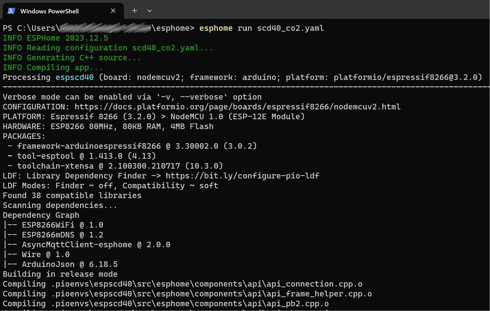

The `co2_scd40.yaml` YAML script:
```yaml
# Sourcecode by vdbrink.github.io
esphome:
  name: espscd40
  comment: Room CO2 sensor
  platform: ESP8266
  board: nodemcuv2

wifi:
  ssid: "XXX"
  password: "XXX"
  fast_connect: true # only needed for hidden SSID

# Push the data also to MQTT topics: 
# * CO2 espscd40/sensor/scd40_co2/state
# * Temperature espscd40/sensor/co2_temperature/state  
# * Humidity espscd40/sensor/co2_humidity/state
mqtt:
  broker: 192.168.XXX.XXX
  port: 1883
  username: "XXXX"
  password: "XXXX"

# Enable logging to the console
logger:

# Home Assistant integration
api:

# Pins on an esp8266
i2c:
  sda: 4 # pin 21 for an ESP32
  scl: 5 # pin 22 for an ESP32

# Sensors definitions
sensor:
  - platform: scd4x
    co2:
      name: "SCD40 CO2"
    temperature:
      name: "CO2 temperature"
    humidity:
      name: "CO2 humidity"
```

---
## Test if it works

Now the data is flashed, check if the sensor pushes the data correctly.

### Via console
If you flash the ESP via the console and enabled logging, 
you see the readings in the console direct after the ESP is flashed.

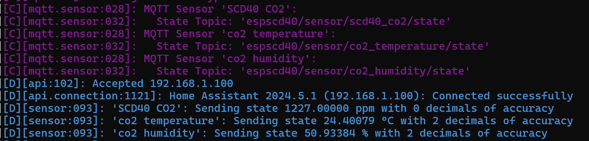

### Via Home Assistant

Ones the ESP is online it automatically registers itself by Home Assistant if you installed ESPHome.

You will see a new device with three entities, CO2 , temperature and humidity.

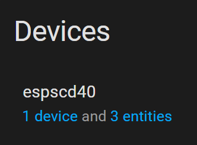

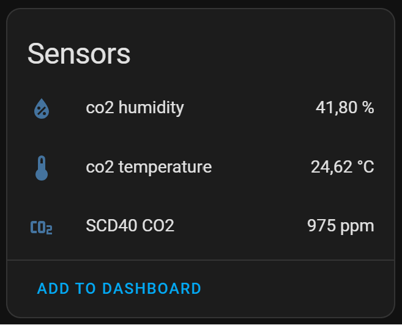

### Via MQTT
One way is to test, if the ESP works now, check for incoming MQTT messages (if you enabled it in the config).  
On Windows you can use the application MQTT Explorer. 
The sensor sends it data to the topics `/homeassistant/sensor/espscd40` and `/espscd40`

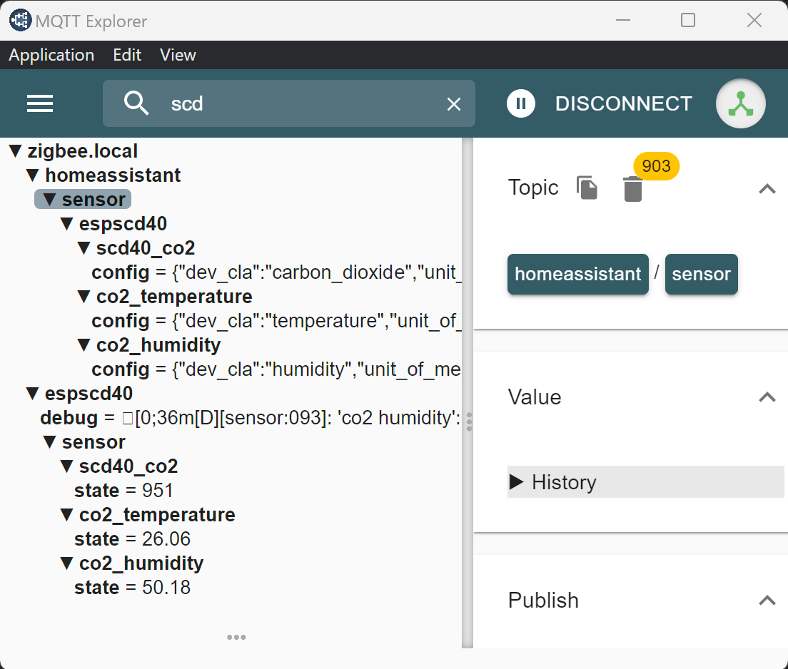

---

## Home Assistant Dashboards

Now the data is available in Home Assistant we can create dashboard elements to visual it.

### Dashboard Gauge

In a Gauge, you can directly see if the current CO2 value is correct.
I used different colors to indicate how bad the condition is. I used the values from the table mentioned in the [Introduction](#introduction).

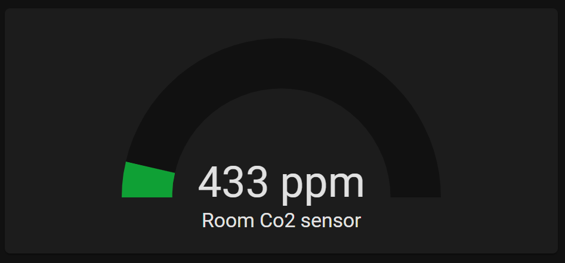

```yaml
# Sourcecode by vdbrink.github.io
# Dashboard card code
type: gauge
severity:
  green: 400
  yellow: 800
  red: 1200
entity: sensor.scd40_co2_value
min: 350
max: 1500
name: Room CO2 sensor
```
### Dashboard Graphic

To show the history of the last 6 hours, you can use the history-graph-card (or a line-card for a rawer version).

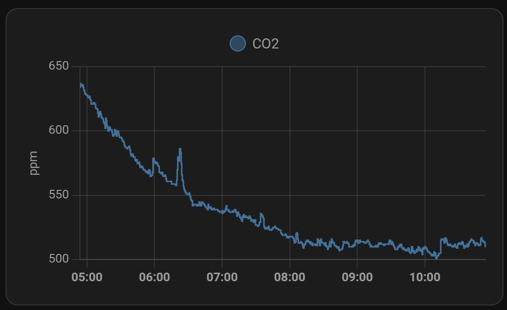

The corresponding dashboard yaml code.
```yaml
# Sourcecode by vdbrink.github.io
# Dashboard card code
type: history-graph
entities:
  - entity: sensor.scd40_co2_value
hours_to_show: 6
```

#### Dashboard Graphic with levels


You can also show baseline values in the graph by creating some extra custom sensors with a fixed value.\
This shows direct if the value is still correct.

```yaml
# Sourcecode by vdbrink.github.io
# Dashboard card code
type: history-graph
entities:
  - entity: sensor.scd40_co2_value
  - entity: sensor.co2_value_800
  - entity: sensor.co2_value_1200
  - entity: sensor.co2_value_1500
hours_to_show: 24
```

This is how you create three custom lines in the graph to see the threshold values.
Add this section to your `configuration.yaml` to create the three static helper sensors.

```yaml

# Sourcecode by vdbrink.github.io
# configuration.yaml
sensor:
  - platform: template
    sensors:
      co2_value_800:
        friendly_name: "good"
        value_template: 800
        unit_of_measurement: 'ppm'
      co2_value_1200:
        friendly_name: "medium"
        value_template: 1200
        unit_of_measurement: 'ppm'
      co2_value_1500:
        friendly_name: "bad"
        value_template: 1500
        unit_of_measurement: 'ppm'

```

### Dashboard condition text

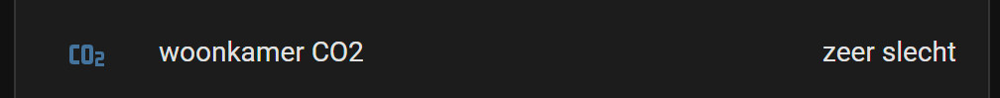

This creates a new sensor that shows a textual presentation of the current condition.

```yaml

# Sourcecode by vdbrink.github.io
# configuration.yaml
- platform: template
  sensors:
    scd40_co2_value_text:
        icon_template: "mdi:molecule-co2"
        friendly_name: "roomname CO2"
        value_template: >-
          
          good
          medium
          bad
          very bad
          unknown

```

### Dashboard bad condition text

In my dashboard, I have a section with important messages. Only when there is an action required, you see that here.
There is also a message when the CO2 value is not good. This section can be achieved by using conditional entities.

```yaml

# Sourcecode by vdbrink.github.io
# Dashboard card code
type: entities
entities:
- type: conditional
  conditions:
    - entity: sensor.scd40_co2_value_text
      state_not: good
      row:
        entity: sensor.scd40_co2_value_text

```

### Dashboard Mushroom entity

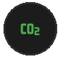 
 Show a green icon, without any text, if the level is less the 800 ppm, less than 1200 ppm yellow, less than 1500 ppm red.


```yaml

# Sourcecode by vdbrink.github.io
# Dashboard card code
type: custom:mushroom-chips-card
chips:
  - chip: null
    type: template
    icon: mdi:molecule-co2
    entity: sensor.senseair_co2_value
    content: ''
    icon_color: |-
      
         blue
      
         red
      
         orange
      
         yellow
      
         green
      

```

That's it!