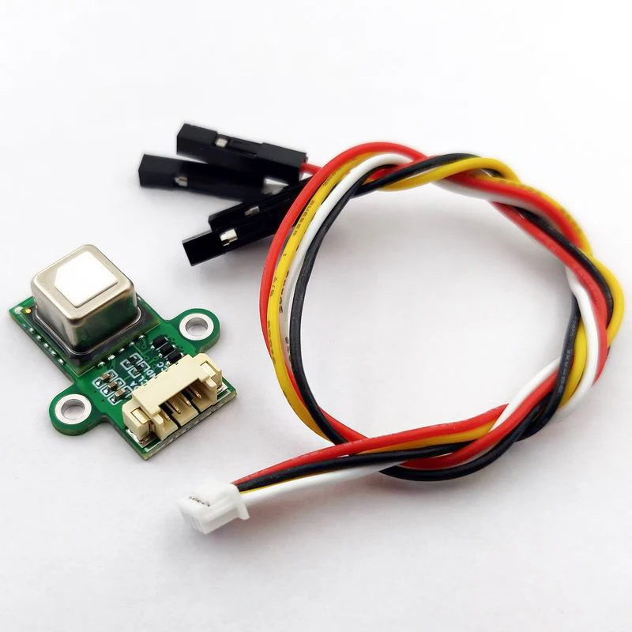
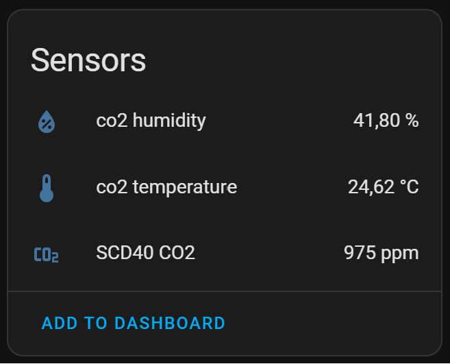
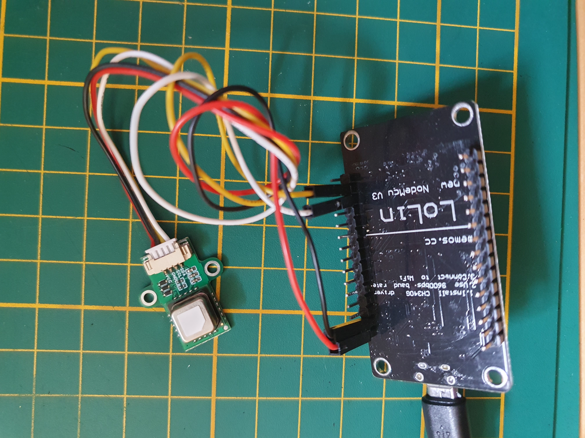
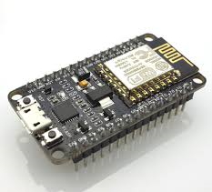
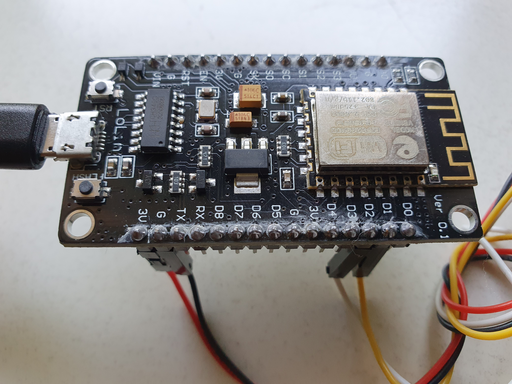
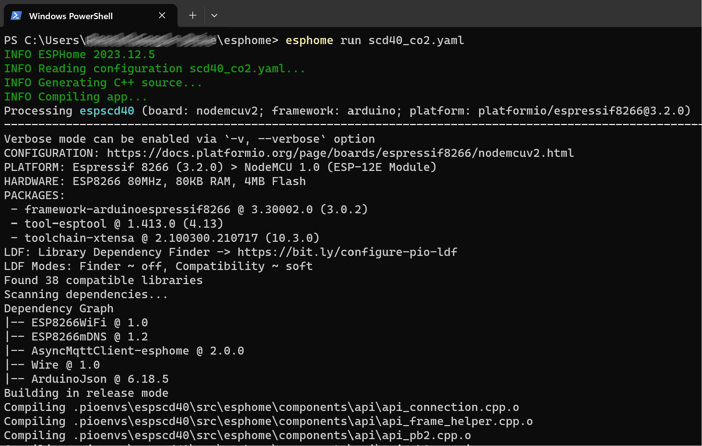
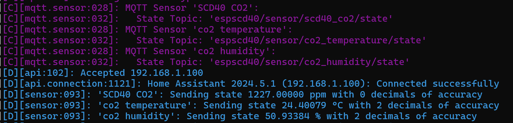
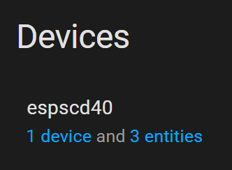
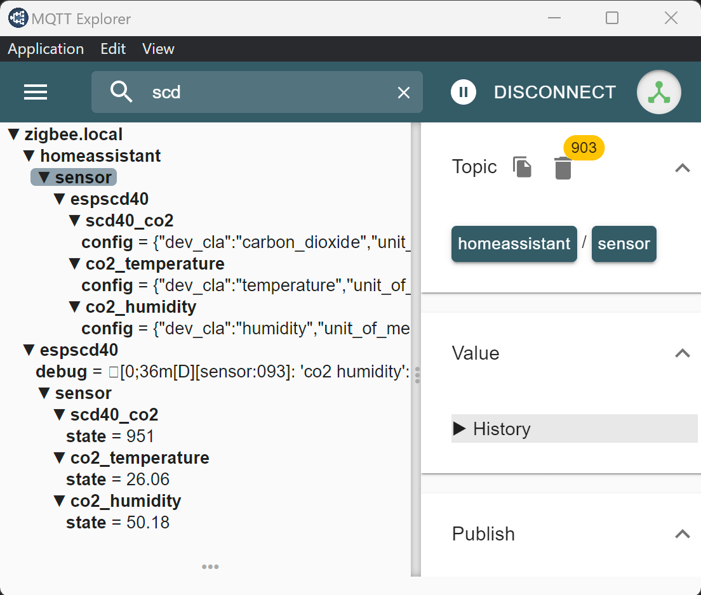
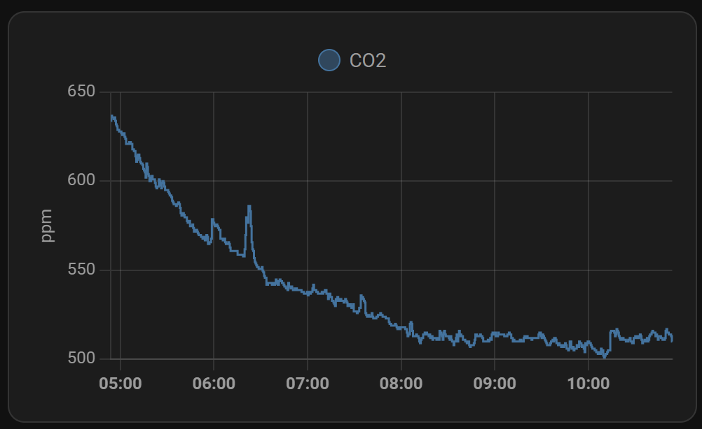



# ESPHome CO2 sensor

*Based on the SCD40 sensor*

## Introduction



Affordable CO2 sensors do exist, but many of them are expensive. 
You can also build one yourself with just a single sensor and an ESP board. 
It is easy, practical, and a nice project to do yourself.\
You can even build this one **without soldering**.

> **_NOTE:_** The SCD41 can also be used here; the pins are the same. The difference between these two models is their range and power consumption.
> The SCD41 can reach up to 5000 ppm, compared to 2000 ppm for the SCD40, and it uses less power when you measure periodically every 5 minutes instead of continuously.

Besides **CO2**, this sensor also measures the **temperature** and **humidity**.



CO2 stands for `Carbon dioxide` and is measured in `Parts per million` (ppm).

If you are in a room with a too high ppm level, you can feel tired, start yawning, and get a headache.
For your health and your family's health, it is important to act when these values are too high.\
The value rises gradually, so you do not notice it directly. 
That's why it's important to get notified about it.

The baseline value is what you measure outside and is around 400 ppm.

This table shows which action is required for each value.

| ppm        | condition | action                              |
|------------|-----------|-------------------------------------|
| 400 - 800  | good      | no action is required               |
| 800 - 1200 | medium    | open a window                       |
| 1200+      | bad       | limit has reached, open all windows |

<br>

In Home Assistant, you can visualize how the CO2 value changes over time.
With an automation, you can get notified when the value is too high. 
Send the notification to your phone or make an announcement via a smart speaker.


Read on to see how you can build this sensor yourself.

If you prefer a ready-to-go CO2 sensor, you can also choose the Netatmo Healthy Home Coach.
It is an all-in-one solution with CO2, decibel, temperature, and humidity sensors.
You can find it here:
{{imgBasket}}[Amazon NL](https://amzn.to/44wKKCE#ad)

---

## My solution

This is one of the easiest ways to get started with ESPHome.\
No soldering is required.\
You only need to connect the wires to the ESP and flash the correct configuration.

<a href="images_scd40/hardware.jpg">

</a>

Click on the photo to open it fullscreen.

---

## Table of Contents
<!-- TOC -->
  * [My solution](#my-solution)
  * [Required hardware](#required-hardware)
  * [Connect the hardware](#connect-the-hardware)
  * [Required software](#required-software)
  * [Test if it works](#test-if-it-works)
  * [Home Assistant Dashboards](#home-assistant-dashboards)
  * [Automations](#automations)
<!-- TOC -->

---

## Required hardware

These are the hardware components I used for this project.

> **_NOTE:_** Affiliate links are used here. Same price, and you support this blog.

The required products, including the soldering version, are also bundled on these
[Amazon US](https://amzn.to/4eQqLEn#ad) and
[Amazon NL](https://amzn.to/48GaTQU#ad) pages.

### SCD40 CO2 sensor

This small gas sensor measures **CO2** (in a range of 400-2000 ppm), **temperature** (-10-60 degrees), and **humidity** (0-100 percent).\
The [SCD40 datasheet](https://sensirion.com/media/documents/E0F04247/631EF271/CD_DS_SCD40_SCD41_Datasheet_D1.pdf) has all the technical details for this sensor.

{{imgBasket}}This sensor with an I2C interface is useful if you do not want to solder 
<a href="https://s.click.aliexpress.com/e/_c4mXziGn" target="_blank">(AliExpress)</a> 
<a href="https://s.click.aliexpress.com/e/_DB01je7" target="_blank">Alternative (AliExpress)</a>
<br>
<a href="https://s.click.aliexpress.com/e/_DB01je7" target="_blank">

</a>

<br>
{{imgBasket}}Otherwise, you can also buy this cheaper version where you need to solder the pins 
<a href="https://s.click.aliexpress.com/e/_okQAZSO" target="_blank">(AliExpress)</a>
<a href="https://amzn.to/4ss4zEb#ad" target="_blank"> (Amazon US)</a>
<a href="https://amzn.to/4dJXI30#ad" target="_blank"> (Amazon NL)</a>

### ESP board

You can use any ESP board: {{imgBasket}}[ESP32](../buy/esphome_diy#esp32), [ESP D1 mini](../buy/esphome_diy#esp-d1-mini), 
but on this page I use an ESP8266.

{{imgBasket}}ESP8266 NodeMCU v3 (CH340) with pre-soldered pins
<a href="https://s.click.aliexpress.com/e/_c3clEj8T" target="_blank">(AliExpress)</a>
<a href="https://s.click.aliexpress.com/e/_EIwdbqH" target="_blank">Alternative (AliExpress)</a>
<a href="https://amzn.to/4sTpEao#ad" target="_blank">(Amazon US)</a>
<a href="https://amzn.to/4qirq3i#ad" target="_blank">(Amazon NL)</a>
<br>


<br>
{{imgBasket}}<a href="https://s.click.aliexpress.com/e/_c4U2UgOD" target="_blank">Alternative link (AliExpress)</a>
<a href="https://amzn.to/44uRwXM#ad" target="_blank"> (Amazon US)</a>
<br>

### Case

You can use almost any object with holes in it, as long as it has a minimum length of 7 cm, a width of 3 cm, and a height of 3 cm.\
The only requirement is that enough air can reach the sensor so it can measure the values in the room.\

A plastic box from a local shop works well too, as long as you drill some holes in it.

Even a small decorative statuette can work, provided it is porous or has enough openings.

{{imgBasket}}On AliExpress, they also sell
Plastic DIY Cases <a href="https://s.click.aliexpress.com/e/_DDALbXD" target="_blank">
(AliExpress)</a>
<a href="https://amzn.to/3G3EhVB#ad" target="_blank">(Amazon US)</a>
<br>
<a href="https://s.click.aliexpress.com/e/_DDALbXD" target="_blank">

</a>
<br>

### USB power cable

A cable to power the ESP.

{{imgBasket}}Micro USB cable to USB-A to power the ESP 
<a href="https://s.click.aliexpress.com/e/_c32Nxdc7" target="_blank">(AliExpress)</a>
<a href="https://amzn.to/4lqcvCK#ad" target="_blank">(Amazon US)</a>
<br>
<a href="https://s.click.aliexpress.com/e/_c32Nxdc7" target="_blank">

</a>
<br>

### 5V USB power adapter

A power adapter to power the ESP.

{{imgBasket}}5V USB EU power adapter 
<a href="https://s.click.aliexpress.com/e/_c3BEg2xd" target="_blank">(AliExpress)</a>
<a href="https://amzn.to/4j2wDcC#ad" target="_blank">(Amazon US)</a>
<br>
<a href="https://s.click.aliexpress.com/e/_c3BEg2xd" target="_blank">

</a>

<br>
<br>

Found a dead link? [Please inform me](https://github.com/vdbrink/vdbrink.github.io/issues) or look at [ESPHome DIY sensors - Best Buy Tips](../buy/esphome_diy) for alternative links.

---

## Connect the hardware

I have made a diagram showing how to connect the GY SCD40 to the ESP.\
This sensor uses an I2C bus interface to connect to the ESP. 
That also makes it possible to connect multiple sensors to the same bus.\
The ESP has predefined pins for SDA (data) and SDL (clock).

| ESP pin | GPIO esp8266 pin | SCD40 pin   | color  |
|---------|------------------|-------------|--------|
| D2      | GPIO4            | SDA (data)  | white  |
| D1      | GPIO5            | SDL (clock) | yellow |
| G       | GND              | GND         | black  |
| 3V      | 3 V              | VCC         | red    |

### Connect the SCD40 to the ESP

Connect the four wires directly to the ESP8266 NodeMCU like this.

<a href="images_scd40/hardware.jpg">

</a>

<a href="images_scd40/hardware_connect.jpg">

</a>

Click on the photos to open them in fullscreen.

---

## Required software

### ESPHome


The only software you need is <a href="https://esphome.io/" target="_blank">ESPHome</a>.

This software is used to flash the configuration file to the ESP board.

Their website contains a lot of information about how to configure and calibrate all kinds of sensors.\
The relevant pages for this project are:
* [ESPHome SCD4X page](https://esphome.io/components/sensor/scd4x.html)
* [ESPHome I2C page](https://esphome.io/components/i2c.html)

### Flash the script

There are many ways to flash the configuration file with ESPHome to the board.\
Read [here](esphome_flashing) how to upload it.

Connect the ESP via USB to the computer.

One easy way is to run it from the command line:
> esphome "co2_scd40.yaml" run



The `co2_scd40.yaml` YAML script:
```yaml
# Sourcecode by vdbrink.github.io
esphome:
  name: espscd40
  comment: Room CO2 sensor
  platform: ESP8266
  board: nodemcuv2

wifi:
  ssid: "XXX"
  password: "XXX"
  fast_connect: true # only needed for hidden SSID

# Push the data also to MQTT topics: 
# * CO2 espscd40/sensor/scd40_co2/state
# * Temperature espscd40/sensor/co2_temperature/state  
# * Humidity espscd40/sensor/co2_humidity/state
mqtt:
  broker: 192.168.XXX.XXX
  port: 1883
  username: "XXXX"
  password: "XXXX"

# Enable logging to the console
logger:

# Home Assistant integration
api:

# Pins on an esp8266
i2c:
  sda: 4 # pin 21 for an ESP32
  scl: 5 # pin 22 for an ESP32

# Sensors definitions
sensor:
  - platform: scd4x
    co2:
      name: "SCD40 CO2"
    temperature:
      name: "CO2 temperature"
    humidity:
      name: "CO2 humidity"
```

---
## Test if it works

Now that the data is flashed, check whether the sensor pushes the CO2, temperature, and humidity data correctly.

### Via console
If you flash the ESP via the console and enable logging, 
you will see the readings in the console immediately after the ESP is flashed.



### Via Home Assistant

Once the ESP is online, it automatically registers itself in Home Assistant if you installed ESPHome.

You will see a new device with three entities: CO2, temperature, and humidity.




### Via MQTT
If you enabled MQTT in the config, you can also check for incoming messages.  
On Windows, you can use the MQTT Explorer application. 
The sensor sends its data to the topics `/homeassistant/sensor/espscd40` and `/espscd40`.



---

## Home Assistant Dashboards

Now that the data is available in Home Assistant, we can create dashboard elements to visualize it.

### Dashboard Gauge

In a gauge, you can immediately see whether the current CO2 value is in a healthy range.
I used different colors to show how serious the condition is, based on the values in the [Introduction](#introduction).


```yaml
# Sourcecode by vdbrink.github.io
# Dashboard card code
type: gauge
severity:
  green: 400
  yellow: 800
  red: 1200
entity: sensor.scd40_co2_value
min: 350
max: 1500
name: Room CO2 sensor
```
### Dashboard Graphic

To show the history of the last 6 hours, you can use the history graph card, or a line card for a simpler version.



The corresponding dashboard YAML code:
```yaml
# Sourcecode by vdbrink.github.io
# Dashboard card code
type: history-graph
entities:
  - entity: sensor.scd40_co2_value
hours_to_show: 6
```

#### Dashboard Graphic with levels


You can also show baseline values in the graph by creating a few extra custom sensors with fixed values.\
This makes it easy to see at a glance whether the current value is still in range.

```yaml
# Sourcecode by vdbrink.github.io
# Dashboard card code
type: history-graph
entities:
  - entity: sensor.scd40_co2_value
  - entity: sensor.co2_value_800
  - entity: sensor.co2_value_1200
  - entity: sensor.co2_value_1500
hours_to_show: 24
```

This is how you create three custom lines in the graph to show the threshold values.
Add this section to your `configuration.yaml` to create the three static helper sensors:

```yaml

# Sourcecode by vdbrink.github.io
# configuration.yaml
sensor:
  - platform: template
    sensors:
      co2_value_800:
        friendly_name: "good"
        value_template: 800
        unit_of_measurement: 'ppm'
      co2_value_1200:
        friendly_name: "medium"
        value_template: 1200
        unit_of_measurement: 'ppm'
      co2_value_1500:
        friendly_name: "bad"
        value_template: 1500
        unit_of_measurement: 'ppm'

```

### Dashboard condition text


This creates a new sensor that shows a text representation of the current condition.

```yaml

# Sourcecode by vdbrink.github.io
# configuration.yaml
- platform: template
  sensors:
    scd40_co2_value_text:
        icon_template: "mdi:molecule-co2"
        friendly_name: "room CO2"
        value_template: >-
          
          good
          medium
          bad
          very bad
          unknown

```

### Dashboard bad condition text

In my dashboard, I have a section for important messages. You only see it when action is needed.
There is also a message when the CO2 value is not good. You can build this section with conditional entities.

```yaml

# Sourcecode by vdbrink.github.io
# Dashboard card code
type: entities
entities:
- type: conditional
  conditions:
    - entity: sensor.scd40_co2_value_text
      state_not: good
      row:
        entity: sensor.scd40_co2_value_text

```

### Dashboard Mushroom entity

 
 Show a green icon, without any text, if the level is less than 800 ppm, yellow below 1200 ppm, and red below 1500 ppm.


```yaml

# Sourcecode by vdbrink.github.io
# Dashboard card code
type: custom:mushroom-chips-card
chips:
  - chip: null
    type: template
    icon: mdi:molecule-co2
    entity: sensor.senseair_co2_value
    content: ''
    icon_color: |-
      
         blue
      
         red
      
         orange
      
         yellow
      
         green
      

```

---

## Automations

When the CO2, temperature, or humidity value is too high, you can send a [notification](../node-red/node-red_home-assistant_notifications) to your phone or smart speaker.\
Or use a colored light or [LED strip](/projects/bin_day_led_strip_reminder) to indicate the condition and make it visible at a glance.

<br><br>

That is it.

---

Also check my other [ESPHome projects](/esphome/index#articles)!
