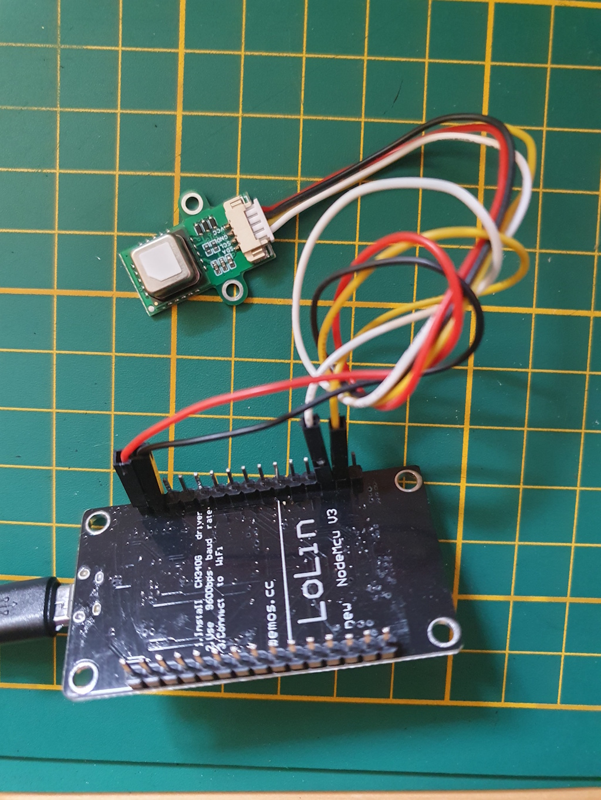

# ESPHome Co2 sensor

*Based on the SCD40 sensor*

## Introduction


There are Co2 sensors available, most of them are really expensive but 
you can also create one yourself with just a single sensor and an ESP board. 
It's easy (and fun) to create one yourself. 
You can even create this one WITHOUT SOLDERING!!

Co2 stands for `Carbon dioxide` and is measured in `Parts per million` (ppm).

If your in a space with a too high ppm level, you can feel tired, your start yawning and can get a headache.
For your, and your family health, it's important to act when these values are too high.

The base value is what you measure outside and is around 400 ppm.

This table shows for which value, which action is required.

| ppm        | condition | action                              |
|------------|-----------|-------------------------------------|
| 400 - 800  | good      | no action is required               |
| 800 - 1200 | medium    | open a window                       |
| 1200+      | bad       | limit has reached, open all windows |

<br>


In Home Assistant you can visualize how the Co2 value changed over time. Read along how you create this graph yourself.

---

## My solution

This sensor is the easiest way to start with ESPHome.\
No soldering required here.\
You only need to connect the wires to the ESP and flash the correct configuration.

<a href="images_scd40/hardware.jpg">

</a>
You click on the photo to open it fullscreen.

---

## Table of Contents
- [Required hardware](#required-hardware)
- [Required software](#required-software)
- [Connect the hardware](#connect-the-hardware)
- [ESPHome](#esphome)
- [Home Assistant](#home-assistant)

---

## Required hardware

These hardware components do I use for this project.

Affiliate links are used here. Same price, but you also sponsor this blog.

### GY-SCD40 Co2 and temperature sensor

<a href="https://s.click.aliexpress.com/e/_DB01je7" target="_blank">
This sensor is useful if you don't want to solder (Aliexpress)
<br>

</a>

### ESP board

You can use any ESP board: [ESP32](../buy/esphome_diy#esp32), [ESP D1 mini](../buy/esphome_diy#esp-d1-mini), on this page I use a ESP8266.

<a href="https://s.click.aliexpress.com/e/_EIwdbqH" target="_blank">
ESP8266 NodeMCU v3 (Ch340) with pre soldered pins (Aliexpress)
<br>


<br>
<a href="https://s.click.aliexpress.com/e/_mPJWRqE" target="_blank">Alternative link (Aliexpress)</a>
<br>

### Case

<a href="https://s.click.aliexpress.com/e/_DDALbXD" target="_blank">
Plastic DIY Case, minimal required height is 8 cm (Aliexpress)
<br>

</a>
<br>

### USB power cable

<a href="https://s.click.aliexpress.com/e/_onj6tZi" target="_blank">
Micro USB cable to USB A to power the ESP (Aliexpress)
<br>

</a>
<br>

### 5V USB power adapter

<a href="https://s.click.aliexpress.com/e/_EQrXcuH" target="_blank">
5V USB power adapter to power the ESP  (Aliexpress)
<br>

</a>

<br>
<br>

Found a dead link? [Please inform me](https://github.com/vdbrink/vdbrink.github.io/issues) or look at [ESPHome DIY sensors - best buy tips](../buy/esphome_diy) for alternative links.

---

## Required software

### ESPHome

The only software you need is ESPHome.

There are a lot of ways to flash the config file with ESPHome to the board.\
Read [here](esphome_flashing) how to upload it.

---

## Connect the hardware

I've made a scheme how to connect the GY SCD40 to the ESP.
This sensor uses an i2c interface to connect to the ESP. 
The ESP has predefined pins for SDA and SDL. I use here a ESP8266 chipset.

| ESP pin | GPIO esp8266 pin | SCD40 pin   | color  |
|---------|------------------|-------------|--------|
| D2      | GPIO4            | SDA (data)  | white  |
| D1      | GPIO5            | SDL (clock) | yellow |
| G       | GND              | GND         | black  |
| 3V      | 3 V              | VCC         | red    |

<!--
### Connect the SCD40 to the ESP

> Use control + click to see the full photos of the connected wires.


-->

---

## ESPHome


[ESPHome SCD4X page](https://esphome.io/components/sensor/scd4x.html)

[ESPHome I2C page](https://esphome.io/components/i2c.html)

### Flash the ESP via command line with Python


Connect the ESP via USB with the computer.


The script:
```yaml
# Sourcecode by vdbrink.github.io
esphome:
  name: espscd40
  comment: Room Co2 sensor
  platform: ESP8266
  board: nodemcuv2
  arduino_version: latest

wifi:
  ssid: "XXX"
  password: "XXX"
  fast_connect: true # only needed for hidden SSID

# Push the data also to MQTT topics: 
# * Co2 espscd40/sensor/scd40_co2/state
# * Temperature espscd40/sensor/co2_temperature/state  
# * Humidity espscd40/sensor/co2_humidity/state
mqtt:
  broker: 192.168.XXX.XXX
  port: 1883
  username: "XXXX"
  password: "XXXX"

# Enable logging to the console
logger:

# Home Assistant integration
api:

# Pins on an esp8266
i2c:
  sda: 4 # pin 21 for an ESP32
  scl: 5 # pin 22 for an ESP32

# Sensors definitions
sensor:
  - platform: scd4x
    co2:
      name: "SCD40 CO2"
    temperature:
      name: "co2 temperature"
    humidity:
      name: "co2 humidity"
```

---

## Home Assistant

Ones the sensor pushes the data, you can use and present the data on your dashboards or create notifications when the status is not good.


### Dashboard Gauge

In a Gauge, you can directly see if the current co2 value is correct.
I used different colors to indicate how bad the condition is. I used the values from the table mentioned in the [Introduction](#introduction).


```yaml
# Sourcecode by vdbrink.github.io
# Dashboard card code
type: gauge
severity:
  green: 400
  yellow: 800
  red: 1200
entity: sensor.scd40_co2_value
min: 350
max: 1500
name: Room Co2 sensor
```
### Dashboard Graphic

To show the history of the last 6 hours, you can use the history-graph-card (or a line-card for a rawer version).


```yaml
# Sourcecode by vdbrink.github.io
# Dashboard card code
type: history-graph
entities:
  - entity: sensor.scd40_co2_value
hours_to_show: 6
```

### Dashboard History Graphic


Another graph entity is the `history-graph`.

You can also show baseline values by creating a custom sensor with a fixed value.

```yaml
# Sourcecode by vdbrink.github.io
# Dashboard card code
type: history-graph
entities:
  - entity: sensor.scd40_co2_value
  - entity: sensor.co2_value_800
  - entity: sensor.co2_value_1200
  - entity: sensor.co2_value_1500
hours_to_show: 24
```

This is how you create three custom lines in the graph to see the threshold values.

```yaml

# Sourcecode by vdbrink.github.io
# configuration.yaml
- sensor:
    - platform: template
      sensors:
        co2_value_800:
          friendly_name: "good"
          value_template: 800
          unit_of_measurement: 'ppm'
        co2_value_1200:
          friendly_name: "avarage"
          value_template: 1200
          unit_of_measurement: 'ppm'
        co2_value_1500:
          friendly_name: "bad"
          value_template: 1500
          unit_of_measurement: 'ppm'

```

### Dashboard condition text


This creates a new sensor that shows a textual presentation of the current condition.

```yaml

# Sourcecode by vdbrink.github.io
# configuration.yaml
- platform: template
  sensors:
    scd40_co2_value_text:
        icon_template: "mdi:molecule-co2"
        friendly_name: "roomname CO2"
        value_template: >-
          
          good
          medium
          bad
          very bad
          unknown

```

### Dashboard bad condition text

In my dashboard, I have a section with important messages. Only when there is an action required, you see that here.
There is also a message when the Co2 value is not good. This section can be achieved by using conditional entities.

```yaml

# Sourcecode by vdbrink.github.io
# Dashboard card code
type: entities
entities:
- type: conditional
  conditions:
    - entity: sensor.scd40_co2_value_text
      state_not: good
      row:
        entity: sensor.scd40_co2_value_text

```

### Dashboard Mushroom entity

 
 Show a green icon, without any text, if the level is less the 800 ppm, less than 1200 ppm yellow, less than 1500 ppm red.


```yaml

# Sourcecode by vdbrink.github.io
# Dashboard card code
type: custom:mushroom-chips-card
chips:
  - chip: null
    type: template
    icon: mdi:molecule-co2
    entity: sensor.senseair_co2_value
    content: ''
    icon_color: |-
      
         blue
      
         red
      
         orange
      
         yellow
      
         green
      

```
