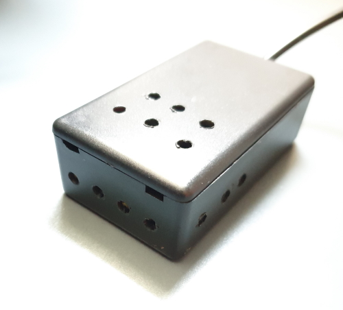
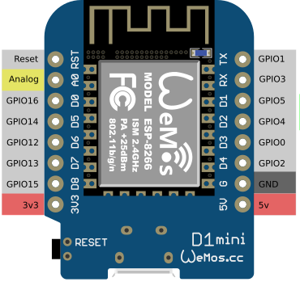



# ESPHome CO2 sensor
*Based on the SenseAir S8 sensor*

## Introduction


There are not so many affordable out-of-the-box CO2 sensors available, but it's easy to create one yourself.
With only an ESP, a CO2 sensor, power cable and box, it's a small and easy project with a lot of benefits! 

If your in a space with a too high ppm level, you can feel tired, your start yawning, 
get red cheeks and can get a headache.
Without knowing, this happens because it goes very gradually.
To prevent this, use your smart home automations and take action if the levels are too high.\
This keeps you and your family healthy!

CO2 stands for `Carbon dioxide` and is measured in `Parts per million` (ppm).

The average value outside is around 400 ppm, which is a base value.
That's also why you need to open a window when the value is too high, get some fresh air from outside.

| ppm        | condition | action                              |
|------------|-----------|-------------------------------------|
| 400 - 800  | good      | no action is required               |
| 800 - 1200 | medium    | open a window                       |
| 1200+      | bad       | limit has reached, open all windows |

---
## My final result

A small box with a tail.  
Inside a CO2 sensor and an ESP mini.



When you prefer a ready-to-go CO2 sensor, you can also choose for the Netatmo Healthy Home Coach.
It's an all-in-one solution with a CO2 and also decibel, temperature and humidity sensor in it.
You can find it:
[Amazon NL](https://amzn.to/44wKKCE),
[Amazon DE](https://amzn.to/42nXN80),
[Amazon UK](https://amzn.to/4d0299f)

---

## Table of Contents
<!-- TOC -->
* [Introduction](#introduction)
* [My final result](#my-final-result)
* [Required hardware](#required-hardware)
* [Required software](#required-software)
* [Connect the hardware](#connect-the-hardware)
  * [Connect the SenseAir S8 to the ESP](#connect-the-senseair-s8-to-the-esp)
* [ESPHome](#esphome)
  * [Flash the ESP](#flash-the-esp)
* [Home Assistant](#home-assistant)
  * [Dashboard Gauge](#dashboard-gauge)
  * [Dashboard Line Graphic](#dashboard-line-graphic)
  * [Dashboard History Graphic](#dashboard-history-graphic)
  * [Dashboard condition text](#dashboard-condition-text)
  * [Dashboard Mushroom entity](#dashboard-mushroom-entity)
* [Automations](#automations)
<!-- TOC -->

---

## Required hardware

The links go to an overall page with all different kinds of DIY components with their webshop links.

Affiliate links are used here. Same price, but you also sponsor this blog.

These hardware components did I use for this project:

* {{imgBasket}}SenseAir S8 CO2 sensor <a href="https://s.click.aliexpress.com/e/_oEMg5KO" target="_blank">(AliExpress)</a>
<a href="https://s.click.aliexpress.com/e/_oFib9fC">(AliExpress alternative link)</a>
<a href="https://amzn.to/3ShAiry#ad" target="_blank">(Amazon US)</a>
  * <a href="https://senseair.com/product/s8/">Manufacture product page</a> 


* {{imgBasket}}ESP 12S Wemos D1 mini (no pro or V3) <a href="https://s.click.aliexpress.com/e/_ooKDQkk" target="_blank">(AliExpress)</a> <a href="https://amzn.to/3SOIvDC">(Amazon US)</a>
  * You can use any ESP chip, but I like this one because of its small size


* {{imgBasket}}Dupont male to male wires <a href="https://s.click.aliexpress.com/e/_DEy2mvt" target="_blank">(AliExpress)</a> <a href="https://amzn.to/43HvzFU">(Amazon US)</a>
  * If you order these, you can better order all three types at ones, also for any further projects


* Plastic DIY Case, I used a box with the sizes 70 x 45 x 30 mm. This one is not available anymore, but you can order a similar one (it's in <a href="https://s.click.aliexpress.com/e/_oEnMVdm" target="_blank">white still available</a>) or at least one with a minimal of these sizes. 

  * {{imgBasket}}A lot of boxes with all kinds of sizes <a href="https://s.click.aliexpress.com/e/_DDALbXD" target="_blank">(AliExpress)</a> <a href="https://amzn.to/43FwAya">(Amazon US)</a>


* {{imgBasket}}Micro USB cable to power the ESP board <a href="https://s.click.aliexpress.com/e/_onj6tZi" target="_blank">(AliExpress)</a> <a href="https://amzn.to/43mVuBq">(Amazon US)</a>


* {{imgBasket}}5V USB power adapter to power the ESP <a href="https://s.click.aliexpress.com/e/_opoqyJG" target="_blank">(AliExpress)</a> <a href="https://amzn.to/4dvqIem#ad" target="_blank">(Amazon US)</a>


* {{imgBasket}}Soldering iron <a href="https://s.click.aliexpress.com/e/_DEDR08n" target="_blank">(AliExpress)</a> <a href="https://amzn.to/4dvqwf8#ad" target="_blank">(Amazon US)</a>. I suggest this based on the reviews. I already had one. Please let me know if you advise this one or not?


* {{imgBasket}}Soldering tin wire <a href="https://s.click.aliexpress.com/e/_DEDR08n" target="_blank">(AliExpress)</a> <a href="https://amzn.to/3Zt4Zha#ad" target="_blank">(Amazon US)</a>


Affiliate links are used here, so you sponsor my blog also with it, without paying extra for it.

Found a dead link? [Please inform me](https://github.com/vdbrink/vdbrink.github.io/issues)


See [ESPHome DIY sensors Best Buy Tips](../buy/esphome_diy) for more DIY hardware buy tips.

---

## Required software

For this project, you only need the software to flash the ESP chip with the configuration file.

The only software you need is ESPHome.

There are a lot of ways to flash the config file with ESPHome to the board.\
Read [here](esphome_flashing) how to upload it.

---

## Connect the hardware

I've made a scheme how to connect the SenseAir S8 to the ESP.

The ESP and sensor don't come with pins, so you need to solder a bit to connect the male-to-male dupont cables between the sensor and the ESP.

### Connect the SenseAir S8 to the ESP

> Click on the image to see the full photos of the connected wires.

| Connected pins                                                                                                                                                           | ESP8266 Wemos <br>D1 mini pins                                                                                                                      | SenseAir S8 pins                                                                                                                                                                                          |
|--------------------------------------------------------------------------------------------------------------------------------------------------------------------------|-----------------------------------------------------------------------------------------------------------------------------------------------------|-----------------------------------------------------------------------------------------------------------------------------------------------------------------------------------------------------------|
| <a href="images_co2/schema_senseair_s8_co2_sensor.jpg"> | <a href="images/pins_esp8266_wemos_d1_mini.png"></a> | <a href="images_co2/senseair_s8_pins.jpg"></a> <BR> This image is 180 degrees rotated compared with the first image. |

This table shows how the ESP is connected with the SenseAir.

| Wemos pin | GPIO Wemos pin* | SenseAir pin |
|-----------|-----------------|--------------|
| D7        | GPIO13          | UART_TxD     |
| D8        | GPIO15          | UART_RxD     |
| G         | GND             | G0           |
| 5V        | 5 V             | G+           |

&ast; The `GPIO Wemos pin` is the port which is used in the ESPHome yaml.


If you place the sensor on top of the ESP mini, it fits perfect in the DIY box.

You need to drill a hole in the edge of the box so the USB power cable can go through it.


I drilled some holes in the case. Now the air can reach the CO2 sensor inside the box.


---

## ESPHome


[ESPHome SenseAir page](https://esphome.io/components/sensor/senseair.html)

### Flash the ESP

Connect the ESP via USB to the computer.

Install ESPHome and compile the configuration code after you configured your own wifi. And configure (or remove) the MQTT section. This is not needed if you integrate it direct in Home Assistant.

For more information about installing and flashing your ESP with ESPHome see the [ESPHome website](https://esphome.io/guides/getting_started_command_line.html) or [Peyanski ESPHome Installation Guide](https://peyanski.com/complete-esphome-installation-guide/#How_to_properly_connect_an_ESP_device_for_ESPHome_install).

The script:
```yaml
# Sourcecode by vdbrink.github.io
esphome:
  name: esp_co2
  comment: Room CO2 sensor
  platform: ESP8266
  board: d1_mini
  arduino_version: latest

wifi:
  ssid: "xxx"
  password: "xxx"
  fast_connect: true # only needed for hidden SSID
  
mqtt:
  broker: xxx.xxx.xxx.xxx
  port: 1883
  username: "xxx"
  password: "xxx"
  
uart:
  rx_pin: GPIO13
  tx_pin: GPIO15
  baud_rate: 9600
  
sensor:
  - platform: senseair
    co2:
      id: senseair_co2
      name: "SenseAir CO2 Value"
    update_interval: 30s
```

---

## Home Assistant

Ones the sensor pushes the data, you can use and present the data on your dashboards or create notifications when the values are not good.

### Dashboard Gauge

In a Gauge, you can directly see if the current CO2 value is correct.
I used different colors to indicate how bad the condition is. I used the values from the table mentioned in the [Introduction](#introduction). 


```yaml
# Sourcecode by vdbrink.github.io
# Dashboard card code
type: gauge
severity:
  green: 400
  yellow: 800
  red: 1200
entity: sensor.senseair_co2_value
min: 350
max: 1500
name: Room CO2 sensor
```

### Dashboard Line Graphic

To show the history of the last X hours, you can use the card.


```yaml
# Sourcecode by vdbrink.github.io
# Dashboard card code
type: sensor
graph: line
entity: sensor.senseair_co2_value
name: Room CO2 sensor
hours_to_show: 6
```

### Dashboard History Graphic


Another graph entity is the `history-graph`.

You can also show baseline values by creating a custom sensor with a fixed value.

```yaml
# Sourcecode by vdbrink.github.io
# Dashboard card code
type: history-graph
entities:
  - entity: sensor.senseair_co2_value
  - entity: sensor.co2_value_800
  - entity: sensor.co2_value_1200
  - entity: sensor.co2_value_1500
hours_to_show: 24
```

This is how you create three custom lines in the graph to see the threshold values.

```yaml

# Sourcecode by vdbrink.github.io
# configuration.yaml
- sensor:
    - platform: template
      sensors:
        co2_value_800:
          friendly_name: "good"
          value_template: 800
          unit_of_measurement: 'ppm'
        co2_value_1200:
          friendly_name: "avarage"
          value_template: 1200
          unit_of_measurement: 'ppm'
        co2_value_1500:
          friendly_name: "bad"
          value_template: 1500
          unit_of_measurement: 'ppm'

```

### Dashboard condition text


This creates a new sensor that shows a textual presentation of the current condition.

```yaml

# Sourcecode by vdbrink.github.io
# configuration.yaml
- platform: template
  sensors:
    senseair_co2_value_text:
        icon_template: "mdi:molecule-co2"
        friendly_name: "Room CO2 "
        value_template: >-
          
          good
          average
          bad
          very bad
          unknown

```

In my dashboard, I have a section with important messages. Only when there is an action required, you see that here.
There is also a message when the CO2 value is not good. This section can be achieved by using conditional entities. 

```yaml

# Sourcecode by vdbrink.github.io
# Dashboard card code
type: entities
entities:
- type: conditional
  conditions:
    - entity: sensor.senseair_co2_value_text
      state_not: good
      row:
        entity: sensor.senseair_co2_value_text

```

### Dashboard Mushroom entity

 
 Show a green icon, without any text, if the level is less the 800 ppm, less than 1200 ppm yellow, less than 1500 ppm red.


```yaml

# Sourcecode by vdbrink.github.io
# Dashboard card code
type: custom:mushroom-chips-card
chips:
  - chip: null
    type: template
    icon: mdi:molecule-co2
    entity: sensor.senseair_co2_value
    content: ''
    icon_color: |-
      
         blue
      
         red
      
         orange
      
         yellow
      
         green
      

```

---

## Automations

When the CO2 value is too high, you can send a [notification](../node-red/node-red_home-assistant_notifications) to your phone or smart speaker.\
Or use a colored light or [LED-strip](/projects/bin_day_led_strip_reminder) to indicate the condition.

<br><br>
Keep your home healthy, measuring is knowing!