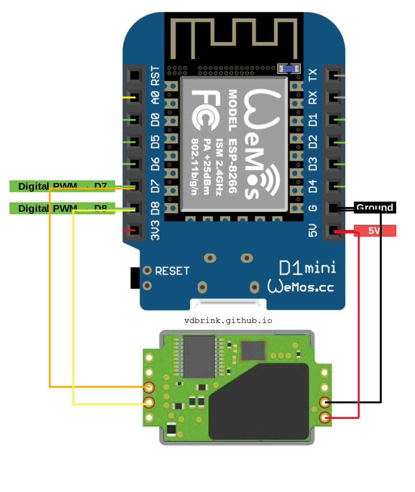

# ESPHome SenseAir S8 Co2 sensor

## Introduction

There are not much out-of-the-box Co2 sensors available, but it's easy to create one yourself.

Co2 stands for `Carbon dioxide` and is measured in `Parts per million` (ppm).
If your in a space with a too high ppm level you can feel tired, your start yawn and can get a headache.

The average value outside is around 400 ppm.

| ppm        | condition | action                              |
|------------|-----------|-------------------------------------|
| 400 - 800  | good      | no action is required               |
| 800 - 1200 | medium    | open a window                       |
| 1200+      | bad       | limit has reached, open all windows |

## My solution 

A small box with a tail.  
Inside a Co2 sensor and an ESP mini.


---

## Table of Contents
- [Required hardware](#required-hardware)
- [Required software](#required-software)
- [Connect the hardware](#connect-the-hardware)
- [ESPHome](#esphome)
- [Home Assistant](#home-assistant)
- [Sponsor me](#sponsor-me)
- [Remarks or suggestions?](#remarks-or-suggestions)

---

## Required hardware

These hardware components do I use for this project:

* SenseAir S8 Co2 sensor [link 1](https://aliexpress.com/item/32863793412.html) [link 2](https://aliexpress.com/item/1005001398529596.html)


* ESP 12S Wemos D1 mini (no pro or V3) [link 1](https://aliexpress.com/item/32631693796.html) [link 2](https://aliexpress.com/item/32631775619.html)


* 5 plastic DIY Cases 70 x 45 x 30 mm (One is ofcourse enough for this project.)


* Micro USB cable to power the ESP [link 1](https://aliexpress.com/item/32951467674.html) [link 1](https://aliexpress.com/item/1005001741508596.html)


* 5V USB power adapter to power the ESP [link 1](https://aliexpress.com/item/4000016006173.html) [link 2](https://aliexpress.com/item/1005003080781367.html)


No affiliate links are used here, only some example links where you can buy the required parts for this project.

Found a dead link? [Please inform me](https://github.com/vdbrink/vdbrink.github.io/issues)

---

## Required software

* <a href="https://www.python.org/" target="_blank">Python</a> to run ESPHome
* <a href="https://esphome.io/guides/getting_started_command_line.html#first-uploading" target="_blank">ESPHome</a> to flash the ESP
* <a href="https://github.com/nodemcu/nodemcu-devkit/tree/master/Drivers" target="_blank">Windows driver chp340</a> to recognize the ESP as connected device

---

## Connect the hardware

I've made a scheme how to connect the SenseAir S8 to the ESP.

### Connect the SenseAir S8 to the ESP

> Use control + click to see the full photos of the connected wires.

| Connected pins                                                                                                   | ESP8266 Wemos <br>D1 mini pins                                                                        | SenseAir S8 pins                                                                                                                              |
|------------------------------------------------------------------------------------------------------------------|-------------------------------------------------------------------------------------------------------|-----------------------------------------------------------------------------------------------------------------------------------------------|
|  |  |  <BR> 180 degrees rotated compared with the first image. |

This table show how the ESP is connected with the SenseAir.

| Wemos pin | GPIO Wemos pin* | SenseAir pin |
|-----------|-----------------|--------------|
| D7        | GPIO13          | UART_TxD     |
| D8        | GPIO15          | UART_RxD     |
| G         | GND             | G0           |
| 5V        | 5 V             | G+           |

&ast; The `GPIO Wemos pin` is the port which is used in the ESPHome yaml.


If you place the sensor on top of the ESP mini it fits perfect in the DIY box.


I drilled some holes in the DIY case. Now the air can reach the Co2 sensor inside the box.


---

## ESPHome


[ESPHome SenseAir page](https://esphome.io/components/sensor/senseair.html)

### Flash the ESP

Connect the ESP via USB with the computer.

Install ESPHome and compile the configuration code after you configured your own wi-fi. And configure (or remove) the MQTT section.

For more information about installing and flashing your ESP with ESPHome see the [ESPHome website](https://esphome.io/guides/getting_started_command_line.html) or [Peyanski ESPHome Installation Guide](https://peyanski.com/complete-esphome-installation-guide/#How_to_properly_connect_an_ESP_device_for_ESPHome_install).

The script:
```yaml
# Source by vdbrink.github.io
esphome:
  name: esp_co2
  comment: Room Co2 sensor
  platform: ESP8266
  board: d1_mini
  arduino_version: latest

wi-fi:
  ssid: "xxx"
  password: "xxx"
  fast_connect: true # only needed for hidden SSID
  
mqtt:
  broker: xxx.xxx.xxx.xxx
  port: 1883
  username: "xxx"
  password: "xxx"
  
uart:
  rx_pin: GPIO13
  tx_pin: GPIO15
  baud_rate: 9600
  
sensor:
  - platform: senseair
    co2:
      id: senseair_co2
      name: "SenseAir Co2 Value"
    update_interval: 30s
```

---

## Home Assistant

Ones the sensor push the data, you can use and present the data on your dashboards or create notifications when the status is not good.

### Lovelace Gauge

In a gauge you can direct see if the current co2 value is correct.
I used different colors to indicate how bad the condition is. I used the values from the table mentioned in the [Introduction](#introduction). 


```yaml
# Source by vdbrink.github.io
# Lovelace Card config
type: gauge
severity:
  green: 400
  yellow: 800
  red: 1200
entity: sensor.senseair_co2_value
min: 350
max: 1500
name: Room Co2 sensor
```
### Lovelace Graphic

To show the history of the last x hours you can use the card.


```yaml
# Source by vdbrink.github.io
# Lovelace Card config
type: sensor
graph: line
entity: sensor.senseair_co2_value
name: Room Co2 sensor
hours_to_show: 6
```

### Dashboard condition text

This creates a new sensor which show a textual presentation of the current condition.

```yaml

# Source by vdbrink.github.io
# configuration.yaml
- platform: template
  sensors:
    senseair_co2_value_text:
        icon_template: "mdi:molecule-co2"
        friendly_name: "Room Co2"
        value_template: >-
          
          good
          average
          bad
          very bad
          unknown

```

### Dashboard bad condition text

In my dashboard I have a section with important messages. Only when there is an action required you see that here.
There is also a message when the Co2 value is not good. This section can be achieved by using conditional entities. 

```yaml

# Source by vdbrink.github.io
# Lovelace Card config
type: entities
entities:
- type: conditional
  conditions:
    - entity: sensor.senseair_co2_value_text
      state_not: good
      row:
        entity: sensor.senseair_co2_value_text

```

---
## Sponsor me


If you like what your read here consider a donation.

It's up to you if, and how much you want to support me writing more articles like this.

You can donate via PayPal
https://www.paypal.me/revdbrink


---
## Remarks or suggestions?
Do you have any remarks or suggestions please let me know via github issues.

[Create an issue](https://github.com/vdbrink/vdbrink.github.io/issues)

Or via a [private message](https://gathering.tweakers.net/forum/send_privatemessage/172381) on the Tweakers.net forum.