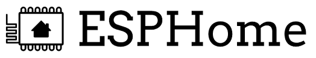



# ESPHome custom sensors and actuators

*ESPHome is a product from Nabu Casa, like Home Assistant is also one of them.*

## Introduction

Not every sensor is available on the market as a complete product.
Sometimes the only way is to create one yourself.\
It's also fun to build your own. 
It's also possible to combine multiple sensors together with one ESP board.

The ESP board is a small mini computer with onboard WiFi. ESPHome makes it easy to program these boards.

You define for each ESP board the connected sensors in a template. In the template, you define your ESP board and which and how the sensors are connected.
The sensor registers itself automatically to Home Assistant (or sends its data to a MQTT server).

---

## Articles

I wrote multiple articles about creating your own wireless WiFi sensors and actuators based on the ESP chip with ESPHome:

<a class="hp-card hp-tile" href="orcon_mechanic_ventilation">

Ventilation control<strong>Control an Orcon mechanic ventilation system</strong>
Make an Orcon mechanical ventilation smart with an ESP board.

</a>
<a class="hp-card hp-tile" href="co2_scd40">

CO2 sensor<strong>CO2 sensor based on a SCD40 sensor</strong>
Create your own ESPHome CO2 sensor based on the SCD40 sensor for Home Assistant.

</a>
<a class="hp-card hp-tile" href="co2_senseair_s8_sensor">

CO2 sensor<strong>CO2 sensor based on a SenseAir S8 sensor</strong>
Create your own ESPHome CO2 sensor based on the SenseAir S8 sensor for Home Assistant.

</a>
<a class="hp-card hp-tile" href="microwave_radar_sensor_rcwl-0516">

Motion and Presence sensor<strong>Motion and Presence sensor based on the RCWL-0516 sensor</strong>
Create your own ESPHome motion and presence sensor for Home Assistant.

</a>

---

## How to flash with ESPHome

<a class="hp-card hp-tile" href="esphome_flashing">

How to<strong>How to flash the config to the ESP board</strong>
Install the ESPHome config on your ESP board, the first time and via the air afterwards.

</a>

---

## DIY Best Buy Tips

<a class="hp-card hp-tile" href="../buy/esphome_diy">

Best Buy Tips<strong>ESPHome DIY sensors</strong>
All kinds of hardware buy tips to create your own sensors: ESP boards, sensors, cables and tools.
To the buy tips &rarr;

</a>

