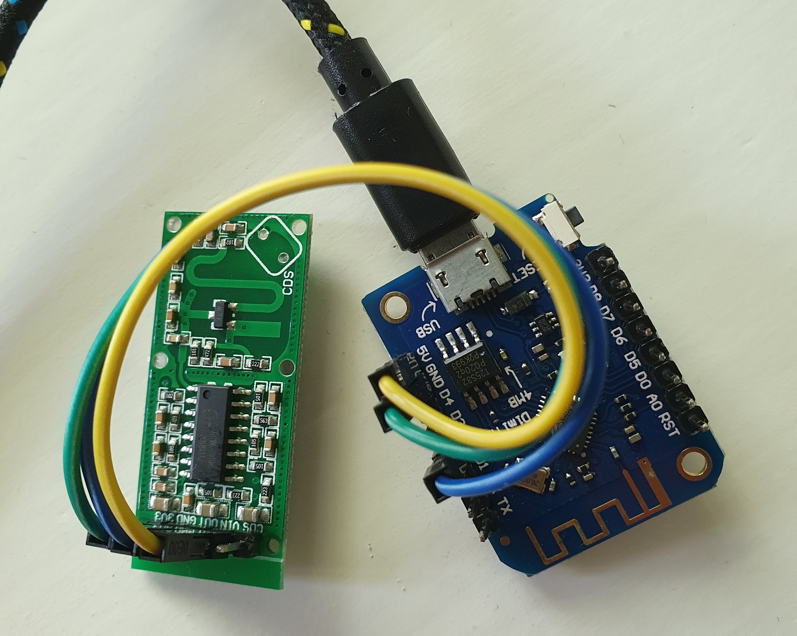
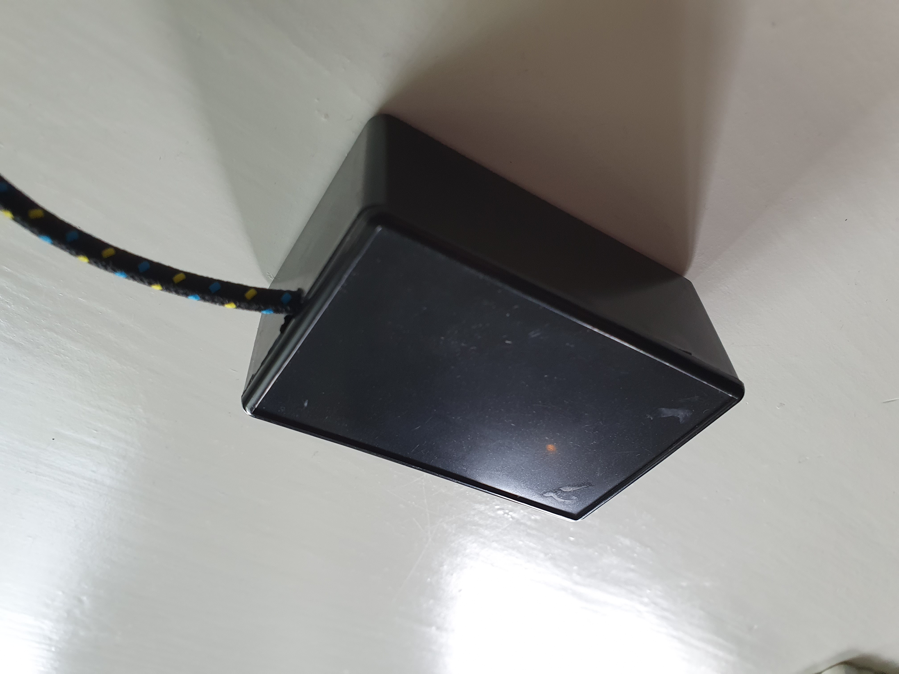
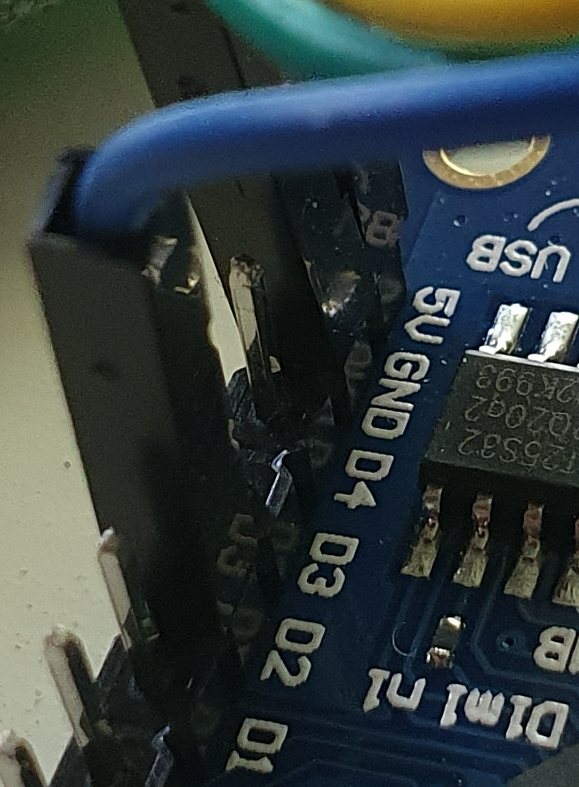
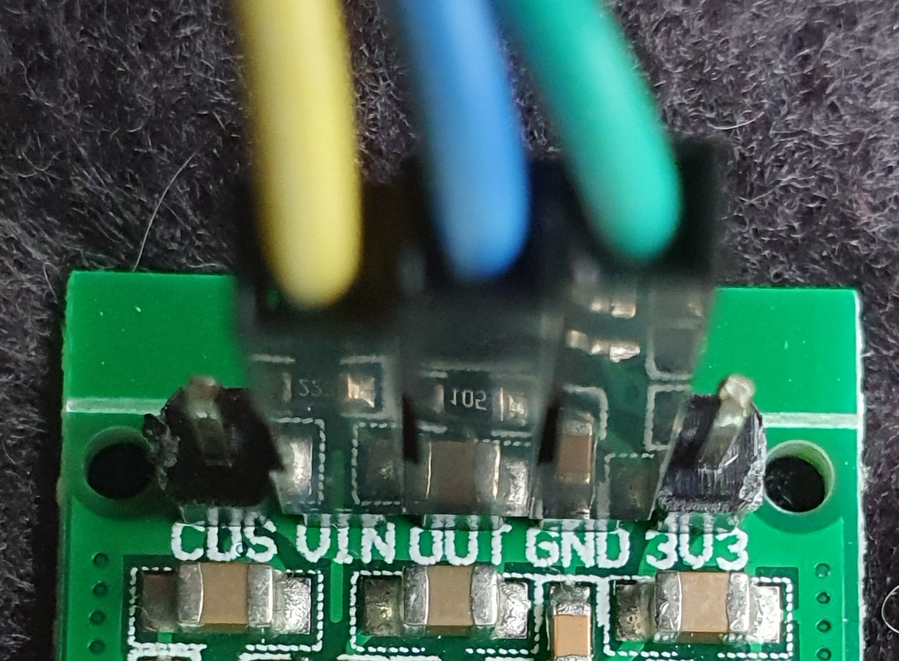
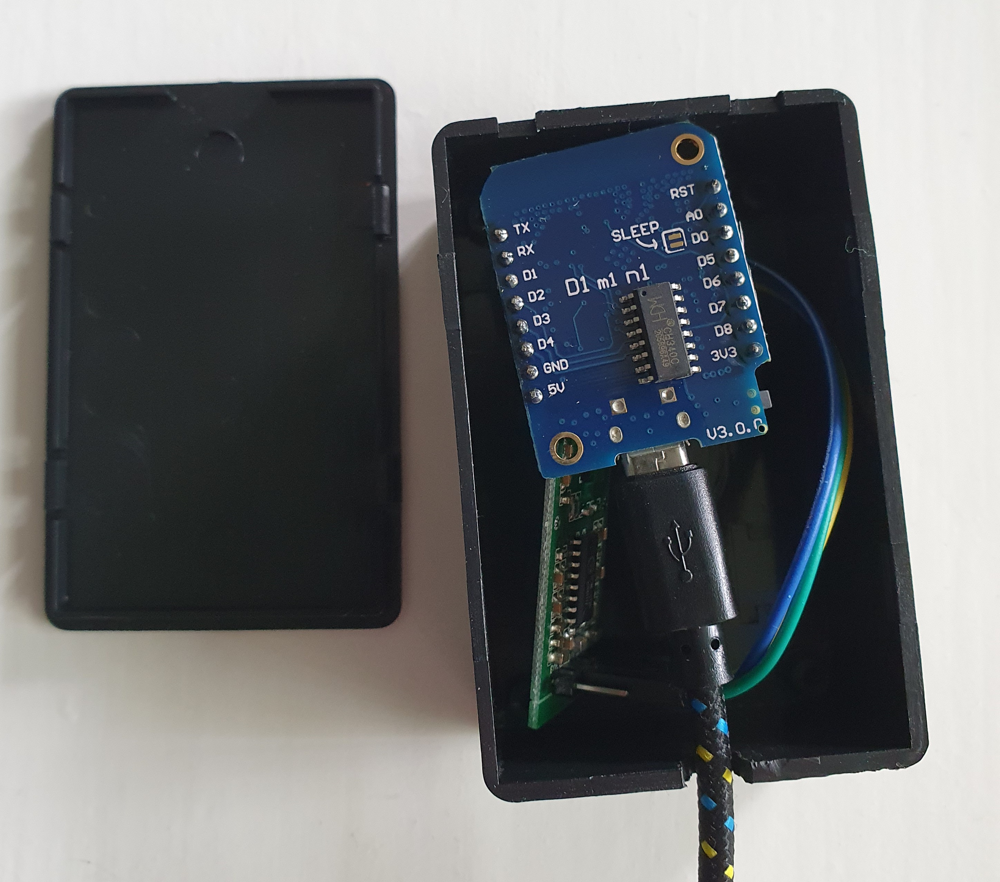
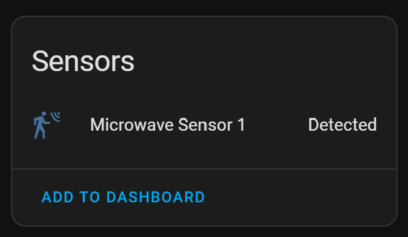
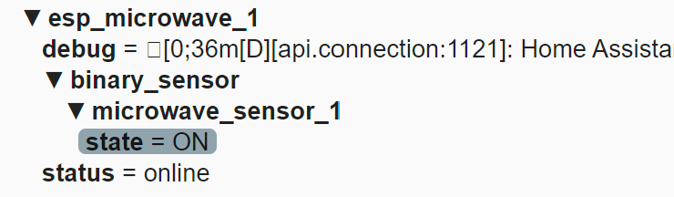
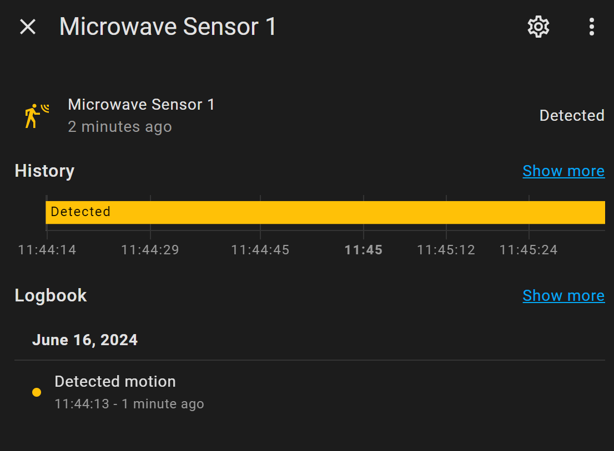



# ESPHome Presence detection with a microwave radar sensor

*Based on the RCWL-0516 sensor*

## Introduction


The RCWL-0516 microwave sensor is a cheap presence detection sensor based on radar technology.\
The advantage above a traditional PIR motion sensor is that you can hide it out of sight by placing it, for example, inside a closet.

## My solution

I used this sensor in combination with a compact D1 mini ESP chip to create multiple, low-priced, occupancy detection sensors which also works in Home Assistant.

<a href="images_rcwl-0516/rcwl_0516_wired.jpg">

</a>

<a href="images_rcwl-0516/rcwl_0516_closed_box.jpg">

</a>

Click on the photos to see them in fullscreen.

---

## Table of Contents
<!-- TOC -->
  * [My solution](#my-solution)
  * [Required hardware](#required-hardware)
  * [Connect the hardware](#connect-the-hardware)
  * [Required software](#required-software)
  * [Test if it works](#test-if-it-works)
  * [Home Assistant](#home-assistant)
<!-- TOC -->

---

## Required hardware

These hardware components do I use for this project:
The sensor, an ESP, wires, usb cable and a power adapter.

Affiliate links are used here. Same price as normal, but now you also sponsor this blog with a few cents.

### RCWL-0516 microwave sensor

This radar sensor detect human presence via radar signals.

{{imgBasket}}<a href="https://s.click.aliexpress.com/e/_Dc8YZ39" target="_blank">link 1 (AliExpress)
<br>

</a>

You can buy a single sensor for around &euro; 0,45 or buy 5 or 10 in bulk,
which is cheaper per piece if you plan to create multiple sensor to use around the house.

{{imgBasket}}<a href="https://s.click.aliexpress.com/e/_DE3U61H" target="_blank">link 2, per 5 pieces (AliExpress)</a>\
{{imgBasket}}<a href="https://s.click.aliexpress.com/e/_Dee7OwP" target="_blank">link 3, per 10 pieces (AliExpress)</a>


### ESP board

You can use any ESP board, but on this page I use the tiny ESP8266 D1 mini.

* The pins are not soldered on the board yet (with some practice even you can do it for sure!)

{{imgBasket}}<a href="https://s.click.aliexpress.com/e/_ooKDQkk" target="_blank">link 1 (AliExpress)</a>\
{{imgBasket}}<a href="https://s.click.aliexpress.com/e/_DmlkMXv" target="_blank">link 2 (AliExpress)</a>

<a href="https://s.click.aliexpress.com/e/_ooKDQkk" target="_blank">
</a>

### Dupont cables

Dupont are cables to connect the ESP pins with sensors pins. 
The dupont cables are in different variants: male-to-male, female-to-male and male-to-female. 
You can also cut one end to just solder it direct to the connector.

I used for this project female-to-female because I soldered the pin heads on the ESP and sensor. 

<a href="https://s.click.aliexpress.com/e/_DEy2mvt" target="_blank">
</a>

{{imgBasket}}<a href="https://s.click.aliexpress.com/e/_DEy2mvt" target="_blank">link 1 (AliExpress)</a>\
{{imgBasket}}<a href="https://s.click.aliexpress.com/e/_EIjrYwZ" target="_blank">link 2 (AliExpress)</a>

* I advise: If you order these, you can better order all three types at ones, also for any further projects.

### Case

Any case with a minimum length of 7 cm, width of 3 cm, and a height of 3 cm can be used.\

It can also be a plastic box from a local shop.

Also, a decorative small statuette can be used.

On AliExpress they also sell
{{imgBasket}}<a href="https://s.click.aliexpress.com/e/_DDALbXD" target="_blank">
Plastic DIY Cases (AliExpress)
<br>

</a>
<br>

### USB power cable

A cable to power the ESP.

{{imgBasket}}<a href="https://s.click.aliexpress.com/e/_onj6tZi" target="_blank">
Micro USB cable to USB A to power the ESP (AliExpress)
<br>

</a>
<br>

### 5V USB power adapter

A power adapter to power the ESP and sensor.

{{imgBasket}}<a href="https://s.click.aliexpress.com/e/_DBB3Upl" target="_blank">
5V USB power adapter (AliExpress)
<br>

</a>

### Soldering tools

This project require some soldering, If you don't have an soldering iron and tin wire yet check this link where to buy it.\
{{imgBasket}}<a href="/buy/esphome_diy#tools" target="_blank">soldering hardware</a>

<br>

Found a dead link? [Please inform me](https://github.com/vdbrink/vdbrink.github.io/issues) or look at [ESPHome DIY sensors - best buy tips](../buy/esphome_diy) for alternative links.

---
## Connect the hardware

This table shows how the ESP D1 mini is connected with the RCWL-0516.

| Connected pins                                                                                                                                                     | ESP8266 Wemos <br>D1 mini pins                                                                                                                      | RCWL-0516 pins                                                                                                                            |
|--------------------------------------------------------------------------------------------------------------------------------------------------------------------|-----------------------------------------------------------------------------------------------------------------------------------------------------|-------------------------------------------------------------------------------------------------------------------------------------------|
| <a href="images_rcwl-0516/d1_mini_pins_connected.jpg"></a> | <a href="images/pins_esp8266_wemos_d1_mini.png"></a> | <a href="images_rcwl-0516/rcwl_0516_pins.jpg"></a> |

Click on the photos/image to open it fullscreen.

| ESP D1 pin | GPIO pin | RCWL-0516 pin | cable color | description                                 |
|------------|----------|---------------|-------------|---------------------------------------------|
| D2         | GPIO4    | VOUT          | blue        | RCWL sends HIGH signal when motion detected |
| GND        | GND      | GND           | green       | ground                                      |
| 5V         | 5V       | VIN           | yellow      | power                                       |

&ast; The `GPIO pin` is the port which is used in the ESPHome yaml.

I've made a small hole in the case for the power USB cable.\
The sensor detects through the case, no holes are needed in the case.

<a href="images_rcwl-0516/rcwl_0516_in_the_box.jpg">

</a>

<a href="images_rcwl-0516/rcwl_0516_closed_box.jpg">

</a>

---

## Required software

### ESPHome


The only software you need is <a href="https://esphome.io/" target="_blank">ESPHome</a>.\

This software is used to flash the config file to the ESP board.

Their website contains a lot of information about how to config all kinds of sensors.
Also, the one we used here, a binary sensor:

* [ESPHome Binary Sensor Component page](https://esphome.io/components/binary_sensor/)

#### Flash the script

There are a lot of ways to flash the config file with ESPHome to the board.\
Read [here](esphome_flashing) how to upload it.

Connect the ESP via USB to the computer.

One possible way is to run python in command line:
> esphome "microwave sensor RCWL-0516.yaml" run

The "microwave sensor RCWL-0516.yaml" YAML file
```yaml
# Sourcecode by vdbrink.github.io
esphome:
  name: esp_microwave_1
  comment: Occupancy sensor
  platform: ESP8266
  board: d1_mini

wifi:
  ssid: "XXX"
  password: "XXX"
  fast_connect: true # only needed for hidden SSID

# Push the data also to MQTT topics: 
# * esp_microwave_1/binary_sensor/microwave_sensor_1/state
mqtt:
  broker: 192.168.XXX.XXX
  port: 1883
  username: "XXXX"
  password: "XXXX"

# Enable logging to the console
logger:

# Home Assistant integration
api:

# Sensors definitions
# See https://esphome.io/components/binary_sensor/ for all config parameters
binary_sensor:
  - platform: gpio
    pin: D2
    name: "Microwave Sensor 1"
    id: microwave_sensor_1
    device_class: motion
    filters:
      - delayed_off: 180000ms # wait for 180 seconds without motion to send OFF
```

---
## Test if it works

Now the data is flashed, check if the sensor pushes the data correctly.

### Via console
If you flash the ESP via the console and enabled logging,
you see the readings in the console direct after the ESP is flashed.

### Via Home Assistant

Ones the ESP is online it automatically registers itself by Home Assistant if you installed ESPHome.

You will see a new device with one entity.



### Via MQTT
One way is to test, if the ESP works now, check for incoming MQTT messages (if you enabled it in the config).  
On Windows you can use the application MQTT Explorer.
The sensor sends it data to the topics `/esp_microwave_1/binary_sensor/microwave_sensor_1/state`



---

## Home Assistant

In Home Assistant you now have a new boolean sensor if presence is detected.




