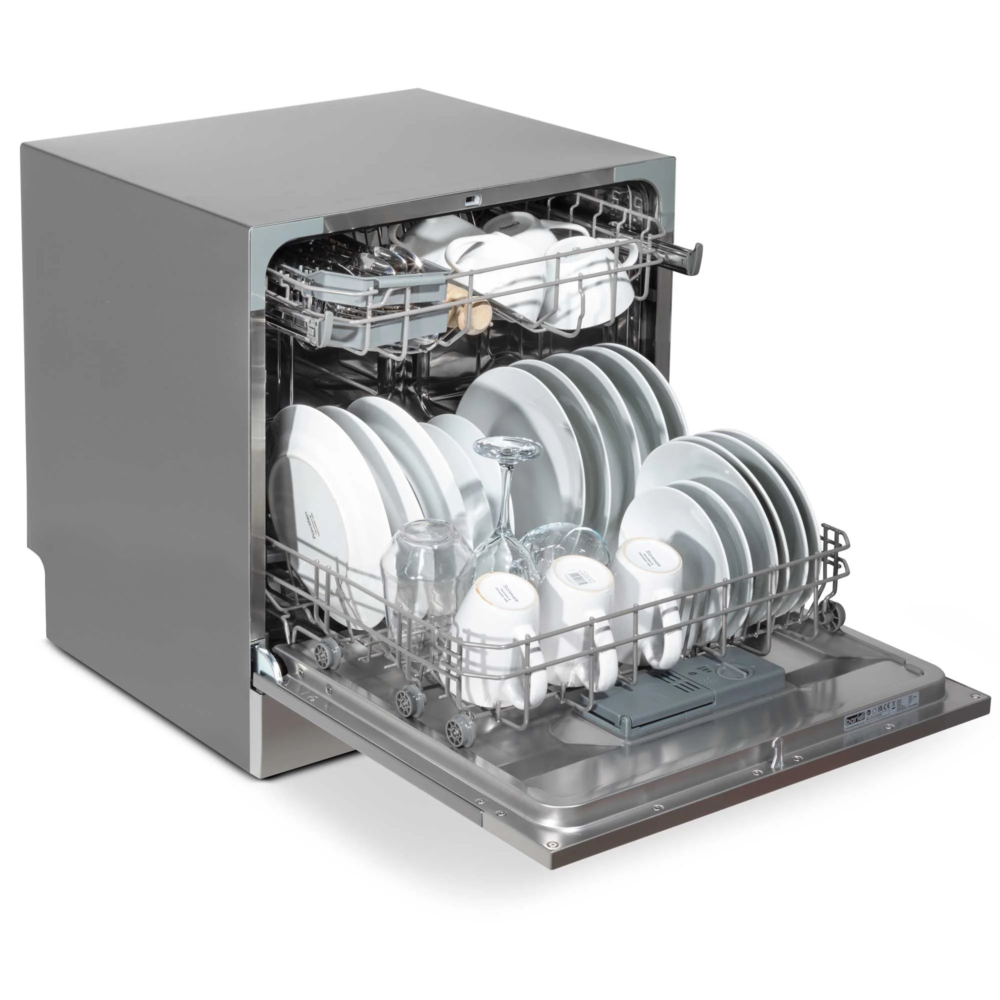

# Dishwasher with error code E4
*How to fix it yourself*

## Introduction

One day, the dishwasher suddenly wouldn't start. It began beeping and displayed an E4 error code.

I checked the manual, but it only mentioned: writing down the error code and calling a service company.

Most of the time, such errors are caused by a sensor that checks for water level, pressure, or temperature not being within the expected range.

When I googled the E4 error code, I found that most dishwasher manufacturers use this code for issues related to water filling or draining.

This is a video showing the error I encountered:

I managed to fix it myself! Read on to find out how...

## How I fixed it

The solution that worked for me was:

* I pulled the dishwasher completely out of the cabinet;
    * All water and electrical cables can remain connected.
* Placed some towels underneath the dishwasher;
* Tilted the dishwasher at a 45-degree angle onto its side;
    * Water began to come out from the bottom of the dishwasher.
* Tilt it a bit further until no more water is leaking.
* First, test if this solves the problem before putting it back in place:
    * Turn it on and wait a moment, with the error, the beeping started immediately and should now be gone!
* If there's no error anymore, place it back in the cabinet, congratulations you fixed it yourself!

This could save you a lot of money!

## Alternative solutions

If the error isn't fixed, try these alternative solutions:

* Check if there's a kink in the inlet hose that might be preventing water from entering the machine;
    * Also check the drain hose for any kinks that might be blocking waste water from exiting;
* Check if there's any debris in the drain filter that could be blocking the water from draining properly.
  
* Unplug the dishwasher for a few minutes and plug it back in to see if that resets the error state.

If none of these attempts help, then it's time to call a professional.
Something may truly be broken and need to be replaced.

## Remarks

If you have another solution or any remarks, feel free to send me a message via my social media accounts 
or create a [GitHub issue](https://github.com/vdbrink/vdbrink.github.io/issues).
