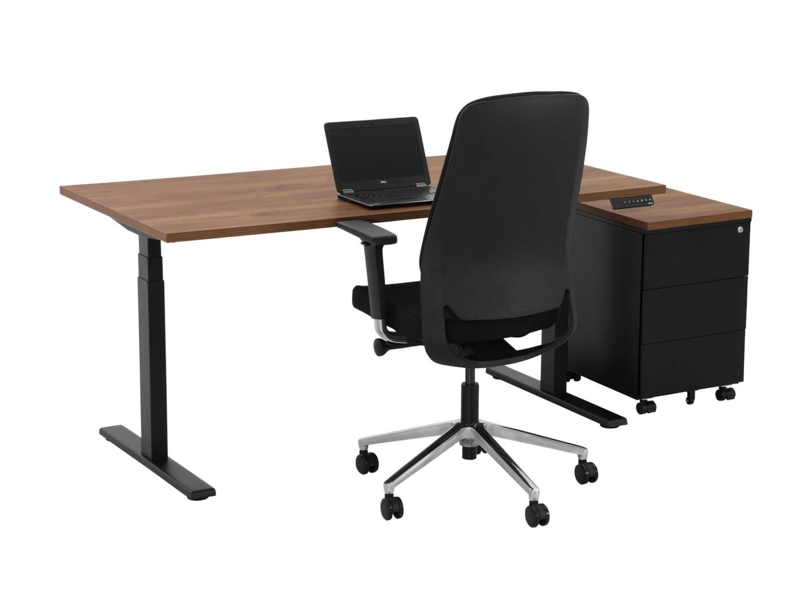
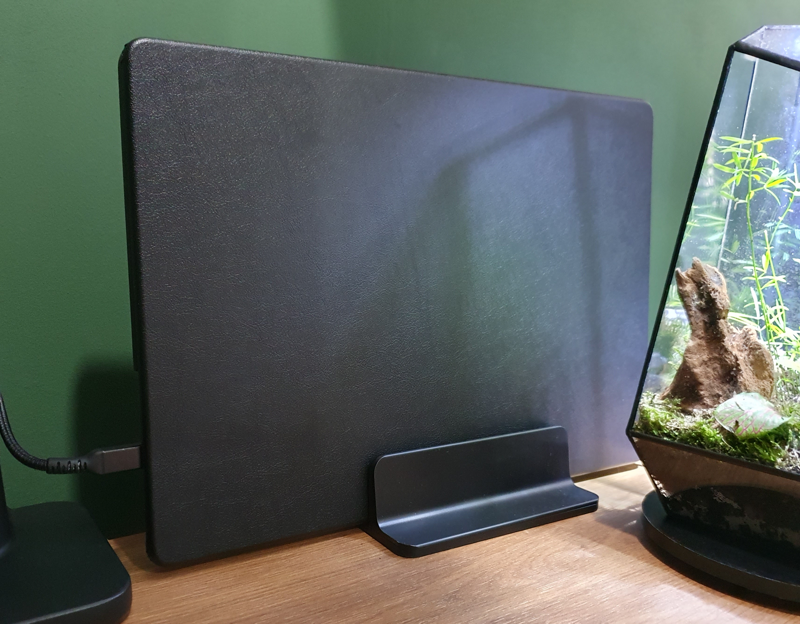
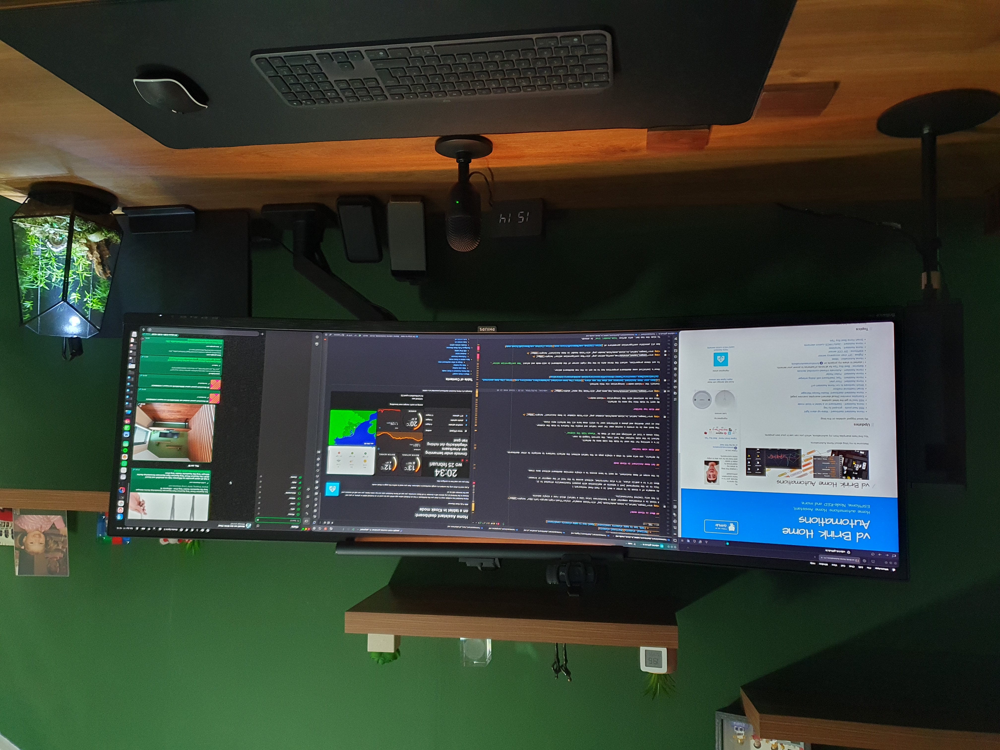
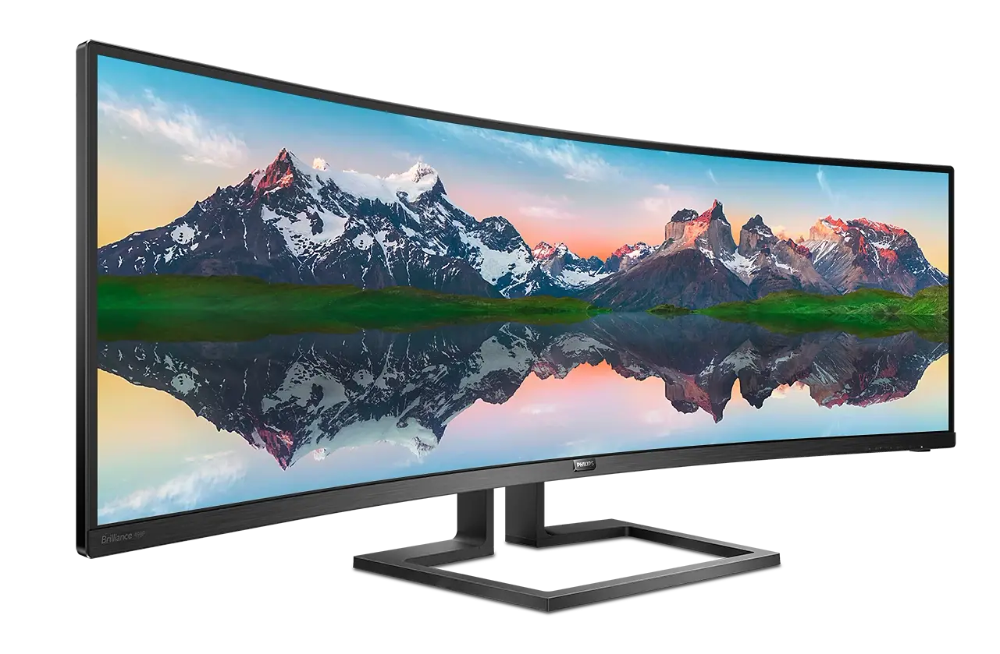
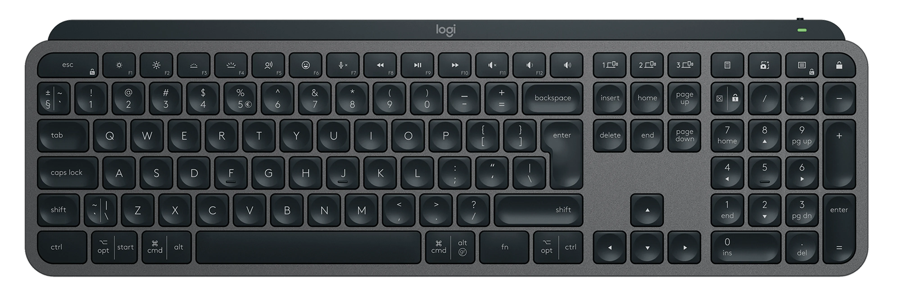
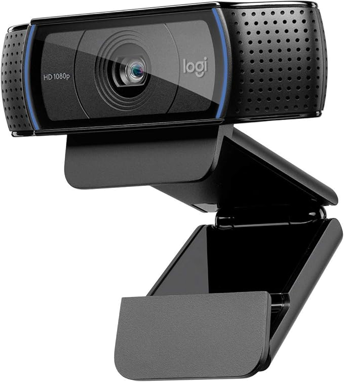
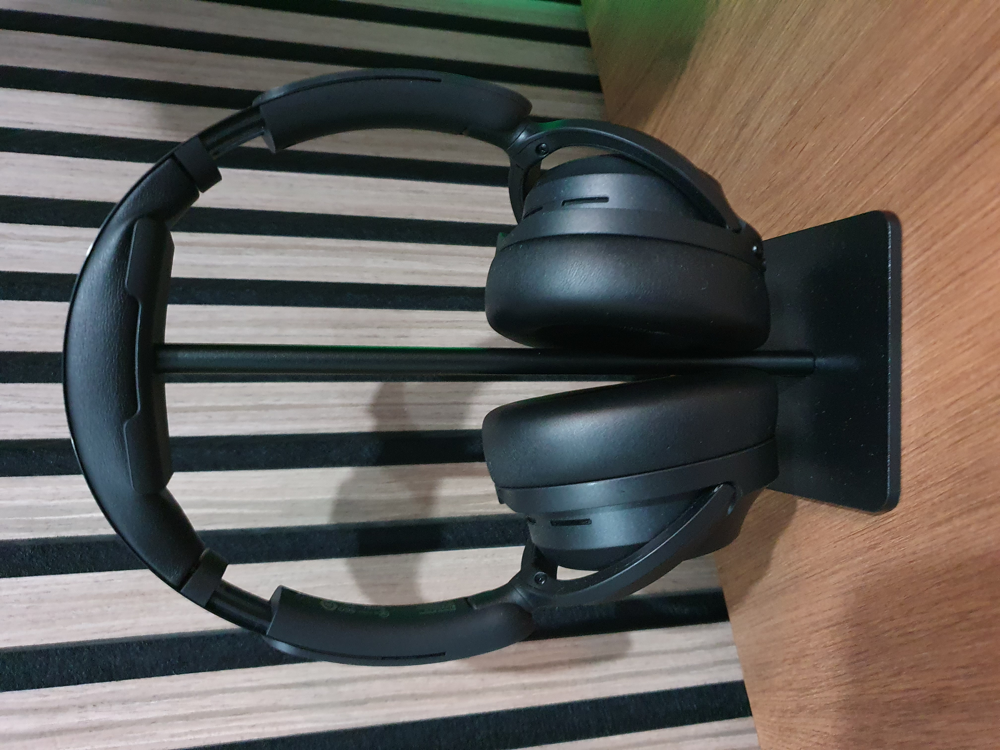
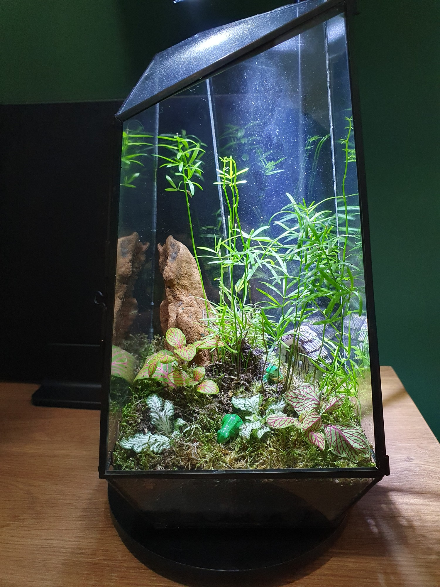
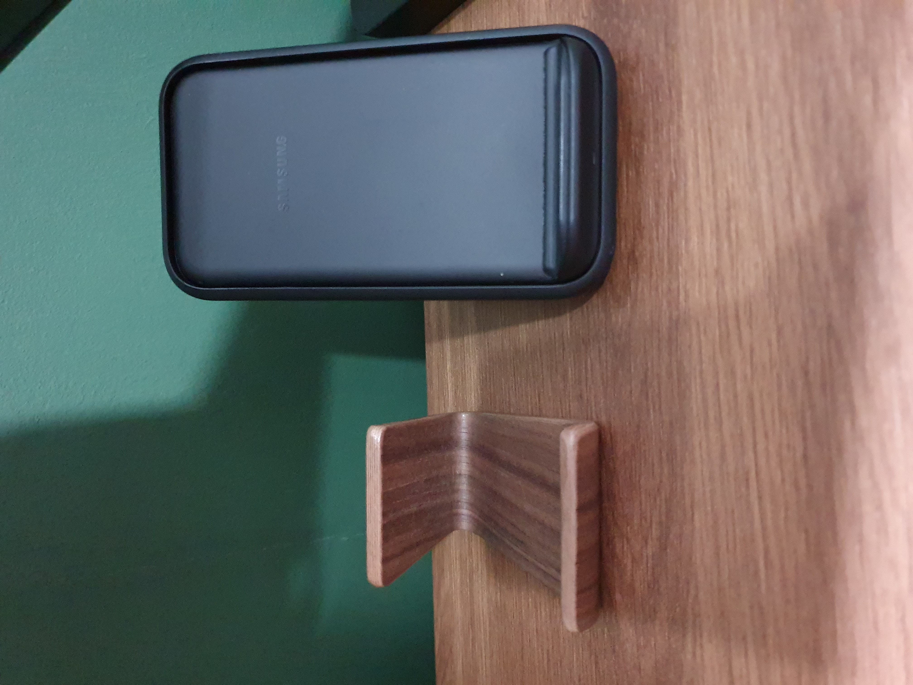



# Home office desk setup hardware list

On this page you can read which hardware I use now.

---

## Table of Contents
<!-- TOC -->
  * [Desk](#desk)
  * [Laptop](#laptop)
  * [Laptop charger](#laptop-charger)
  * [Laptop stand](#laptop-stand)
  * [Laptop case](#laptop-case)
  * [Monitor](#monitor)
    * [Monitor cable](#monitor-cable)
    * [Monitor arm](#monitor-arm)
  * [Keyboard](#keyboard)
  * [Chair](#chair)
  * [Mouse](#mouse)
  * [Desk pad](#desk-pad)
  * [Camera](#camera)
  * [Microphone](#microphone)
  * [ANC over ear headset](#anc-over-ear-headset)
    * [Headphone stand](#headphone-stand)
  * [Accessories](#accessories)
    * [Moss terrarium](#moss-terrarium)
    * [Mug coaster](#mug-coaster)
    * [Wireless phone charger](#wireless-phone-charger)
    * [Walnut Phone stand](#walnut-phone-stand)
    * [Cat tower](#cat-tower)
* [Future improvements](#future-improvements)
  * [Clock](#clock)
  * [Retractable USB charger](#retractable-usb-charger)
  * [Camera](#camera-1)
<!-- TOC -->

---
## Desk

My wishlist for my new desk was clear:
* Walnut top
* 180 - 200 cm wide
* 80 cm deep
* Electric standing/sit desk
* 2 programmable preset heights
* Black legs
* Minimal wires visible

 
It took some time to find the perfect desk.
There are so many companies who sell such desks.

I was eventually choosing between:
* The {{imgBasket}}[Flexispot E7 Pro](https://www.flexispot.nl/elektrisch-zit-sta-bureau-e7-pro.html) this one has good reviews but didn't have the full 200 cm width desk top.
* The {{imgBasket}}[YOUP02-Z-CW-128 Electric desk black Cognac Walnut](https://www.goedkoopinrichten.nl/product/115/elektrisch-zit-sta-bureau-youp02-zwart-cognac-walnoten?modelId=572) matched all criteria but less reviews.

I eventually bought the YOUP02 from [www.goedkoopinrichten.nl](https://www.goedkoopinrichten.nl):

If you're looking for more info about desk choices, you can take a look also at [Reddit - StandingDesk](https://www.reddit.com/r/StandingDesk/).

---
## Laptop

The laptop I use is a powerful MacBook M4 Pro 16 inch.

* {{imgBasket}}[MacBook Pro M4 16" - Amazon US](https://amzn.to/4t2gNUj) 

---
## Laptop charger

I use a Xiaomi 120W USB-c charger to charge my laptop.

* {{imgBasket}}[Xiaomi 120W USB-c - AliExpress](https://s.click.aliexpress.com/e/_c34kENKH)

---
## Laptop stand

To make the desk clean, I have my laptop upright with a black vertical laptop stand.
This way I can also easily detach it and replace it with my personal laptop.

* {{imgBasket}}[Vertical laptop stand black - AliExpress](https://s.click.aliexpress.com/e/_c3YOP0VH)

Alternative solutions:

* {{imgBasket}}[Walnut stand upright - AliExpress](https://s.click.aliexpress.com/e/_c4KppAtd)
* {{imgBasket}}[Laptop mount under desk - AliExpress](https://s.click.aliexpress.com/e/_c3Kc8qzt)
* {{imgBasket}}[Laptop side desk mount - AliExpress](https://s.click.aliexpress.com/e/_c4EqTSqf)

## Laptop case

To avoid outside light reflections and distractions from the silver laptop on my desk I put a black case around my laptop. 
I choose to have all items below my monitor and on my desk to be black.

* {{imgBasket}}[Macbook Pro 16" cover - AliExpress](https://s.click.aliexpress.com/e/_c4syE4fB)

---
## Monitor

The monitor is a Philips 49" curved screen with a resolution of 5120 x 1440.
With an aspect ratio of 32:9 and curving of 1800R.
It's the size of two 27" next to each other.

This is one of my best purchases ever! I still love it every day.
The big advanced compare to two separated 27" screens is that you can split your application windows as you like for the current moment. 
Sometimes this into three equal app windows, or one big window in the middle and small on the sides.

The model I have is the Philips P Line 498P9Z/00 (model from 2021). 
It's now replaced with even better screens with the same sizes. 

Alternative:

* {{imgBasket}}[Philips 49" curved monitor - 49B2U5900C - Amazon NL](https://amzn.to/4afMEdn)
* {{imgBasket}}[Philips 49" curved monitor - 49B2U5900C - Amazon US](https://amzn.to/4afMEdn)

---
### Monitor cable

The Philips monitor has a single DisplayPort 1.4 and 3x HDMI 2.0 ports.

To get the maximum resolution of 5120 x 1440 with 165 Hz, I use a single DisplayPort cable.

* {{imgBasket}}[USB C/Thunderbolt 3 to DisplayPort 1.4 Cable 8K - Amazon NL](https://amzn.to/3MSMgsm)
* {{imgBasket}}[Similar cable from Ugreen - AliExpress](https://s.click.aliexpress.com/e/_c3P8oBaL)

---
### Monitor arm

To make a clean desk, I was looking for a monitor arm which should hold the screen stable, 
not wobbly and is attached to the desk. Now the monitor "float" above the desk.
It should also hold easily the weight of the 12 kg 49" screen.
Hide the wires and doesn't stick out on the back, otherwise I had to set the desk away from the wall and loose space. 
I can easily pull and push the screen back- and forward.

I end up with the [ACT AC8340](https://www.act-connectivity.com/en-us/products/av-mounts/single-monitor-arm-office-premium-gas-spring-ac8340)
It's made of strong metal and can hold up to 20 kg, match all my requirements and cost not too much.

* {{imgBasket}}[monitor arm ACT AC8340 - Amazon NL](https://amzn.to/4qFwvD8)
* {{imgBasket}}[monitor arm ACT AC8340 - Tweakers NL - Dutch price compare site](https://tweakers.net/pricewatch/2160666/act-ac8340-monitorarm-office-premium-gasveer-1-monitor.html)

---
## Keyboard

For a keyboard, I want a wireless, silent, smooth typing, with big shift and return button, volume buttons and a numpad.

The [Logitech MX Keys S (Qwerty)](https://www.logitech.com/en-eu/shop/p/mx-keys-s.920-011587) was a logical choice, it's much more than what's on my wishlist.
It can easily switch between three devices, it lights up when you come closer, charging via USB-C.

 
<em>YouTube product video about the Logitech MX Keys</em>

* {{imgBasket}}[Amazon NL](https://amzn.to/4bXiCML)
* {{imgBasket}}[Amazon US](https://amzn.to/4kFN3cE)

## Chair

The chair I use is an old model from Ikea but still sits pretty comfortable.

Alternative:
* {{imgBasket}}[MILLBERGET - Ikea NL](https://www.ikea.com/nl/nl/p/millberget-bureaustoel-murum-zwart-70489394/#content)

## Mouse

The mouse I use is a basic wireless soft-click and scroll one.
Simple but perfect for years!
Works with a single AA battery.

* {{imgBasket}}[Basic soft-click mouse - AliExpress](https://s.click.aliexpress.com/e/_c3BUrspD)

## Desk pad

I use a very large mouse pad underneath my keyboard and mouse.
The top material is soft with a smooth surface for the perfect sliding with the mouse.
The bottom material is made of rubber to keep it on its place.

I use a full black one without any art distractions on it.

The size of my pad is 400 x 900 x 3 mm. 
They are available in many different sizes and with different border colors.
I have the all-black version.

* {{imgBasket}}[Large anti-slip mouse pad - AliExpress](https://s.click.aliexpress.com/e/_c4lkc8mT)

Alternative:
* {{imgBasket}}[Other all black big pad - AliExpress](https://s.click.aliexpress.com/e/_c4TG8ihV)

## Camera

I choose a basic camera (years back) for the features:
* HD USB camera with a lens cover
* 30 fps
* Light correction
* Good sound and microphone quality (now I use a separated microphone)
* A mount with contra weight to place on top of a monitor

Back in the days, the Logitech C920 HD Pro Webcam was a perfect match for me, and it still works fine.
But it can be upgraded to a newer one with a 4K resolution with auto follow feature. I'm open for any good suggestions!

* {{imgBasket}}[Logitech C920 HD Pro Webcam - Amazon NL](https://amzn.to/4kLNBO6)

## Microphone

For an affordable basic microphone, I've chosen for the Razer Seiren Mini black - USB condensator microphone.

* {{imgBasket}}[Razer Seiren Mini black - Amazon NL](https://amzn.to/4cwPg84)

## ANC over ear headset

For my new office I looked for a newer and improved over ear headset.
The development of ANC is improving every year and my daily used three-year-old headset could get an upgrade.
I want to go for the overall best option, the Sony WH, but the price is very high for a headset. 
This keeps me looking further. 
I heard and read good stories about the QCY H3 and when I found out the improved 2026 version H3S was released, I went for this one!
In the past I had already good experience with the QCY in-earbuds for on-the-go.

&nbsp;

&nbsp;

 
* Dual device connect - possibility to connect at the same time to two devices (laptop and phone)
* Soft top - no hard plastic pressure on your head
* QCY app - to set custom sound settings and the level of noice cancellation
* Bluetooth 6 - long battery life
* Physic buttons - to control ANC/sound/calls
* 5 modes Adaptive ANC Noise cancellation (Adaptive/Crowded/Commute/Indoor/Anti-Wind)
* Foldable headset with a hard case for traveling

 
Just read the reviews!

Available in Black/White/Gray:
* {{imgBasket}}[ANC over ear headset QCY H3S - AliExpress](https://s.click.aliexpress.com/e/_c4rmILlH)

 
Alternative:\
I'm also a fan of the Sony WH range, but the price is 10x the price of the QCY, but it isn't 10x better.
For now, I stick to the QCY.
* {{imgBasket}}[Sony WH-1000XM6 - Amazon NL](https://amzn.to/3QxCUDG)

### Headphone stand

A basic plastic headphone stand.

* {{imgBasket}}[Headphone stand - AliExpress](https://s.click.aliexpress.com/e/_c2JOMKeL)

Alternative:
* {{imgBasket}}[Walnut stand - AliExpress](https://s.click.aliexpress.com/e/_c3OrIwYj)

---
## Accessories

### Moss terrarium

* {{imgBasket}}[Moss terrarium - AliExpress](https://s.click.aliexpress.com/e/_c3MlDAd1)

### Mug coaster

* {{imgBasket}}[Mug coasters - AliExpress](https://s.click.aliexpress.com/e/_c3uKT7xt)

### Wireless phone charger

* {{imgBasket}}[Wireless phone charger - AliExpress](https://s.click.aliexpress.com/e/_c3qTRe0B)

### Walnut Phone stand

* {{imgBasket}}[Walnut Phone stand - AliExpress](https://s.click.aliexpress.com/e/_c4UBgQzZ)

### Cat tower

It's available in three colors: Black/Beige/Gray
* {{imgBasket}}[Cat tower Diogenes L - Bitiba.nl](https://www.bitiba.nl/shop/katten/krabpaal_krabmeubels/krabtonnen/554883?activeVariant=554883.1)

---
# Future improvements

## Clock

I'm still looking for a matching wall clock.
This is the kind of clock I want, very minimalistic, without numbers or gold and in the walnut color.

Alternative:
* {{imgBasket}}[Wall clock - Amazon.nl](https://amzn.to/3O178xU)

---
## Retractable USB charger

I'm also still looking for a clean solution for USB charging cables.
Not everything can be charged wireless.
Sometimes you need a charging cable to charge a headphone or keyboard.
Most of the time you don't need such cable and keep it out of sight.
But when you need it, you don't want to dive under the table to connect one.

A nice solution is retractable USB charging cables. 
You can pull them out when you need it, and it automatically rolls in when you're done.

I found these and the fit almost perfect with my other wood elements.
But I don't like the orange color (I can paint it black, of course).
And the shipping price makes it very expensive.

* {{imgBasket}}[Walnut cable organizer - AliExpress](https://s.click.aliexpress.com/e/_c2ud4CQX)

Alternative:
* {{imgBasket}}[Black dual USB-C power hub - AliExpress](https://s.click.aliexpress.com/e/_c4oe4KB1)

----
## Camera

An newer 4K camera with auto zoom and auto follow feature should be a nice upgrade.
Then everybody can see me sharp and sparkly!

---

Do you have good suggestions for my office desk? Please create an issue or share it as comment on my posts.