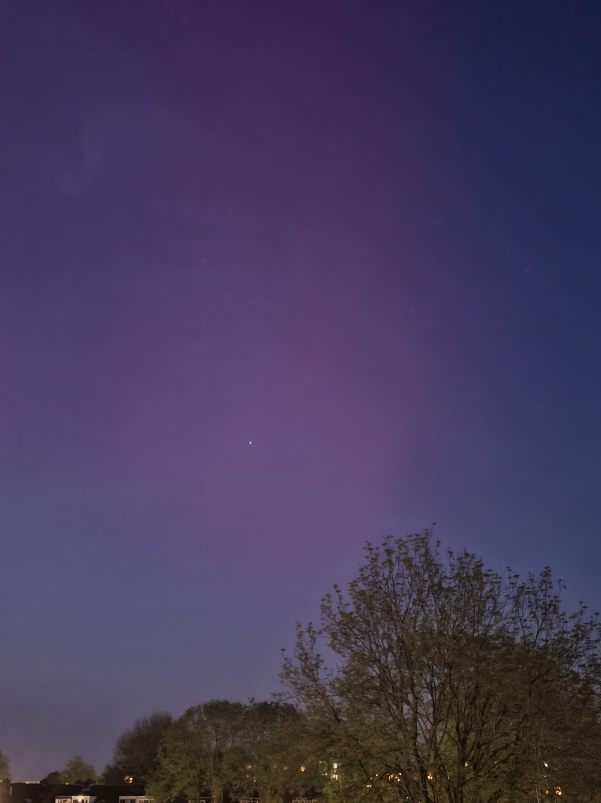
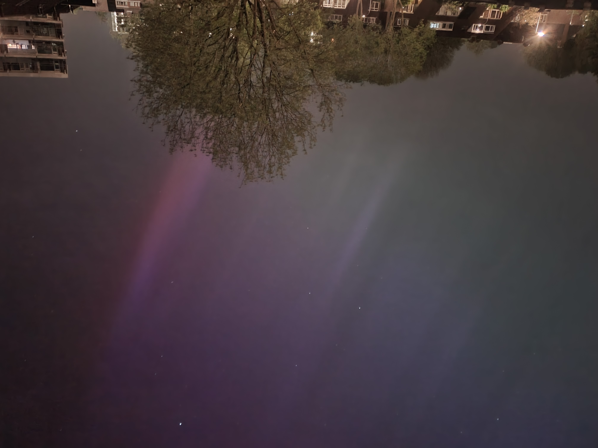
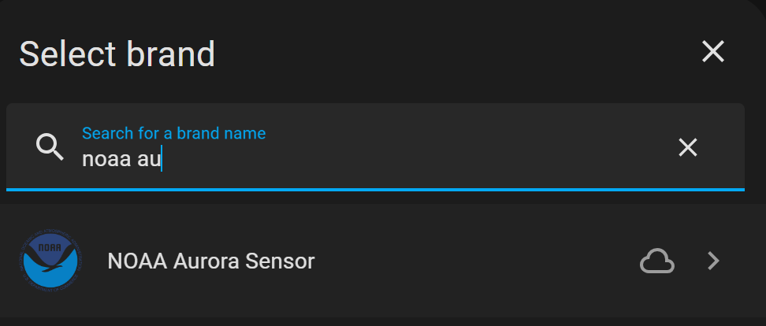
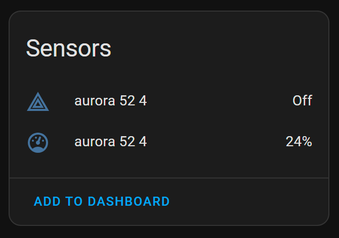
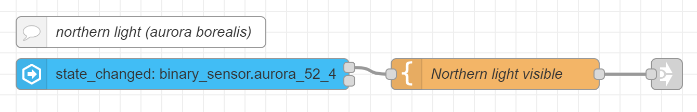

# Home Assistant: Aurora Borealis integration

## Introduction

<a href="index"></a>
Since I caught my first northern light (Aurora Borealis) on camera, here in the Netherlands, I was looking for a way for an own automation which informs me when the change is available to catch it again! I already had an app for that, but I want to integrate it to my own home server and send my own alert messages. Then I can remove that app again.

After a post on a forum, I was informed about a Home Assistant integration, called: `NOAA Aurora Sensor`. 
This does exact what I want. 
Set a threshold which sets a sensor value on `On` when the change is high to see it.





<br>

More info about this integration [www.home-assistant.io/integrations/aurora](https://www.home-assistant.io/integrations/aurora)

---
## Home Assistant integration: NOAA Aurora Sensor

Go to integrations and search for `noaa aurora`



This Aurora integration uses the NOAA Aurora Forecast service to let you know if an aurora might be visible at your home location in the next 30 minutes, based on the current solar flare activity.

This service adds two sensors, one contains a number 0-100 representing the current likelihood in percentage of visible auroras at your latitude/longitude.

| Sensor Type   | Values   | Description                                                           |
|---------------|----------|-----------------------------------------------------------------------|
| binary_sensor | on / off | on = high chance of Aurora visibility, off = low chance of visibility |
| sensor        | % value  | Percentage chance of visibility                                       |
<br>


By default, this sensor is set up to trigger when the reported likelihood for your location is > 75. You can change this value in the settings.

It updates every 5 minutes.

Now it's possible to create a notification based on these sensors.

> **_NOTE:_** On the evening of the big visibility of northern light, this integration value was for me only 9% with binary_sensor off.\
> I advise also adding an automation which checks the KP value which should be bigger than 8.

---

## Node-RED alert

I use Node-RED for my automations. 

This flow sends a text if the above binary_sensor is `true`/`on`.



* The first block is the [HA condition node](../node-red/node-red_home-assistant) `events: state node` with (my) entity `binary_sensor.aurora_52_4` which has state `on`
* If that state matches, the next node is triggered and passes the text `Northern light is now possible visible` 
* The third node is `link out node` to my notification global flow.

The corresponding Node-RED flow:
```yaml

[{"id":"8990d4c3d816c12c","type":"tab","label":"Flow 3","disabled":false,"info":"","env":[]},{"id":"c16ee5149b439845","type":"server-state-changed","z":"8990d4c3d816c12c","name":"","server":"969e9e50.88897","version":5,"outputs":2,"exposeAsEntityConfig":"","entityId":"binary_sensor.aurora_52_4","entityIdType":"exact","outputInitially":false,"stateType":"str","ifState":"on","ifStateType":"str","ifStateOperator":"is","outputOnlyOnStateChange":true,"for":0,"forType":"num","forUnits":"minutes","ignorePrevStateNull":true,"ignorePrevStateUnknown":true,"ignorePrevStateUnavailable":true,"ignoreCurrentStateUnknown":true,"ignoreCurrentStateUnavailable":true,"outputProperties":[{"property":"payload","propertyType":"msg","value":"","valueType":"entityState"},{"property":"data","propertyType":"msg","value":"","valueType":"eventData"},{"property":"topic","propertyType":"msg","value":"","valueType":"triggerId"}],"x":200,"y":80,"wires":[["fb513212ee004153"],[]]},{"id":"13cf622cd20da9fa","type":"comment","z":"8990d4c3d816c12c","name":"northern light (aurora borealis)","info":"","x":160,"y":40,"wires":[]},{"id":"6b807e64aa44f552","type":"link out","z":"8990d4c3d816c12c","name":"send notification","mode":"link","links":[],"x":665,"y":80,"wires":[]},{"id":"fb513212ee004153","type":"template","z":"8990d4c3d816c12c","name":"Northern light visible","field":"payload","fieldType":"msg","format":"handlebars","syntax":"mustache","template":"Northern light is now possible visible","output":"str","x":500,"y":80,"wires":[["6b807e64aa44f552"]]},{"id":"969e9e50.88897","type":"server","name":"Home Assistant","version":5,"addon":false,"rejectUnauthorizedCerts":true,"ha_boolean":"y|yes|true|on|home|open","connectionDelay":false,"cacheJson":true,"heartbeat":false,"heartbeatInterval":"30","areaSelector":"friendlyName","deviceSelector":"friendlyName","entitySelector":"friendlyName","statusSeparator":"at: ","statusYear":"hidden","statusMonth":"short","statusDay":"numeric","statusHourCycle":"h23","statusTimeFormat":"h:m","enableGlobalContextStore":true}]

```


