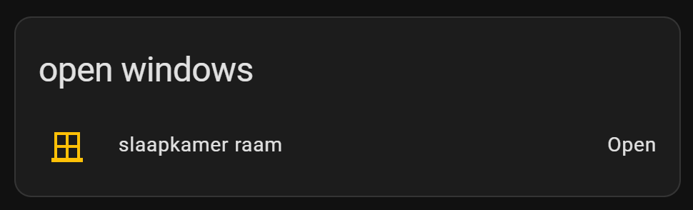

# Home Assistant dashboard custom element: Auto-entities


<a href="index"></a>

Here you find Home Assistant (lovelace) dashboard examples from the custom HACS card element **auto-entities** which you can add to your own dashboards.

Auto-entities is a very powerful addon card that can let you make dynamic entity lists based on (multiple) filters, include and exclude entities, different types of sorting and presenting.

The git repository with also all options and some examples can be found at https://github.com/thomasloven/lovelace-auto-entities

Install this integration via this button in your own HA instance
[](https://my.home-assistant.io/redirect/hacs_repository/?owner=thomasloven&repository=lovelace-auto-entities&category=integration)

---
## Table of Contents
<!-- TOC -->
  * [Temperatures (rounded, sorted and colored)](#temperatures-rounded-sorted-and-colored)
  * [Humidity (rounded, sorted and colored)](#humidity-rounded-sorted-and-colored)
  * [Show lights ordered by state](#show-lights-ordered-by-state)
  * [Show only the lights which are 'on'](#show-only-the-lights-which-are-on)
  * [Latest activities (motions and doors)](#latest-activities-motions-and-doors)
  * [Open windows](#open-windows)
  * [Missing devices](#missing-devices)
  * [Full moon (single condition)](#full-moon-single-condition)
  * [Only X days left (multiple conditions with AND)](#only-x-days-left-multiple-conditions-with-and)
  * [Upcoming week and sort by days](#upcoming-week-and-sort-by-days)
  * [With attribute data](#with-attribute-data)
  * [Conditional mushroom cards](#conditional-mushroom-cards)
  * [Chores](#chores)
<!-- TOC -->

---

## Temperatures (rounded, sorted and colored)

Show all temperature sensors in order of their temperature from high to low. And show the rounded temperature to a real number and for temperature higher than ideal give them an orange or red color. Blue icons when the temperature is below 10 degrees.


```yaml

# Sourcecode by vdbrink.github.io
# Dashboard card code
type: custom:auto-entities
card:
  type: entities
  show_header_toggle: false
  state_color: false
  title: Temperaturen aflopend
filter:
  include:
    - entity_id: sensor.temp*.temperature
      options:
        type: custom:template-entity-row
        state: |
          {{ states(config.entity)|round(0)}} °C
        style: |
          :host {
            --paper-item-icon-color:
             
              firebrick
              orange
              blue
              var(--primary-text-color)
              
             ;
           }
show_empty: false
sort:
  method: state
  reverse: true
  numeric: true

```

---
## Humidity (rounded, sorted and colored)

Show all humidity sensors in order of their humidity from high to low 
and only when the value is higher or equal than 65%.\
Hide sensor `temp12` and with value `unavailable`.\
Show the rounded humidity to a real number and for humidity higher than 70% red,
higher 60% orange, higher than 55% white.

```yaml

# Sourcecode by vdbrink.github.io
# Dashboard card code
type: custom:auto-entities
card:
  type: entities
  show_header_toggle: false
  state_color: false
filter:
  include:
    - entity_id: sensor.temp*_humidity_rounded
      options:
        type: custom:template-entity-row
        state: |
          {{ states(config.entity)|round(0)}} %
        style: |
          :host {
            --paper-item-icon-color:
             
              firebrick
              orange
              white
              var(--primary-text-color)
              
             ;
           }
  exclude:
    - entity_id: sensor.temp12_humidity
    - state: unavailable
    - state: <= 65
show_empty: false
sort:
  method: state
  reverse: true
  numeric: true  

```

---
## Show lights ordered by state
Show all the lights which are currently `on` always on top.\
Hide also the unavailable ones.


```yaml

# Sourcecode by vdbrink.github.io
# Dashboard card code
type: custom:auto-entities
card:
  type: entities
  show_header_toggle: false
  state_color: false
filter:
  include:
    - entity_id: light.*
  exclude:
    - state: "unavailable"
sort:
  method: state
  reverse: true

```

---
## Show only the lights which are 'on'

Show only the lights which are 'on'.


```yaml

# Sourcecode by vdbrink.github.io
# Dashboard card code
type: custom:auto-entities
show_empty: false
card:
  type: entities
filter:
  include:
    - domain: light
      state: "on"
      options:
        tap_action:
          action: toggle

```

---
## Latest activities (motions and doors)

Show the latest 10 active motion-, presence- and contact door sensors which are changed in the last 30 minutes.


```yaml

# Sourcecode by vdbrink.github.io
# Dashboard card code
type: custom:auto-entities
card:
  type: entities
  state_color: true
  title: Latest activities
filter:
  include:
    - domain: binary_sensor
      attributes:
        device_class: motion
      options:
        secondary_info: last-changed
    - domain: binary_sensor
      entity_id: "*_contact"
      options:
        secondary_info: last-changed
  exclude:
    - last_changed: "> 30m ago"
sort:
  method: last_changed
  count: 10
  reverse: true

```

---
## Open windows

Show which windows are open.



Example 2: based on `device_class`= `window`.
```yaml

# Sourcecode by vdbrink.github.io
# Dashboard card code
type: custom:auto-entities
card:
  type: entities
  state_color: true
  title: open windows
  show_header_toggle: false
filter:
  include:
    - domain: binary_sensor
      state: "on"
      attributes:
        device_class: window
sort:
  method: last_updated
  reverse: true
  numeric: false
show_empty: true

```

Example 2: based on entity name (`raam*`).
```yaml

# Sourcecode by vdbrink.github.io
# Dashboard card code
type: custom:auto-entities
card:
  type: entities
  state_color: true
  title: open windows
  show_header_toggle: false
filter:
  include:
    - name: "*raam*"
      state: "on"
      options:
        secondary_info: last-changed
sort:
  method: last_updated
  reverse: true
  numeric: false
show_empty: true


```


---
## Missing devices

Show devices which didn't trigger an update for the last 24 hours.
You can fine tune this by including or excluding specific devices.


```yaml

# Sourcecode by vdbrink.github.io
# Dashboard card code
type: custom:auto-entities
card:
  type: entities
  state_color: true
  title: Missing devices
filter:
  include:
    - entity_id: /sensor.*_temperature/
      last_updated: "> 24h ago"
      options:
        secondary_info: last-changed
    - domain: binary_sensor
      last_updated: "> 24h ago"
      attributes:
        device_class: motion
      options:
        secondary_info: last-changed
    - entity_id: /sensor.*_contact/
      last_updated: "> 24h ago"
      options:
        secondary_info: last-changed
sort:
  method: last_changed
  count: 15
  reverse: false

```

---
## Full moon (single condition)

Show this only when the entity `sensor.moon` has the status `full_moon`.

```yaml

# Sourcecode by vdbrink.github.io
# Dashboard card code
type: custom:auto-entities
card:
  type: entities
filter:
  include:
    - entity_id: sensor.moon
      state: full_moon
show_empty: false

```

---
## Only X days left (multiple conditions with AND)

For the paper pickup day, I only want this visible when there are only three days left.

Show only for the upcoming days (when the number of days is less than 4 AND more than -1).


[See here how to create a day countdown based on a date.](homeassistant_dashboard_date_time#days-count-down)

```yaml

# Sourcecode by vdbrink.github.io
# Dashboard card code
type: custom:auto-entities
card:
  type: entities
filter:
  include:
    - entity_id: sensor.paper_waste_pickup_countdown
      state 1: "< 4"
      state 2: "> -1"

```

---
## Upcoming week and sort by days

For my waste bin pickups, I show how many days are left until they picked up.


```yaml

# Sourcecode by vdbrink.github.io
# Dashboard card code
type: custom:auto-entities
card:
  type: entities
  show_header_toggle: false
  state_color: false
filter:
  include:
    - entity_id: sensor.*waste_pickup_countdown
      state 1: "> 0"
      state 2: < 8
show_empty: false
sort:
  method: state
  numeric: true

```


---
## With attribute data

Show all room presence entities and as `secondary_info` an attribute value, in this case the `distance` attribute.


````yaml
type: custom:auto-entities
card:
  type: entities
  state_color: true
  title: Tracker
filter:
  include:
    - domain: sensor
      entity_id: '*.room_presence'
      options:
        type: custom:multiple-entity-row
        secondary_info:
          attribute: distance
  exclude:
    - state: unknown
    - state: unavailable
sort:
  method: last-changed
  reverse: true
````

---
## Conditional mushroom cards

Mushroom cards can also be shown conditionally, see my [conditional mushroom card](/homeassistant/homeassistant_dashboard_card_mushroom#nice-weather-only-an-icon) examples.

---
## Chores
I created a [separated page](homeassistant_dashboard_chores.md) about this subject where I use multiple auto entities lists to show which chores must be done and which are already done.

---

[<< See also my other Home Assistant pages](index)