# Home Assistant dashboard card: Mushroom

<a href="index"></a>

Here you find Home Assistant (lovelace) dashboard examples related to the **mushroom** cards which you can easily add to your own dashboards.

Mushroom  is a card which can let you add a small widget on your dashboard.

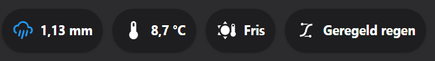 

Click on one of these icons below to go to the corresponding example code:

<a href="#co2-colored-icon-indicator-based-on-a-number"></a>
<a href="#weather-alarm-state-colored-icon-indicator-based-on-a-value">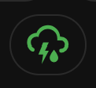</a>
<a href="#bigger-icon">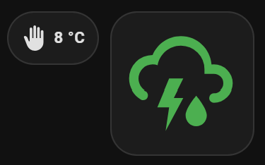</a>
<a href="#nice-weather-only-an-icon"></a>
<a href="#temperature-custom-icon">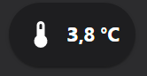</a>
<a href="#temperature-colored-icon-and-text">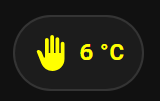</a>
<a href="#person-status">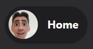</a>
<a href="#persons-count-in-a-specific-zone">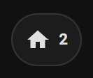</a>
<a href="#door-open-custom-picture">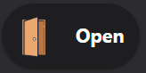</a>

The git repository of the Mushroom card is https://github.com/piitaya/lovelace-mushroom

Install the Mushroom card via this button\
[](https://my.home-assistant.io/redirect/hacs_repository/?owner=piitaya&repository=lovelace-mushroom&category=integration)

**Custom styling**

For some examples, some custom CSS styling is applied which isn't possible by default. 
You need the extra HACS integration `card_mod`. 
You can Install this integration via this button in your own HA instance\
[](https://my.home-assistant.io/redirect/hacs_repository/?owner=thomasloven&repository=lovelace-card-mod&category=integration)


---
## Table of Contents
<!-- TOC -->
  * [Introduction](#introduction)
  * [Cards](#cards)
    * [Title card](#title-card)
      * [What to wear when you go outside](#what-to-wear-when-you-go-outside)
      * [Welcome text and weather forecast for today (Dutch)](#welcome-text-and-weather-forecast-for-today-dutch)
      * [Time and date with large font](#time-and-date-with-large-font)
    * [Chips card](#chips-card)
      * [CO2 colored icon indicator based on a number](#co2-colored-icon-indicator-based-on-a-number)
      * [Weather alarm state colored icon indicator based on a value](#weather-alarm-state-colored-icon-indicator-based-on-a-value)
      * [Bigger icon](#bigger-icon)
      * [Nice weather (only an icon)](#nice-weather-only-an-icon)
      * [Temperature (custom icon)](#temperature-custom-icon)
      * [Temperature (colored icon and text)](#temperature-colored-icon-and-text)
      * [Person status](#person-status)
      * [Persons count in a specific zone](#persons-count-in-a-specific-zone)
      * [Door open (custom picture)](#door-open-custom-picture)
  * [More examples](#more-examples)
<!-- TOC -->

---
## Introduction

The mushroom card has a whole set of different card types.
In my examples here, I only use two of them. If you want to know more about them all, check this page https://github.com/piitaya/lovelace-mushroom#cards

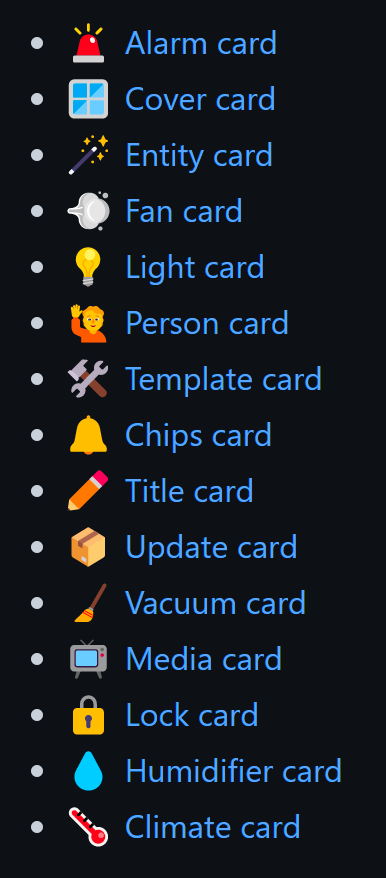

---
## Cards

I show here some examples of the two cards, the Tile and Chip card.

### Title card

The title card shows data based on a template.

#### What to wear when you go outside

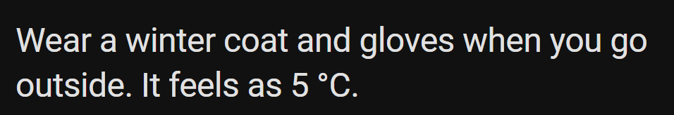

Show what to wear for clothes when you go outside.
You can change it the way you like or extend it by adding rain expectations.

```yaml

# Sourcecode by vdbrink.github.io
# Dashboard card code
type: custom:mushroom-title-card
title: >2
 Wear a winter coat and gloves
jacket
sweater
T-shirt
 when you go outside. It feels as {{ states('sensor.feels_like_temperature')|int }} °C.

```

#### Welcome text and weather forecast for today (Dutch)
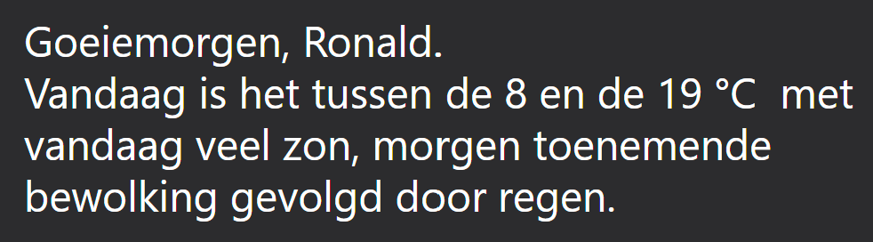

Dutch welcome text based on the time of the day, and the name of the logged-in user.\
Then show also the minimal and maximum temperature for today and a textual description of the weather.

```yaml

# Sourcecode by vdbrink.github.io
# Dashboard card code
type: custom:mushroom-title-card
title: >2
  Goeiemorgen
  Goeiemiddag
  Goeieavond, {{user}}. 
  Vandaag is het tussen de {{states('sensor.meteoserver_d0tmin')}} en de
  {{ states('sensor.meteoserver_d0tmax') }} °C  
  met {{ states('sensor.meteoserver_verw').lower() }}.

```

#### Time and date with large font

Larger font size to show the time and the full date.

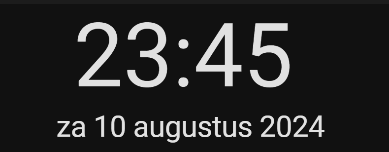

```yaml

# Sourcecode by vdbrink.github.io
# configuration.yaml
type: vertical-stack
cards:
  - type: custom:mushroom-title-card
    title: '{{now().strftime(''%H:%M'')}}'
    alignment: center
    card_mod:
      style: |
        ha-card {
          --title-font-size: 90px !important;
        }
  - type: custom:mushroom-title-card
    title: {{states('sensor.date_only_formatted')}}
    alignment: center
    card_mod:
      style: |
        ha-card {
          --title-font-size: 30px !important;
        }

```

---

Are you looking for more template examples? Check also my dedicated page about [templates](homeassistant_templates#template-examples)!
* [Count the number of lights on](homeassistant_templates#count-the-number-of-lights-on)
* [Calculate temperature differences](homeassistant_templates#calculate-temperature-differences)
* [Minutes since mail is delivered](homeassistant_templates#minutes-since-mail-is-delivered)
* [What to wear outside](homeassistant_templates#what-to-wear-outside)
* [Expected rain amount](homeassistant_templates#expected-rain-amount)
* [Rain intensity](homeassistant_templates#rain-intensity)
* [DIY Sink leak status](homeassistant_templates#diy-sink-leak-status)
* [DIY Chair occupancy status](homeassistant_templates#diy-chair-occupancy-status)

---

### Chips card

Chips cards are a small icon that indicates a status.

#### CO2 colored icon indicator based on a number


 Show a green icon, without any text, if the level is less the 800 ppm, less than 1200 ppm yellow, less than 1500 ppm red.

<br>

[Create your own CO2 sensor (SCD40)](/esphome/co2_scd40)\
[Create your own CO2 sensor (SenseAir S8)](/esphome/co2_senseair_s8_sensor)

```yaml

# Sourcecode by vdbrink.github.io
# Dashboard card code 
type: custom:mushroom-chips-card
chips:
  - chip:
    type: template
    icon: mdi:molecule-co2
    icon_color: |-
      
         blue
      
         red
      
         orange
      
         yellow
      
         green
      
    entity: sensor.senseair_co2_value
    content: ''

```

#### Weather alarm state colored icon indicator based on a value


Show a green icon, when the value is `Code groen`, yellow for `Code geel` and red for `Code rood`.

The use entity here is based on the [KNMI weather alarm scraper](/homeassistant/homeassistant_dashboard_weather_nl#weather-alarm).\
You can decide what happens when you click on it, in this example you redirect to the website of the KNMI where you can see all the details about the current weather alarm status.

```yaml

# Sourcecode by vdbrink.github.io
# Dashboard card code
type: custom:mushroom-chips-card
chips:
  - chip:
    type: template
    icon: mdi:weather-lightning-rainy
    icon_color: |-
      
         green
      
         yellow
      
         red
      
         gray
      
    entity: sensor.knmi_weercode
    content: ''
    tap_action:
      action: url
      url_path: https://www.knmi.nl/nederland-nu/weer/waarschuwingen/overijssel

```

#### Bigger icon


&nbsp; Show the mushroom icon in a mush bigger size with the `card_mod` HACS integration, see <a href="https://github.com/thomasloven/lovelace-card-mod" target="_blank">https://github.com/thomasloven/lovelace-card-mod</a> for more info.

<br>

Install `card_mod` via this button\
[](https://my.home-assistant.io/redirect/hacs_repository/?owner=thomasloven&repository=lovelace-card-mod&category=integration)


```yaml

# Sourcecode by vdbrink.github.io
# Dashboard card code
type: custom:mushroom-chips-card
chips:
  - chip:
    type: template
    icon: mdi:weather-lightning-rainy
    icon_color: |-
      
         green
      
         yellow
      
         red
      
         1C1C1C
      
    entity: sensor.knmi_weercode
    content: ""
    card_mod:
      style: |
        ha-card {
          --chip-icon-size: 80px;
          width: 100px !important;
          height: 100px !important
        }

```

#### Nice weather (only an icon)


&nbsp; Show (it only based on a condition) only a green icon, without any text, of a seat when the custom binary sensor `nice_outside` is `on` Otherwise this icon isn't visible.

```yaml

# Sourcecode by vdbrink.github.io
# Dashboard card code
type: custom:mushroom-chips-card
chips:
  - type: conditional
    conditions:
      - entity: binary_sensor.nice_outside
        state: 'on'
    chip:
      type: template
      icon_color: green
      icon: mdi:seat
      entity: binary_sensor.nice_outside
      content: ''

```

#### Temperature (custom icon)

 &nbsp; Show a (outdoor/room/pool/etc) temperature.
<br/><br/>

```yaml

# Sourcecode by vdbrink.github.io
# Dashboard card code
type: custom:mushroom-chips-card
chips:
  - type: entity
    entity: sensor.temperature_outside_feels_like
    icon: mdi:sun-thermometer

```

#### Temperature (colored icon and text)

 &nbsp; Set the icon and text color based on the entity value.
 
<br>

To override the colors, you need the extra HACS integration `card_mod`. 
You can Install this integration via this button in your own HA instance\
[](https://my.home-assistant.io/redirect/hacs_repository/?owner=thomasloven&repository=lovelace-card-mod&category=integration)

```yaml

# Sourcecode by vdbrink.github.io
# Dashboard card code
type: custom:mushroom-chips-card
chips:
  - type: entity
    entity: sensor.tempest_temperature_feels_like_rounded
    icon: mdi:hand-back-right
    tap_action:
      action: navigate
      navigation_path: /lovelace-diverse/test2
    card_mod:
      style:
        .: |
          ha-card {
            --icon-primary-color:
            
             #1C1C1C;
            
             blue;
            
             yellow;
            
             orange;
            
              red;
            
             green;
            
             --text-color:
            
             gray;
            
             blue;
            
             yellow;
            
             orange;
            
              red;
            
             green;
            
            }

```

#### Person status
 &nbsp; Show this icon only when I'm at home.
<br/><br/>

```yaml

# Sourcecode by vdbrink.github.io
# Dashboard card code
type: custom:mushroom-chips-card
chips:
- type: conditional
  conditions:
    - entity: person.vdbrink
      state: home
  chip:
    type: entity
    entity: person.vdbrink
    name: Me
    use_entity_picture: true
    hide_state: true
    hide_name: false

```

#### Persons count in a specific zone

 &nbsp; 
Show the number of persons which are currently this in the zone `home`.

<br/>

```yaml

# Sourcecode by vdbrink.github.io
# Dashboard card code
type: custom:mushroom-chips-card
chips:
  - type: entity
    entity: zone.home

```

#### Door open (custom picture)

 &nbsp; Show a custom picture when the front door is open. Otherwise hide it.
<br/><br/>

```yaml

# Sourcecode by vdbrink.github.io
# Dashboard card code
type: custom:mushroom-chips-card
chips:
  - type: conditional
    conditions:
      - entity: binary_sensor.contact_front_door_contact
        state: 'on'
    chip:
      type: template
      picture: https://img.icons8.com/plasticine/344/door-opened.png
      content: Open

```
---

## More examples
Looking for more examples? Check this link:
* https://smarthomescene.com/guides/mushroom-cards-part-2-room-layout-and-card-combinations/

---

[<< See also my other Home Assistant pages](index)
