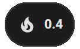
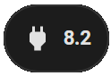

# Home Assistant dashboard card: Mushroom

<a href="index"></a>

Here you find Home Assistant (lovelace) dashboard examples related to the **mushroom** cards which you can easily add to your own dashboards.

Mushroom  is a card which can let you add small widget on your dashboard.

 

The git repository is https://github.com/piitaya/lovelace-mushroom

---
## Table of Contents
<!-- TOC -->
  * [Intro](#intro)
  * [Cards](#cards)
    * [Title card](#title-card)
      * [Welcome text and weather forecast for today](#welcome-text-and-weather-forecast-for-today)
    * [Chips card](#chips-card)
      * [Co2 colored icon indicator based on a number](#co2-colored-icon-indicator-based-on-a-number)
      * [Weather alarm state colored icon indicator based on a value](#weather-alarm-state-colored-icon-indicator-based-on-a-value)
      * [Nice weather (only an icon)](#nice-weather-only-an-icon)
      * [Outside temperature (custom icon)](#outside-temperature-custom-icon)
      * [Person status](#person-status)
      * [Door open (custom picture)](#door-open-custom-picture)
      * [Today's gas consumption](#todays-gas-consumption)
      * [Today's power consumption](#todays-power-consumption)
  * [More examples](#more-examples)
<!-- TOC -->

---
## Intro

The mushroom card has a whole set of different card types.
In my examples here I only use two of them. If you want to know more about them all check this page https://github.com/piitaya/lovelace-mushroom#cards


---
## Cards

I highlight here two cards.

### Title card

The title card show data based on a template and has no background.

#### Welcome text and weather forecast for today


Welcome text based on the time of the day and the name of the logged in user.\
Show also the minimal and maximum temperature for today and a textual description of the weather.

```yaml

# Sourcecode by vdbrink.github.io
# Dashboard card code
- type: custom:mushroom-title-card
  title: > 2
    Goeiemorgen
    Goeiemiddag
    Goeieavond, {{user}}. 
    Vandaag is het tussen de {{states.sensor.meteoserver_d0tmin.state}} en de
    {{ states.sensor.meteoserver_d0tmax.state }} °C  
    met {{ states.sensor.meteoserver_verw.state.lower() }}.

```

---

### Chips card

Chips cards are small icon which indicate a status.\
In my example I only show them, with a condition, when they are relative. 

#### Co2 colored icon indicator based on a number


 Show a green icon, without any text, if the level is less the 800 ppm, less than 1200 ppm yellow, less than 1500 ppm red.

```yaml

# Sourcecode by vdbrink.github.io
# Dashboard card code
- type: custom:mushroom-chips-card
  chips:
    - chip:
      type: template
      icon: mdi:molecule-co2
      icon_color: |-
        
           blue
        
           red
        
           orange
        
           yellow
        
           green
        
      entity: sensor.senseair_co2_value
      content: ''

```

#### Weather alarm state colored icon indicator based on a value


Show a green icon, when the value is `Code groen`, yellow for `Code geel` and red for `Code rood`.

```yaml

# Sourcecode by vdbrink.github.io
# Dashboard card code
- type: custom:mushroom-chips-card
  chips:
    - chip:
      type: template
      icon: mdi:weather-lightning-rainy
      icon_color: |-
        
           green
        
           yellow
        
           red
        
           gray
        
      entity: sensor.knmi_weercode
      content: ''
      tap_action:
        action: url
        url_path: https://www.knmi.nl/nederland-nu/weer/waarschuwingen/overijssel
      card_mod: null

```

#### Nice weather (only an icon)


 Show only a green icon, without any text, of a seat when the custom binary sensor `nice_outside` is `on` Otherwise this icon is not visible.

```yaml

# Sourcecode by vdbrink.github.io
# Dashboard card code
- type: custom:mushroom-chips-card
  chips:
    - type: conditional
      conditions:
        - entity: binary_sensor.nice_outside
          state: 'on'
      chip:
        type: template
        icon_color: green
        icon: mdi:seat
        entity: binary_sensor.nice_outside
        content: ''

```

#### Outside temperature (custom icon)

Show the outside temperature.
<br/><br/>

```yaml

# Sourcecode by vdbrink.github.io
# Dashboard card code
- type: custom:mushroom-chips-card
  chips:
    - type: entity
      entity: sensor.temperature_outside_feels_like
      icon: mdi:sun-thermometer

```

#### Person status
Show if your at home.
<br/><br/>

```yaml

# Sourcecode by vdbrink.github.io
# Dashboard card code
- type: custom:mushroom-chips-card
  chips:
  - type: conditional
    conditions:
      - entity: person.vdbrink
        state: home
    chip:
      type: entity
      entity: person.vdbrink
      name: Me
      use_entity_picture: true
      hide_state: true
      hide_name: false

```

#### Door open (custom picture)

Show a custom picture when the front door is open.
<br/><br/>

```yaml

# Sourcecode by vdbrink.github.io
# Dashboard card code
- type: custom:mushroom-chips-card
  chips:
    - type: conditional
      conditions:
        - entity: binary_sensor.contact_front_door_contact
          state: 'on'
      chip:
        type: template
        picture: https://img.icons8.com/plasticine/344/door-opened.png
        content: Open

```
---

#### Today's gas consumption

Show today's gas consumption.
<br/><br/>

```yaml

# Sourcecode by vdbrink.github.io
# Dashboard card code
- chip: null
  type: template
  entity: sensor.dsmr_day_consumption_gas
  content: "{{ (states ('sensor.dsmr_day_consumption_gas') | float * 10) | round(1) }}"
  icon: mdi:fire
  tap_action:
  action: navigate
  navigation_path: /energy

```
---

#### Today's power consumption

Show today's power consumption.
<br/><br/>

```yaml

# Sourcecode by vdbrink.github.io
# Dashboard card code
- chip: null
  type: template
  entity: sensor.dsmr_day_consumption_electricity_merged
  content: '{{ states (''sensor.dsmr_day_consumption_electricity_merged'') | round(1) }}'
  icon: mdi:power-plug
  tap_action:
  action: navigate
  navigation_path: /energy
  
```
---

## More examples
Looking for more examples check this link:
* https://smarthomescene.com/guides/mushroom-cards-part-2-room-layout-and-card-combinations/

---
[^^ Top](#table-of-contents)

[<< See also my other Home Assistant pages](index)


