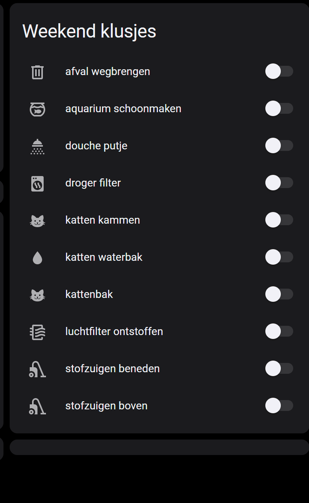
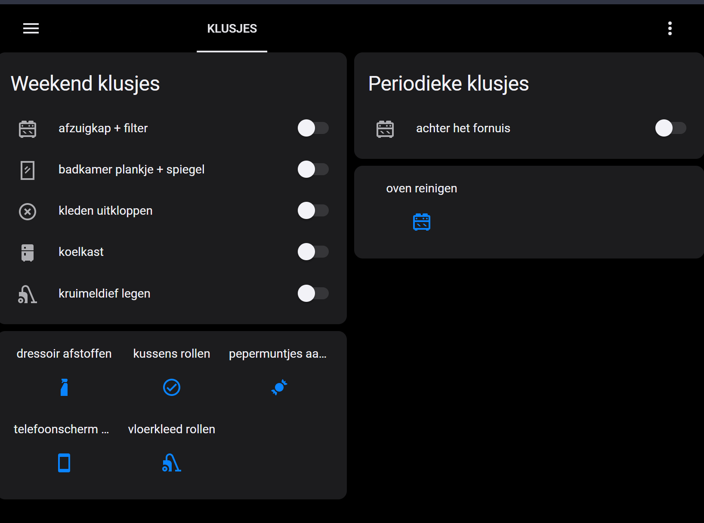
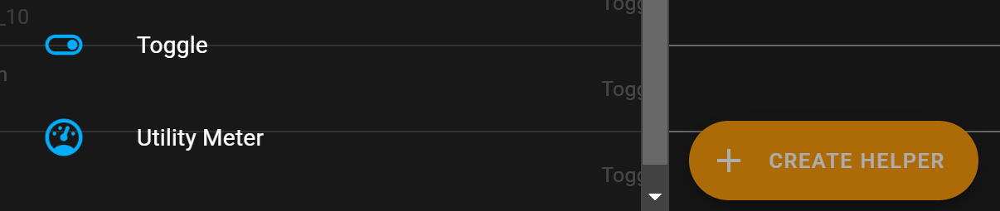
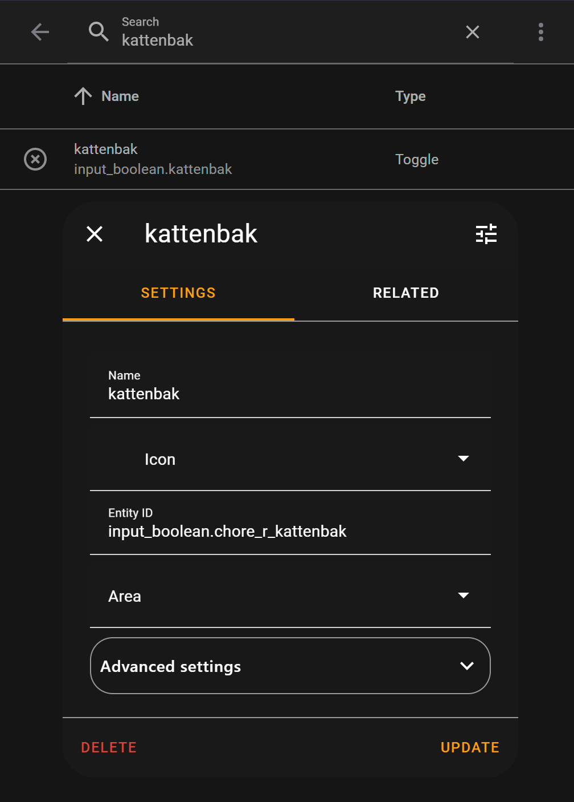
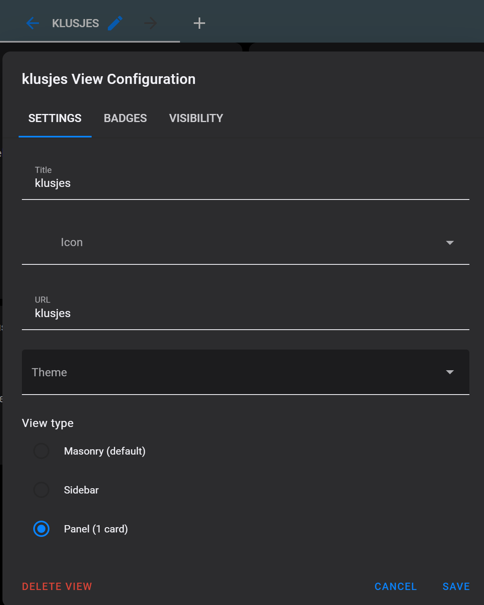
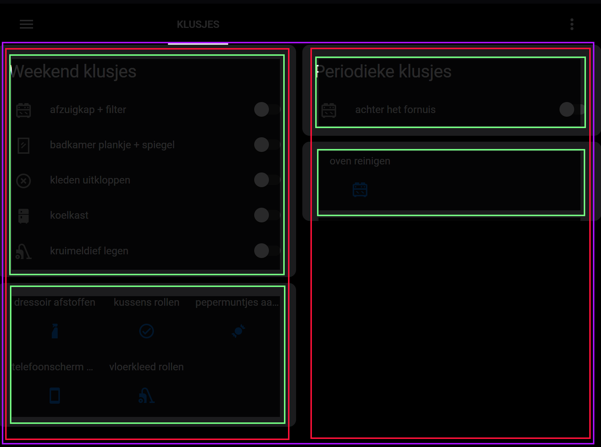
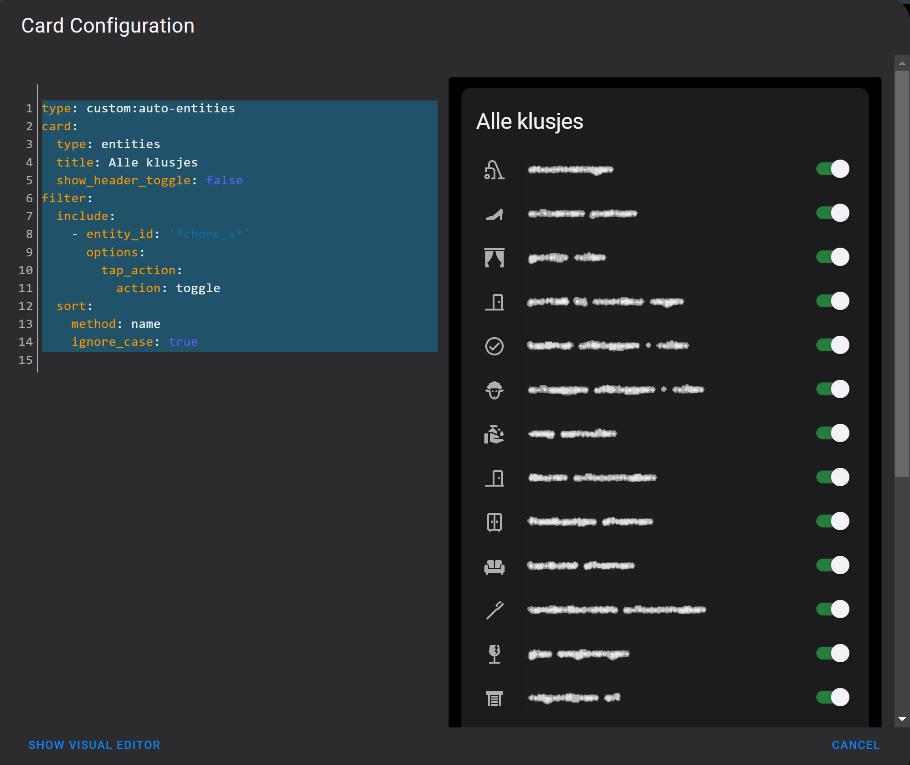

# Home Assistant dashboard: Chores


<a href="index"></a>

Here you find a Home Assistant (lovelace) dashboard what I've created\
for managing my weekend chores.

<br/>


---

## Table of Contents
<!-- TOC -->
* [Intro](#introduction)
* [Functionalities](#functionalities)
* [Final result](#final-result)
* [Create the chores](#create-the-chores)
* [Create the dashboard](#create-the-dashboard)
* [Layout of the dashboard](#layout-of-the-dashboard)
* [Final dashboard code](#final-dashboard-code)
* [Reset the chores](#reset-the-chores)
* [Maintenance dashboard](#maintenance-dashboard)
* [Background](#background)
* [Credits](#credits)
* [Alternatives](#alternatives)
<!-- TOC -->

---

## Introduction

I was looking for a solution to manage the weekend chores, via Home Assistant, for myself and the rest of the family. Where everyone can easily mark when they finished one.

---

## Functionalities

My chore list must contain the next functionalities:
* I want to have a list of chores for every weekend and periodic chores.
* I want to see which chores I still have to do and which I already have done.
* I want to undo chores from closed to open.
* I want to have a separated list with all periodic chores, but in my dashboard I only want to see the chores I want to do this weekend.

---

## Final result

This is the final result, and what I describe here is how I achieved it.<br>
In the left column you see the weekly weekend chores and in the right column the periodic chores
I want to do this weekend.

If you have specific recurring chores separated per person, you can create for each person a separated column.



---

## Create the chores

I have two types of chores, weekly and periodic chores.

To create the chores I create for each chore a new helper entity.

* Go to Settings > Devices & Services > tab Helpers.
* Click in the bottom right corner on + Create helper.
* Choose from the list the type Toggle.


* Enter a name for the chore and click on create.
* Search for the new created chore by the given name and open it.
* Add a reference text to the entity ID, then you can later group the weekly chores together. I use `chore_r_` as my reference. So I have to change the Entity ID from `input_boolean.kattenbak` to `input_boolean.chore_r_kattenbak`.


* Choose a corresponding icon.
* Click on update to finish the first chore.

Repeat all these steps to create all your weekly chores.

> You can always add new chores, they will automatically add to the dashboard.

For the periodic chores repeat also these steps, but use `chore_x_` as reference text.

> To hide temporary season chores just change the reference text. Then they don't match on it, and they don't show up in the dashboard.

---

## Create the dashboard

Create a new view and edit it with the pencil icon to give it a title, icon and url.

Set the `View type` to `Panel (1 card)` to let it use the full width.



---

## Layout of the dashboard

To align everything you need to set up a framework for your layout.\
Below you find all the code together, but this is how it is configured.

* Add as base a horizontal stack (purple).
* Add two vertical stacks (red) to create two columns. This will result that the cards in that stack stay in the same column, otherwise they jump from left to right.
* Add in each column two auto-entities (install via HACS) custom element (green).



* The top left card show the open **weekly** chores with their toggle to mark them as completed.\
This uses the filter which contains entity ID `chore_r_` and have state `off`.
* The bottom left card show the icons and text for the completed chores in a compact presentation. When you click on one of them, they move back to the open chores list.

The periodic chores work a bit different. I only show the chores that have been changed in the last two days. Before the weekend starts, you must toggle the chores you want to do. Now only these will show up in the list and the rest is still hidden.  

* The top right card show the open **periodic** chores with their toggle to mark them as completed.\
  This uses the filter which contains entity ID `chore_x_` and have state `off` AND changed in the last 2 days.

---

## Final dashboard code

> You also need to install the [auto-entities](https://github.com/thomasloven/lovelace-auto-entities) dashboard custom element via HACS to create this dashboard.

Install it via this button
[](https://my.home-assistant.io/redirect/hacs_repository/?owner=thomasloven&repository=lovelace-auto-entities&category=integration)

This is all the YAML code you need in your horizontal stack card.\
It contains the layout and the four cards.

<details>
  <summary><b>> Click here to see all the required YAML code >></b></summary>

```yaml

# Sourcecode by vdbrink.github.io
# Dashboard card code
type: horizontal-stack
cards:
  # left column
  - type: vertical-stack
    cards:
      # first card with open weekly chores
      - type: custom:auto-entities
        card:
          type: entities
          title: Weekend klusjes
          show_header_toggle: false
        filter:
          include:
            - entity_id: '*chore_r_*'
              state: 'off'
              options:
                tap_action:
                  action: toggle
          sort:
            method: name
            ignore_case: true
        sort:
          method: friendly_name
          numeric: false
          reverse: false
      # second card with closed weekly chores
      - type: custom:auto-entities
        card:
          type: glance
          show_state: false
          columns: 3
        filter:
          include:
            - entity_id: '*chore_r_*'
              state: 'on'
              options:
                tap_action:
                  action: toggle
          sort:
            method: name
            ignore_case: true
        sort:
          method: friendly_name
  # right column
  - type: vertical-stack
    cards:
      # first card with open periodic chores
      - type: custom:auto-entities
        card:
          title: Periodieke klusjes
          type: entities
          show_header_toggle: false
        filter:
          include:
            - entity_id: '*chore_x_*'
              state: 'off'
              # Show only the chores which are toggled in
              # the last 2880 minutes (2 days)
              last_changed: < 2880
              options:
                tap_action:
                  action: toggle
        sort:
          method: last_changed
          numeric: false
          reverse: false

      # second card with closed periodic chores
      - type: custom:auto-entities
        card:
          type: glance
          show_state: false
          columns: 3
        filter:
          include:
            - entity_id: '*chore_x_*'
              state: 'on'
              last_changed: < 2880
              options:
                tap_action:
                  action: toggle
        sort:
          method: last_changed
          numeric: false
          reverse: true

```
</details>

---

## Reset the chores
After the weekend, I reset automatic all the chores to the status open again.

To reset them, I first created an [old style group](https://www.home-assistant.io/integrations/group/#old-style-groups) in the groups.yaml file with all the chores defined in it.

```yaml

# Sourcecode by vdbrink.github.io
# groups.yaml
chores:
  name: chores
  entities:
    - input_boolean.chore_r_kattenbak
    - input_boolean.chore_r_2
    - input_boolean.chore_r_3

    - input_boolean.chore_x_1
    - input_boolean.chore_x_2
    - input_boolean.chore_x_3
    ...etc

```
Then I created an automation (in automation.yaml or in the Home Assistant itself) which get triggered at 00:00 on Tuesday and toggle all the chores, defined in the `group.chores`, to the status off. 

```yaml

# Sourcecode by vdbrink.github.io
# automations.yaml
- id: '123'
  alias: reset_chores
  description: 'reset all chores'
  trigger: []
  condition:
    - condition: time
      weekday:
        - tue
      after: '00:00:00'
  action:
    - service: input_boolean.turn_off
      data: {}
      target:
        entity_id:
          - group.chores
  mode: single

```

> If you don't have file groups.yaml or automations.yaml create them in the directory next to configuration.yaml and add these two lines to this file.

```yaml

group: !include groups.yaml
automation: !include automations.yaml

```

---

## Maintenance dashboard
I have a separated view where I can pick the periodic chores which I want to do this weekend.

Before the weekend, I can open this view and toggle the chores to off which I want to show up in my periodic list. Now they will be visible for two days in my chores dashboard.



Create a new view and add an Entity card on it.\
Place the next code in it.
```yaml

# Sourcecode by vdbrink.github.io
# Dashboard card code
type: custom:auto-entities
card:
  type: entities
  title: Alle klusjes
  show_header_toggle: false
filter:
  include:
    - entity_id: '*chore_x*'
      options:
        tap_action:
          action: toggle
  sort:
    method: name
    ignore_case: true

```

---

## Background

I was looking for a solution to manage the weekend chores for use.\
I did it before with writing down chore, from a list in an app, on the whiteboard.\
I'm trying to move, as much as possible, from the old-school whiteboard to a digital version with Home Assistant. With these recurring chores, this should be possible. I looked at different solutions how to manage chores in Home Assistant.

I tried the old HA shopping list, but when you mark it is gone and I could only make one list. Then I fixed the Microsoft To-Do integration, then I could maintain it from the app. The downside here was I couldn't undo chores and no good solution for periodic chores.

Then I found a solution with Home Assistant helpers. This is what I've worked out and fits all my needs for a while now.

---

## Credits

I got the inspiration for this approach from
https://smarthomepursuits.com/chore-tracking-with-point-system-in-home-assistant/

---

## Alternatives

There is also a HACS integration where you also can manage your household tasks, [Chore Helper for Home Assistant](https://github.com/bmcclure/ha-chore-helper?tab=readme-ov-file#chore-helper-for-home-assistant)

---
[^^ Top](#table-of-contents)

[<< See also my other Home Assistant tips and tricks](index)