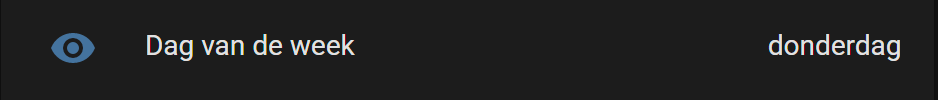
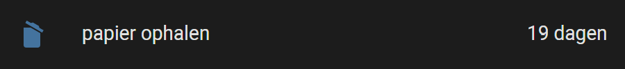
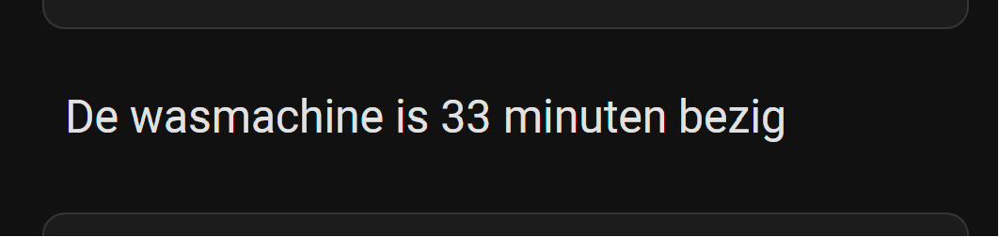
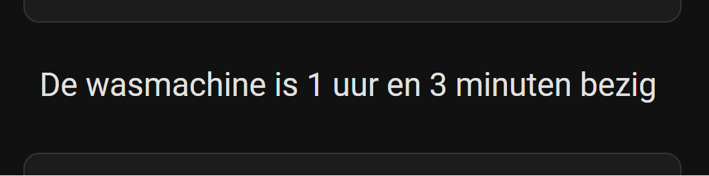
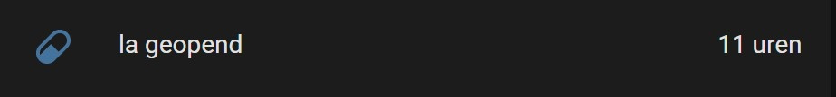

# Home Assistant dashboard: Date & Time

<a href="index"></a>

Here you find Home Assistant (lovelace) dashboard examples related to date and time which you can easily add to your own dashboards.

<br/>

---
## Table of Contents
<!-- TOC -->
  * [Time and date](#time-and-date)
  * [Inline time and date (Dutch format)](#inline-time-and-date-dutch-format)
  * [Current day of the week (Dutch format)](#current-day-of-the-week-dutch-format)
  * [Days count down](#days-count-down)
  * [How long an entity is active in human-readable text](#how-long-an-entity-is-active-in-human-readable-text)
  * [Hours count up](#hours-count-up)
  * [Last changed indication as secondary info](#last-changed-indication-as-secondary-info)
  * [Last changed indication](#last-changed-indication)
  * [Triggered today](#triggered-today)
<!-- TOC -->

---

## Time and date

Hugh time notation and a full date notation.


```yaml

# Sourcecode by vdbrink.github.io
# configuration.yaml
type: vertical-stack
cards:
  - type: custom:mushroom-title-card
    title: '{{now().strftime(''%H:%M'')}}'
    alignment: center
    card_mod:
      style: |
        ha-card {
          --title-font-size: 90px !important;
        }
  - type: custom:mushroom-title-card
    title: '{{states.sensor.date_only_formatted.state}}'
    alignment: center
    card_mod:
      style: |
        ha-card {
          --title-font-size: 30px !important;
        }

```

---
## Inline time and date (Dutch format)


```yaml

# Sourcecode by vdbrink.github.io
# configuration.yaml
- platform: template
  sensors:
    time_formatted:
      friendly_name: "Datum en tijd"
      value_template: >-
        
        
        
        
        
        {{ now().strftime('%H:%M') + ', ' + day_short + ' ' + now().strftime('%d') + ' ' + month + ' ' + now().strftime('%Y') }}
      icon_template: mdi:calendar-clock

```

```yaml

# Sourcecode by vdbrink.github.io
# Dashboard card code
- type: entity
  entity: sensor.time_formatted
  name: ' '

```

---
## Current day of the week (Dutch format)



```yaml

# Sourcecode by vdbrink.github.io
# configuration.yaml
- platform: template
  sensors:
    day_of_the_week_full:
      friendly_name: "Dag van de week"
      value_template: >-
        
        
        {{ day }}

```
```yaml

# Sourcecode by vdbrink.github.io
# Dashboard card code
- type: entity
  entity: sensor.time_formatted
  name: ' '

```

---
## Days count down



### Twente Milieu: format `YYYY-MM-DD`
Countdown for the number of days until they pick up the paper waste. 
The `Twente Milieu` integration creates the sensor `paper_waste_pickup` in the format `YYYY-MM-DD` 

With this template it gives the amount of days from now. 

```yaml

# Sourcecode by vdbrink.github.io
# configuration.yaml
- platform: template      
  sensors:
    paper_waste_pickup_countdown:
      friendly_name: "papier ophalen"
      value_template: >-
         {% set now_timestamp = as_timestamp(strptime(states("sensor.date"), "%Y-%m-%d")) %}
         {% set paper_timestamp = as_timestamp(strptime(states("sensor.paper_waste_pickup"), "%Y-%m-%d")) %}
         
         {{ days }}
      icon_template: mdi:delete-empty
      unit_of_measurement: "dagen"  

```

### HACS: Afvalbeheer: attribute and format `YYYYMMDD`
Countdown for the number of days until they pick up the paper waste.
The [HACS: Afvalbeheer](https://github.com/pippyn/Home-Assistant-Sensor-Afvalbeheer) integration creates the sensor `wastecollector_papier` the default value can be `Morgen, 05-02-2024` or `06-02-2024`. But the attributes field `Sort_date` has a default `YYYYMMDD` that's why I use this value

With this template it gives the amount of days from now.

```yaml

# Sourcecode by vdbrink.github.io
# configuration.yaml
- platform: template      
  sensors:
    paper_waste_pickup_countdown:
      friendly_name: "papier ophalen"
      value_template: >-
        
        {{ ((as_timestamp(strptime(datex, '%Y%m%d')) - as_timestamp(now())) / (60 * 60 * 24)) | round(0, 'ceil')  }}
      icon_template: mdi:delete-empty
      unit_of_measurement: "dagen"  

```

### Show only on the last 4 days

To show only the message when it's less than 4 days before the pick-up I used the [HACS: auto-entities](https://github.com/thomasloven/lovelace-auto-entities) custom element.
Install it via this button
[](https://my.home-assistant.io/redirect/hacs_repository/?owner=thomasloven&repository=lovelace-auto-entities&category=integration)
```yaml

# Sourcecode by vdbrink.github.io
# Dashboard card code
- type: custom:auto-entities
  card:
    type: entities
  filter:
    include:
      - entity_id: sensor.paper_waste_pickup_countdown
        state 1: "< 4"
        state 2: "> -1"
  show_empty: false

```

---
## How long an entity is active in human-readable text





Show in human-readable text how long an entity, like a washing machine, is active.

I used a custom HACS module mushroom.
Install it via this button
[](https://my.home-assistant.io/redirect/hacs_repository/?owner=piitaya&repository=lovelace-mushroom&category=integration)

```yaml

# Sourcecode by vdbrink.github.io
# Dashboard card code
- type: custom:mushroom-title-card
  title: |-
  {{ 'De wasmachine is ' }}
  
  
  
      
      
      
      
      
        
      
  
      {%- set runningsincehours = (runningsinceseconds % 86400 / 3600)|int|string -%}
      
      
        
       
      
      {%- set runningsinceminutes = (runningsinceseconds % 3600 / 60)|int|string -%} 
      
       
        
       
  
       
      # Running more then 1 day
        {{ runningsincedays + ' ' + runningsincedaystext + ', ' + runningsincehours + ' ' + runningsincehourstext + ' en ' + runningsinceminutes + ' ' + runningsinceminutestext }} 
      
      # Running more then 1 hour
        {{ runningsincehours + ' ' + runningsincehourstext + ' en ' + runningsinceminutes + ' ' + runningsinceminutestext }} 
      
      # Running for minutes
        {{ runningsinceminutes + ' ' + runningsinceminutestext }}
      
       
        {{ ' bezig'}} 
      
  
  # State is off
    {{ ' uit' }}
  

```
---

## Hours count up



Count the hours since the last changed state. In this case when a drawer with medicines was opened for the last time.

The value 11.3 will round to 11 and also 11.6 will round to 11 hours.

```yaml

# Sourcecode by vdbrink.github.io
# configuration.yaml
- platform: template
  sensors:
    drawer_opened_hours_ago:
      friendly_name: "la geopend"
      value_template: >-
        
        
        
        {{ hours }}
      unit_of_measurement: "uren"

```
---
## Last changed indication as secondary info


The value on the right is the actual sensor value.

```yaml

# Sourcecode by vdbrink.github.io
# Dashboard card code
- type: entities
  entities:
    - entity: binary_sensor.contact1_contact
      secondary_info: last-changed

```

---
## Last changed indication

A custom sensor that shows the time since the last change.\
Also useful to show on a floor map. 

```yaml

# Sourcecode by vdbrink.github.io
# Dashboard card code
mailbox_timer:
  friendly_name: mailbox
  icon_template: mdi:clock-outline
  value_template: >
    {{ relative_time(states.binary_sensor.mailbox_contact.last_changed) }}

```

---
## Triggered today

Test if the robot vacuum already runs today.

```yaml

# Sourcecode by vdbrink.github.io
# configuration.yaml
binary_sensor:
  - platform: template
    sensors:
       vaccuum_run_today:
            friendly_name: "runned today"
            value_template: "{{ as_local(as_datetime(states("sensor.vacuum_last_clean_start"))).date() == now().date() }}"

```

---

[<< See also my other Home Assistant tips and tricks](index)