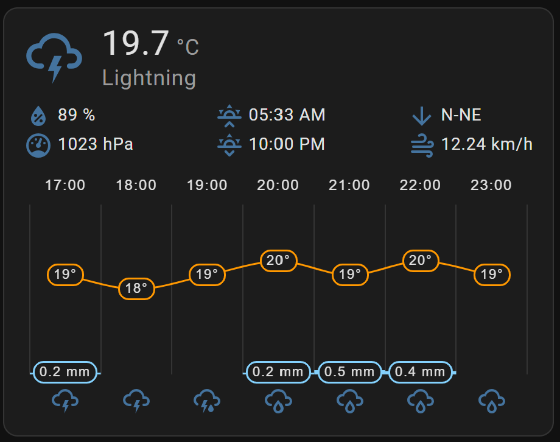
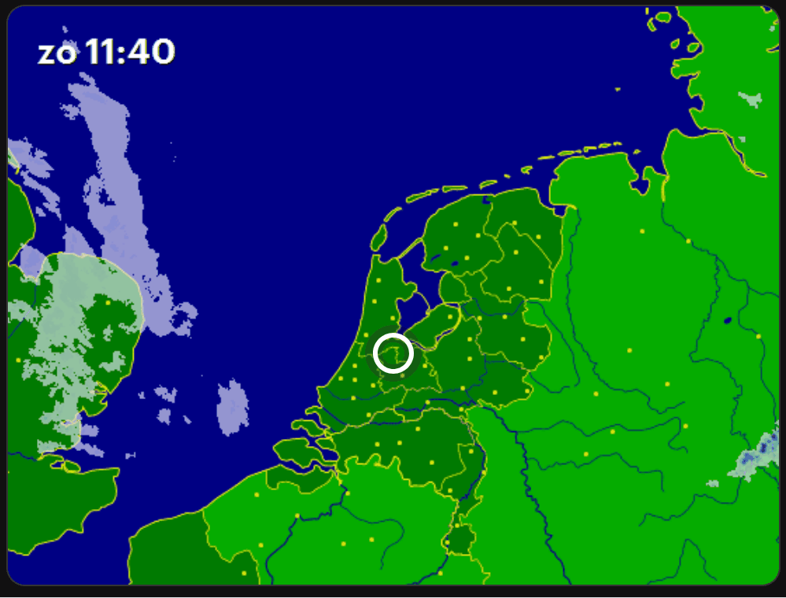
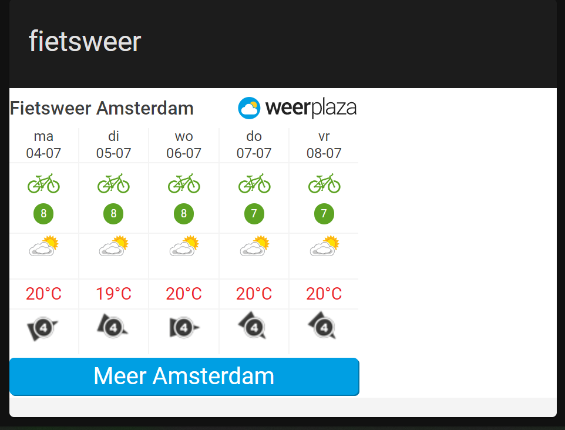
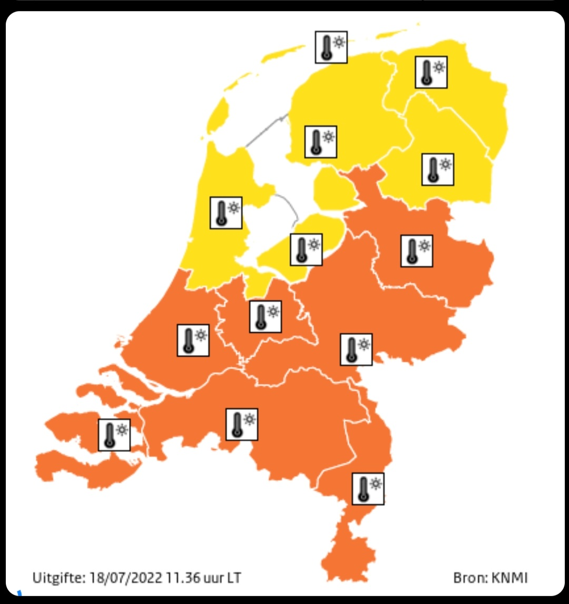
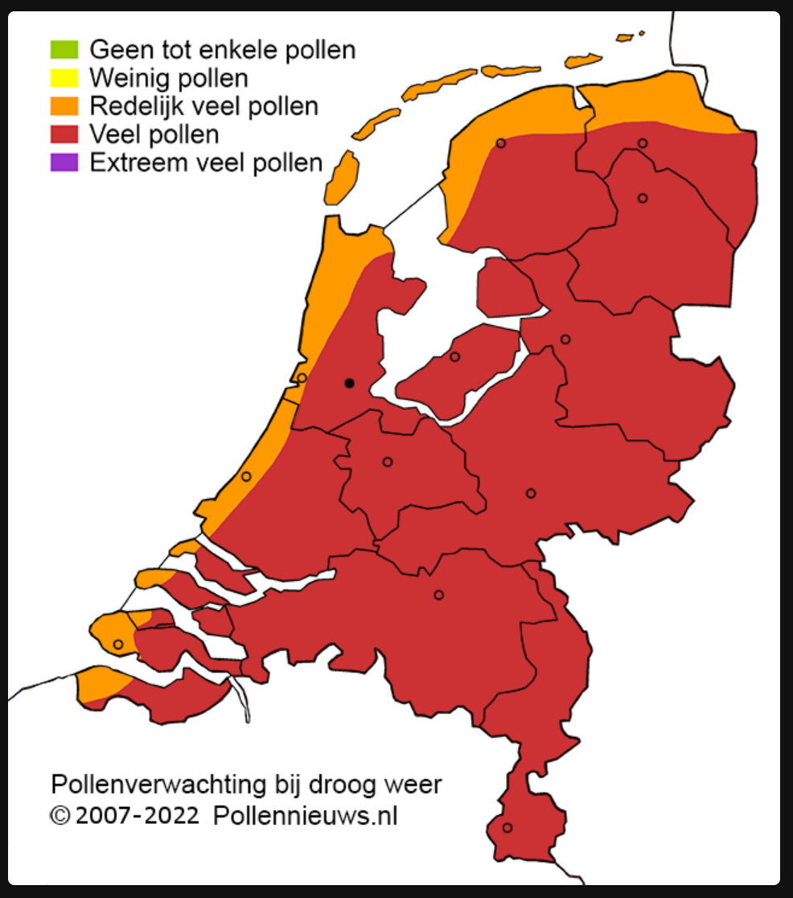

# Home Assistant dashboard: Examples overview

Here you find a visual elements overview of Home Assistant dashboard elements on this site.

Click on the screenshot to go to the section where this is described.

I hope you can use the examples for your own dashboard!

> **_NOTE:_** For some of the examples here, you need to install first an extra HACS integration.

---
## Table of Contents
<!-- TOC -->
  * [Date and time](#date-and-time)
  * [Weather](#weather)
  * [Predictions](#predictions)
    * [Thunder](#thunder)
  * [Weather in The Netherlands](#weather-in-the-netherlands)
    * [Rain](#rain)
    * [Score](#score)
    * [Weather alarm](#weather-alarm)
    * [Pollen](#pollen)
  * [Afvalbeheer Integration](#afvalbeheer-integration)
<!-- TOC -->

---

## Date and time

## Weather

## Predictions

 or

### Thunder

## Weather in The Netherlands

### Rain

### Score

### Weather alarm

### Pollen

## Afvalbeheer Integration

  

  

  

  

  

  

  

  

  

  

---

[Dashboard: Layout >>](homeassistant_dashboard_layout)