# Home Assistant dashboard: Examples overview

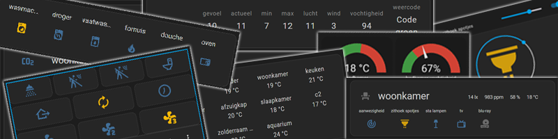

Here you find a visual elements overview of Home Assistant dashboard elements on this site.

Click on the screenshot to go to the section where this is described.

I hope you can use the examples for your own dashboard!

> **_NOTE:_** For some of the examples here, you need to install first an extra HACS integration.

---
## Table of Contents
<!-- TOC -->
  * [Date and time](#date-and-time)
  * [Weather](#weather)
  * [Predictions](#predictions)
    * [Thunder](#thunder)
  * [Weather in The Netherlands](#weather-in-the-netherlands)
    * [Rain](#rain)
    * [Score](#score)
    * [Weather alarm](#weather-alarm)
    * [Pollen](#pollen)
  * [Afvalbeheer Integration](#afvalbeheer-integration)
<!-- TOC -->

---

## Date and time

<a href="homeassistant_dashboard_date_time#time-and-date">
    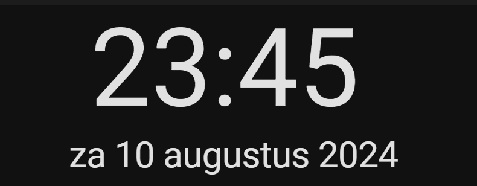
</a>

Example with time and date (in Dutch).

---
## Weather

## Predictions

Current type of temperature and forecast for three days.

 or

Forecast for five days and the upcoming twelve hours.

Forecast with temperature and rain per hour.

### Thunder

Actual lightning and thunder overview.

---
## Weather in The Netherlands

### Rain

Forecast for rain intensity over time.

Animated rain forecast over The Netherlands. With marker for your home town.

Other animated rain forecast.

Amount of fallen rain in The Netherlands.

### Score

Weather scores per day for different type of sports activities. Like cycling.

### Weather alarm

Weather alarm color and text based on the Dutch KNMI data.

Map of the Netherlands with weather alarms per province.

### Pollen

Map of the Netherlands with pollen level per region.

Pollen levels for weed, grass and trees.

---
## Afvalbeheer Integration

Different kind of presentations to show the upcoming trash can pick up days, based on the Afvalbekeer integration.

  <a href="homeassistant_hacs_afvalbeheer#default-presentation">
    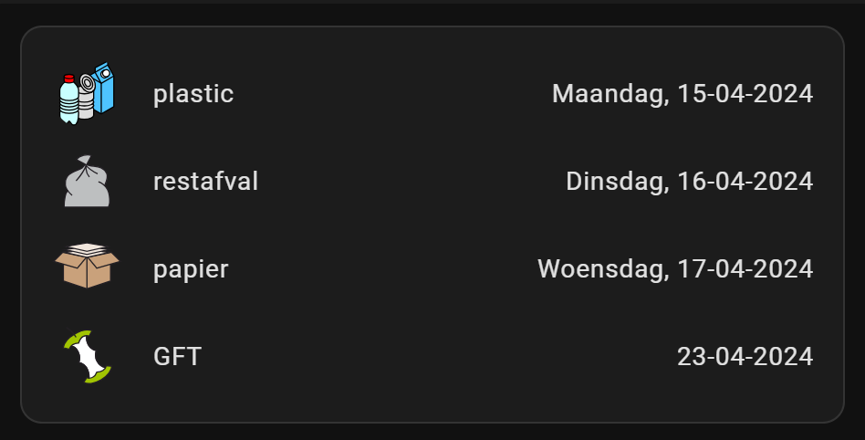
  </a>

The default presentation.

  <a href="homeassistant_hacs_afvalbeheer#sort-by-date">
    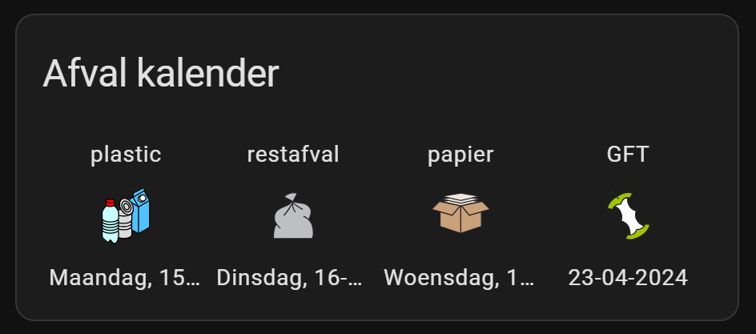
  </a>

Ordered by date in a row.

  <a href="homeassistant_hacs_afvalbeheer#sort-by-date">
    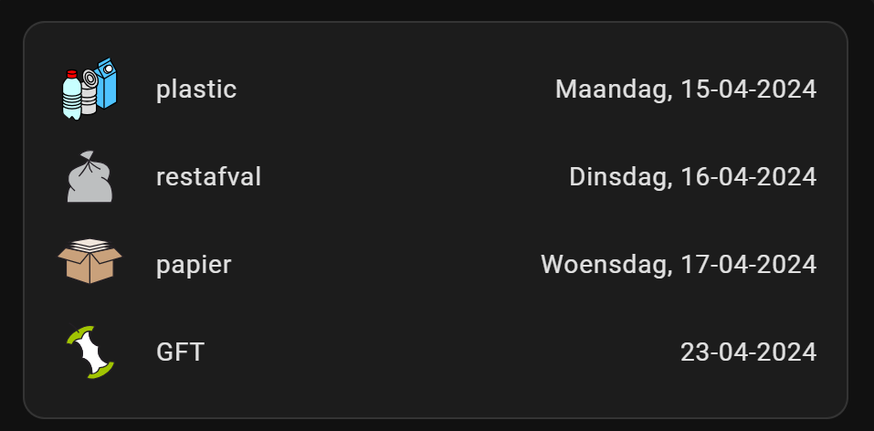
  </a>

Ordered by date in a list.

  <a href="homeassistant_hacs_afvalbeheer#as-list---days-countdown">
    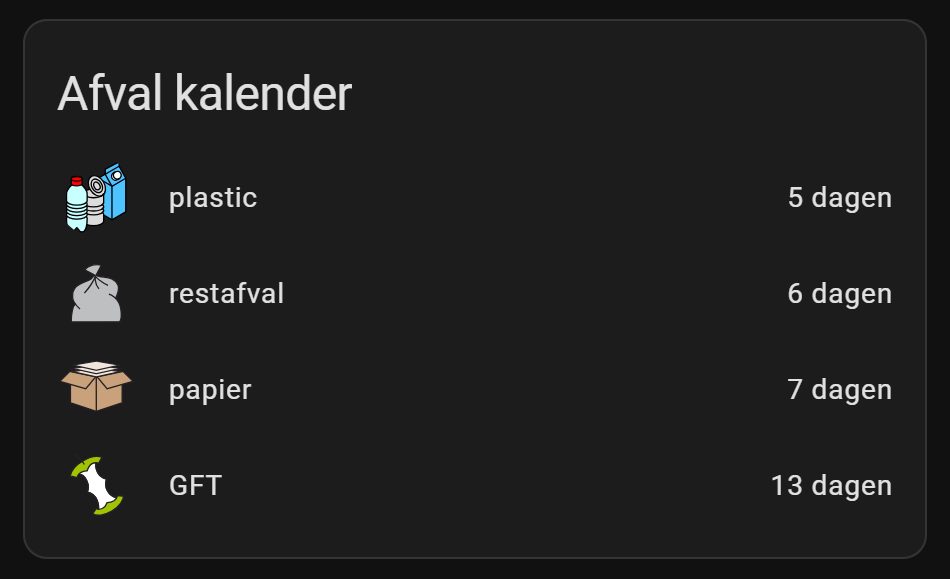
  </a>

Ordered by date in a list with days count down.

  <a href="homeassistant_hacs_afvalbeheer#as-2x2-raster">
    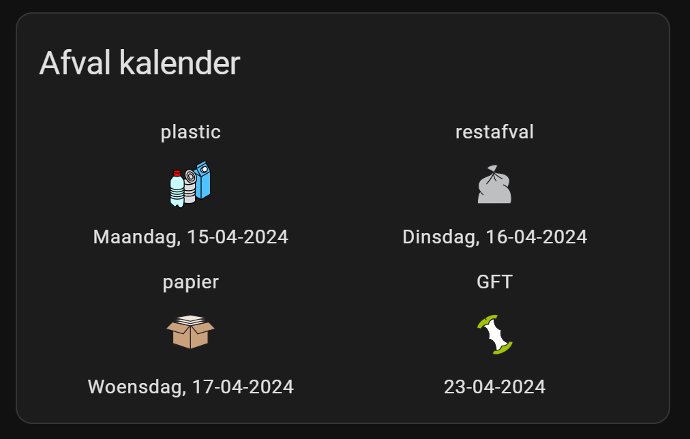
  </a>

In a 2x2 raster.

  <a href="homeassistant_hacs_afvalbeheer#as-row">
    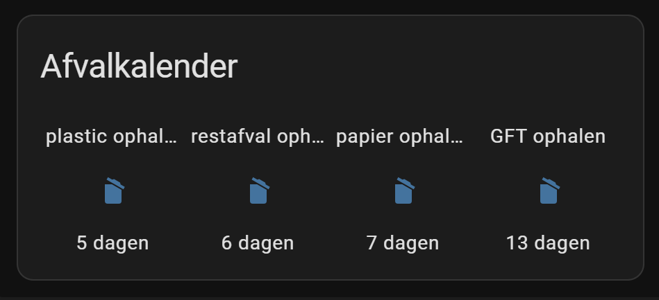
  </a>

In a row with a basic icon.

  <a href="homeassistant_hacs_afvalbeheer#as-list-1">
    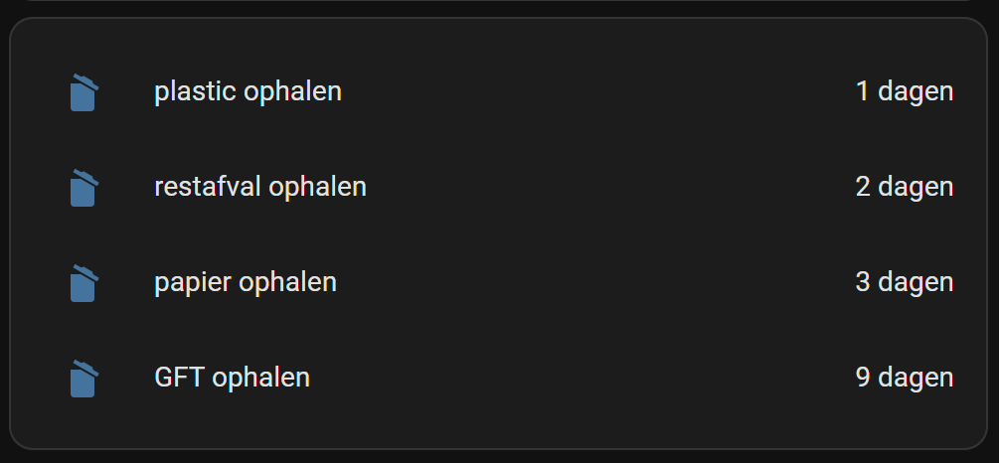
  </a>

In a row with a basic icon.

  <a href="homeassistant_hacs_afvalbeheer#show-conditional-only-for-the-next-5-days">
    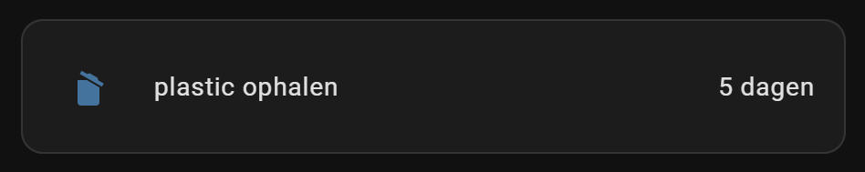
  </a>

Show only the pickup days within the upcoming 5 days.

  <a href="homeassistant_hacs_afvalbeheer#mushroom-element">
    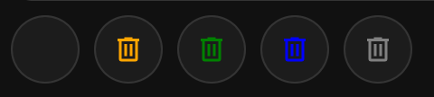
  </a>

Mushroom icon with matching color which trash can must be handled tomorrow/today.

---

[Dashboard: Layout >>](homeassistant_dashboard_layout)